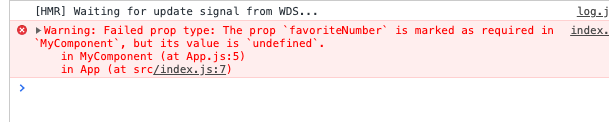

#  1. 리액트 시작

기존의 아키텍처는 변형하려고 하는 돔을  찾아서 업데이트 한다. 그냥 기존의 뷰를 날려버리고 처음부터 새로 렌더링하는 방식을 택했다. 이렇게 하면 CPU 점유율도 그렇고 메모리도 많이 사용할 거고 끊김 현상은 어떡할거야?

## 1.1. Why React?

### 1.1.1 리액트 이해

리액트는 뷰만 신경쓰는 라이브러리

리액트 프로젝트에서는 특정 부분이 어떻게 생길지 정하는 선언체를 component라고 부릅니다. 컴포넌트는 다른 프레임워크에서 사용자 인터페이스를 다룰 때 사용하는 템플릿과는 다른 개념입니다. 템플릿은 보통 데이터 셋이 주어지면 html 태그 형식을 문자열로 반환하는데 이와 달리 컴포넌트는 복합적인 개념입니다. 재사용이 가능한 API로 수많은 기능들을 내장하고 있으며 컴포넌트 하나에서 해당 컴포넌트의 생김새와 작동 방식을 정의합니다. 사용자 화면에 뷰를 보여 주는 것을 렌더링이라고 합니다. 리액트 라이브러리는 뷰를 어떻게 렌더링하길래 데이터가 변할 때마다 새롭게 리렌더링하면서 성능을 아끼고 최적의 사용자 경험을 제공할 수 있을까요? 이 비밀을 파악하려면 리액트 컴포넌트가 최초로 실행한 '초기 렌더링'과 컴포넌트의 데이터 변경으로 다시 실행되는 '리렌더링' 개념을 이해해야합니다. 

#### 1.1.1.1 초기 렌더링

초기 렌더링을 다루는 render 함수가 있습니다. 이 함수는 HTML 형식의 문자열이 아닌 뷰에 대한 정보를 지닌 객체를 반환합니다. 또한 컴포넌트 내부에 또 다른 컴포넌트가 들어갈 수 있습니다. render 함수를 실행하면 내부에 있는 컴포넌트도 재귀적으로 렌더링 합니다. 이렇게 최상위 컴포넌트의 렌더링 작업이 끝나면 객체의 정보를 이용하여 HTML 마크업을 만들고 이를 우리가 정하는 실제 페이지의 DOM 요소 안에 주입합니다. (src/index.js에서) 문자열 형태의 HTML코드를 생성한 후 특정 DOM에 해당 내용을 주입하면 이벤트가 적용됩니다.

#### 1.1.1.2 조화 과정( DOM reconcilation)

새로운 요소로 갈아 끼웁니다. 이 작업 또한 render 함수가 맡아서 합니다. 새로운 데이터를 가지고 render 함수를 또 다시 호출합니다. 하지만 이때 render 함수가 반환하는 결과를 곧바로 DOM에 반영하지 않고, 이전에 render 함수가 만들었던 컴포넌트 정보와 현재 render 함수가 만든 컴포넌트 정보를 비교합니다.


## 1.2 리액트의 특징

### 1.2.1 Virtual DOM 

#### 1.2.1.1 DOM이란?

Document Object Model의 약어. 즉 객체로 문서 구조를 표현하는 방법으로 XML이나 HTML로 작성합니다.웹 부라우저는 DOM을 활용하여 객체에 자바스크립트와 css를 적용합니다. DOM은 트리 형태라서 특정 노드를 찾거나 수정하거나 제거하거나 원하는 곳에 삽입할 수 있습니다.

##### DOM의 치명적인 약점 ?

돔은 동적 UI에 최적화 되어 있지 않습니다. 자체적으로는 정적이나 자바스크립트를 사용하여 이를 동적으로 만들 수 있습니다. 페이스북에서 포스트 한 개를 표현할 때 사용하는 div 요소 개수는 약 100개 입니다. 이렇게 규모가 큰 웹 애플리케이션에서 DOM에 직접 접근하여 변화를 주다 보면 성능 이슈가 조금씩 발생합니다. 하지만 돔이 느린것이 아니라 DOM 자체는 빠르나 변화가 일어나면 웹 브라우저가 css를 다시 연산하고 레이아웃을 구성하고 페이지를 리페인트하는 과정의 시간이 많이 소요됩니다.


해결법 : DOM을 최소한으로 조작하여야 합니다. 그래서 Virtual DOM방식을 사용하여 DOM 업데이트를 추상화함으로써 DOM 처리 횟수를 최소화하고 효율적으로 진행합니다.

#### 1.2.1.2 Virtual DOM

Virtual DOM을 사용하면 실제 DOM에 접근하여 조작하는 대신, 이를 추상화한 자바스크립트 객체를 구성하여 사용합니다. 마치 실제 DOM의 가벼운 사본과 비슷합니다.

리액트에서 데이터가 변하여 웹 브라우저에 실제 DOM을 업데이트할 때는 다음 세 가지 절차를 밟습니다.

1. 데이터를 업데이트하면 전체 UI를  VIrtual DOM에 리렌더링합니다.
2. 이전 Virtual DOM에 있는 내용과 현재 내용을 비교합니다.
3. 바뀐 부분만 실제 DOM에 적용합니다.

##### 오해 Virtual DOM 을 사용한 리액트가 무조건 빠른것은 아닙니다.

지속적으로 데이터가 변화하는 대규모 애플리케이션에 리액트 라이브러리가 유용하다.

리액트와 Virtual DOM이 언제나 제공할 수 있는 것은 바로 업데이트 처리 간결성입니다. UI를 업데이트하는 과정에서 생기는 복잡함을 모두 해소하고, 더욱 쉽게 업데이트에 접근할 수 있습니다.

### 1.2.2 기타 특징

 뷰뷰만 담당하기 때문에 기타기능 (ajax, 데이터 모델링, 라우팅)은 직접 구현하여야합니다. 라우팅애는 리액트-라우터, ajax 처리 에는 axios나 fetch, 상태 관리에는 리덕스나 MobX FMF TKDYDGKAUS EHLQSLEK.


## 1.3 작업환경 설정

여기서는 macOS,Window,Linux 환경에서 모두 호환되는 툴로 실습할 예정입니다.

### 1.3.1 Node.js 와 npm

#### NODE.JS? 

node.js는 크롬 V8 자바스크립트 엔진으로 빌드한 자바스크립트 런타임 입니다. 이것으로 웹 브라우저 환경이 아닌 곳에서도 자바스크립트를 사용하여 연산할 수 있습니다. 노드를 설치하면 npm도 설치된다.

##### 런타임이란?

**런타임** 환경(영어: **runtime** environment)은 컴퓨터가 실행되는 동안 프로세스나 프로그램을 위한 소프트웨어 서비스를 제공하는 가상 머신의 상태이다. 예를들면 주피터 노트북 같은 느낌이다.

#### LTS 버전

장기적으로 안정적인 지원을 제공하는 버전을 의미한다.

### 1.3.2 yarn

npm과 같은 패키지 관리도구. 더 효율적인 캐시 시스템과 기타 부가 기능을 제공합니다.

### 1.3.3 에디터

비쥬얼 스튜디오

#### 1.3.3.1 VS 코드 확장 프로그램 설치 

ESLint : 자바스크립트 문법 및 코드 스타일을 검사해 주는 도구입니다.

Reactjs Code Snippets : 단축 단어를 사용하여 간편하게 코드를 자동으로 생성해 낼 수 있는 코드 스니펫 모음 , 제작자가 charalampos karypidis인 것을 설치하세요

#### 1.3.3.2 언어 설정

F1 , Configure Display Language를 입력하고 나면 locale.json이라는 파일이 열리는데 여기서 설정하면 됩니다.

### 1.3.4 Git 설치


# 2장 JSX

## 2.1 코드 이해하기 

CRA 프로젝트 생성 과정에서 node_modules라는 디렉터리에 각종 라이브러리 및 모듈이 설치되며 이중에 react 모듈도 설치 됩니다. 이렇게 모듈을 불러와서 사용하는 것은 원래 브라우저에는 없던 기능입니다. Node.js에서 제공되는 기능입니다. 참고로 Node.js에서는 import가 아닌 require으로 패키지를 불러 올 수 있습니다.

이러한 기능을 브라우저에서도 사용하기 위해 번들러를 사용합니다. 대표적 번들러로 보통 웹팩을 사용합니다. 2017년부터는 브러우저에서도 import 구문을 사용할 수 있게 되었지만, 이는 다른 경로에 있는 자바스크립트를 불러오는 용도로만 사용되기 때문에 프로젝트 번들링과는 용도?가 다릅니다. 파일을 불러오는 것은 웹팩의 로더라는 기능이 담당합니다. css-loader는  css 파일을 불러올 수 있게 도와주고, file loader는 웹 폰트나 미디어 파일 등을 불러올  수 있게 해 줍니다. 그리고 barbel-loader는 최신을  ES5문법으로 변환하여 준다.

## 2.2 JSX란?

```jsx
function App(){
	return (<div>
    Hello <b>react</b>
    </div>);
}
```

이렇게 작성된 코드는 다음과 같이 변환됩니다.

```jsx
function App(){
	return React.createElement("div",null,"Hello",React.createElement("b",null,"react"))
}
```


## 2.3 JSX 장점

리액트만 배워봤기에 무엇이 장점인지 모릅니다.


## 2.4 JSX 문법

### 2.4.1 감싸인 요소

```jsx
import React from 'react';
function App(){
  return(
	<div>
		<h1>1</h1>
		<h2>2</h2>
  </div>
  )
}
```

 위와 같이 요소 여러개를 하나의 요소로 꼭 감싸주어야 가상 돔에서 컴포넌트 변화를 감지해 낼 때 효율적으로 비교할 수 있도록 컴포넌트 내부는 하나의 돔 트리 구조로 이루어져있어야 하는 규칙이 있습니다. 따라서 꼭 

Fragment 사용해도 상관없습니다.

```jsx
import React,{Fragment} from 'react';
function App(){
  return(
	<Fragment>
		<h1>1</h1>
		<h2>2</h2>
  </Fragment>)
}
```

```jsx
import React from 'react';
function App(){
  return(
	<>
		<h1>1</h1>
		<h2>2</h2>
  </>)
}
```

### 2.4.2 자바스크립트 표현

jsx 내부에서 코드를 {}로 감싸주면 됩니다.

#### ES6의 const와 let

ES5에서는  함수 단위의 var을 사용했지만 ES6은 블록단위의 let과 const를 사용합니다.

let은 for문처럼 유동적인 값을 지닐 변수에, const는 한번 설정한 뒤 변할 일 없는 값에, const는 한번 선언하면 재설정 할 수 없습니다.


### 2.4.3 IF문 대신 조건부 연산자(삼항 연산자)

if문을 jsx안에서 사용할 수 없습니다.

### 2.4.4  AND 연산자(&&)을 사용한 조건부 렌더링

A && B   A가 참이라면 B가 결과가 됩니다.  A가 거짓이라면 falsy가 됩니다.(0)

### 2.4.5 undefined를 렌더링하지 않기(||)

A || B     혹시나 A가 거짓일 때 B의 값으로 결과가 결정됩니다.

### 2.4.6 인라인 스타일링

리액트에서 돔 요소에 스타일을 적용할 때는 문자열 형태로 넣는 것이 아니라 객체 형태로 넣어 주어야합니다. 스타일 이름 중에서 background-color처럼 -문자가 포함되는 이름이 있으면 backgroundColor처럼 카멜표기법을 이용해야 합니다.

### 2.4.7 class 대신 className

### 2.4.8 꼭 닫아야하는 태그

HTML의 Input은 열어놔도 되지만 jsx내부의 input은 무조건 닫아주어야한다.

### 2.4.9 주석

{/*comment */}

## 2.5 ESLint와 Prettier 적용하기

### 2.5.1 ESLint

마켓 플레이스에서 ESLint와 Prettier를 설치합니다.

보기-문제 탭에서 확인하면 됩니다. 초록색 줄은 그냥 무시해도 됩니다.

빨간색 줄이 그어진 코드는 무조건 고쳐야합니다.

### 2.5.2 Prettier

f1 -> format 코드 정리가 될 것입니다.

.prettierrc

```
{
	"singleQuote": true,
	"semi" :true,
	"useTabs" : false,
	"tabWidth" : 2
}
```

### 2.5.1 저장할 때 자동으로 코드 정리하기

code 환경 설정에서 format on save 속성을 활성화 하면 됩니다.


# 3장 컴포넌트


## 3.1 클래스형 컴포넌트

 함수형 컴포넌트

```jsx
import React from 'react';

const App = () => {
  const name = 'react';
  return <div className="react">{name}</div>;
};

export default App;

```

클래스형 컴포넌트

```jsx
import React, { Component } from 'react';

class App extends Component {
  render() {
    const name = 'react';
    return <div className="react">{name}</div>;
  }
}

export default App;

```

클래스형과 함수형의 차이는 클래스형 컴포넌트의 경우에 state 기능 및 라이프사이클 기능이 내제되어 사용할 수 있다는 것과 임의 메서드를 정의할 수 있는 것입니다. 클래스형 컴포넌트에서는 render 꼭 함수가 있어야합니다. 그 안에서 보여주어야 할 JSX를 반환해야 합니다.

함수형 컴포넌트는 선언하는데의 간결함, 메모리도 덜 사용하고, 파일크기도 더 적게 차지한다. 함수형 컴포넌트의 주요 단점은 state와  라이프 사이클 API의 사용이 불가능하다는 점이 있다. 함수형 컴포넌트의 주요 단점은 state와 라이프사이클 API를 사용하지 못하는 점이였으나 Hook라는 도입된 기능으로 해결할 수 있다.


### 3.2 첫 컴포넌트 생성

### 3.2.1 src 디렉터리에 MyComponent.js 파일 생성

### 3.2.2 코드 작성하기

MyComponent.js

```jsx
import React from 'react';

const MyComponent = () => {
  return <div>new MyComponent</div>;
};

export default MyComponent;

```

화살표 함수와 function의 다른점

```jsx
function BlackDog(){
	this.name = '흰둥이';
  return {
    name: '검둥이',
    bark: function(){
      console.log(this.name + '멍멍')
    };
  }
}
const blackDog = new BlackDog();
// ()=>자신 객채 내의 종속된 변수를 받아 온다.
blackDog.bark(); // 검둥이 멍멍

function WhiteDog(){
	this.name = '흰둥이';
  return {
    name: '검둥이',
    bark: ()=>{
      console.log(this.name + '멍멍')
    };
  }
}
const whiteDog = new WhiteDog();
WhiteDog.bark(); // 흰둥이 멍멍
// ()의 this는 자신이 종속된 인스턴스를 받아 온다.

```


### 3.2.3 모듈 내보내기 및 불러오기

- import 
- export 

default는   import blah

그 외에는 import {blah}

import * as blah from  컴포넌트

## 3.3 porps

부모컴포넌트가 자식 컴포넌트에게 전달해주는 속성

### 3.3.1 JSX 내부에서 props 렌더링

{} 이용

Mycomponent.js

```jsx
import React from 'react';

const MyComponent = props => {
  return <div>{props.name}</div>;
};

export default MyComponent;

```

### 3.3.2 컴포넌트를 사용할 때 props 값을 지정하기

App.js

```jsx
import React from 'react';
import MyComponent from './MyComponent';

const App = () => {
  return <MyComponent name="React" />;
};

export default App;

```

### 3.3.3 props 기본값 설정 : defaultProps

방금 설정한 name 값을 지우고 다시 저장해 보세요.

```jsx
return <MyComponent />
```

Mycomponent.js

```jsx
import React from 'react';

const MyComponent = props => {
  return <div>{props.name}</div>;
};


MyComponent.defaultProps = {name : '기본이름'}
export default MyComponent;
```

### 3.3,4 태그 사이의 내용을 보여 주는  children

리액트 컴포넌트를 사용할 때 컴포넌트 태그 사이의 내용을 보여주는 props가 있는데요. 바로 children입니다.

App.js

```jsx
import React from 'react';
import MyComponent from './MyComponent';

const App = () => {
  return <MyComponent>리액트</MyComponent>;
};

export default App;

```

MyComponent.js

```jsx
import React from 'react';

const MyComponent = props => {
  return (
    <div>
      안녕하세요 {props.name} 입니다
      <br />
      안녕하세요 {props.children} 자식입니다
    </div>
  );
};

MyComponent.defaultProps = { name: '기본이름' };
export default MyComponent;

```

### 3.3.5 비구조화 할당 문법

MyComponent.js

```jsx
import React from 'react';

const MyComponent = props => {
  const { name, children } = props;
  return (
    <div>
      안녕하세요 {name} 입니다
      <br />
      안녕하세요 {children} 자식입니다
    </div>
  );
};

MyComponent.defaultProps = { name: '기본이름' };
export default MyComponent;

```

또는

```jsx
import React from 'react';

const MyComponent = ({ name, children }) => {
  return (
    <div>
      안녕하세요 {name} 입니다
      <br />
      안녕하세요 {children} 자식입니다
    </div>
  );
};

MyComponent.defaultProps = { name: '기본이름' };
export default MyComponent;

```

### 3.3.6 propsTypes를 통한 props 검증

MyComponent.js

```jsx
import React from 'react';
import PropTypes from 'prop-types';

const MyComponent = ({ name, children }) => {
  return (
    <div>
      안녕하세요 {name} 입니다
      <br />
      안녕하세요 {children} 자식입니다
    </div>
  );
};

MyComponent.defaultProps = { name: '기본이름' };
MyComponent.propTypes = {
  name: PropTypes.string,
  children: PropTypes.string
};
export default MyComponent;

```

App.js

```jsx
import React from 'react';
import MyComponent from './MyComponent';

const App = () => {
  return <MyComponent name={3}>자식</MyComponent>;
};

export default App;

```

Warning 발생


### 3.3.6.1 isRequired를 사용하여 필수 propTypes를 설정

Mycomponent.js

```jsx
import React from 'react';
import PropTypes from 'prop-types';

const MyComponent = ({ name, children, favoriteNumber }) => {
  return (
    <div>
      안녕하세요 {name} 입니다
      <br />
      안녕하세요 {children} 자식입니다
    </div>
  );
};

MyComponent.defaultProps = { name: '기본이름' };
MyComponent.propTypes = {
  name: PropTypes.string,
  children: PropTypes.string,
  favoriteNumber: PropTypes.number.isRequired
};
export default MyComponent;

```




#### 3.3.6.2 많은 종류의 PropTypes 종류

github.com/facebook/prop-types에서 확인하세요


### 3.3.7 클래스형 컴포넌트에서 props 사용하기

Mycomponent.js

```jsx
import React, { Component } from 'react';
import PropTypes from 'prop-types';
class MyComponent extends Component {
  render() {
    const { name, favoriteNumber, children } = this.props;

    return (
      <div>
        안녕하세요 {name} 이름 입니다 <br />
        안녕하세요 {favoriteNumber} 좋아하는 숫자 입니다 <br />
        안녕하세요 {children} 자식 입니다 <br />
      </div>
    );
  }
}

MyComponent.defaultProps = { name: '기본이름' };

MyComponent.propTypes = {
  name: PropTypes.string,
  children: PropTypes.string,
  favoriteNumber: PropTypes.number.isRequired
};
export default MyComponent;

```


# 3.4 state

리액트에서 state는 컴포넌트 내부에서 바뀔 수 있는 값을 의미합니다.  props는 컴포넌트가 사용 되는 과정에서 부모 컴포넌트가 설정(전달)하는 값이며 전달 받는 자식 컴포넌트는 해당 props을 읽기 전용으로만 사용할 수 있습니다.


### 3.4.1 클래스형 컴포넌트의 state

Counter.js

```jsx
import React, { Component } from 'react';
import PropTypes from 'prop-types';
class MyComponent extends Component {
  render() {
    const { name, favoriteNumber, children } = this.props;

    return (
      <div>
        안녕하세요 {name} 이름 입니다 <br />
        안녕하세요 {favoriteNumber} 좋아하는 숫자 입니다 <br />
        안녕하세요 {children} 자식 입니다 <br />
      </div>
    );
  }
}

MyComponent.defaultProps = { name: '기본이름' };

MyComponent.propTypes = {
  name: PropTypes.string,
  children: PropTypes.string,
  favoriteNumber: PropTypes.number.isRequired
};
export default MyComponent;

```

App.js

```jsx
import React from 'react';
import MyComponent from './MyComponent';
import Counter from './Counter';

const App = () => {
  return (
    <div>
      <Counter />
    </div>
  );
};

export default App;

```


#### 3.4.1.1 state 객체 안에 여러 값이 있을 때

```jsx
import React, { Component } from 'react';

class Counter extends Component {
  constructor(props) {
    super(props);

    this.state = {
      number: 0,
      fixedNumber: 0
    };
  }

  render() {
    const { number, fixedNumber } = this.state;

    return (
      <div>
        <h1>{number}</h1>
        <h1>바뀌지 않는 값 {fixedNumber}</h1>
        <button
          onClick={() => {
            this.setState({ number: number + 1 });
          }}
        >
          +1
        </button>
      </div>
    );
  }
}

export default Counter;

```

### 3.4.1.2 state를 constructor에서 꺼내기

```jsx
import React, { Component } from 'react';

class Counter extends Component {
  state = {
    number: 0,
    fixedNumber: 0
  };
  render() {
    const { number, fixedNumber } = this.state;

    return (
      <div>
        <h1>{number}</h1>
        <h1>바뀌지 않는 값 {fixedNumber}</h1>
        <button
          onClick={() => {
            this.setState({ number: number + 1 });
          }}
        >
          +1
        </button>
      </div>
    );
  }
}

export default Counter;

```

#### 3,4.1.3 this.setState의 전달인자(argument)에 객체가 아닌 함수  인자 를 넣기

```jsx
        <button
          onClick={() => {
            this.setState({ number: number + 1 }); // 이부분
            this.setState({ number: this.state.number + 1 });
          }}
          ></button>
```

두번 실행하여도 1만 더해진다.

이를 해결하기 위해서는 함수를 넣어주어야한다.

```jsx
<button
          onClick={() => {
            this.setState(prevState => {
              return {
                number: prevState.number + 1
              };
            });

            this.setState(prevState => ({
              number: prevState.number + 1
            }));
          }}
        >
```

### 3.4.2 함수형 컴포넌트에서 useState 사용하기

#### 3.4.2.1 배열 비구조화 할당

#### 3.4.2.2 useState 사용하기 

Say.js

```jsx
import React, { useState } from 'react';

const Say = () => {
  const [message, setMessage] = useState('');

  const onClickEnter = () => setMessage('안녕하세요');
  const onClickExit = () => setMessage('안녕히가세요');
  return (
    <div>
      <button onClick={onClickEnter}>입장</button>
      <button onClick={() => onClickExit()}>퇴장</button>
      <h1>{message}</h1>
    </div>
  );
};

export default Say;

```

App.js

```jsx
import React from 'react';
import Say from './Say';

const App = () => {
  return <Say></Say>;
};

export default App;

```

#### 3.4.2.3 useState를 여러번 사용하기

Say.js

```jsx
import React, { useState } from 'react';

const Say = () => {
  const [message, setMessage] = useState('');
  const [color, setColor] = useState('black');

  const onClickEnter = () => setMessage('안녕하세요');
  const onClickExit = () => setMessage('안녕히가세요');
  return (
    <div>
      <button onClick={onClickEnter}>입장</button>
      <button onClick={() => onClickExit()}>퇴장</button>
      <h1 style={{ color }}>{message}</h1>
      <button style={{ color: 'red' }} onClick={() => setColor('red')}>
        빨간색
      </button>
      <button style={{ color: 'green' }} onClick={() => setColor('green')}>
        초록색
      </button>
      <button style={{ color: 'blue' }} onClick={() => setColor('blue')}>
        파랑색
      </button>
    </div>
  );
};

export default Say;

```

## 3.5 useState 사용 할 때 주의 사항

setter함수로만 할당,

상태에 객체나 배열을 업데이트할 때는 

새로운 객체또는 배열 생성

그 사본에 기존의 객체의 값을 업데이트하고,

세터함수를 통해  업데이트해야함
