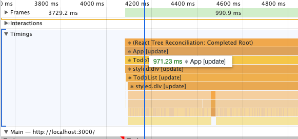
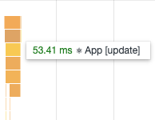
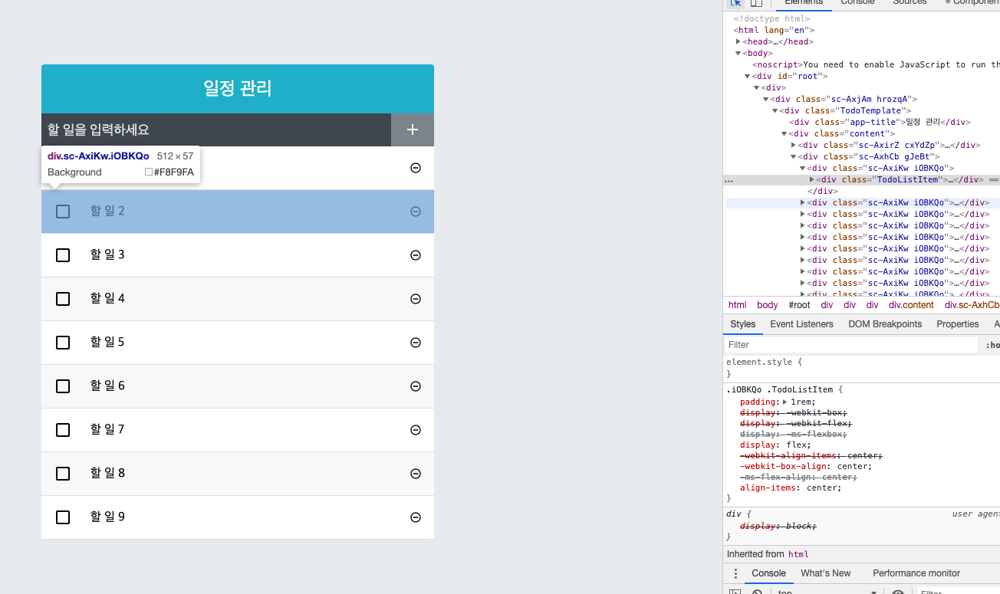
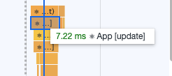

#  10장 일정관리 앱

책은 sass로 스타일링하였습니다. 저는  달리  styled-components로 스타일링 할 예정입니다.그리고 저는 프로젝트에 styled-component를 계속 사용하겠습니다.


## 10.1 준비하기

.prettierrc

```

```

jsconfig.js

```

```

라이브러리 설치

```
yarn add styled-components react-icons
```

## 10.2 UI 완성하기

App.js

```jsx
import React from 'react';
import TodoTemplate from './components/TodoTemplate';
import TodoInsert from './components/TodoInsert';
import TodoList from './components/TodoList';

const App = () => {
	return (
		<div>
			<TodoTemplate>
				<TodoInsert />
				<TodoList />
			</TodoTemplate>
		</div>
	);
};

export default App;

```

TodoTemplate.js

```jsx
import React from 'react';
import styled from 'styled-components';

const TodoTemplateBlock = styled.div`
	.TodoTemplate {
		width: 512px;
		margin-left: auto;
		margin-right: auto;
		margin-top: 6rem;
		border-radius: 4px;
		overflow: hidden;
	}
	.app-title {
		background: #22b8cf;
		color: white;
		height: 4rem;
		font-size: 1.5rem;
		display: flex;
		/* 위 아래 */
		align-items: center;
		/* 좌우 */
		justify-content: center;
	}
	.content {
		background: white;
	}
`;

const TodoTemplate = ({ children }) => {
	return (
		<TodoTemplateBlock>
			<div className="TodoTemplate">
				<div className="app-title">일정 관리</div>
				<div className="content">{children}</div>
			</div>
		</TodoTemplateBlock>
	);
};

export default TodoTemplate;

```

TodoInsert.js

```jsx
import React from 'react';
import styled from 'styled-components';
import { MdAdd } from 'react-icons/md';
const TodoInsertBlock = styled.div`
	.TodoInsert {
		display: flex;
		background: #495057;
		input {
			background: none;
			outline: none;
			border: none;
			padding: 0.5rem;
			font-size: 1.125rem;
			line-height: 1.5;
			color: white;
			/* 속성에 접근하는 연산자 */
			&::placeholder {
				color: #dee2e6;
			}

			/* 버튼을 제외한 영역을 모두 차지하기 */
			flex: 1;
		}
		button {
			outline: none;
			border: none;
			background: #868e96;
			color: white;
			font-size: 1.5rem;
			padding-left: 1rem;
			padding-right: 1rem;
			display: flex;
			align-items: center;
			cursor: pointer;
			transition: 0.1s ease-in;
			/* 상태에 접근하는 연산자 */
			&:hover {
				background: #adb5bd;
			}
		}
	}
`;
const TodoInsert = () => {
	return (
		<TodoInsertBlock>
			<form className="TodoInsert">
				<input placeholder="할 일을 입력하세요"></input>
				<button type="submit">
					<MdAdd />
				</button>
			</form>
		</TodoInsertBlock>
	);
};

export default TodoInsert;

```


TodoList.js

```jsx
import React from 'react';
import TodoListItem from './TodoListItem';
import styled from 'styled-components';

const TodoListBlock = styled.div`
	min-height: 320px;
	max-height: 513px;
	overflow-y: auto;
`;

const TodoList = () => {
	return (
		<TodoListBlock>
			<TodoListItem />
			<TodoListItem />
			<TodoListItem />
		</TodoListBlock>
	);
};

export default TodoList;

```

TodoListItem.js

```jsx
import React from 'react';
import styled from 'styled-components';
import {
	MdCheckBoxOutlineBlank,
	MdRemoveCircleOutline,
	MdCheckBox,
} from 'react-icons/md';
const TodoListItemBlock = styled.div`
	.TodoListItem {
		padding: 1rem;
		display: flex;
		align-items: center;

		.checkbox {
			cursor: pointer;
			/* 삭제 버튼을 제외한 부분이 남은부분을 차지하기 */
			flex: 1;
			display: flex;
			align-items: center;
			svg {
				font-size: 1.5rem;
			}
			.text {
				margin-left: 1.5rem;
				flex: 1;
			}
			/* 체크 되었을 때 */
			&.checked {
				svg {
					color: #22b8cf;
				}
				.text {
					color: #adb5bd;
					text-decoration: line-through;
				}
			}
		}
		.remove {
			display: flex;
			align-items: center;
			font-size: #ff6b6b;
			cursor: pointer;
			&:hover {
				color: #ff8787;
			}
		}
	}

	& + & {
		border-top: 1px solid #dee2e6;
	}
	&:nth-child(even) {
		background: #f8f9fa;
	}
`;
const TodoListItem = () => {
	return (
		<TodoListItemBlock>
			<div className="TodoListItem">
				<div className="checkbox">
					<MdCheckBoxOutlineBlank />
					<div className="text">할 일</div>
				</div>
				<div className="remove">
					<MdRemoveCircleOutline />
				</div>
			</div>
		</TodoListItemBlock>
	);
};

export default TodoListItem;

```


## 10.3 기능 구현하기 

### 10.3.1 App에서 todos 상태 사용하기

App.js

```jsx
import React, { useState } from 'react';
import TodoTemplate from './components/TodoTemplate';
import TodoInsert from './components/TodoInsert';
import TodoList from './components/TodoList';

const App = () => {
	const [todos, setTodos] = useState([
		{
			id: 1,
			text: '1',
			checked: true,
		},
		{
			id: 2,
			text: '2',
			checked: true,
		},
		{
			id: 3,
			text: '3',
			checked: false,
		},
	]);
	return (
		<div>
			<TodoTemplate>
				<TodoInsert />
				<TodoList todos={todos} />
			</TodoTemplate>
		</div>
	);
};

export default App;

```

TodoList.js

```jsx
import React from 'react';
import TodoListItem from './TodoListItem';
import styled from 'styled-components';

const TodoListBlock = styled.div`
	min-height: 320px;
	max-height: 513px;
	overflow-y: auto;
`;

const TodoList = ({ todos }) => {
	return (
		<TodoListBlock>
			{todos.map(todo => (
				<TodoListItem id={todo.id} todo={todo}></TodoListItem>
			))}
		</TodoListBlock>
	);
};

export default TodoList;

```

TodoListItem.js

```jsx
import React from 'react';
import styled, { css } from 'styled-components';
import {
	MdCheckBoxOutlineBlank,
	MdRemoveCircleOutline,
	MdCheckBox,
} from 'react-icons/md';
const TodoListItemBlock = styled.div`
	.TodoListItem {
		padding: 1rem;
		display: flex;
		align-items: center;

		.checkbox {
			cursor: pointer;
			/* 삭제 버튼을 제외한 부분이 남은부분을 차지하기 */
			flex: 1;
			display: flex;
			align-items: center;
			svg {
				font-size: 1.5rem;
			}
			.text {
				margin-left: 1.5rem;
				flex: 1;
			}
			/* 체크 되었을 때 */
			/* 이때의 props는 TodoListItemBlock의 속성입니다. */
			${props =>
				props.checked &&
				css`
					svg {
						color: #22b8cf;
					}
					.text {
						color: #adb5bd;
						text-decoration: line-through;
					}
				`}
		}

		.remove {
			display: flex;
			align-items: center;
			font-size: #ff6b6b;
			cursor: pointer;
			&:hover {
				color: #ff8787;
			}
		}
	}

	& + & {
		border-top: 1px solid #dee2e6;
	}
	&:nth-child(even) {
		background: #f8f9fa;
	}
`;
const TodoListItem = ({ todo }) => {
	const { text, checked } = todo;
	return (
		<TodoListItemBlock checked={checked}>
			<div className="TodoListItem ">
				<div className="checkbox">
					{checked ? <MdCheckBox /> : <MdCheckBoxOutlineBlank />}
					<div className="text">{text}</div>
				</div>
				<div className="remove">
					<MdRemoveCircleOutline />
				</div>
			</div>
		</TodoListItemBlock>
	);
};

export default TodoListItem;

```

여기서 props의 checked를 사용하기 위해서 TodoListItemBlock에 check의 속성을 담아준다.

### 10.3.2 항목 추가 기능 구현하기

#### 10.3.2.1 TodoInsert에서 상태로 제공하기

TodoInsert.js

```jsx
import React, { useState, useCallback } from 'react';
import styled from 'styled-components';
import { MdAdd } from 'react-icons/md';
const TodoInsertBlock = styled.div`
	.TodoInsert {
		display: flex;
		background: #495057;
		input {
			background: none;
			outline: none;
			border: none;
			padding: 0.5rem;
			font-size: 1.125rem;
			line-height: 1.5;
			color: white;
			/* 속성에 접근하는 연산자 */
			&::placeholder {
				color: #dee2e6;
			}

			/* 버튼을 제외한 영역을 모두 차지하기 */
			flex: 1;
		}
		button {
			outline: none;
			border: none;
			background: #868e96;
			color: white;
			font-size: 1.5rem;
			padding-left: 1rem;
			padding-right: 1rem;
			display: flex;
			align-items: center;
			cursor: pointer;
			transition: 0.1s ease-in;
			/* 상태에 접근하는 연산자 */
			&:hover {
				background: #adb5bd;
			}
		}
	}
`;
const TodoInsert = ({ onInsert }) => {
	const [value, setValue] = useState('');
	//재사용할 수 있도록 usecallback 사용
	const onChange = useCallback(e => {
		setValue(e.target.value);
	}, []);

	const onSubmit = useCallback(
		e => {
			onInsert(value);
			setValue('');
			// submit 이벤트는 브라우저에서 새로고침을 발생시킵니다. 이를 방지하기 위해서
			e.preventDefault();
		},
		[onInsert, value],
	);
	return (
		<TodoInsertBlock>
			<form className="TodoInsert" onSubmit={onSubmit}>
				<input
					value={value}
					onChange={onChange}
					placeholder="할 일을 입력하세요"
				></input>
				<button type="submit">
					<MdAdd />
				</button>
			</form>
		</TodoInsertBlock>
	);
};

export default TodoInsert;

```

App.js

```jsx
import React, { useState } from 'react';
import TodoTemplate from './components/TodoTemplate';
import TodoInsert from './components/TodoInsert';
import TodoList from './components/TodoList';
import { useRef } from 'react';
import { useCallback } from 'react';

const App = () => {
	const [todos, setTodos] = useState([
		{
			id: 1,
			text: '1',
			checked: true,
		},
		{
			id: 2,
			text: '2',
			checked: true,
		},
		{
			id: 3,
			text: '3',
			checked: false,
		},
	]);
	const nextId = useRef(4);

	const onInsert = useCallback(
		text => {
			const todo = { id: nextId.current, text, checked: false };
			const newTodos = todos.concat(todo);
			setTodos(newTodos);
      nextId.current += 1;
		},
		[todos],
	);
	return (
		<div>
			<TodoTemplate>
				<TodoInsert onInsert={onInsert} />
				<TodoList todos={todos} />
			</TodoTemplate>
		</div>
	);
};

export default App;

```

밑의 10.3.2내용이 위에 다 들어가 있습니다. 리액트 개발자 도구는 이 프로젝트에 사용하지 못한점에 대해서 공부를 해야하 input의 value가 하는 기능을 자세히 알아보아야 합니다. 새 객체를 추가하는 함수는 App에서 선언 해야합니다. 상태가 있는 컴포넌트에서 해야하기 때문입니다. 선언한 함수를 자식 컴포넌트의 속성으로 전달합니다. 그리고 form의 속성 onSubmit으로 설정합니다.

#### 10.3.2.2 리액트 개발자 도구

다른 프로젝트로 실험해보아야합니다.

#### 10.3.2.3 todos 배열에 새 객체 추가하기

함수 재사용 usecallback and 컴포넌트에 안보여줘도 되는 값은 useRef 사용

#### 10.3.2.4 TodoInsert에서 onSubmit 이벤트 설정

위의 내용과 같습니다.

### 10.3.3 지우기 기능 구현하기

#### 10.3.3.1 배열 내장 함수 filter

사용법  참인것을 남겨준다.

#### 10.3.3.2 todos 배열에서 id로 항목 지우기

App.js 함수선언

```jsx
import React, { useState } from 'react';
import TodoTemplate from './components/TodoTemplate';
import TodoInsert from './components/TodoInsert';
import TodoList from './components/TodoList';
import { useRef } from 'react';
import { useCallback } from 'react';

const App = () => {
	const [todos, setTodos] = useState([
		{
			id: 1,
			text: '1',
			checked: true,
		},
		{
			id: 2,
			text: '2',
			checked: true,
		},
		{
			id: 3,
			text: '3',
			checked: false,
		},
	]);
	const nextId = useRef(4);

	const onInsert = useCallback(
		text => {
			const todo = { id: nextId.current, text, checked: false };
			const newTodos = todos.concat(todo);
			setTodos(newTodos);
			nextId.current += 1;
		},
		[todos],
	);
	const onRemove = useCallback(
		id => {
			setTodos(todos.filter(todo => todo.id !== id));
		},
		[todos],
	);

	return (
		<div>
			<TodoTemplate>
				<TodoInsert onInsert={onInsert} />
				<TodoList todos={todos} onRemove={onRemove} />
			</TodoTemplate>
		</div>
	);
};

export default App;

```


#### 10.3.3.3 todoListItem에서 삭제 함수 호출하기

TodoList.js

```jsx
import React from 'react';
import TodoListItem from './TodoListItem';
import styled from 'styled-components';

const TodoListBlock = styled.div`
	min-height: 320px;
	max-height: 513px;
	overflow-y: auto;
`;

const TodoList = ({ todos, onRemove }) => {
	return (
		<TodoListBlock>
			{todos.map(todo => (
				<TodoListItem
					key={todo.id}
					todo={todo}
					onRemove={onRemove}
				></TodoListItem>
			))}
		</TodoListBlock>
	);
};

export default TodoList;

```

TodoListItem.js

```jsx
import React from 'react';
import styled, { css } from 'styled-components';
import {
	MdCheckBoxOutlineBlank,
	MdRemoveCircleOutline,
	MdCheckBox,
} from 'react-icons/md';
const TodoListItemBlock = styled.div`
	.TodoListItem {
		padding: 1rem;
		display: flex;
		align-items: center;

		.checkbox {
			cursor: pointer;
			/* 삭제 버튼을 제외한 부분이 남은부분을 차지하기 */
			flex: 1;
			display: flex;
			align-items: center;
			svg {
				font-size: 1.5rem;
			}
			.text {
				margin-left: 1.5rem;
				flex: 1;
			}
			/* 체크 되었을 때 */
			/* 이때의 props는 TodoListItemBlock의 속성입니다. */
			${props =>
				props.checked &&
				css`
					svg {
						color: #22b8cf;
					}
					.text {
						color: #adb5bd;
						text-decoration: line-through;
					}
				`}
		}

		.remove {
			display: flex;
			align-items: center;
			font-size: #ff6b6b;
			cursor: pointer;
			&:hover {
				color: #ff8787;
			}
		}
	}

	& + & {
		border-top: 1px solid #dee2e6;
	}
	&:nth-child(even) {
		background: #f8f9fa;
	}
`;
const TodoListItem = ({ todo, onRemove }) => {
	const { id, text, checked } = todo;
	return (
		<TodoListItemBlock checked={checked}>
			<div className="TodoListItem ">
				<div className="checkbox">
					{checked ? <MdCheckBox /> : <MdCheckBoxOutlineBlank />}
					<div className="text">{text}</div>
				</div>
				<div className="remove" onClick={() => onRemove(id)}>
					<MdRemoveCircleOutline />
				</div>
			</div>
		</TodoListItemBlock>
	);
};

export default TodoListItem;

```

### 10.3.4 수정 기능


#### 10.3.4.1 onToggle 구현하기

App.js

```jsx
import React, { useState } from 'react';
import TodoTemplate from './components/TodoTemplate';
import TodoInsert from './components/TodoInsert';
import TodoList from './components/TodoList';
import { useRef } from 'react';
import { useCallback } from 'react';

const App = () => {
	const [todos, setTodos] = useState([
		{
			id: 1,
			text: '1',
			checked: true,
		},
		{
			id: 2,
			text: '2',
			checked: true,
		},
		{
			id: 3,
			text: '3',
			checked: false,
		},
	]);
	const nextId = useRef(4);

	const onInsert = useCallback(
		text => {
			const todo = { id: nextId.current, text, checked: false };
			const newTodos = todos.concat(todo);
			setTodos(newTodos);
			nextId.current += 1;
		},
		[todos],
	);
	const onRemove = useCallback(
		id => {
			setTodos(todos.filter(todo => todo.id !== id));
		},
		[todos],
	);
	const onToggle = useCallback(
		id => {
			setTodos(
				todos.map(todo =>
					todo.id === id ? { ...todo, checked: !todo.checked } : todo,
				),
			);
		},
		[todos],
	);

	return (
		<div>
			<TodoTemplate>
				<TodoInsert onInsert={onInsert} />
				<TodoList todos={todos} onRemove={onRemove} onToggle={onToggle} />
			</TodoTemplate>
		</div>
	);
};

export default App;

```


#### 10.3.4.2 TodoListItem에서 토글 함수 구현하기

TodoList.js

```jsx
import React from 'react';
import TodoListItem from './TodoListItem';
import styled from 'styled-components';

const TodoListBlock = styled.div`
	min-height: 320px;
	max-height: 513px;
	overflow-y: auto;
`;

const TodoList = ({ todos, onRemove, onToggle }) => {
	return (
		<TodoListBlock>
			{todos.map(todo => (
				<TodoListItem
					key={todo.id}
					todo={todo}
					onRemove={onRemove}
					onToggle={onToggle}
				></TodoListItem>
			))}
		</TodoListBlock>
	);
};

export default TodoList;

```

TodoListItem.js

```jsx
import React from 'react';
import styled, { css } from 'styled-components';
import {
	MdCheckBoxOutlineBlank,
	MdRemoveCircleOutline,
	MdCheckBox,
} from 'react-icons/md';
const TodoListItemBlock = styled.div`
	.TodoListItem {
		padding: 1rem;
		display: flex;
		align-items: center;

		.checkbox {
			cursor: pointer;
			/* 삭제 버튼을 제외한 부분이 남은부분을 차지하기 */
			flex: 1;
			display: flex;
			align-items: center;
			svg {
				font-size: 1.5rem;
			}
			.text {
				margin-left: 1.5rem;
				flex: 1;
			}
			/* 체크 되었을 때 */
			/* 이때의 props는 TodoListItemBlock의 속성입니다. */
			${props =>
				props.checked &&
				css`
					svg {
						color: #22b8cf;
					}
					.text {
						color: #adb5bd;
						text-decoration: line-through;
					}
				`}
		}

		.remove {
			display: flex;
			align-items: center;
			font-size: #ff6b6b;
			cursor: pointer;
			&:hover {
				color: #ff8787;
			}
		}
	}

	& + & {
		border-top: 1px solid #dee2e6;
	}
	&:nth-child(even) {
		background: #f8f9fa;
	}
`;
const TodoListItem = ({ todo, onRemove, onToggle }) => {
	const { id, text, checked } = todo;
	return (
		<TodoListItemBlock checked={checked}>
			<div className="TodoListItem">
				<div className="checkbox" onClick={() => onToggle(id)}>
					{checked ? <MdCheckBox /> : <MdCheckBoxOutlineBlank />}
					<div className="text">{text}</div>
				</div>
				<div className="remove" onClick={() => onRemove(id)}>
					<MdRemoveCircleOutline />
				</div>
			</div>
		</TodoListItemBlock>
	);
};

export default TodoListItem;

```


## 10.4 정리

첫 번째 프로젝트를 완성했습니다.

# 11 컴포넌트 성능 최적화

## 11.1 많은 데이터 렌더링하기

App.js

```jsx
import React, { useState } from 'react';
import TodoTemplate from './components/TodoTemplate';
import TodoInsert from './components/TodoInsert';
import TodoList from './components/TodoList';
import { useRef } from 'react';
import { useCallback } from 'react';

function createBulktodos() {
	const array = [];
	for (let i = 1; i <= 2500; i++) {
		array.push({ id: i, text: `할 일 ${i}`, checekd: false });
	}
	return array;
}

const App = () => {
	const [todos, setTodos] = useState(createBulktodos);
	const nextId = useRef(4);

	const onInsert = useCallback(
		text => {
			const todo = { id: nextId.current, text, checked: false };
			const newTodos = todos.concat(todo);
			setTodos(newTodos);
			nextId.current += 1;
		},
		[todos],
	);
	const onRemove = useCallback(
		id => {
			setTodos(todos.filter(todo => todo.id !== id));
		},
		[todos],
	);
	const onToggle = useCallback(
		id => {
			setTodos(
				todos.map(todo =>
					todo.id === id ? { ...todo, checked: !todo.checked } : todo,
				),
			);
		},
		[todos],
	);

	return (
		<div>
			<TodoTemplate>
				<TodoInsert onInsert={onInsert} />
				<TodoList todos={todos} onRemove={onRemove} onToggle={onToggle} />
			</TodoTemplate>
		</div>
	);
};

export default App;

```

## 11.2 크롬 개발자 도구를 통한 성능 모니터링

크롬 개발자 도구 - 퍼포먼스탭 - 녹화버튼 누르고 이벤트 실행 후 중지



App update를 하는데 971.23ms나 걸리는 것을 확인 할 수 있다.

## 11.3 느려지는 원인 분석

컴포넌트는 다음과 같은 상황에서 리렌더링이 발생합니다.

- 자신이 전달받은 props가 변경될 때
- 자신의 state가 바뀔 때
- 부모 컴포넌트가 리렌더링 될 때
- forcedUpdate 함수가 실행될 때

현 상황에서는 App의 상태인 todos가 바뀌게 되면서 App 컴포넌트가 리렌더링 됩니다. 따라서 App 밑에 있는 모든 컴포넌트들이 리렌더링 됩니다.

## 11.4 React.memo를 사용하여 컴포넌트 성능 최적화

클래스형 컴포넌트에서는 shouldComponentUpdate라는 라이프 사이클 메소드를 사용해서 업데이트가 안 일어나게 하면 됩니다. 하지만 함수형 컴포넌트는 라이프사이클 메서드를 사용할 수 없습니다. 그 대신 React.memo라는 함수를 사용합니다. 컴포넌트의 props가 바뀌지 않았다면, 리렌더링하지 않도록 설정하여 함수형 컴포넌트의 리렌더링 성능을 최적화해 줄 수 있습니다.

TodoListItem.js

```jsx
(...)
const TodoListItem = ({ todo, onRemove, onToggle }) => {
	const { id, text, checked } = todo;
	return (
		<TodoListItemBlock checked={checked}>
			<div className="TodoListItem">
				<div className="checkbox" onClick={() => onToggle(id)}>
					{checked ? <MdCheckBox /> : <MdCheckBoxOutlineBlank />}
					<div className="text">{text}</div>
				</div>
				<div className="remove" onClick={() => onRemove(id)}>
					<MdRemoveCircleOutline />
				</div>
			</div>
		</TodoListItemBlock>
	);
};

export default React.memo(TodoListItem)

```

위 컴포넌트에 React.Memo를 감싸줍니다. 이렇게 하면 TodoListItem의 props가 바뀌지 않는 이상 컴포넌트를 리렌더링 하지 않습니다.

## 11.5 onToggle, onRemove 함수가 바뀌지 않게 하기

현재 프로젝트에서는 todos 배열이 업데이트되면 onRemove와 onToggle 함수도 새롭게 바뀝니다. 이 이유는 배열 상태를 업데이트하는 과정에서 최신 상태의 todos를 참조하기 때문에 todos 배열이 바뀔 때마다 함수가 새로 만들어 집니다. 이 문제를 해결하는 방법은 두 가지가 있습니다. 첫 번째는 useState의 함수형 업데이트이고 두 번째는 useReducer를 사용하는 방법입니다.

### 11.5.1 useState의 함수형 업데이트

useCallback의 두 번째 파라미터에 [todos]가 들어가 있는데 이것을 [] 로 바꾸려면 todos를 다른곳으로 빼야한다. 그것을 setState

App.js

```jsx
import React, { useState } from 'react';
import TodoTemplate from './components/TodoTemplate';
import TodoInsert from './components/TodoInsert';
import TodoList from './components/TodoList';
import { useRef } from 'react';
import { useCallback } from 'react';

function createBulktodos() {
	const array = [];
	for (let i = 1; i <= 2500; i++) {
		array.push({ id: i, text: `할 일 ${i}`, checekd: false });
	}
	return array;
}

const App = () => {
	const [todos, setTodos] = useState(createBulktodos);
	const nextId = useRef(4);

	const onInsert = useCallback(text => {
		setTodos(todos =>
			todos.concat({ id: nextId.current, text, checked: false }),
		);
		nextId.current += 1;
	}, []);
	const onRemove = useCallback(id => {
		setTodos(todos => todos.filter(todo => todo.id !== id));
	}, []);
	const onToggle = useCallback(id => {
		setTodos(todos =>
			todos.map(todo =>
				todo.id === id ? { ...todo, checked: !todo.checked } : todo,
			),
		);
	}, []);

	return (
		<div>
			<TodoTemplate>
				<TodoInsert onInsert={onInsert} />
				<TodoList todos={todos} onRemove={onRemove} onToggle={onToggle} />
			</TodoTemplate>
		</div>
	);
};

export default App;

```



# 별첨(프로덕션 빌드 방법)

개발환경에서의 성능은 프로덕션 모드에서보다 처리속도가 느립니다.

프로덕션 빌드 방법

```j
yarn build
yarn global add serve
serve -s build
```


### 11.5.2 useReducer 사용하기

App.js

```jsx
import React, { useState, useReducer } from 'react';
import TodoTemplate from './components/TodoTemplate';
import TodoInsert from './components/TodoInsert';
import TodoList from './components/TodoList';
import { useRef } from 'react';
import { useCallback } from 'react';

function createBulktodos() {
	const array = [];
	for (let i = 1; i <= 2500; i++) {
		array.push({ id: i, text: `할 일 ${i}`, checekd: false });
	}
	return array;
}
function todoReducer(todos, action) {
	switch (action.type) {
		case 'INSERT':
			return todos.concat(action.todo);
		case 'REMOVE':
			return todos.filter(todo => todo.id !== action.id);
		case 'TOGGLE':
			return todos.map(todo =>
				todo.id === action.id ? { ...todo, checked: !todo.checked } : todo,
			);
		default:
			return todos;
	}
}

const App = () => {
	const [todos, dispatch] = useReducer(todoReducer, undefined, createBulktodos);

	const nextId = useRef(2501);

	const onInsert = useCallback(text => {
		const todo = { id: nextId.current, text, checked: false };
		dispatch({ type: 'INSERT', todo });
		nextId.current += 1;
	}, []);
	const onRemove = useCallback(id => {
		dispatch({ type: 'REMOVE', id });
	}, []);
	const onToggle = useCallback(id => {
		dispatch({ type: 'TOGGLE', id });
	}, []);

	return (
		<div>
			<TodoTemplate>
				<TodoInsert onInsert={onInsert} />
				<TodoList todos={todos} onRemove={onRemove} onToggle={onToggle} />
			</TodoTemplate>
		</div>
	);
};

export default App;

```

useReduer(리듀서함수,초기상태)로 사용하지만

현재는 초기상태를 undefined로 설정하고 세 번째 파라미터에 초기상태를 만들어 주는 함수를 넣었습니다. 이렇게 하면 컴포넌트가 맨 처음 렌더링 될 때만 함수가 호출 됩니다. 

## 11.6 불변성의 중요성

스프레드 문법을 이용해도 얕은 복사밖에 할수가 없다. 층마다 계속 해주어야한다.

## 11.7 TodoList 컴포넌트 최적화 하기

리스트도 React.memo사용하기

```jsx
import React from 'react';
import TodoListItem from './TodoListItem';
import styled from 'styled-components';

const TodoListBlock = styled.div`
	min-height: 320px;
	max-height: 513px;
	overflow-y: auto;
`;

const TodoList = ({ todos, onRemove, onToggle }) => {
	return (
		<TodoListBlock>
			{todos.map(todo => (
				<TodoListItem
					key={todo.id}
					todo={todo}
					onRemove={onRemove}
					onToggle={onToggle}
				></TodoListItem>
			))}
		</TodoListBlock>
	);
};

export default React.memo(TodoList);

```

현재 App.js가 리렌더링 될 이유는 todos가 변할 때만 입니다. 따라서 todos가 변함과 동시에 TodoList도 렌더링은 됩니다. 그 이외에 App이 리렌더링될 이유가 없기 때문에 TodoList가 리렌더링 될 이유는 없어서 사실 TodoList를 감싸주는 React.memo와 성능은 관계가 없지만 나중에 App에서 다른 것의 이유로 리렌더링을 할 시 미리 TodoList를 감싸 놓는 것이 좋습니다.

## 11.8 react-virtualized를 사용한 렌더링

최적화 하는 방법은 이렇게 리렌더링의 성능을 최적화 하는 방법으로 설계합니다. 또 다른 설계 방법은 보이지 않는 2491개의 TodoListItem 컴포넌트를 스크롤이 되기전엔 렌더링 하지 않고 크기만 차지하게 만든 다음 스크롤 되면 컴포넌트를 렌더링 하게 하겠습니다.

### 11.8.1 최적화 준비

```
yarn add react-virtualized
```



첫 번째 아이템은 윗부분의 테두리를 차지 않기 때문에 두 번째 아이템부터 검사하시면 됩니다. 높이 57인것과 너비가 512인것 확인하시고

### 11.8.2 TodoList

```jsx
import React, { useCallback } from 'react';
import TodoListItem from './TodoListItem';
import styled from 'styled-components';
import { List } from 'react-virtualized';

const TodoListBlock = styled.div`
	.TodoList {
		min-height: 320px;
		max-height: 513px;
		overflow-y: auto;
	}
`;

const TodoList = ({ todos, onRemove, onToggle }) => {
	const rowRenderer = useCallback(
		({ index, key, style }) => {
			const todo = todos[index];
			return (
				<TodoListItem
					todo={todo}
					key={key}
					onRemove={onRemove}
					onToggle={onToggle}
					style={style}
				></TodoListItem>
			);
		},
		[onRemove, onToggle, todos],
	);
	return (
		<TodoListBlock>
			<List
				className="TodoList"
				width={512}
				height={513}
				rowCount={todos.length}
				rowHeight={57}
				rowRenderer={rowRenderer}
				list={todos}
				style={{ outline: 'none' }}
			></List>
		</TodoListBlock>
	);
};

export default React.memo(TodoList);

```

List 컴포넌트를 사용하기 위해 rowRenderer라는 함수를 새로 작성해 주었습니다. 이 함수는 react-virtualized의 List 컴포넌트에서 각 TodoItem을 렌더링 할 때 사용하며, 이 함수는 List 컴포넌트의 props로 설정해 주어야 합니다. 이 함수는 index,key,style 값을 객체 타입으로 받아와서 사용합니다. List 컴포넌트 사용할 때 해당 리스트의 전체 크기와 각 항목의 높이, 렌더링 함수, 배열을 넣어 주어야합니다. 그러면 이컴포넌트가 전달받은 props를 사용하여 자동으로 최적화해 줍니다.

### 11.8.3 TodoListItem 수정

```jsx
import React from 'react';
import styled, { css } from 'styled-components';
import {
	MdCheckBoxOutlineBlank,
	MdRemoveCircleOutline,
	MdCheckBox,
} from 'react-icons/md';
const TodoListItemBlock = styled.div`
	.TodoListItem {
		padding: 1rem;
		display: flex;
		align-items: center;

		.checkbox {
			cursor: pointer;
			/* 삭제 버튼을 제외한 부분이 남은부분을 차지하기 */
			flex: 1;
			display: flex;
			align-items: center;
			svg {
				font-size: 1.5rem;
			}
			.text {
				margin-left: 1.5rem;
				flex: 1;
			}
			/* 체크 되었을 때 */
			/* 이때의 props는 TodoListItemBlock의 속성입니다. */
			${props =>
				props.checked &&
				css`
					svg {
						color: #22b8cf;
					}
					.text {
						color: #adb5bd;
						text-decoration: line-through;
					}
				`}
		}

		.remove {
			display: flex;
			align-items: center;
			font-size: #ff6b6b;
			cursor: pointer;
			&:hover {
				color: #ff8787;
			}
		}
	}

	& + & {
		border-top: 1px solid #dee2e6;
	}
	&:nth-child(even) {
		background: #f8f9fa;
	}
`;
const TodoListItem = ({ todo, onRemove, onToggle, style }) => {
	const { id, text, checked } = todo;

	return (
		<TodoListItemBlock checked={checked} style={style}>
			<div className="TodoListItem">
				<div className="checkbox" onClick={() => onToggle(id)}>
					{checked ? <MdCheckBox /> : <MdCheckBoxOutlineBlank />}
					<div className="text">{text}</div>
				</div>
				<div className="remove" onClick={() => onRemove(id)}>
					<MdRemoveCircleOutline />
				</div>
			</div>
		</TodoListItemBlock>
	);
};

export default React.memo(
	TodoListItem,
	(prevProps, nextProps) => prevProps.todo === nextProps.todo,
);

```

Styled-Components로 컴포넌트를 작성하여 책과는 다릅니다. 

마지막 부분이 좀 신경 쓰이는데 아마  최적화 하는 boolean 함수로 보입니다.



0.973초 걸리던 것이 0.007초로 줄였습니다.
