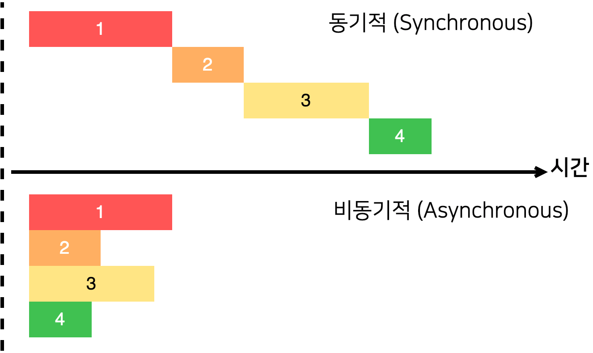

# 14 외부 API를 연동하여 뉴스 뷰어 만들기


## 14.1 비동기 작업의 이해





- 서버에서 데이터를 받아올 때

서버에서 데이터를 받아와야 할 상황에서는 송,수신 시간 비동기 작업으로 일을 처리히야합니다. 만약 작업을 동기적으로 처리한다면 다른 작업을 하지 못합니다. 따라서 비동기적으로 처리한다면 다른 일들을 동시에 할 수 있고 다른 함수를 호출 할 수도 있습니다.

- 기다려야 할 때

```javascript
function PrintMe(){
  console.log('Hello world');
}
setTimeout(printMe,3000); // 3000ms 후에 printMe를 호출하시오 라는 문법입니다.

```

위 코드에서 printMe 함수 자체를 setTimeout 함수의 인자로 전달하였는데, 이런 함수를 콜백 함수라고 부릅니다.


### 14.1.1 콜백함수

예를 하나 들겠습니다. 인자가 주어진다면 1초 뒤에 10을 더해서 반환하는 함수가 있다는 가정을 합니다. 그리고 해당 함수가 처리된 직후 어떠한 작업을 하고 싶다면 다음과 같이 콜백 함수를 활용해서 작업합니다.

```javascript
function increase(number,callback){
	setTimeout(()=>{
    const result = number + 10;
    if (callback){
      callback(result);
    }
  },1000)
}
// 10과 console창에 결과를 기록하는 행위를 인자로 함수 호출
increase(10,result => {console.log(result)}); // 20

```


1초 후 20

2초 후 30

3초 후 40 을 작동하고 싶다면

```javascript
function increase(number,callback){
	setTimeout(()=>{
    const result = number + 10;
    if (callback){
      callback(result);
    }
  },1000)
}
// 10과 console창에 결과를 기록하는 행위를 인자로 함수 호출
increase(10,result => {
  console.log(result) // 20
  increase(result, result => {
    console.log(result); // 30
  	increase(result ,result => {
      console.log(result); // 40
    	})
  })
}); // 20


```

이렇게 콜백 함수가 많아지면 가독성이 떨어집니다. 이런 코드(콜백 지옥) 을 방지하기 위해서 ES6에서 도입된 기능인 Promise가 있습니다. 앞에서 본 코드를  Promise를 사용하여 작성해보겠습니다.


### 14.1.2 Promise

```javascript
function increase(number) {
  const promise = new Promise((resolve, reject) => {
    // resolve 는 성공 reject 는 실패
    setTimeout(() => {
      const result = number + 10;
      if (result > 50) {
        const e = new Error("Number is Too Big");
        return reject(e);
      }
      resolve(result);
    }, 1000);
  });
  // promise 반환
  return promise;
}

increase(0)
  .then(number => {
    // Promise 에서 resolve된 값은 .then을 통해 받아올수 있다. 즉 resolve를 활용하려면 .then = resolve 을 사용하면 된다.
    // 이 then 메소드의 파라미터인 callback 함수 자체가 resolve를 의미한다.
    // number은 result에 해당하는 의미
    console.log(number); // 10 출력
    return increase(number); // 20을 반환
  })
  .then(number => {
    console.log(number); // 20 출력
    return increase(number); // 30을 반환
  })
  .then(number => {
    console.log(number); // 30 출력
    return increase(number); // 40을 반환
  })
  .then(number => {
    console.log(number); // 40 출력
    return increase(number); // 50을 반환
  })
  .then(number => {
    console.log(number); // 50 출력
    return increase(number); // 60을 반환
  })
  .catch(e => {	
    // 에러가 제대로 입력되지 안
    console.log(e);
  });

```


### 14.1.3 async/await

async/await는 Promise를 더욱 쉽게 사용할 수 있도록 도와주는 ES2017(ES8) 문법입니다.

```javascript
function increase(number) {
  const promise = new Promise((resolve, reject) => {
    setTimeout(() => {
      const result = number + 10;
      if (result > 50) {
        const e = new Error("NumberisToobig");
        return reject(e);
      }
      resolve(result);
    }, 1000);
  });
  return promise;
}

async function run() {
  try {
    let result = await increase(0);
    console.log(result); // 10
    result = await increase(result);
    console.log(result); // 20
    result = await increase(result);
    console.log(result); // 30
    result = await increase(result);
    console.log(result); // 40
    result = await increase(result);
    console.log(result); // 50
    result = await increase(result);
    console.log(result); // 60
  } catch (e) {
    // 에러가 제대로 입력되지 안
    console.log(e);
  }
}

run();

```


## 14.2 axios로 API호출해서 데이터 받아오기

axios는 2019.09 기준 가장 많이 사용되는 자바스크립트 HTTP 클라이언트 입니다.

이 라이브러리의 특징은 HTTP요청을 Promise 기반으로 처리한다는 점입니다.

```
$ yarn create react-app 14-news-viwer
$ cd 14-news-viewer
$ yarn add axios
```

.prettierrc

```
{
  "singleQuote": true,
  "semi": true,
  "useTabs": false,
  "tabWidth": 2,
  "printWidth": 80,
  "trailingComma": "all"
}

```

jsconfig.json

```json
{
  "compilerOptions": {
    "target": "es6"
  }
}

```

then을 활용하여 비동기작업을 처리하기

App.js

```jsx
import React, { useState } from 'react';
import axios from 'axios';
const App = () => {
  const [data, setData] = useState(null);
  const onClick = () => {
    axios
      .get('https://jsonplaceholder.typicode.com/todos/1')
      .then((response) => {
        setData(response.data);
      });
  };
  return (
    <div>
      <div>
        <button onClick={onClick}>불러오기</button>
      </div>
      {data && <textarea rows={7} value={JSON.stringify(data, null, 2)} />}
    </div>
  );
};

export default App;

```


async/await를 활용하여 비동기작업을 처리하기

App.js

```jsx
import React, { useState } from 'react';
import axios from 'axios';
const App = () => {
  const [data, setData] = useState(null);
  const onClick = async () => {
    try {
      const response = await axios.get(
        'https://jsonplaceholder.typicode.com/todos/1',
      );
      setData(response.data);
    } catch (e) {
      console.log(e);
    }
  };
  return (
    <div>
      <div>
        <button onClick={onClick}>불러오기</button>
      </div>
      {data && <textarea rows={7} value={JSON.stringify(data, null, 2)} />}
    </div>
  );
};

export default App;
```


## 14.3 newsapi API 키 발급하기

https://newsapi.org/ 사이트에서 api를 발급받기

dk99521@naver.com

지금여기12

발급받은 API  키는 추후 API를 요청할 때 API 주소의 쿼리 파라미터로 넣어서 사용하면 됩니다.

- 한국 뉴스  API 설명서
- 전체 뉴스 불러오기
- 특정 카테고리 뉴스 불러오기

JSONPlaceholder 가짜 API를 전체 뉴스를 불러오는 API로 대체해봅시다.

App.js

```jsx
import React, { useState } from 'react';
import axios from 'axios';
const App = () => {
  const [data, setData] = useState(null);
  const onClick = async () => {
    try {
      const response = await axios.get(
        'http://newsapi.org/v2/top-headlines?country=kr&apiKey=5e9dbc5e923549c8a35d4af559c3672c',
      );
      setData(response.data);
    } catch (e) {
      console.log(e);
    }
  };
  return (
    <div>
      <div>
        <button onClick={onClick}>불러오기</button>
      </div>
      {data && <textarea rows={7} value={JSON.stringify(data, null, 2)} />}
    </div>
  );
};

export default App;

```


## 14.4 뉴스 뷰어 UI 만들기

```
$ yarn add styled-components
```

components 디렉터리 안에 

NewsItem.js // 각 뉴스 정보를 보여주는 컴포넌트

NewsList.js // 여기서 Newsitem을 배열로 렌더링 하는

### 14.4.1 NewsItem 만들기

먼저 서버에서 받아온 데이터(response.data)를 확인해봅시다.

<textarea> {
  "status": "ok",
  "totalResults": 34,
  "articles": [
    {
      "source": {
        "id": null,
        "name": "Joins.com"
      },
      "author": "중앙일보",
      "title": "프로축구선수협회, 선수 동의 없는 임금 삭감 반대 - 중앙일보 - 중앙일보",
      "description": "한국프로축구선수협회가 18일 \"선수 동의 없는 (임금) 삭감은 안 된다\"는 공식 입장을 냈다. 선수협 이근호(울산 현대) 회장은 이사회에서 \"우선 코로나19로 인한 손실이 어느 정도인지 정확히 파악할 필요가 있다\"고 짚었고, 박주호(울산) 부회장은 \"현재 K리그 일부 구단에서 선수들의 급여를 삭감해 기부가 이뤄진 것으 - 프로축구선수협회,선수,프로축구선수협회 선수,임금 선수들,임금 삭감",
      "url": "https://news.joins.com/article/23757422",
      "urlToImage": "https://pds.joins.com/news/component/htmlphoto_mmdata/202004/19/4100368d-fd02-4685-88ba-8ffca8992fca.jpg",
      "publishedAt": "2020-04-18T17:43:04Z",
      "content": null
    },
    {
      "source": {
        "id": null,
        "name": "Joins.com"
      },
      "author": "정진우",
      "title": "트럼프 \"文 큰 승리 거뒀다\" 文 \"코로나 호전, 총선승리 큰 도움\" - 중앙일보 - 중앙일보",
      "description": "도널드 트럼프 미국 대통령이 18일 문재인 대통령과 통화에서 더불어민주당이 180석을 확보하며 압승한 21대 총선 결과에 대해 \"문 대통령이 큰 승리를 거둔 것\"이라고 말했다. 트럼프 대통령은 이날 오후 10시부터 30분간 이뤄진 문 대통령과의 통화에서 코로나19 대응과 관련한 한미 공조방안 등에 대해 의견을 교환하면 - 대북지원,트럼프,트럼프 대통령,대북지원 원칙,총선 승리",
      "url": "https://news.joins.com/article/23757421",
      "urlToImage": "https://pds.joins.com/news/component/htmlphoto_mmdata/202004/19/8efb8de2-7030-4a0f-8b5b-82b2e5ee65d9.jpg",
      "publishedAt": "2020-04-18T16:20:59Z",
      "content": null
    },
    {
      "source": {
        "id": null,
        "name": "Chosun.com"
      },
      "author": null,
      "title": "김예지, 안내견 '국회 입장' 논란에 \"시각장애인의 눈\" - 조선일보",
      "description": "\"안내견 본회의장 입장, 논란의 대상이 되는 것이 문제\"정의당 \"충분히 지원해야\" 與 이석현 \"허용하는 게 당연\"'시각장애인 피아니스트'인 미래..",
      "url": "https://biz.chosun.com/site/data/html_dir/2020/04/19/2020041900011.html",
      "urlToImage": "https://image.chosun.com/sitedata/image/202004/19/2020041900011_0.png",
      "publishedAt": "2020-04-18T16:04:02Z",
      "content": "' ' 18 \" , \" . \" ' ' . \" .\r\n'' . . \"'' , \" .\r\n\" , ' '(barrier free· ) \" \" \" .\r\n\" \" \" \" .\r\n\"17 \" \"21 \" .\r\n\" . , \" \" . \" ."
    },
    {
      "source": {
        "id": "google-news",
        "name": "Google News"
      },
      "author": null,
      "title": "기재1차관 \"임시·일용직·자영업자 최우선 지원 절실…실업급여 커버 안돼\" - 시사프라임",
      "description": null,
      "url": "https://news.google.com/__i/rss/rd/articles/CBMiPGh0dHBzOi8vd3d3LnNpc2FwcmltZS5jby5rci9uZXdzL2FydGljbGVWaWV3Lmh0bWw_aWR4bm89ODI2MtIBAA?oc=5",
      "urlToImage": null,
      "publishedAt": "2020-04-18T16:01:00Z",
      "content": null
    },
    {
      "source": {
        "id": null,
        "name": "Polinews.co.kr"
      },
      "author": "윤청신 기자",
      "title": "정은채 공식입장, 정준일과 불륜설 \"과거일인데 마치 현재 사건처럼 왜곡\" - 폴리뉴스",
      "description": "[폴리뉴스=윤청신 기자] 가수 정준일(38)과 불륜설에 휩싸여 구설수에 올랐던 배우 정은채(35)가 \"10여 년 전 지극히 개인적인 일로 모두 끝난 부분\"이라는 공식입장을 밝혔다. 정은채의 소속사 키이스트는 18일 공식입장을 통해 \"이 사안은 10여 년 전 지극히 개인적인 일로 모두 끝난 부분\"이라며 \"특히 양측",
      "url": "http://www.polinews.co.kr/news/article.html?no=460221",
      "urlToImage": "http://www.polinews.co.kr/data/photos/20200416/art_15872229572443_e7d723.jpg",
      "publishedAt": "2020-04-18T15:32:48Z",
      "content": "[= ]\r\n (38) (35) \"10 \" .\r\n 18 \" 10 \" \" , \" .\r\n \" \" .\r\n \" \" \" \" .\r\n \" \" .\r\n 17 10 . , .\r\n 17 \" 10 \" \" \" .\r\n 18 \" \" \" , \" .\r\n1986 () 2010 '' '', ' ', ' ', '' .\r\n 2013 ' ' , , .\r\n 17 SBS ' - ' . 2008 , 2011 , '' ."
    },
    {
      "source": {
        "id": null,
        "name": "Voakorea.com"
      },
      "author": null,
      "title": "한국, 코로나바이러스 신규 확진자 58일만에 10명대 진입 - 한국어 방송 - VOA Korean",
      "description": "한국 내 코로나바이러스 확진자가 18명 증가했다고 한국 방역 당국이 18일 밝혔습니다.\n\n이로써 한국 내 신종 코로나바이러스 확진자는 총 1만653명을 기록했습니다.\n\n한국에서 일일 신규 확진자 수가 10명대로 떨어진 건 지난 2월 20일 이후 처음입니다.\n\n신규 확진자 가운데 5명은 대구·경북에서 나왔습니다.\n\n수도권에서는 신규 확진자가 서울 1명, 경기 4명, 인천 1명 등 총 6명이 발생했습니다.\n\n신규 확진자 18명 가운데 9명은 해외에서 유입됐습니다.…",
      "url": "https://www.voakorea.com/coronavirus/health-corona-virus-korea",
      "urlToImage": "https://media.voltron.voanews.com/Drupal/01live-211/2020-04/2020-04-15T060848Z_659897953_RC2U4G9N1CQF_RTRMADP_3_HEALTH-CORONAVIRUS-SOUTHKOREA-RESPONSE.JPG",
      "publishedAt": "2020-04-18T15:24:23Z",
      "content": null
    },
    {
      "source": {
        "id": null,
        "name": "Kbs.co.kr"
      },
      "author": null,
      "title": "이스타항공, 군산-제주 국내선 운항 중단 연장 - KBS뉴스",
      "description": "코로나19 장기화로 구조 조정을 본격화한 이스타항공이 국내선 운항 중단을 연장했습니다. 이에 따라 군산에서 제주를 오가는 모든 이스타항공 편이 다음 달 28일까지 중단됩니다. 이스타항공은 지난달",
      "url": "http://news.kbs.co.kr/news/view.do?ncd=4427715",
      "urlToImage": "http://padmin.static.kbs.co.kr/nbroad/2020/4/18/1587216325981_nbroad.jpg",
      "publishedAt": "2020-04-18T13:25:00Z",
      "content": null
    },
    {
      "source": {
        "id": null,
        "name": "Kbs.co.kr"
      },
      "author": null,
      "title": "“백신 없으면 내년 도쿄올림픽 비현실적” > 뉴스 9 > 종합 > 스포츠 | KBSNEWS - KBS뉴스",
      "description": "'코로나 19'의 백신이 개발되지 않는다면 내년으로 미뤄진 도쿄올림픽 정상 개최가 어려울 것이라는 전망이 나왔습니다. 영국의 BBC는 보건 전문가인 데비 스리다 교수와의 인터뷰를 통해 '코로나 19'의 백신이",
      "url": "http://mn.kbs.co.kr/news/view.do?ncd=4427632",
      "urlToImage": "https://nsimg.kbs.co.kr/data/news/2020/04/18/4427632_200.jpg",
      "publishedAt": "2020-04-18T12:35:00Z",
      "content": null
    },
    {
      "source": {
        "id": null,
        "name": "Polinews.co.kr"
      },
      "author": null,
      "title": "식약처 메디톡스의 '메디톡신주' 품목 취소…그 배경은? - 폴리뉴스",
      "description": "［폴리뉴스 황수분 기자］식품의약품안전처(이하 식약처)가 메디톡스의 메디톡신주 품목 허가를 취소하기로 해 그 배경이 관심이다. 메디톡신은 메디톡스가 2006년 3월 국산 첫 보툴리눔 톡신 A형 제제로 식약처로부터 허가를 받은 제품이다. 메디톡신주는 근육경직 치료 및 주름개선에 사용되는 보툴리눔 제제로 메디톡신주의 출시 이후 꾸준한 성장세를 보여왔기에 파장이",
      "url": "http://www.polinews.co.kr/news/article.html?no=460208",
      "urlToImage": "http://www.polinews.co.kr/data/photos/20200416/art_15872109994852_e9195a.gif",
      "publishedAt": "2020-04-18T12:22:31Z",
      "content": "[ ]19 HMR, CMR, \r\n (HMR), (CMR), 19 . HMR . CJ 3 2 16 . 1 . 1 2000 . HMR . HMR HMR 2 . HMR CMR . CMR , . 1 1300 . 2 4 ."
    },
    {
      "source": {
        "id": null,
        "name": "Chosun.com"
      },
      "author": null,
      "title": "'라임 무마 의혹' 前청와대 행정관 구속 - 조선일보",
      "description": "1조 6000억원 규모의 라임자산운용 환매 중단 사태에 연루된 김모(46) 전 청와대 행정관이 18일 구속됐다. 서울남부지법 이승원 판사는 이날..",
      "url": "https://news.chosun.com/site/data/html_dir/2020/04/18/2020041801151.html",
      "urlToImage": "https://image.chosun.com/facebook/newson.png",
      "publishedAt": "2020-04-18T11:22:53Z",
      "content": "1 6000 (46) 18 . .2 1 . () 4900 .\r\n, . 4 . , .\r\nWM . .\r\n16 . 18 ."
    },
    {
      "source": {
        "id": null,
        "name": "Youtube.com"
      },
      "author": null,
      "title": "[단독] \"교육부, 5월 고3부터 단계적 등교 개학 검토\" / SBS - SBS 뉴스",
      "description": "학생들이 실제로 학교에 가는 진짜 개학을 언제 할 거냐 관심이 많은데 정부가 5월에 수능 시험 준비가 급한 고3부터 등교시키는걸 검토하는걸로 저희 취재결과 확인됐습니다. 그리고 나서 상황을 봐가면서 고등학교 다른 학년들, 중학교, 이런 순서로 단계적으로 학교 문을 다시 연다는 생각...",
      "url": "https://www.youtube.com/watch?v=mMdW3HPO1nE",
      "urlToImage": "https://i.ytimg.com/vi/mMdW3HPO1nE/maxresdefault.jpg",
      "publishedAt": "2020-04-18T11:22:26Z",
      "content": null
    },
    {
      "source": {
        "id": null,
        "name": "Mt.co.kr"
      },
      "author": "고용준",
      "title": "[LCK] '돌아왔구나' 담원, KT 꺾고 PO 1R 진출(종합) - OSEN",
      "description": "[OSEN=고용준 기자] 특유의 공격성으로 팬들을 매료시켰던 담원이 자신들의 색깔을 찾았다. 담원이 KT의 운영을 무너뜨리고 포스트시즌의 두 번째 관문인 플레이오프 1라운드행 티켓",
      "url": "http://osen.mt.co.kr/article/G1111340127",
      "urlToImage": "https://file.osen.co.kr/article/2020/04/18/202004181912775567_5e9adfe02c5dd.jpg",
      "publishedAt": "2020-04-18T11:09:20Z",
      "content": "[OSEN=고용준 기자] 특유의 공격성으로 팬들을 매료시켰던 담원이 자신들의 색깔을 찾았다. 담원이 KT의 운영을 무너뜨리고 포스트시즌의 두 번째 관문인 플레이오프 1라운드행 티켓을 거머쥐었다. \r\n담원은 18일 오후 온라인으로 열린 '2020 LOL 챔피언스 코리아(이하 LCK)' 스프링 스플릿 플레이오프 KT와 와일드카드전서 풀세트 접전 끝에 2-1 승리를 거뒀다. '너구리' 장하권과 '쇼메이커' 허수의 캐리 라인이 활약하면서 접전의 승리를 견인했다. \r\n… [+606 chars]"
    },
    {
      "source": {
        "id": null,
        "name": "Mk.co.kr"
      },
      "author": null,
      "title": "코로나 지원금, 올리브영은 되고 랄라블라는 안 된다? - 매일경제 - 매일경제",
      "description": "대기업 브랜드라도 가맹점이면 OK 스타벅스·커피빈·롭스도 사용 불가",
      "url": "https://www.mk.co.kr/news/business/view/2020/04/406715/",
      "urlToImage": "https://file.mk.co.kr/meet/neds/2020/04/image_readtop_2020_406715_15872077704167141.jpg",
      "publishedAt": "2020-04-18T11:02:50Z",
      "content": "(19) . (H&amp;B) , .\r\n17 9 `` 10 , , (SSM), , . 19 .\r\n `` .\r\n GS25, CU, , 24, , , H&amp;B , bhc, BBQ , , , .\r\nH&amp;B . 1248 20% 250 . 19 . .\r\n19 .\r\n19 . . GS25 11 13899 0.7%(102) . CU 1% . ` ` . \r\n. 1154 4(0.3%). bhc 1450 8 . 99% .\r\n. 19 . , . 2018 (99.7%), … [+48 chars]"
    },
    {
      "source": {
        "id": null,
        "name": "Joins.com"
      },
      "author": "고승혁 / 주말취재팀 기자",
      "title": "논산훈련소 입소생 2명 추가 확진…모두 '신천지 신도' - JTBC",
      "description": "[앵커]어제(17일) 논산훈련소에서 코로나19 확진자가 나왔다고 전해드렸는데 오늘 2명이 더 확인됐습니다. 모두 신천지 신도라고 하는데요. 훈련소에 가족을 보낸 시민들은 불안한 마음에 홈페이지에 안부를 묻거나",
      "url": "http://news.jtbc.joins.com/article/article.aspx?news_id=NB11946058",
      "urlToImage": "http://photo.jtbc.joins.com/news/2020/04/18/202004181902108376_LC.jpg",
      "publishedAt": "2020-04-18T10:09:00Z",
      "content": null
    },
    {
      "source": {
        "id": null,
        "name": "Kmib.co.kr"
      },
      "author": "�dz��� ����",
      "title": "‘긴급사태’ 일본 누적 확진자 한국 추월… “계속 늘어나” - 국민일보",
      "description": "��޻��°� ������ �Ϻ� �� ���� �ڷγ����̷���������(�ڷγ�19) ���� Ȯ���ڰ� 18�� �ѱ��� �߿��ߴ�.NHK�� �̳� ���� 4���� �Ϻ� �� �ڷγ�19 Ȯ���ڰ� 1��9",
      "url": "http://m.kmib.co.kr/view.asp?arcid=0014491948",
      "urlToImage": "http://image.kmib.co.kr/online_image/2020/0418/611312110014491948_1.jpg",
      "publishedAt": "2020-04-18T09:28:00Z",
      "content": "° (19) 18 .NHK 4 19 198 ó 1 . .\r\n 19 712 1810. 1653(18 0 ) .500 10~20 õ.\r\n201 181 19 . 2975 þ.\r\nkwonny@kmib.co.kr\r\n<ul><li> 8 </li><li> , </li><li> ö </li><li>, 5 3 </li><li> 171 , ù </li><li> ± , </li><li>[] ü 3 õ </li><li> ? ¶ </li><li> , </li><li> 8õ · </l… [+426 chars]"
    },
    {
      "source": {
        "id": null,
        "name": "Hankyung.com"
      },
      "author": "Digital tenasia.hankyung.com",
      "title": "구혜선 '미스터트롯 힘으로 두번째 전시회 개최' - 텐아시아",
      "description": "[TV텐] 구혜선 '미스터트롯 힘으로 두번째 전시회 개최', 조준원 기자, 연예가화제 뉴스",
      "url": "https://tenasia.hankyung.com/topic/article/2020041887474",
      "urlToImage": "https://img.hankyung.com/photo/202004/BF.22393056.1.jpg",
      "publishedAt": "2020-04-18T09:05:00Z",
      "content": null
    },
    {
      "source": {
        "id": null,
        "name": "Chosun.com"
      },
      "author": "health chosun",
      "title": "\"퇴행성관절염, 다리 휜 사람은 급속히 악화\" - 헬스조선",
      "description": "���� ���༺�������� ȣ���ϸ� ������ ã�� ȯ���� ��κ��� ������ ȣ���Ѵ�. ����� �������� ��, �ɾҴٰ� �Ͼ ��, ���� ��� ���� ������ ��..",
      "url": "http://health.chosun.com/site/data/html_dir/2020/04/17/2020041702782.html",
      "urlToImage": null,
      "publishedAt": "2020-04-18T08:38:49Z",
      "content": "ã . , , . \" , ó ¸ \" \" , \" . . \r\n . . , ü .\r\n \" \" \" ' ' \" . \" \" \" \" . . \r\n , 'EOS ' \" \" '(SwimEX)' ´\" ."
    },
    {
      "source": {
        "id": null,
        "name": "Insight.co.kr"
      },
      "author": "지동현",
      "title": "'2살' 설정인데 너무 커 캐스팅 실패(?)했다고 말 나온 '부부의 세계' 박해준 한소희 딸 - 인사이트",
      "description": "부부의 세계‘ 박해준과 한소희의 딸이 드라마 설정상 2살의 나이임에도 너무 성장한 모습으로 시청자의 시선을 끌었다.",
      "url": "https://www.insight.co.kr/news/279767",
      "urlToImage": "https://img.insight.co.kr/static/2020/04/18/1200/pcg0oka02758kdj5puyv.jpg",
      "publishedAt": "2020-04-18T06:30:34Z",
      "content": "JTBC ' '\r\n[] = ' ' (?) .\r\n 17 JTBC ' ' ( ) ( ) 2 .\r\n ( ) .\r\n .\r\nJTBC ' '\r\n .\r\n .\r\n .\r\n 2 2 .\r\nJTBC ' '\r\n 2 .\r\n4~5 \"2 \", \" \", \" \" .\r\n .\r\nJTBC ' '\r\nNaver TV ' '"
    },
    {
      "source": {
        "id": null,
        "name": "Chosun.com"
      },
      "author": null,
      "title": "방역당국 \"렘데시비르 국내 임상 2건, 5월말 결과 목표\" - 조선일보",
      "description": "질병관리본부 중앙방역대책본부는 신종 코로나바이러스 감염증(코로나 19) 치료효과를 나타낸 것으로 알려진 ‘렘데시비르(remdesivir)’의 임..",
      "url": "https://biz.chosun.com/site/data/html_dir/2020/04/18/2020041800893.html",
      "urlToImage": "https://image.chosun.com/sitedata/image/202004/18/2020041800886_0.png",
      "publishedAt": "2020-04-18T06:25:21Z",
      "content": "( 19) (remdesivir) 2 18 .() \" , \" .\r\n, . AFP (NIH) 17( ) 19 , .\" , 3 \" \" NIH \" .\r\n\" 2 5 \" . \" , \" \" \" .\r\n19 . \" , \" \" , \" .\r\n\" \" .\r\n\" , , \" .\r\n\" ·\" \" \" ."
    },
    {
      "source": {
        "id": null,
        "name": "Seattlen.com"
      },
      "author": "시애틀N",
      "title": "'화양연화' 이보영 \"유지태, 멜로로 원래 자리 찾은 것 같아\" - 시애틀N",
      "description": "시애틀 주요 뉴스 및 미주 한인 주요 뉴스 제공. 시애틀 한인 커뮤니티 자유게시판 및 벼룩시장 제공",
      "url": "https://www.seattlen.com/bbs/board.php?bo_table=entNews&wr_id=18638",
      "urlToImage": "http://www.seattlen.com/images/ico.png",
      "publishedAt": "2020-04-18T03:46:39Z",
      "content": "'' \", \" . \r\n 17 tvN '- '( / / '') \" '' \" . \r\n \" . \" . '' .\r\n '' ( ) ( ). 25 9 ."
    }
  ]
}</textarea>


즉 response.data 안의 article 객체 안의 배열로 뉴스기사들이 들어 있습니다. 다시 뉴스아이템의 컴포넌트를 확인하기 위해서 다시 확인해 봅시다.

<textarea>  "articles": [
    {
      "source": {
        "id": null,
        "name": "Joins.com"
      },
      "author": "중앙일보",
      "title": "프로축구선수협회, 선수 동의 없는 임금 삭감 반대 - 중앙일보 - 중앙일보",
      "description": "한국프로축구선수협회가 18일 \"선수 동의 없는 (임금) 삭감은 안 된다\"는 공식 입장을 냈다. 선수협 이근호(울산 현대) 회장은 이사회에서 \"우선 코로나19로 인한 손실이 어느 정도인지 정확히 파악할 필요가 있다\"고 짚었고, 박주호(울산) 부회장은 \"현재 K리그 일부 구단에서 선수들의 급여를 삭감해 기부가 이뤄진 것으 - 프로축구선수협회,선수,프로축구선수협회 선수,임금 선수들,임금 삭감",
      "url": "https://news.joins.com/article/23757422",
      "urlToImage": "https://pds.joins.com/news/component/htmlphoto_mmdata/202004/19/4100368d-fd02-4685-88ba-8ffca8992fca.jpg",
      "publishedAt": "2020-04-18T17:43:04Z",
      "content": null
    }, </textarea>

트리형태로 표현해보면

- source
  - id
  - name
- author
- title
- description
- url
- utlToImage
- publishedAt
- content

이 중 title(내용), description(본문), url(링크), urlToImage(뉴스 이미지) 를 사용하겠습니다.

components/NewsItem.js

```jsx
import React from 'react';
import styled from 'styled-components';

const NewsItemBlock = styled.div`
  display: flex;
  .thumbnail {
    margin-left: 1rem;
    img {
      display: block;
      width: 160px;
      height: 160px;
      object-fit: cover;
    }
  }
  .contents {
    h2 {
      margin: 0;
      a {
        color: black;
      }
    }
    p {
      margin: 0;
      line-height: 1.5;
      margin-top: 1rem;
      white-space: normal;
    }
  }
  & + & {
    margin-top: 3rem;
  }
`;
const NewsItem = ({ article }) => {
  const { title, description, url, urlToImage } = article;

  return (
    <NewsItemBlock>
      {urlToImage && (
        <div className="thumbnail">
          <a href={url} target="_blank" rel="noopener noreferrer">
            
          </a>
        </div>
      )}
      <div className="contents">
        <h2>
          <a href={url} target="_blank" rel="noopener noreferrer">
            {title}
          </a>
        </h2>
        <p>{description}</p>
      </div>
    </NewsItemBlock>
  );
};

export default NewsItem;

```


### 14.4.2 NewsList 만들기

components/NewsList.js

```jsx
import React from 'react';
import styled from 'styled-components';
import NewsItem from './NewsItem';

const NewsListBlock = styled.div`
  box-sizing: border-box;
  padding-bottom: 3rem;
  width: 768px;
  margin: 0 auto;
  margin-top: 2rem;
  @media screen and (max-width: 768px) {
    width: 100%;
    padding-left: 1rem;
    padding-right: 1rem;
  }
`;

const sample = {
  title: '제목',
  description: '내용',
  url: 'www.google.com',
  urlToImage: 'http://via.placeholder.com/160',
};
const NewsList = () => {
  return (
    <NewsListBlock>
      <NewsItem article={sample} />
      <NewsItem article={sample} />
      <NewsItem article={sample} />
      <NewsItem article={sample} />
      <NewsItem article={sample} />
      <NewsItem article={sample} />
    </NewsListBlock>
  );
};

export default NewsList;

```


## 14.5 데이터 연동하기

API 호출 할 때 useEffect를 사용하여 컴포넌트가 처음 렌더링 되는 시점에 API를 요청하면 됩니다. 여기서 주의할 점은 useEffect에 등록하는 함수에 async를 붙이면 안 되다는 점 입니다. useEffect에서 반환해야하는 값은 뒷정리 함수(unmount ) 이기 때문입니다.

따라서 useEffect 내부에서 async/await를 사용하고 싶다면, 함수 내부에 async 키워드가 붙은 함수를 따로 선언해서 사용해 주어야 하 ㅂ니다.

추가로 loading이라는 상태도 관리하여 API 요청이 대기 중인지 판별할 것입니다. 요청이 대기중일 때는 loading의 값은 true로 설정되고, 끝났을 때는 false가 됩니다.

components/NewsList.js

```jsx
import React, { useState, useEffect } from 'react';
import styled from 'styled-components';
import NewsItem from './NewsItem';
import axios from 'axios';
const NewsListBlock = styled.div`
  box-sizing: border-box;
  padding-bottom: 3rem;
  width: 768px;
  margin: 0 auto;
  margin-top: 2rem;
  @media screen and (max-width: 768px) {
    width: 100%;
    padding-left: 1rem;
    padding-right: 1rem;
  }
`;

const NewsList = () => {
  const [articles, setArticles] = useState(null);
  const [loading, setLoading] = useState(false);

  useEffect(() => {
    const fetchData = async () => {
      setLoading(true);
      try {
        const response = await axios.get(
          'http://newsapi.org/v2/top-headlines?country=kr&apiKey=5e9dbc5e923549c8a35d4af559c3672c',
        );
        setArticles(response.data.articles);
      } catch (e) {
        console.log(e);
      }
      setLoading(false);
    };
    // 함수 실행
    fetchData();
  }, []);

  // 로딩 중
  if (loading) {
    return <NewsListBlock>대기 중...</NewsListBlock>;
  }
  if (!articles) {
    return null;
  }
  // article 값 확인
  return (
    <NewsListBlock>
      {articles &&
        articles.map((article) => (
          <NewsItem key={article.url} article={article}></NewsItem>
        ))}
    </NewsListBlock>
  );
};

export default NewsList;

```


## 14.6 카테고리 기능 구현하기

### 14.6.1 카테고리 선택 UI 만들기

components/Categories.js

```jsx
import React from 'react';
import styled from 'styled-components';

const categories = [
  {
    name: 'all',
    text: '전체보기',
  },
  {
    name: 'business',
    text: '비즈니스',
  },
  {
    name: 'entertainment',
    text: '엔터테인먼트',
  },
  {
    name: 'health',
    text: '건강',
  },
  {
    name: 'science',
    text: '과학',
  },
  {
    name: 'sports',
    text: '스포츠',
  },
  {
    name: 'technology',
    text: '기술',
  },
];
const CategoriesBlock = styled.div`
  display: flex;
  padding: 1rem;
  width: 768px;
  margin: 0 auto;
  /* 동적 변화 */
  @media screen and (max-width: 768px) {
    width: 100%;
    overflow-x: auto;
  }
`;
const Category = styled.div`
  font-size: 1.15rem;
  cursor: pointer;
  white-space: pre;
  text-decoration: none;
  color: inherit;
  padding-bottom: 0.25rem;
  &:hover {
    color: #495057;
  }
  & + & {
    margin-left: 1rem;
  }
`;
const Categories = () => {
  return (
    <CategoriesBlock>
      {categories.map((c) => (
        <Category key={c.name}>{c.text}</Category>
      ))}
    </CategoriesBlock>
  );
};

export default Categories;

```

App.js

```jsx
import React from 'react';
import NewsList from './components/NewsList';
import Categories from './components/Categories';

const App = () => {
  return (
    <>
      <Categories />
      <NewsList />
    </>
  );
};

export default App;

```

 이제는 App에서  Category 상태를 useState로 관리하겠습니다. 추가로 Category를 업데이트 하는 onSelect라는 함수도 만들겠습니다. 그리고 category와 onSelect를 Categories 컴포넌트에 props로 전달하고 NewsList에게도 전달해줍니다.

App.js

```jsx
import React, { useCallback, useState } from 'react';
import NewsList from './components/NewsList';
import Categories from './components/Categories';

const App = () => {
  // 첫 CateGory 화면은 전체
  const [category, setCategory] = useState('all');
  const onSelect = useCallback((category) => setCategory(category), []);
  return (
    <>
      <Categories category={category} onSelect={onSelect} />
      <NewsList category={category} />
    </>
  );
};

export default App;

```

components/Categories.js

```jsx
import React from 'react';
import styled, { css } from 'styled-components';

const categories = [
  {
    name: 'all',
    text: '전체보기',
  },
  {
    name: 'business',
    text: '비즈니스',
  },
  {
    name: 'entertainment',
    text: '엔터테인먼트',
  },
  {
    name: 'health',
    text: '건강',
  },
  {
    name: 'science',
    text: '과학',
  },
  {
    name: 'sports',
    text: '스포츠',
  },
  {
    name: 'technology',
    text: '기술',
  },
];
const CategoriesBlock = styled.div`
  display: flex;
  padding: 1rem;
  width: 768px;
  margin: 0 auto;
  /* 동적 변화 */
  @media screen and (max-width: 768px) {
    width: 100%;
    overflow-x: auto;
  }
`;
const Category = styled.div`
  font-size: 1.15rem;
  cursor: pointer;
  white-space: pre;
  text-decoration: none;
  color: inherit;
  padding-bottom: 0.25rem;
  &:hover {
    color: #495057;
  }
  ${(props) =>
    props.active &&
    css`
      font-weight: 600;
      border-bottom: 2px solid #22b8cf;
      color: #22b8cf;
      &:hover {
        color: #3bc9bd;
      }
    `}
  & + & {
    margin-left: 1rem;
  }
`;
const Categories = ({ category, onSelect }) => {
  return (
    <CategoriesBlock>
      {categories.map((c) => (
        <Category
          active={category === c.name}
          // 파라미터가 있기 때문에 ()=>함수실행 형태로 사용
          onClick={() => onSelect(c.name)}
          key={c.name}
        >
          {c.text}
        </Category>
      ))}
    </CategoriesBlock>
  );
};

export default Categories;

```

### 14.6.2 API를 호출할 때 카테고리 지정하기

이제 뉴스리스트에서 category별 뉴스 기사를 보여줄 수 있도록 설정합니다.

components/NewsList.js

```jsx
import React, { useState, useEffect } from 'react';
import styled from 'styled-components';
import NewsItem from './NewsItem';
import axios from 'axios';
const NewsListBlock = styled.div`
  box-sizing: border-box;
  padding-bottom: 3rem;
  width: 768px;
  margin: 0 auto;
  margin-top: 2rem;
  @media screen and (max-width: 768px) {
    width: 100%;
    padding-left: 1rem;
    padding-right: 1rem;
  }
`;

const NewsList = ({ category }) => {
  const [articles, setArticles] = useState(null);
  const [loading, setLoading] = useState(false);

  useEffect(() => {
    const fetchData = async () => {
      setLoading(true);
      try {
        const query = category === 'all' ? '' : `&category=${category}`;
        const response = await axios.get(
          `http://newsapi.org/v2/top-headlines?country=kr${query}&apiKey=5e9dbc5e923549c8a35d4af559c3672c`,
        );
        setArticles(response.data.articles);
      } catch (e) {
        console.log(e);
      }
      setLoading(false);
    };
    // 함수 실행
    fetchData();
  }, [category]);

  // 로딩 중
  if (loading) {
    return <NewsListBlock>대기 중...</NewsListBlock>;
  }
  if (!articles) {
    return null;
  }
  // article 값 확인
  return (
    <NewsListBlock>
      {articles &&
        articles.map((article) => (
          <NewsItem key={article.url} article={article}></NewsItem>
        ))}
    </NewsListBlock>
  );
};

export default NewsList;

```


## 14.7 리액트 라우터 적용하기

### 14.7.1 리액트 라우터의 설치 및 적용

```
yarn add react-router-dom
```

index.js

```jsx
import React from 'react';
import ReactDOM from 'react-dom';
import './index.css';
import App from './App';
import * as serviceWorker from './serviceWorker';
import { BrowserRouter } from 'react-router-dom';

ReactDOM.render(
  <BrowserRouter>
    <React.StrictMode>
      <App />
    </React.StrictMode>
  </BrowserRouter>,
  document.getElementById('root'),
);

serviceWorker.unregister();

```

### 14.7.2  NewsPage 생성

페이지에서 파라미터로 전달할 수 있도록 App.js 와 NewsPage 컴포넌트를 새로 작성합니다.

pages/NewsPage.js

```jsx
import React from 'react';
import NewsList from '../components/NewsList';
import Categories from '../components/Categories';

const Newspage = ({ match }) => {
  // 지정되지 않았을 때는 all을 기본으로 설정
  const category = match.params.category || 'all';
  return (
    <div>
      <Categories />
      <NewsList category={category} />
    </div>
  );
};

export default Newspage;

```

App.js

```jsx
import React, { useCallback, useState } from 'react';
import { Route } from 'react-router-dom';
import Newspage from './pages/Newspage';

const App = () => {
  return (
    <>
      {/* ?는  있어도 되고 없어도 된다라는 의미 */}
      <Route component={Newspage} path="/:category?" />
    </>
  );
};

export default App;

```

### 14.7.3 Categories 컴포넌트에서 NavLink 사용하기 

components/Categories.js

```jsx
import React from 'react';
import styled, { css } from 'styled-components';
import { NavLink } from 'react-router-dom';

const categories = [
  {
    name: 'all',
    text: '전체보기',
  },
  {
    name: 'business',
    text: '비즈니스',
  },
  {
    name: 'entertainment',
    text: '엔터테인먼트',
  },
  {
    name: 'health',
    text: '건강',
  },
  {
    name: 'science',
    text: '과학',
  },
  {
    name: 'sports',
    text: '스포츠',
  },
  {
    name: 'technology',
    text: '기술',
  },
];
const CategoriesBlock = styled.div`
  display: flex;
  padding: 1rem;
  width: 768px;
  margin: 0 auto;
  /* 동적 변화 */
  @media screen and (max-width: 768px) {
    width: 100%;
    overflow-x: auto;
  }
`;
const Category = styled(NavLink)`
  font-size: 1.125rem;
  cursor: pointer;
  white-space: pre;
  text-decoration: none;
  color: inherit;
  padding-bottom: 0.25rem;
  &:hover {
    color: #495057;
  }
  // claseeName
  &.active {
    font-weight: 600;
    border-bottom: 2px solid #22b8cf;
    color: #22b8cf;
    &:hover {
      color: #3bc9bd;
    }
  }

  & + & {
    margin-left: 1rem;
  }
`;
const Categories = () => {
  return (
    <CategoriesBlock>
      {categories.map((c) => (
        <Category
          key={c.name}
          // 이 값을 설정하지 않으면 다른 카테고리에도 active 스타일이 설정됩니다.
          // 전체보기 링크에 active 스타일이 적용되는 오류가 발생됩니다.
          activeClassName="active"
          // all을 가르킬때만 true 설정 아니면 경로가 all과 특정 카테고리가 같이 생성
          exact={c.name === 'all'}
          // url주소
          to={c.name === 'all' ? '/' : `/${c.name}`}
        >
          {c.text}
        </Category>
      ))}
    </CategoriesBlock>
  );
};

export default Categories;

```


## 14.8 usePromise 커스텀 Hook 만들기

컴포넌트에서 API 호출처럼 Promise를 사용해야 하는 경우 더욱 간결하게 코드를 작성할 수 있습니다.

lib/usePromise.js

```jsx
import { useState, useEffect } from 'react';

export default function usePromise(promiseCreator, deps) {
  const [loading, setLoading] = useState(false);
  const [resolved, setResolved] = useState(null);
  const [error, setError] = useState(null);

  useEffect(() => {
    const process = async () => {
      setLoading(true);
      try {
        const resolved = await promiseCreator();
        setResolved(resolved);
      } catch (e) {
        setError(e);
      }
      setLoading(false);
    };
    process();
  }, deps);

  return [loading, resolved, error];
}

```

대기 중(loading), 완료 결과(resolved), 실패결과(error) 의 상태를 관리하며 usePromise의 의존 배열 deps를 받아옵니다.


components/NewsList.js

```jsx
import React, { useState, useEffect } from 'react';
import styled from 'styled-components';
import NewsItem from './NewsItem';
import axios from 'axios';
import usePromise from '../lib/usePromise';
const NewsListBlock = styled.div`
  box-sizing: border-box;
  padding-bottom: 3rem;
  width: 768px;
  margin: 0 auto;
  margin-top: 2rem;
  @media screen and (max-width: 768px) {
    width: 100%;
    padding-left: 1rem;
    padding-right: 1rem;
  }
`;

const NewsList = ({ category }) => {
  const [loading, response, error] = usePromise(() => {
    const query = category === 'all' ? '' : `&category=${category}`;
    return axios.get(
      `http://newsapi.org/v2/top-headlines?country=kr${query}&apiKey=5e9dbc5e923549c8a35d4af559c3672c`,
    );
  }, [category]);

  // 로딩 중
  if (loading) {
    return <NewsListBlock>대기 중...</NewsListBlock>;
  }
  // 데이터가 안 왔을때
  if (!response) {
    return null;
  }
  // 에러가 발생시
  if (error) {
    return <NewsListBlock>에러 발생 !</NewsListBlock>;
  }

  const { articles } = response.data;
  return (
    <NewsListBlock>
      {articles &&
        articles.map((article) => (
          <NewsItem key={article.url} article={article}></NewsItem>
        ))}
    </NewsListBlock>
  );
};

export default NewsList;

```


# 15 Context API

나중에 ...


