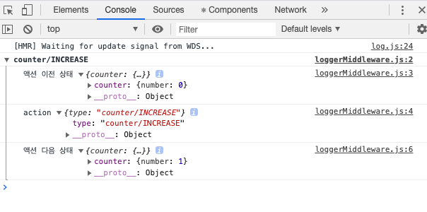
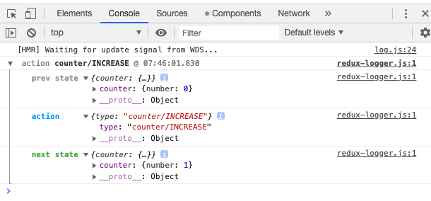
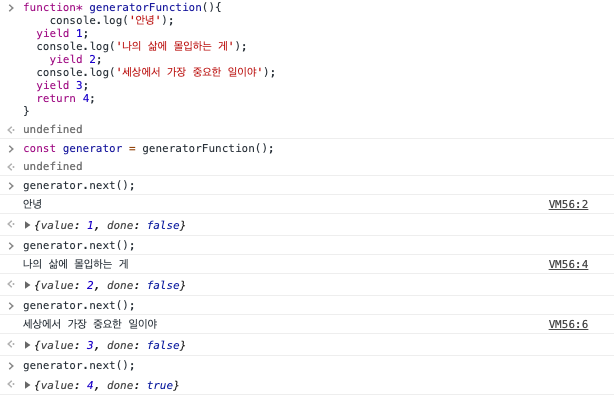
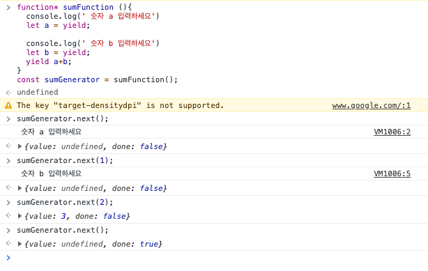
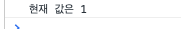

# 18 리덕스 미들웨어틀 통한 비동기 작업관리

## 18.1 작업환경 준비

`yarn add redux react-redux redux-actions `

리덕스 모듈 부분은 본 책과 다르게 준비했습니다.

### 18.1.1 UI 준비하기

App.js

```jsx
import React from 'react';
import CounterContainer from './containers/CounterContainer';

const App = () => {
  return (
    <div>
      <CounterContainer />
    </div>
  );
};

export default App;

```

containers/CounterContainer.js

```jsx
import React from 'react';
import Counter from '../components/Counter';
import { useCallback } from 'react';
import { useSelector, useDispatch } from 'react-redux';
import { increase, decrease } from '../modules/counter';
const CounterContainer = () => {
  const number = useSelector(state => state.counter.number);
  const dispatch = useDispatch();
  const onIncrease = useCallback(() => dispatch(increase()), [dispatch]);

  const onDecrease = useCallback(() => dispatch(decrease()), [dispatch]);
  return (
    <Counter number={number} onIncrease={onIncrease} onDecrease={onDecrease} />
  );
};

export default CounterContainer;

```

components/Counter.js

```jsx
import React from 'react';

const Counter = ({ number, onIncrease, onDecrease }) => {
  return (
    <div>
      <h1>{number}</h1>
      <p>
        <button onClick={onIncrease}>+1</button>
        <button onClick={onDecrease}>-1</button>
      </p>
    </div>
  );
};

export default Counter;

```

### 18.1.2 redux 작성하기

modules/counter.js

```jsx
import { createAction, handleActions } from 'redux-actions';
const INCREASE = 'counter/INCREASE';
const DECREASE = 'counter/DECREASE';

export const increase = createAction(INCREASE);
export const decrease = createAction(DECREASE);

const initiaState = {
  number: 0
};

const counter = handleActions(
  {
    [INCREASE]: state => ({ number: state.number + 1 }),
    [DECREASE]: state => ({ number: state.number - 1 })
  },
  initiaState
);

export default counter;

```

modules/index.js

```jsx
import { combineReducers } from 'redux';
import counter from './counter';

const rootReducer = combineReducers({ counter });

export default rootReducer;

```

index.js

```jsx
import React from 'react';
import ReactDOM from 'react-dom';
import './index.css';
import App from './App';
import * as serviceWorker from './serviceWorker';
import { createStore } from 'redux';
import rootReducer from './modules';
import { Provider } from 'react-redux';

const store = createStore(rootReducer);

ReactDOM.render(
  <Provider store={store}>
    <App />
  </Provider>,
  document.getElementById('root')
);
serviceWorker.unregister();

```

## 18.2 미들웨어란?

리덕스 미들웨어란 액션을 디스패치 했을 때 리듀서에게 이를 처리하기에 앞서 사전에 지정된 작업들을 실행합니다. 미들웨어는 액션과 리듀서의 중간자라고 생각하면 됩니다.

### 18.2.1 미들웨어 만들기

실제 프로젝트를 작업할 때 미들웨어를 직접 만들어서 사용할 일이 그리 많지 않습니다. 다른 개발자가 만들어 높은 미들웨어를 사용하면 되기 때문입니다. 하지만 만들어 보면 어떻게 작동하는지 알것 입니다.

lib/loggerMiddleware.js

```jsx
const loggerMiddleware = store => next => action => {
  // 미들웨어의 기본 구조입니다.
}
```

미들웨어는 함수를 반환하는 함수입니다. 여기서 store는 리덕스 스토어 인스토어를 , action은 디스패치된 액션입니다. next는 store.dispatch와 같은 역할, 이 next(action)을 호출하면 그 다음 처리해야 할 미들웨어에게 액션을 넘겨주고 없다면 리듀서에게 액션을 넘겨 실행합니다.

미들웨어 내부에서 stroe.dispatch를 사용하면 첫 번째 미들웨어부터 다시 처리합니다. 만약 미들웨어에서 next를 사용하지 않으면 액션이 리듀서에 전달되지 않습니다. 즉, 액션이 무시되는 것입니다.

```jsx
const loggerMiddleware = store => next => action => {
  console.group(action && action.type); // 액션 타입이 있다면 action type으로 그룹화 함
  console.log('액션 이전 상태', store.getState());
  console.log('action', action);
  next(action); // 다음 미들웨어 또는 리듀서에게 전달
  console.log('액션 다음 상태', store.getState());
  console.groupEnd(); // 그룹 끝

  // 미들웨어의 기본 구조입니다.
};

export default loggerMiddleware;

```

index.js

```jsx
import React from 'react';
import ReactDOM from 'react-dom';
import './index.css';
import App from './App';
import * as serviceWorker from './serviceWorker';
import { createStore, applyMiddleware } from 'redux';
import rootReducer from './modules';
import { Provider } from 'react-redux';
import loggerMiddleware from './lib/loggerMiddleware';

const store = createStore(rootReducer, applyMiddleware(loggerMiddleware));
ReactDOM.render(
  <Provider store={store}>
    <App />
  </Provider>,
  document.getElementById('root')
);
serviceWorker.unreg=ister();

```




### 18.2.2 redux-logger 사용하기

위의 내용을 오픈 소스로 만들어진 형태를 사용하겠습니다.

`yarn add redux-logger`

index.js

```jsx
import React from 'react';
import ReactDOM from 'react-dom';
import './index.css';
import App from './App';
import * as serviceWorker from './serviceWorker';
import { createStore, applyMiddleware } from 'redux';
import rootReducer from './modules';
import { Provider } from 'react-redux';
import { createLogger } from 'redux-logger';

const logger = createLogger();

const store = createStore(rootReducer, applyMiddleware(logger));
ReactDOM.render(
  <Provider store={store}>
    <App />
  </Provider>,
  document.getElementById('root')
);
serviceWorker.unregister();

```




## 18.3 비동기 작업을 처리하는 미들웨어 사용

오픈소스로 공개된 미들웨어를 사용해보겠습니다.

### 18.3.1 redux-thunk

시간을 지연이 될 수도 있는 작업을 실행할 때 비동기 처리를 합니다(서버에 접근하여 데이터를 받아오는 시간이 걸릴 때)

#### 18.3.1.1 Thunk란?

특정 작업을 나중에 할 수 있도록 미루기 위해 함수 형태로 감싼 것 을 의미합니다.

만약 1더하기 1을 어떤 함수가 실행된 다음 실행 할 수 있게 만든다면

```jsx
const AddOne = x => x + 1;
function addOneThunk(x){
	const thunk = () => addOne(x);
  return thunk
}

const fn = addOneThunk(1);

setTimeout(()=>{
  const value = fn();
  console.log(value);
},10000)
```

```jsx
const redux-thunk = ()=>(dispatch,getState)=>{
	// 현재 상태 참조 가능,
	// 새 액션을 디스 패치 가능
}
```


#### 18.3.1.2 미들웨어 적용

`yarn add redux-thunk`

실제로 1초 뒤에 숫자가 올라가는 적용하겠습니다.

modules/counter.js

```jsx
import { createAction, handleActions } from 'redux-actions';
const INCREASE = 'counter/INCREASE';
const DECREASE = 'counter/DECREASE';

export const increase = createAction(INCREASE);
export const decrease = createAction(DECREASE);

export const increaseAsync = () => dispatch => {
  setTimeout(() => {
    dispatch(increase());
  }, 1000);
};
export const decreaseAsync = () => dispatch => {
  setTimeout(() => {
    dispatch(decrease());
  }, 1000);
};

const initiaState = {
  number: 0
};

const counter = handleActions(
  {
    [INCREASE]: state => ({ number: state.number + 1 }),
    [DECREASE]: state => ({ number: state.number - 1 })
  },
  initiaState
);

export default counter;

```

index.js

```jsx
import React from 'react';
import ReactDOM from 'react-dom';
import './index.css';
import App from './App';
import * as serviceWorker from './serviceWorker';
import { createStore, applyMiddleware } from 'redux';
import rootReducer from './modules';
import { Provider } from 'react-redux';
import { createLogger } from 'redux-logger';
import ReduxThunk from 'redux-thunk';
const logger = createLogger();

const store = createStore(rootReducer, applyMiddleware(logger, ReduxThunk));
ReactDOM.render(
  <Provider store={store}>
    <App />
  </Provider>,
  document.getElementById('root')
);
serviceWorker.unregister();

```

containers/CounterContainer.js

```jsx
import React from 'react';
import Counter from '../components/Counter';
import { useCallback } from 'react';
import { useSelector, useDispatch } from 'react-redux';
import {
  increase,
  decrease,
  decreaseAsync,
  increaseAsync
} from '../modules/counter';
const CounterContainer = () => {
  const number = useSelector(state => state.counter.number);
  const dispatch = useDispatch();
  const onIncrease = useCallback(() => dispatch(increaseAsync()), [dispatch]);

  const onDecrease = useCallback(() => dispatch(decreaseAsync()), [dispatch]);
  return (
    <Counter number={number} onIncrease={onIncrease} onDecrease={onDecrease} />
  );
};

export default CounterContainer;

```

처음 패치되는 액션은 함수 형태(undefined)이고 두 번째 액션은 객체 형태입니다.

#### 18.3.1.4 웹 요청 비동기 작업 처리하기

api를 호출 할때는 주로 Promise 기반 웹 클라이언트인 axios를 사용합니다.

- https://jsonplaceholder.typicode.com/users
- https://jsonplaceholder.typicode.com/posts/${id}

`yarn add axios`

api 함수화 작업을 미리 하자

lib/api.js

```jsx
import axios from 'axios';

export const getUsers = () =>
  axios.get('https://jsonplaceholder.typicode.com/users');

export const getPostById = id =>
  axios.get(`https://jsonplaceholder.typicode.com/posts/${id}`);

```

상태 관리 리듀서를 2개 만든다. loading , sample

일단 서버에 요청을 하고 loading하는 시간이 있으므로 loading 하는 동안 상태를 설정해 주어야합니다. 

로딩 리듀서 ( 시작, 끝 )

샘플 리듀서 (시작, 성공)  따로 실패에 대한 액션을 처리하고 싶다면 만들어 주어도 좋습니다.

샘플.시작 , 로딩.시작  요청 => 샘플.성공 로딩.끝 

만약 실패라면 

//실패 액션객체 반환, 실패.실행

그리고 중복되는 코드를 번거롭게 두번 사용하지 않고 createRequestThunk.js 에서 만들어 사용하겠습니다.

lib/createRequestThunk.js

```jsx
import { startLoading, finishLoading } from '../modules/loading';

export default function createRequestThunk(type, request) {
  const SUCCESS = `${type}_SUCCESS`;
  const FAILURE = `${type}_FAILURE`;

  return params => async dispatch => {
    dispatch({ type });
    dispatch(startLoading(type));
    try {
      const response = await request(params);
      dispatch({ type: SUCCESS, payload: response.data });
      dispatch(finishLoading(type));
    } catch (e) {
      dispatch({ type: FAILURE, payload: e, error: true });
      dispatch(startLoading(type));
      throw e;
    }
  };
}

```

modules/loading.js

```jsx
import { createAction, handleActions } from 'redux-actions';

const START_LOADING = 'loading/START_LOADING';
const FINISH_LOADING = 'loading/FINISH_LOADING';

export const startLoading = createAction(START_LOADING);
export const finishLoading = createAction(FINISH_LOADING);

const initialstate = {};

const loading = handleActions(
  {
    [START_LOADING]: (state, action) => ({
      ...state,
      [action.payload]: true // action 객체의 payload값을 상태에 추가해 만들어줌
    }),
    [FINISH_LOADING]: (state, action) => ({
      ...state,
      [action.payload]: false
    })
  },
  initialstate
);
// ex
// {
//   type: 'loading/START_LOADING',
//   payload : 'sample/GET_POST'
// }
export default loading;

```

modules/sample.js

```jsx
import * as api from '../lib/api';
import { handleActions } from 'redux-actions';
import createRequestThunk from '../lib/createRequestThunk';

const GET_USERS = 'sample/GET_USERS';
const GET_USERS_SUCCESS = 'sample/GET_USERS_SUCCESS';

const GET_POST = 'sample/GET_POST';
const GET_POST_SUCCESS = 'sample/GET_POST_SUCCESS';

export const getUsers = createRequestThunk(GET_USERS, api.getUsers);
export const getPostById = createRequestThunk(GET_POST, api.getPostById);

const initialState = {
  users: null,
  post: null
};

const sample = handleActions(
  {
    [GET_POST_SUCCESS]: (state, action) => ({ ...state, post: action.payload }),
    [GET_USERS_SUCCESS]: (state, action) => ({
      ...state,
      users: action.payload
    })
  },
  initialState
);

export default sample;

```

modules/index.js

```jsx
import { combineReducers } from 'redux';
import counter from './counter';
import loading from './loading';
import sample from './sample';
const rootReducer = combineReducers({ counter, sample, loading });

export default rootReducer;

```

containers/SampleContainer.js

```jsx
import React, { useEffect } from 'react';
import { getPostById, getUsers } from '../modules/sample';
import Sample from '../components/Sample';
import { useSelector, useDispatch } from 'react-redux';
const SampleContainer = () => {
  const { post, users, loadingPost, loadingUsers } = useSelector(state => ({
    post: state.sample.post,
    users: state.sample.users,
    loadingPost: state.loading.GET_POST,
    loadingUsers: state.loading.GET_USERS
  }));
  const dispatch = useDispatch();
  useEffect(() => {
    dispatch(getPostById(1));
    dispatch(getUsers());
  }, [dispatch]);
  return (
    <Sample
      post={post}
      users={users}
      loadingPost={loadingPost}
      loadingUsers={loadingUsers}
    />
  );
};

export default SampleContainer;

```

loading.GET_POST 가 어떻게 loading : {sample/GET_POST} 가 될 수 있지?

components/Sample.js

```jsx
import React from 'react';

const Sample = ({ loadingPost, loadingUsers, post, users }) => {
  return (
    <div>
      <section>
        <h1>post</h1>
        {loadingPost && 'loading ...'}
        {!loadingPost && post && (
          <div>
            <h3>{post.title}</h3>
            <h3>{post.body}</h3>
          </div>
        )}
      </section>
      <hr />
      <section>
        <h1>사용자 목록</h1>
        {loadingUsers && '로딩 중...'}
        {!loadingUsers && users && (
          <ul>
            {users.map(user => (
              <li key={user.id}>
                {user.username} ({user.email})
              </li>
            ))}
          </ul>
        )}
      </section>
    </div>
  );
};

export default Sample;

```

데이터를 불러와서 렌더링 할 때 유효성 검사를 무조건 해주어야합니다. 데이터 없는 상태에서 조회 할때 자바스크립트 오류가 발생합니다. 

추가적으로 실패했을 때의 케이스를 관리하고 싶다면 _FAILURE를 붙은 액션을 리듀서에서 처리하면 됩니다. 혹은 컨테이너컴포넌트에서 아래와 같이 try/catch문을 사용해도 됩니다.

```jsx
useEffect(()=>{
  const fn = async ()=>{
    try{
      await getPost(1);
      await getUsers(1);
    }
    catch(e){
      console.log(e);
    }
  }
  fn();
},[getPost,getUsers])
```


### 18.3.2 redux-saga

기존 코드랑 많이 겹쳐지기 때문에 새로 만들어 사용해보겠습니다. UI는 그대로 사용합니다.

`yarn add redux react-redux redux-actions axios redux-saga redux-devtools-extension redux-logger`

redux-thunk는 함수 형태의 액션을 디스패치하여 미들웨어에서 해당 함수의 dispatch와 getState를 파라미터로 넣어 사용하는 원리입니다. 보통 다 해결되지만 redux-thunk보다  redux-saga는 다음 상황에 유용합니다.

- 기존 요청을 취소 처리해야 할 때 (불필요한 중북요청 방지=>takeLatest)
- 특정 액션이 발생했을 때 다른 액션을 발생 시키거나, API 요청 등 리덕스와 관계 없는ㄴ 코드를 실행할 때
- 웹소캣을 사용할때?
- API 요청 실패시 재요청해야 할 때

#### 18.3.2.1 제너레이터 함수 

 ES6의  generator 함수 문법을 사용합니다.

```jsx
function* generatorFunction(){
	console.log('안녕');
  yield 1;
  //
  console.log('나의 삶에 몰입하는 게');
	yield 2;
  //
  console.log('세상에서 가장 중요한 일이야');
  yield 3;
  //
  return 4;
}
const generator = generatorFunction();

generator.next(); => 
generator.next();
generator.next();
generator.next();


```





```js
function* sumFunction (){
  console.log(' 숫자 a 입력하세요')
  // 
  let a = yield;
 	console.log(' 숫자 b 입력하세요')
  //
  let b = yield;
  //
  yield a+b;
  //
}
const sumGenerator = sumFunction();
```

yield의 형태에 따라 next를 할 수 있는 횟수나 논리가 정해집니다.



```jsx
function *watchGenerator(){
  console.log('모니터링 중')
  let prevAction = null;
  while(true){
    const action = yield;
    console.log('이전 액션', prevAction);
    prevAction = action;
    if(prevAction === 'HELLO'){
      console.log('끝')
    }
  }
}
```


#### 18.3.2.2 비동기 카운터 만들기 

위의 내용에서 UI와 Container는 그대로 복사해옵니다. 

modules/counter.js

```jsx
import { createAction, handleActions } from 'redux-actions';

import { delay, put, takeEvery, takeLatest } from 'redux-saga/effects';

const INCREASE = 'counter/INCREASE';
const DECREASE = 'counter/DECREASE';

const INCREASE_ASYNC = 'counter/INCREASE_ASYNC';
const DECREASE_ASYNC = 'counter/DECREASE_ASYNC';

export const increase = createAction(INCREASE);
export const decrease = createAction(DECREASE);

export const increaseAsync = createAction(INCREASE_ASYNC);
export const decreaseAsync = createAction(DECREASE_ASYNC);

function* increaseSaga() {
  yield delay(1000);
  yield put(increase()); // 특정 액션을 디스패치 합니다.
}

function* decreaseSaga() {
  yield delay(1000);
  yield put(decrease()); // 특정 액션을 디스패치 합니다.
}

export function* counterSaga() {
  yield takeEvery(INCREASE_ASYNC, increaseSaga);
  yield takeLatest(DECREASE_ASYNC, decreaseSaga);
}

const initiaState = {
  number: 0
};

const counter = handleActions(
  {
    [INCREASE]: state => ({ number: state.number + 1 }),
    [DECREASE]: state => ({ number: state.number - 1 })
  },
  initiaState
);

export default counter;

```

modules/index.js

```jsx
import { combineReducers } from 'redux';
import counter, { counterSaga } from './counter';
import loading from './loading';
import sample from './sample';
import { all } from 'redux-saga/effects';
const rootReducer = combineReducers({ counter, sample, loading });

export function* rootSaga() {
  yield all([counterSaga()]);
}

export default rootReducer;

```

index.js

```jsx
import React from 'react';
import ReactDOM from 'react-dom';
import './index.css';
import App from './App';
import * as serviceWorker from './serviceWorker';
import { createLogger } from 'redux-logger';
import createSagaMiddleware from 'redux-saga';
import { createStore, applyMiddleware } from 'redux';
import rootReducer, { rootSaga } from './modules';
import { composeWithDevTools } from 'redux-devtools-extension';
import { Provider } from 'react-redux';
const logger = createLogger();

const sagaMiddleware = createSagaMiddleware();

const store = createStore(
  rootReducer,
  composeWithDevTools(applyMiddleware(logger, sagaMiddleware))
);

sagaMiddleware.run(rootSaga);

ReactDOM.render(
  <Provider store={store}>
    <App />
  </Provider>,
  document.getElementById('root')
);

serviceWorker.unregister();

```

#### 18.3.2.3 API 요청 관리하기

loading 모듈의 코드는 그대로 사용합니다.

lib/createRequestSaga()

```jsx
import { startLoading, finishLoading } from '../modules/loading';
import { put, call } from 'redux-saga/effects';

export default function createRequestSaga(type, request) {
  const SUCCESS = `${type}_SUCCESS`;
  const FAILURE = `${type}_FAILURE`;

  return function*(action) {
    yield put(startLoading(type)); //로딩 시작
    try {
      const response = yield call(request, action.payload); // request(action.payload)
      yield put({
        type: SUCCESS,
        payload: response.data
      }); // 성공 액션
      yield put(finishLoading(type));
    } catch (e) {
      yield put({ type: FAILURE, error: true, payload: e }); // 실패 액션
      yield put(finishLoading(type));
    }
  };
}

```

modules/sample.js

```jsx
import * as api from '../lib/api';
import { handleActions, createAction } from 'redux-actions';
import createRequestSaga from '../lib/createRequestSaga';
import { takeLatest } from 'redux-saga/effects';

const GET_USERS = 'sample/GET_USERS'; // 시작을 알리는 액션 타입
const GET_USERS_SUCCESS = 'sample/GET_USERS_SUCCESS';

const GET_POST = 'sample/GET_POST';
const GET_POST_SUCCESS = 'sample/GET_POST_SUCCESS';

// 컨테이너에서 요청을 불러올때 사용
export const getUsers = createAction(GET_USERS);
export const getPostById = createAction(GET_POST);

const getUsersSaga = createRequestSaga(GET_USERS, api.getUsers); // 이 파라미터가 SUCCESS에 관련함
const getPostByIdSaga = createRequestSaga(GET_POST, api.getPostById);

export function* sampleSaga() {
  yield takeLatest(GET_USERS, getUsersSaga); // 여 파라미터가 GET_USERS 액션이 들어오는지 체크 .  getUsersSaga를 실행하라
  yield takeLatest(GET_POST, getPostByIdSaga);
}

const initialState = {
  users: null,
  post: null
};

const sample = handleActions(
  {
    [GET_POST_SUCCESS]: (state, action) => ({ ...state, post: action.payload }),
    [GET_USERS_SUCCESS]: (state, action) => ({
      ...state,
      users: action.payload
    })
  },
  initialState
);

export default sample;

```

modules/index.js

```jsx
import { combineReducers } from 'redux';
import counter, { counterSaga } from './counter';
import loading from './loading';
import sample, { sampleSaga } from './sample';
import { all } from 'redux-saga/effects';

const rootReducer = combineReducers({ counter, sample, loading });

export function* rootSaga() {
  yield all([counterSaga(), sampleSaga()]);
}

export default rootReducer;

```

#### 18.3.2.4 유용한 기능

- 사가 내부에서 현재 상태를 조회및. 참조하는 방법 =>  select

modules/counter.js

```jsx
function* increaseSaga() {
  yield delay(1000);
  yield put(increase()); // 특정 액션을 디스패치 합니다.
  const number = yield select(state => state.counter.number);
  console.log(`현재 값은 ${number}`);
}
```



-  사가가 실행되는 주기를 제한하는 방법

takeEvery 대신 tthrottle라는 함수를 사용하면 사가가 n 초에 단 한번만 호출 되도록 설정할 수 있습니다.

modules/counter.js

```jsx

export function* counterSaga() {
  yield throttle(3000, INCREASE_ASYNC, increaseSaga);
  yield takeLatest(DECREASE_ASYNC, decreaseSaga);
}
```

3초에 한번씩 실행하는데 사가 내부에서 아무리 많이 눌러도 3초동안만 명령을 수행합니다. 

즉 지금 사가 한번을 실행하는데 1초가 걸리므로 2번만 실행됩니다.