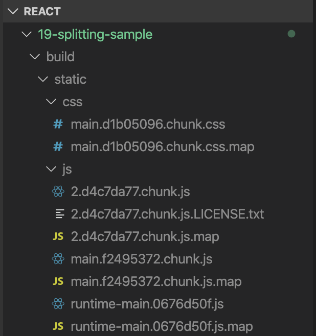
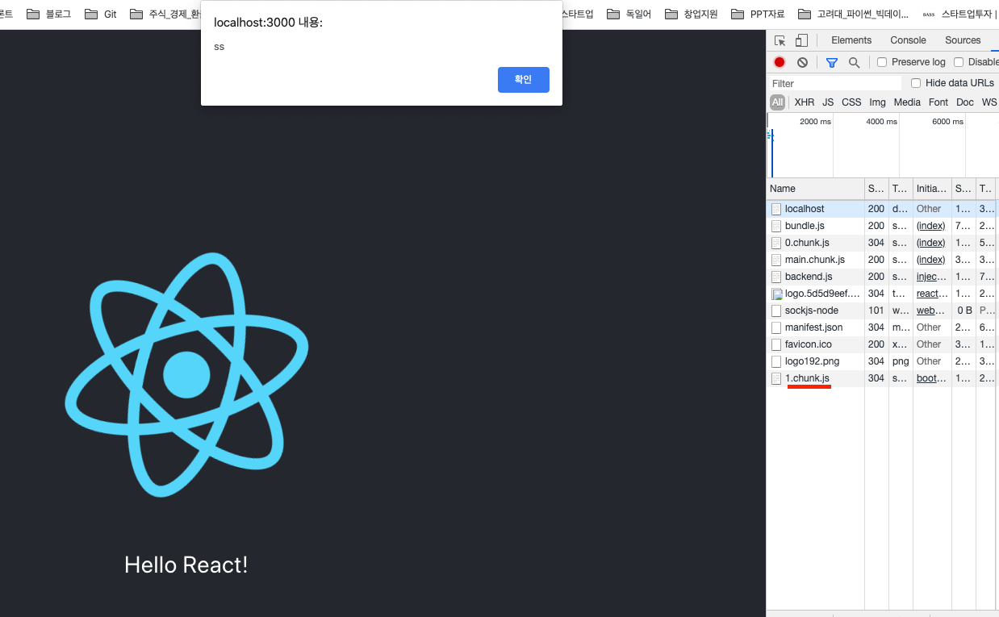
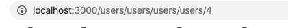

# 19장 Code-split

리액트 프로젝트를 완성하여 사용자에게 제공할 때는 빌드 작업을 거쳐서 배포한다. 

빌드 작업이 하는 일

- 파일크기 최소화
- jsx문법, 최신 자바스크립트 문법이 원할하게 실행 되도록 코드의 트랜스파일 작업
- 이미지와 같은 정적 파일이 있다면 해당 파일을 위한 경로도 지정

웹팩이 담당한다. CRA로 빌드를 할 경우 최소 2개 이상의 자바스크립트 파일이 생성된다. CRA의 기본 웹팩 설정에는 SplitChunks라는 기능이 적용되어 node_modules에서 불러온 파일, 일정 크기 이상의 파일, 여러 파일 간의 공유된 파일을 자동으로 따로 분리시켜서 캐싱 효과

```
yarn create react-app 19-splitting-sample
cd 19-splitting-sample
yarn build
```

build/static/




자바스크립트 파일 여러 개가 만들어 졌는지 확인

 해시값이 포함되어 있다. 

- 파일의 내용에 따라 생성
- 브라우저가 새로 파일을 받아야 할지 말지의 정보가 담겨 있다.


2로 시작하는 파일에는 React, ReactDoM 등 node_modules에서 불러온 라이브러리 관련 코드, main으로 시작하는 파일에는 직접 프로젝트에 작성하는  App 같은 컴포넌트가 ㅇ들어 있다.

 2로 시작하는 파일은 코드가 엄청나게 길고 main으로 시작하는 파일은 엄청 짧을 것

자주 바뀌지 않는 코드들이 2로 시작하는 파일에 들어 있어 캐싱의 이점을 누릴수 있다.


2로 시작하는 파일 이름을 확인해 주시고 App.js의 코드를 변경해 보세요

src/App.js

```jsx
import React from 'react';
import logo from './logo.svg';
import './App.css';

function App() {
  return (
    <div className="App">
      <header className="App-header">
        
        <p>Hello React!</p>
      </header>
    </div>
  );
}

export default App;

```

다시

```
yarn build
```


2로 시작하는 파일은 바뀌지 않았지만 main으로 시작하는 파일명은 바뀌었다.(내용이 바뀌었으니)

이렇게 파일을 분리하는 작업을 코드 스플리팅이라고 한다

이제 다시 코드 스플리팅을 하면 다시 이야기 하면 되는데 리액트 앱에 기본 탑재된  SplitChunks 기능을 통한 코드 스플리팅은 단순히 효율적인 캐싱효과만 있을 뿐입니다. 예를 들어 페이지 A,B,C로 구성된 싱글 페이지 애플리케이션을 개발한다고 가정하면 사용자가 A페이지에 방문했다면 B와 C의 컴포넌트 정보는 필요하지 않습니다. 실제로 사용자가  B나 C로 이동하려고 할 때만 필요하다.

하지만 리액트 프로젝트에 별도로 설정하지 않으면 A,B,C에 대한 코드가 모두 한 파일 내에 저장된다. 이러한 문제를 해결해 줄 수 있는 방법이 바로 코드 비동기 로딩이다. 이 또한 코드 스플리팅 방법 중 하나입니다. (다른 것도 있다는 것)

 우리가 적용하지 않으면

## 19.1 자바스크립트 함수 비동기 로딩

```jsx
export default function notify() {
  alert('hi!');
}

```

src/App.js

```jsx
import React from 'react';
import logo from './logo.svg';
import './App.css';
import notify from './notify';

function App() {
  const onClick = () => {
    notify();
  };
  return (
    <div className="App">
      <header className="App-header">
        
        <p onClick={onClick}>Hello React!</p>
      </header>
    </div>
  );
}

export default App;

```

 위와 같이 코드를 작성하면 notify가 main 파일 안에 들어가게 된다. 하지만 다음과 같이 import를 상단에서 하지 않고 import() 함수 형태로 메서드 안에서 사용하면 파일을 따로 분리시켜서 저장한다.

src/App.js

```jsx
import React from 'react';
import logo from './logo.svg';
import './App.css';

function App() {
  const onClick = () => {
    import('./notify').then(result => result.default());
  };
  return (
    <div className="App">
      <header className="App-header">
        
        <p onClick={onClick}>Hello React!</p>
      </header>
    </div>
  );
}

export default App;

```

import를 함수로 사용하면 promise를 반환한다. 이렇게 import를 함수로 사용하는 문법은 비록 아직 표준 자바스크립트는 아니지만, stage-3 단계에 있는 dynamic import라는 문법이다. 현재 웹팩에서 지원하고 있으므로 별도의 설정 없이 프로젝트에 바로 사용할 수 있다. 이 함수를 통해 모듈을 불러올 때 모듈에서 default로 내보낸 것은 result.default로 참조해야 사용할 수 있다.

### default뿐만 아니라 const도 해보자.

src/notify.js

```jsx
export default function notify() {
  alert('hi!');
}

export const naver = () => {
  alert('ss');
};

```

src/App.js

```jsx
import React from 'react';
import logo from './logo.svg';
import './App.css';

function App() {
  const onClick = () => {
    import('./notify').then(result => {
      result.naver();
      result.default();
    });
  };
  return (
    <div className="App">
      <header className="App-header">
        
        <p onClick={onClick}>Hello React!</p>
      </header>
    </div>
  );
}

export default App;

```

브라우저를 열고 개발자 도구의 NetWork 탭을 연 다음 Hello,React를 클릭해 보세요





yarn build가 있다.


이제 3으로 시작하는 파일 안에 notify 관련 코드가 들어 있습니다.


## 19.2 React.lazy와 Suspense를 통한 컴포넌트 코드 스플리팅

리액트 내장 기능으로 유틸 함수인  React.lazy와 컴포넌트인  Suspense가 있다.

리액트 v16.6 버전부터 도입, 이전버전에서는 import함수를 통해 불러온다음 컴포넌트 자체를 state에 넣는 방식으로 구현해야함

### 19.2  state를 이용한 코드 스플리팅

Reac.lazy와 suspense 없이 코드 스플리팅 한다면 어떻게 해야할까

src/SplitMe.js

```jsx
import React from 'react';

const SplitMe = () => {
  return <div>SplitMe</div>;
};

export default SplitMe;

```

src/App.js

```jsx
import React, { useState, useEffect } from 'react';
import logo from './logo.svg';
import './App.css';

function App() {
  const [SplitMe, setSplitMe] = useState(null);

  const onClick = async () => {
    const loadedModule = await import('./SplitMe');
    setSplitMe(() => loadedModule.default);
  };
  return (
    <div className="App">
      <header className="App-header">
        
        <p onClick={onClick}>Hello React!</p>
        {SplitMe && <SplitMe />}
      </header>
    </div>
  );
}

export default App;

```

책에는 클래스형 컴포넌트로 설명되어 있음


### 19.2.2 React.lazy와 Suspense 사용하기

state를 선언하지 않고도 간편하게

React.lazy는 컴포넌트를 "렌더링"하는 시점에 비동기적으로 로딩할 수 있게 해주는 유틸 함수

```jsx
const SplitMe = React.lazy() => import('./SplitMe');
```


```jsx
import React, {Suspense} from 'react'
(...)
 <Suspense fallback={<div>loading...</div>}>
	<SplitMe / >
</Suspense>
```

src/App.js

```jsx
import React, { useState, Suspense } from 'react';
import logo from './logo.svg';
import './App.css';
const SplitMe = React.lazy(() => import('./SplitMe'));
function App() {
  const [visible, setVisible] = useState(false);

  const onClick = () => {
    setVisible(true);
  };
  return (
    <div className="App">
      <header className="App-header">
        
        <p onClick={onClick}>Hello React!</p>
        <Suspense fallback={<div>loading...</div>}>
          {visible && <SplitMe />}
        </Suspense>
      </header>
    </div>
  );
}

export default App;

```


...loading을 확인하고 싶다면 

개발자 도구의 NetWork 탭에서 Online을 클릭하여 네트워크 속도를 느리게 설정( slow 3G)


### 19.2.3 Lodable Components를 통한 코드 스플리팅

서드파티 라이브러리

서버 사이드 렌더링을 지원한다. ( v16.12.0 기준 서버사이드 렌더링 지원하지 않는다)

서버 사이드 렌더링은 웹 서비스 초기 로딩 속도 개선, 캐싱 및 검색 엔진 최적화, 서버 사이드 렌더링을 사용하면 웹 서비스의 초기 렌더링을 사용자의 브라우저가 아닌 서버 쪽에서 처리한다.

```jsx
yarn add @loadable/component
```

loading 없이 컴포넌트 임포트

src/App.js

```jsx
import React, { useState } from 'react';
import logo from './logo.svg';
import './App.css';
import loadable from '@loadable/component';

const SplitMe = loadable(() => import('./SplitMe'));
function App() {
  const [visible, setVisible] = useState(false);

  const onClick =  () => {
    setVisible(true);
  };
  return (
    <div className="App">
      <header className="App-header">
        
        <p onClick={onClick}>Hello React!</p>

        {visible && <SplitMe />}
      </header>
    </div>
  );
}

export default App;

```

loading 보여주기

```jsx
import React, { useState } from 'react';
import logo from './logo.svg';
import './App.css';
import loadable from '@loadable/component';

const SplitMe = loadable(() => import('./SplitMe'), {
  fallback: <div>loading...</div>
});
function App() {
  const [visible, setVisible] = useState(false);

  const onClick = () => {
    setVisible(true);
  };
  return (
    <div className="App">
      <header className="App-header">
        
        <p onClick={onClick}>Hello React!</p>

        {visible && <SplitMe />}
      </header>
    </div>
  );
}

export default App;

```


컴포넌트를 미리 불러오는(preload) 방법 ( 마우스 커서를 올리면 미리 불러오기)

```jsx
import React, { useState } from 'react';
import logo from './logo.svg';
import './App.css';
import loadable from '@loadable/component';

const SplitMe = loadable(() => import('./SplitMe'), {
  fallback: <div>loading...</div>
});
function App() {
  const [visible, setVisible] = useState(false);

  const onClick = () => {
    setVisible(true);
  };

  const onMouseOver = () => {
    SplitMe.preload();
  };
  return (
    <div className="App">
      <header className="App-header">
        
        <p onClick={onClick} onMouseOver={onMouseOver}>
          Hello React!
        </p>

        {visible && <SplitMe />}
      </header>
    </div>
  );
}

export default App;

```


# 20장 서버사이드 렌더링


## 20.1 서버사이드 렌더링의 이해

UI를 서버에서 렌더링 하는 것을 의미

앞에서 만든 리액트 프로젝트는 기본적으로 클라이언트 사이드 렌더링 하고 있다. 클라이언트 사이드 렌더링은 모두 브라우저에서 처리 하는 것, 즉 자바스크립트를 실행해야 우리가 만든 화면이 사용자에게 보입니다. 즉 자바스크립트를 실행해야 우리가 만든 화면이 사용자에게 보인다.

```
yarn create react-app 20-ssr-recipe
cd 20-ssr-recipe
yarn start
```


맨 위에 있는 localhost를 선택하고 Response를 보면 root 엘리먼트가 비어 있는 것을 확인할 수 있습니다. 즉, 이 페이지는 처음에 빈 페이지라는 뜻입니다. 그 이후에 자바스크립트를 실행되고 리액트 컴포넌트가 렌더링 되면서 우리에게 보이는 것

서버사이드 렌더링을 구현하면 사용자가 웹 서비스에 방문했을 때 서버 쪽에서 초기 렌더링을 대신해 줍니다. 그리고 사용자가 html을 전달받을 때 그 내부에 렌더링된 결과물이 보입니다.


### 20.1.1 서버사이드렌더링 장점

- 검색엔진이 내 페이지를 수집해 간다.(구글은 자바스크립트를 실행하는 기능이 탑재되어 있지만)
- 초기 렌더링 성능을 개선할 수 있다.


### 20.1.2 서버사이드렌더링 단점

- 개발자 입장에서는 서버 자원을 사용 , 과부하 발생 가능
- 사용자가 많은 서비스라면 캐싱과 로드 밸런싱을 통해 성능을 최적화해 주어야 한다.
- 구조가 복잡해지고 데이터 미리 불러오기, 코드 스플리팅과의 호환 등 이슈 있을 수 있다.

### 20.1.3 서버사이드렌더링과 코드스플리팅의 충돌

호환없이 같이 작업하면 코드 스플리팅 깜박임 현상이 나타나는 데 이 이유는

1. 서버 사이드 렌더링 결과물이 브라우저에 나타남
2. 자바스크립트 파일 로딩 시작
3. 자바스크립트가 실행하면서 아직 불러오지 않은 컴포넌트를 null로 렌더링함
4. 페이지에서 코드 스플리팅된 컴포넌트들이 사라짐
5. 코드 스프리팅된 컴포넌트들이 로딩된 이후 제대로 나타남


이러한 이슈를 해결하려면 라우트 경로마다 코드 스플리팅된 파일 중에서 필요한 모든 파일을 브라우저에서 렌더링하기 전에 미리 불러와야 한다.

이 책에서는 이 문제점을 다음과 같은 방법으로 해결합니다. Loadable Components  라이브러리에서 제공하는 기능을 써서 서버 사이드 렌더링 후 필요한 파일의 경로를 추출하여 렌더링 결과에 스크립트/스타일 태그를 삽입합니다.


## 20.2 프로젝트 준비하기

```
yarn add react-router-dom
```

components/Red.js 

```jsx
import React from 'react';
import './Red.css';
const Red = () => {
  return <div className="Red">Red</div>;
};

export default Red;

```

components/Blue.js

```jsx
import React from 'react';
import './Blue.css';
const Blue = () => {
  return <div className="Blue">Blue</div>;
};

export default Blue;

```

components/Red.css

```css
.Red {
  background: red;
  font-size: 1.5rem;
  color: white;
  width: 128px;
  height: 128px;
  display: flex;
  align-items: center;
  justify-content: center;
}

```

components/Blue.css

```css
.Blue {
  background: blue;
  font-size: 1.5rem;
  color: white;
  width: 128px;
  height: 128px;
  display: flex;
  align-items: center;
  justify-content: center;
}

```

components/Menu.js

```jsx
import React from 'react';
import { Link } from 'react-router-dom';
const Menu = () => {
  return (
    <ul>
      <li>
        <Link to="/red">Red</Link>
      </li>
      <li>
        <Link to="/blue">Blue</Link>
      </li>
    </ul>
  );
};

export default Menu;

```

pages/RedPage.js

```jsx
import React from 'react';
import Red from '../components/Red';

const RedPage = () => {
  return <Red />;
};

export default RedPage;

```

pages/BluePage.js

```jsx
import React from 'react';
import Blue from '../components/Blue';

const BluePage = () => {
  return <Blue></Blue>;
};

export default BluePage;

```

src/App.js

```jsx
import React from 'react';
import Menu from './components/Menu';
import RedPage from './pages/RedPage';
import BluePage from './pages/BluePage';
import { Route } from 'react-router-dom';
const App = () => {
  return (
    <div>
      <Menu />
      <hr />
      <Route path="/red" component={RedPage} />
      <Route path="/blue" component={BluePage} />
    </div>
  );
};

export default App;

```

src/index.js

```jsx
import React from 'react';
import ReactDOM from 'react-dom';
import './index.css';
import App from './App';
import * as serviceWorker from './serviceWorker';
import { BrowserRouter } from 'react-router-dom';

ReactDOM.render(
  <BrowserRouter>
    <App />
  </BrowserRouter>,
  document.getElementById('root')
);

// If you want your app to work offline and load faster, you can change
// unregister() to register() below. Note this comes with some pitfalls.
// Learn more about service workers: https://bit.ly/CRA-PWA
serviceWorker.unregister();

```


## 20.3 서버 사이드 렌더링 구현하기

웹팩 관련 설정이 기본적으로 모두 숨겨져 있다. yarn eject

```
git add .
git commit -m "commit before eject"
yarn eject
```

### 20.3.1 서버 사이드 렌더링용 엔트리 만들기

엔트리(entry)는 웹팩에서 프로젝트를 불러올 때 가장 먼저 불러오는 파일입니다. 예를 들어 현재 작성 중인 리액트 프로젝트에서는 index.js를 엔트리 파일로 사용합니다. 이 파일부터 시작하여 내부에 필요한 다른 컴포넌트와 모듈을 불러오고 있지요.

src/index.server.js 작성

```jsx
import React from 'react';
import ReactDOMServer from 'react-dom/server';

const html = ReactDOMServer.renderToString(
  <div>Hello server side rendering</div>
);

console.log(html);

```


### 20.3.2 서버 사이드 렌더링 전용 웹팩 환경 설정 작성하기

config/paths.js

```jsx
'use strict';

(...)
// config after eject: we're in ./config/
module.exports = {
  dotenv: resolveApp('.env'),
  appPath: resolveApp('.'),
  appBuild: resolveApp('build'),
  appPublic: resolveApp('public'),
  appHtml: resolveApp('public/index.html'),
  appIndexJs: resolveModule(resolveApp, 'src/index'),
  appPackageJson: resolveApp('package.json'),
  appSrc: resolveApp('src'),
  appTsConfig: resolveApp('tsconfig.json'),
  appJsConfig: resolveApp('jsconfig.json'),
  yarnLockFile: resolveApp('yarn.lock'),
  testsSetup: resolveModule(resolveApp, 'src/setupTests'),
  proxySetup: resolveApp('src/setupProxy.js'),
  appNodeModules: resolveApp('node_modules'),
  publicUrl: getPublicUrl(resolveApp('package.json')),
  servedPath: getServedPath(resolveApp('package.json')),
  ssrIndexJs: resolveApp('src/index.server.js'), //  sever side rendering entry
  ssrBuild: resolveApp('dist') // repository after prcessing by webpack
};

module.exports.moduleFileExtensions = moduleFileExtensions;

```

config/webpack.config.server.js

```jsx
const nodeExternals = require('webpack-node-externals');
const paths = require('./paths');
const webpack = require('webpack');
const getClientEnvironment = require('./env');
const getCSSModuleLocalIdent = require('react-dev-utils/getCSSModuleLocalIdent');

const cssRegex = /\.css$/;
const cssModuleRegex = /\.module\.css$/;
const sassRegex = /\.(scss|sass)$/;
const sassModuleRegex = /\.module\.(scss|sass)$/;

const publicUrl = paths.servedPath.slice(0, -1);
const env = getClientEnvironment(publicUrl);

module.exports = {
  mode: 'production', // 프로덕션 모드로 설정하여 최적화 옵션들을 활성화
  entry: paths.ssrIndexJs, // 엔트리 경로
  target: 'node', // node 환경에서 실행 될 것이라는 것을 명시
  output: {
    path: paths.ssrBuild, // 빌드 경로
    filename: 'server.js', // 파일이름
    chunkFilename: 'js/[name].chunk.js', // 청크 파일이름
    publicPath: paths.servedPath // 정적 파일이 제공 될 경로
  },
  module: {
    rules: [
      {
        oneOf: [
          // 자바스크립트를 위한 처리
          // 기존 webpack.config.js 를 참고하여 작성
          {
            test: /\.(js|mjs|jsx|ts|tsx)$/,
            include: paths.appSrc,
            loader: require.resolve('babel-loader'),
            options: {
              customize: require.resolve(
                'babel-preset-react-app/webpack-overrides'
              ),
              plugins: [
                [
                  require.resolve('babel-plugin-named-asset-import'),
                  {
                    loaderMap: {
                      svg: {
                        ReactComponent: '@svgr/webpack?-svgo![path]'
                      }
                    }
                  }
                ]
              ],
              cacheDirectory: true,
              cacheCompression: false,
              compact: false
            }
          },

          // CSS 를 위한 처리
          {
            test: cssRegex,
            exclude: cssModuleRegex,
            //  onlyLocals: true 옵션을 설정해야 실제 css 파일을 생성하지 않습니다.
            loader: require.resolve('css-loader'),
            options: {
              onlyLocals: true
            }
          },
          // CSS Module 을 위한 처리
          {
            test: cssModuleRegex,
            loader: require.resolve('css-loader'),
            options: {
              modules: true,
              onlyLocals: true,
              getLocalIdent: getCSSModuleLocalIdent
            }
          },
          // Sass 를 위한 처리
          {
            test: sassRegex,
            exclude: sassModuleRegex,
            use: [
              {
                loader: require.resolve('css-loader'),
                options: {
                  onlyLocals: true
                }
              },
              require.resolve('sass-loader')
            ]
          },
          // Sass + CSS Module 을 위한 처리
          {
            test: sassRegex,
            exclude: sassModuleRegex,
            use: [
              {
                loader: require.resolve('css-loader'),
                options: {
                  modules: true,
                  onlyLocals: true,
                  getLocalIdent: getCSSModuleLocalIdent
                }
              },
              require.resolve('sass-loader')
            ]
          },
          // url-loader 를 위한 설정
          {
            test: [/\.bmp$/, /\.gif$/, /\.jpe?g$/, /\.png$/],
            loader: require.resolve('url-loader'),
            options: {
              emitFile: false, // 파일을 따로 저장하지 않는 옵션
              limit: 10000, // 원래는 9.76KB가 넘어가면 파일로 저장하는데
              // emitFile 값이 false 일땐 경로만 준비하고 파일은 저장하지 않습니다.
              name: 'static/media/[name].[hash:8].[ext]'
            }
          },
          // 위에서 설정된 확장자를 제외한 파일들은
          // file-loader 를 사용합니다.
          {
            loader: require.resolve('file-loader'),
            exclude: [/\.(js|mjs|jsx|ts|tsx)$/, /\.html$/, /\.json$/],
            options: {
              emitFile: false, // 파일을 따로 저장하지 않는 옵션
              name: 'static/media/[name].[hash:8].[ext]'
            }
          }
        ]
      }
    ]
  },
  resolve: {
    modules: ['node_modules']
  },
  externals: [nodeExternals()],
  plugins: [
    new webpack.DefinePlugin(env.stringified) // 환경변수를 주입해줍니다.
  ]
};

```

서버를 위한 엔트리 파일 src/index.server.js를 만들어야 하고 작성한 엔트리 파일을 웹팩으로 불러와서 빌드하려면 서버 전용 환경 설정(config/paths.js)을 만들어 주어야 한다. 

다음으로  웹팩 환경 설정을 작성(config/webpack.config.server.js)

- 빌드할 때 어떤 파일에서 시작해 파일들을 불러 오는지, 어디에 결과물을 저장할지
- css나 이미지 파일은 중요하지 않지만 자바스크립트 내부에서 파일 경로가 필요하거나 css 모듈처럼 로컬 className을 참조해야 할 수도 있어 무시할 순 없다. 그래서 해당 파일을 로더에서 별도로 설정하여 처리하지만 따로 결과물에 포함되지 않도록 구현한다.
- 내부에서 node_modules 내부의 라이브러리를 불러올 수 있게 한다.

config/webpack.config.server.js

```jsx
const nodeExternals = require('webpack-node-externals');
const paths = require('./paths');
const webpack = require('webpack');
const getClientEnvironment = require('./env');
const getCSSModuleLocalIdent = require('react-dev-utils/getCSSModuleLocalIdent');

const cssRegex = /\.css$/;
const cssModuleRegex = /\.module\.css$/;
const sassRegex = /\.(scss|sass)$/;
const sassModuleRegex = /\.module\.(scss|sass)$/;

const publicUrl = paths.servedPath.slice(0, -1);
const env = getClientEnvironment(publicUrl);

module.exports = {
  mode: 'production', // 프로덕션 모드로 설정하여 최적화 옵션들을 활성화
  entry: paths.ssrIndexJs, // 엔트리 경로
  target: 'node', // node 환경에서 실행 될 것이라는 것을 명시
  output: {
    path: paths.ssrBuild, // 빌드 경로
    filename: 'server.js', // 파일이름
    chunkFilename: 'js/[name].chunk.js', // 청크 파일이름
    publicPath: paths.servedPath // 정적 파일이 제공 될 경로
  },
  module: {
    rules: [
      {
        oneOf: [
          // 자바스크립트를 위한 처리
          // 기존 webpack.config.js 를 참고하여 작성
          {
            test: /\.(js|mjs|jsx|ts|tsx)$/,
            include: paths.appSrc,
            loader: require.resolve('babel-loader'),
            options: {
              customize: require.resolve(
                'babel-preset-react-app/webpack-overrides'
              ),
              plugins: [
                [
                  require.resolve('babel-plugin-named-asset-import'),
                  {
                    loaderMap: {
                      svg: {
                        ReactComponent: '@svgr/webpack?-svgo![path]'
                      }
                    }
                  }
                ]
              ],
              cacheDirectory: true,
              cacheCompression: false,
              compact: false
            }
          },

          // CSS 를 위한 처리
          {
            test: cssRegex,
            exclude: cssModuleRegex,
            //  onlyLocals: true 옵션을 설정해야 실제 css 파일을 생성하지 않습니다.
            loader: require.resolve('css-loader'),
            options: {
              onlyLocals: true
            }
          },
          // CSS Module 을 위한 처리
          {
            test: cssModuleRegex,
            loader: require.resolve('css-loader'),
            options: {
              modules: true,
              onlyLocals: true,
              getLocalIdent: getCSSModuleLocalIdent
            }
          },
          // Sass 를 위한 처리
          {
            test: sassRegex,
            exclude: sassModuleRegex,
            use: [
              {
                loader: require.resolve('css-loader'),
                options: {
                  onlyLocals: true
                }
              },
              require.resolve('sass-loader')
            ]
          },
          // Sass + CSS Module 을 위한 처리
          {
            test: sassRegex,
            exclude: sassModuleRegex,
            use: [
              {
                loader: require.resolve('css-loader'),
                options: {
                  modules: true,
                  onlyLocals: true,
                  getLocalIdent: getCSSModuleLocalIdent
                }
              },
              require.resolve('sass-loader')
            ]
          },
          // url-loader 를 위한 설정
          {
            test: [/\.bmp$/, /\.gif$/, /\.jpe?g$/, /\.png$/],
            loader: require.resolve('url-loader'),
            options: {
              emitFile: false, // 파일을 따로 저장하지 않는 옵션
              limit: 10000, // 원래는 9.76KB가 넘어가면 파일로 저장하는데
              // emitFile 값이 false 일땐 경로만 준비하고 파일은 저장하지 않습니다.
              name: 'static/media/[name].[hash:8].[ext]'
            }
          },
          // 위에서 설정된 확장자를 제외한 파일들은
          // file-loader 를 사용합니다.
          {
            loader: require.resolve('file-loader'),
            exclude: [/\.(js|mjs|jsx|ts|tsx)$/, /\.html$/, /\.json$/],
            options: {
              emitFile: false, // 파일을 따로 저장하지 않는 옵션
              name: 'static/media/[name].[hash:8].[ext]'
            }
          }
        ]
      }
    ]
  },
  resolve: {
    modules: ['node_modules']
  },
  externals: [nodeExternals()],
  plugins: [
    new webpack.DefinePlugin(env.stringified) // 환경변수를 주입해줍니다.
  ]
};

```

node_modules를 불러올 수 있게 설정할 때 react,react-dom/server 같은 라이브러리를 import구문으로 불러오면 node_modules에 찾아 사용합니다. 라이브러리를 불러오면 빌드할 때 결과물 파일 안에 해당 라이브러리 관련 코드가 함께 번들링 됩니다.


브라우저에서는 결과물 파일에 리액트 라이브러리와 우리 앱에 관한 코드가 공존해야하지만 서버에서는 굳이 결과물 파일 안에 리액트 라이브러리가 들어오지 않아도 된다.  node_modules을 통해 바로 불러와서 사용할 수 있기 때문에 상관 없다.

따라서 서버를 위해 번들링할 때는 node_modules에서 불러오는 것을 제외하고 번들링하는것이 이롭다.

이를 위해

```
yarn add webpack-node-externals
```

 이 라이브러리를 상단에 불러와서 설정하고 환경변수 주입, 이 환경변수로 프로젝트 내에서 process.env, NODE_ENV 값을 참조하여 현재 개발 환경인지 아닌지 알 수 있다.

config/webpack.config.server.js

```jsx
const nodeExternals = require('webpack-node-externals');
const paths = require('./paths');
const webpack = require('webpack');
const getClientEnvironment = require('./env');
const getCSSModuleLocalIdent = require('react-dev-utils/getCSSModuleLocalIdent');

const cssRegex = /\.css$/;
const cssModuleRegex = /\.module\.css$/;
const sassRegex = /\.(scss|sass)$/;
const sassModuleRegex = /\.module\.(scss|sass)$/;

const publicUrl = paths.servedPath.slice(0, -1);
const env = getClientEnvironment(publicUrl);

module.exports = {
  mode: 'production', // 프로덕션 모드로 설정하여 최적화 옵션들을 활성화
  entry: paths.ssrIndexJs, // 엔트리 경로
  target: 'node', // node 환경에서 실행 될 것이라는 것을 명시
  output: {
    path: paths.ssrBuild, // 빌드 경로
    filename: 'server.js', // 파일이름
    chunkFilename: 'js/[name].chunk.js', // 청크 파일이름
    publicPath: paths.servedPath // 정적 파일이 제공 될 경로
  },
  module: {
    rules: [
      {
        oneOf: [
          // 자바스크립트를 위한 처리
          // 기존 webpack.config.js 를 참고하여 작성
          {
            test: /\.(js|mjs|jsx|ts|tsx)$/,
            include: paths.appSrc,
            loader: require.resolve('babel-loader'),
            options: {
              customize: require.resolve(
                'babel-preset-react-app/webpack-overrides'
              ),
              plugins: [
                [
                  require.resolve('babel-plugin-named-asset-import'),
                  {
                    loaderMap: {
                      svg: {
                        ReactComponent: '@svgr/webpack?-svgo![path]'
                      }
                    }
                  }
                ]
              ],
              cacheDirectory: true,
              cacheCompression: false,
              compact: false
            }
          },

          // CSS 를 위한 처리
          {
            test: cssRegex,
            exclude: cssModuleRegex,
            //  onlyLocals: true 옵션을 설정해야 실제 css 파일을 생성하지 않습니다.
            loader: require.resolve('css-loader'),
            options: {
              onlyLocals: true
            }
          },
          // CSS Module 을 위한 처리
          {
            test: cssModuleRegex,
            loader: require.resolve('css-loader'),
            options: {
              modules: true,
              onlyLocals: true,
              getLocalIdent: getCSSModuleLocalIdent
            }
          },
          // Sass 를 위한 처리
          {
            test: sassRegex,
            exclude: sassModuleRegex,
            use: [
              {
                loader: require.resolve('css-loader'),
                options: {
                  onlyLocals: true
                }
              },
              require.resolve('sass-loader')
            ]
          },
          // Sass + CSS Module 을 위한 처리
          {
            test: sassRegex,
            exclude: sassModuleRegex,
            use: [
              {
                loader: require.resolve('css-loader'),
                options: {
                  modules: true,
                  onlyLocals: true,
                  getLocalIdent: getCSSModuleLocalIdent
                }
              },
              require.resolve('sass-loader')
            ]
          },
          // url-loader 를 위한 설정
          {
            test: [/\.bmp$/, /\.gif$/, /\.jpe?g$/, /\.png$/],
            loader: require.resolve('url-loader'),
            options: {
              emitFile: false, // 파일을 따로 저장하지 않는 옵션
              limit: 10000, // 원래는 9.76KB가 넘어가면 파일로 저장하는데
              // emitFile 값이 false 일땐 경로만 준비하고 파일은 저장하지 않습니다.
              name: 'static/media/[name].[hash:8].[ext]'
            }
          },
          // 위에서 설정된 확장자를 제외한 파일들은
          // file-loader 를 사용합니다.
          {
            loader: require.resolve('file-loader'),
            exclude: [/\.(js|mjs|jsx|ts|tsx)$/, /\.html$/, /\.json$/],
            options: {
              emitFile: false, // 파일을 따로 저장하지 않는 옵션
              name: 'static/media/[name].[hash:8].[ext]'
            }
          }
        ]
      }
    ]
  },
  resolve: {
    modules: ['node_modules']
  },
  externals: [nodeExternals()],
  plugins: [
    new webpack.DefinePlugin(env.stringified) // 환경변수를 주입해줍니다.
  ]
};

```

### 20.3.3  빌드 스크립트 작성하기

scripts 경로를 열어보면 build.js 라는 파일이 있다. 이 스크립트는 클라이언트에서 사용할 빌드 파일을 만드는 작업을 합니다.  마찬가지로 서버에서 빌드할 빌드 파일을 만들어 보자

scripts/build.server.js

```jsx
process.env.BABEL_ENV = 'production';
process.env.NODE_ENV = 'production';

process.on('unhandledRejection', err => {
  throw err;
});

require('../config/env');
const fs = require('fs-extra');
const webpack = require('webpack');
const config = require('../config/webpack.config.server');
const paths = require('../config/paths');

function build() {
  console.log('Creating server build...');
  fs.emptyDirSync(paths.ssrBuild);
  let compiler = webpack(config);
  return new Promise((resolve, reject) => {
    compiler.run((err, stats) => {
      if (err) {
        console.log(err);
        return;
      }
      console.log(stats.toString());
    });
  });
}

build();

```

package.json - scripts 부분

```
"start:server" : "node dist/server.js",
"build:server" : "node scripts/build.server.js"
```


### 20.3.4 서버코드 작성하기

```
yarn add express
```

express라는 node.js 웹 프레임워크를 사용하여 웹 서버를 만든다. 꼭 express 뿐만 아니라 koa,hapi, connect라이브러리를 사용해도 된다. 지금 현재 express 사용률이 가장 높고, 추후 정적 파일을 호스팅할 때도 쉽게 구현 가능

server.index.js 작성

```jsx
import React from 'react';
import ReactDOMServer from 'react-dom/server';
import express from 'express';
import { StaticRouter } from 'react-router-dom';
import App from './App';
const app = express();

// 서버 사이드 렌더링을 처리할 핸들러 함수
const serverRender = (req, res, next) => {
  // 이 함수는 404가 떠야 하는 상황에 404를 띄우지 않고 서버 사이드 렌더링을 해 줍니다.
  const context = {};

  const jsx = (
    <StaticRouter location={req.url} context={context}>
      <App />
    </StaticRouter>
  );

  const root = ReactDOMServer.renderToString(jsx);
  res.send(root); // 클라이언트에게 결과물을 응답합니다.
};

app.use(serverRender);
// 5000 포트로 서버를 가동합니다.
app.listen(5000, () => {
  console.log('Running on http://localhost:5000');
});

```


- StaticRouter 컴포넌트
  -  서버 사이드 렌더링 용도로 사용되는 라우터
  -  props로 넣어주는 location의 값에 따라 라우팅
  -  props 중 하나인 context는 나중에 렌더링한 컴포넌트에 따라 HTTP 상태 코드 설정해 줄 수 있다.
- 서버 사이드 렌더링 잘 되어있는지 확인
  - Network 탭에서 서버에서 받아오는지 잘 확인
    - response 체크하면 내용확인가능
    - {}쓰면 정리 잘됨


지금은  css를 불러오지 않기 때문에 스타일이 적용되어 있지 않아도 괜찮습니다. 브라우저에서 자바스크립트도 실행되지 않기 때문에, 현재 브라우저에 나타난 정보는 모두 서버 사이드 렌더링된 것으로 간주 할 수 있습니다.

### 20.3.5 정적 파일 제공하기

이번에는 Express에 내장되어 있는 static 미들웨어를 사용하여 서버를 통해 build에 있는 JS,CSS 정적 파일들에 접근할 수 있도록 해 주겠습니다.

src/index.server.js

```jsx
import React from 'react';
import ReactDOMServer from 'react-dom/server';
import express from 'express';
import { StaticRouter } from 'react-router-dom';
import App from './App';
import path from './path';
const app = express();

// 서버 사이드 렌더링을 처리할 핸들러 함수
const serverRender = (req, res, next) => {
  // 이 함수는 404가 떠야 하는 상황에 404를 띄우지 않고 서버 사이드 렌더링을 해 줍니다.
  const context = {};

  const jsx = (
    <StaticRouter location={req.url} context={context}>
      <App />
    </StaticRouter>
  );

  const root = ReactDOMServer.renderToString(jsx);
  res.send(root); // 클라이언트에게 결과물을 응답합니다.
};

const serve = express.static(path.resolve('./build'), {
  index: false // "/" 경로에서 index.html을 보여주지 않도록 설정
});

app.use(server); // 순서가 중요합니다. serverRender보다 전에 위치해야합니ㅏ.

app.use(serverRender);
// 5000 포트로 서버를 가동합니다.
app.listen(5000, () => {
  console.log('Running on http://localhost:5000');
});

```


```
yarn build
```

index.server.js

```jsx
import React from 'react';
import ReactDOMServer from 'react-dom/server';
import express from 'express';
import { StaticRouter } from 'react-router-dom';
import App from './App';
import path from 'path';
import fs from 'fs';

// asset-manifest.json에서 파일 경로들을 조회합니다.
const manifest = JSON.parse(
  fs.readFileSync(path.resolve('./build/asset-manifest.json'), 'utf-8')
);

const chunks = Object.keys(manifest.files)
  .filter(key => /chunk\.js$/.exec(key)) // chunk.js로 끝나는 키를 찾아서
  .map(key => `<script src="${manifest.files[key]}"></script>`) //스크립트 태그로 변환하고
  .join(''); // 합칩

function createPage(root) {
  return `<!DOCTYPE html>
  <html lang="en">
    <head>
      <meta charset="utf-8" />
      <link rel="shortcut icon" href="/favicon.ico" />
      <meta
        name="viewport"
        content="width=device-width,initial-scale=1,shrink-to-fit=no"
      />
      <meta name="theme-color" content="#000000" />
      <title>react server side rendering</title>
      <link href="${manifest.files['main.css']}" rel="stylesheet" />
    </head>
    <body>
      <noscript>You need to enable javascript to run this app</noscript>
      <div id="root">${root}</div>
      <script src="${manifest.files['runtime-main.js']}"></script>
      ${chunks}
      <script src="${manifest.files['main.js']}"></script>
    </body>
  </html>`;
}

const app = express();

// 서버 사이드 렌더링을 처리할 핸들러 함수
const serverRender = (req, res, next) => {
  // 이 함수는 404가 떠야 하는 상황에 404를 띄우지 않고 서버 사이드 렌더링을 해 줍니다.
  const context = {};

  const jsx = (
    <StaticRouter location={req.url} context={context}>
      <App />
    </StaticRouter>
  );

  const root = ReactDOMServer.renderToString(jsx);
  res.send(createPage(root)); // 클라이언트에게 결과물을 응답합니다.
};

const serve = express.static(path.resolve('./build'), {
  index: false // "/" 경로에서 index.html을 보여주지 않도록 설정
});

app.use(serve); // 순서가 중요합니다. serverRender보다 전에 위치해야합니ㅏ.

app.use(serverRender);
// 5000 포트로 서버를 가동합니다.
app.listen(5000, () => {
  console.log('Running on http://localhost:5000');
});

```


- main.js , chunk.js , main.css , runtime-main.js 를 script 태그로 가져오기


## 20.4 데이터 로딩

데이터 요청하는 것은 API 요청을 의미합니다. 예를 들어 페이지에서 필요로 하는 데이터가 있다면 API를 요청해서 응답을 받아와야 합니다. 브라우저 환경에서는 API를 요청하고 응답을 받아 와서 리액트 state 혹은 리덕스 스토어에 넣으면 자동으로 리렌더링하니 걱정은 없습니다. 하지만 서버의 경우 **문자열 형태 ?**로 렌더링하는 것이므로 state나 리덕스 스토어의 상태가 바뀐다고 해서 자동으로 리렌더 안된다?. 그래서 renderToString 함수를 한 번 더 사용해주어야합니다. 게다가 서버에서는 componentDidMount 같은 라이프사이클 API도 사용 불가능합니다. 서버사이드 렌더링 시 데이터 로딩을 해결하는 방법 또한 다양하다.

깔끔하고 편한방법을 소개

### 20.4.1 redux-thunk

yarn add redux redux-thunk react-redux axios

modules/users.js

```jsx
import axios from 'axios';

const GET_USERS_PENDING = 'users/GET_USERS_PENDING';
const GET_USERS_SUCCESS = 'users/GET_USERS_SUCCESS';
const GET_USERS_FAILURE = 'users/GET_USERS_FAILURE';

const getUsersPending = () => ({ type: GET_USERS_PENDING });
const getUsersSuccess = payload => ({ type: GET_USERS_SUCCESS, payload });
const getUsersFailure = payload => ({
  type: GET_USERS_FAILURE,
  payload,
  error: true
});

export const getUsers = () => async dispatch => {
  try {
    dispatch(getUsersPending);
    const response = await axios.get(
      'http://jsonplaceholder.typicode.com/users'
    );

    dispatch(getUsersSuccess(response));
  } catch (e) {
    dispatch(getUsersFailure(e));
    throw e;
  }
};

const initialState = {
  users: null,
  user: null,
  loading: {
    users: false,
    user: false
  },
  error: {
    users: false,
    user: false
  }
};

function users(state = initialState, action) {
  switch (action.type) {
    case GET_USERS_PENDING:
      return { ...state, loading: { ...state.loading, users: true } };
    case GET_USERS_SUCCESS:
      return {
        ...state,
        loading: { ...state.loading, users: false },
        users: action.payload.data
      };
    case GET_USERS_FAILURE:
      return {
        ...state,
        loading: { ...state.loading, users: false },
        error: { ...state.error, users: action.payload }
      };
    default:
      return state;
  }
}
export default users;

```

- redux-thunk로 users를 호출해오고 나중에는 redux-saga로 user을 호출하는 방법을 제시하기 위해서 이렇게 코드를 작성

modules/index.js

```jsx
import users from './users';
import { combineReducers } from 'redux';

const rootReducer = combineReducers({ users });
export default rootReducer;

```

src/index.js

```jsx
import React from 'react';
import ReactDOM from 'react-dom';
import './index.css';
import App from './App';
import * as serviceWorker from './serviceWorker';
import { BrowserRouter } from 'react-router-dom';
import { Provider } from 'react-redux';
import rootReducer from './modules/index';
import thunk from 'redux-thunk';
import { applyMiddleware, createStore } from 'redux';

const store = createStore(rootReducer, applyMiddleware(thunk));
ReactDOM.render(
  <Provider store={store}>
    <BrowserRouter>
      <App />
    </BrowserRouter>
  </Provider>,
  document.getElementById('root')
);

// If you want your app to work offline and load faster, you can change
// unregister() to register() below. Note this comes with some pitfalls.
// Learn more about service workers: https://bit.ly/CRA-PWA
serviceWorker.unregister();

```


### 20.4.2 Users, UsersContainer 컴포넌트 준비하기

components/Users.js

```jsx
import React from 'react';
import { Link } from 'react-router-dom';

const Users = ({ users }) => {
  if (!users) return null;
  return (
    <div>
      <ul>
        {users.map(user => (
          <li key={user.id}>
            <Link to={`/users/${user.id}`}>{user.username}</Link>
          </li>
        ))}
      </ul>
    </div>
  );
};

export default Users;

```


containers/UserContainers.js

```jsx
import React, { useEffect } from 'react';
import Users from '../components/Users';
import { getUsers } from '../modules/users';
import { connect } from 'react-redux';

const UsersContainer = ({ users, getUsers }) => {
  useEffect(() => {
    if (users) return; // users가 유효하다면 요청할 이유가 없음
    getUsers();
  }, [getUsers, users]);

  return <Users users={users}></Users>;
};

export default connect(state => ({ users: state.users.users }), { getUsers })(
  UsersContainer
);

```


pages/UserPage.js

```jsx
import React from 'react';
import UsersContainer from '@/containers/UsersContainer';

const UsersPage = () => {
  return <UsersContainer />;
};

export default UsersPage;

```


App.js

```jsx
import React from 'react';
import Menu from './components/Menu';
import RedPage from './pages/RedPage';
import BluePage from './pages/BluePage';
import { Route } from 'react-router-dom';
import UsersPage from './pages/UsersPage';
const App = () => {
  return (
    <div>
      <Menu />
      <hr />
      <Route path="/red" component={RedPage} />
      <Route path="/blue" component={BluePage} />
      <Route path="/users" component={UsersPage} />
    </div>
  );
};

export default App;

```

Menu.js

```jsx
import React from 'react';
import { Link } from 'react-router-dom';
const Menu = () => {
  return (
    <ul>
      <li>
        <Link to="/red">Red</Link>
      </li>
      <li>
        <Link to="/blue">Blue</Link>
      </li>
      <li>
        <Link to="/users">Users</Link>
      </li>
    </ul>
  );
};

export default Menu;

```

### 20.4.3 PreloadContext 만들기

getUsers()함수는 UsersContainer의 useEffect 부분에서 호출됩니다. 이를 클래스형으로 작성했다면 componentDidMount()에서 호출했을겁니다. 하지만 서버사이드렌더링할때는 useEffect나 componentDidMount에서 설정한 작업이 호출되지 않습니다. 렌더링 하기전에 API를 요청한 뒤 스토어에 데이터를 담아 놓는 과정이 필요함. 이를 위해 서버 환경에서는 클래스형 컴포넌트가 지니고 있는 CONSTRUCTOR 메서드를 사용하거나 render 함수 자체에서 처리해야한다. 그리고 요청이 끝날 때까지 대기했다가 다시 렌더링 해야합니다.우리는 preloadContext를 만들고 이를 사용하는 preloader 컴포넌트를 만들어 처리 할 예정입니다.

lib/PreloadContext.js

```jsx
import { createContext, useContext } from 'react';

// 클라이언트 환경 : null
// 서버 환경 : {done : false, promise: [] }
const PreloadContext = createContext(null);

export default PreloadContext;
// resolve는 함수 타입입니다.
export const Preloader = ({ resolve }) => {
  const preloadContext = useContext(PreloadContext);

  if (!preloadContext) return null; // context 값이 유효하지 않다면 아무것도 하지않음
  if (preloadContext.done) return null; // 이미 작업이 끝났다면 아무것도 하지 않음

  // promises 배열에 프로미스 등록
  // 설령 resolve 함수가 promise를 반환하지 않더라도 , 프로미스 취급을 받기 위해 등록해야함
  // 위의 과정을 Promise.resolve를 사용하면 해결함
  preloadContext.promises.push(Promise.resolve(resolve()));

  return null;
};

```

preloadContext는 서버 사이드 렌더링을 하는 과정에서 처리해야 할 작업들을 실행하고 만약 기다려야 하는 프로미스가 있다면 프로미스를 수집합니다. 모든 프로미스를 수집한 뒤, 수집된 프로미스들이 끝날 때까지 기다렸다가 그 다음에 다시 렌더링하면 데이터가 채워진 상태로 컴포넌트들이 나타나게 됩니다.

Preloader Component는  resolve라는 함수로 props로 받아 오며, 컴포넌트가 렌더링 될 때 서버환경에서만 resolve 함수를 호출해 줍니다. 

containers/UsersContainer.js

```jsx
import React, { useEffect } from 'react';
import Users from '../components/Users';
import { getUsers } from '../modules/users';
import { connect } from 'react-redux';
import { Preloader } from '../lib/PreloadContext';

const UsersContainer = ({ users, getUsers }) => {
  useEffect(() => {
    if (users) return; // users가 유효하다면 요청할 이유가 없음
    getUsers();
  }, [getUsers, users]);

  return (
    <>
      <Users users={users}></Users>
      <Preloader resolve={getUsers} />
    </>
  );
};

export default connect(state => ({ users: state.users.users }), { getUsers })(
  UsersContainer
);

```


### 20.4.4 서버에서 리덕스 설정 및 PreloadContext 사용하기

index.server.js

```jsx
import React from 'react';
import ReactDOMServer from 'react-dom/server';
import express from 'express';
import { StaticRouter } from 'react-router-dom';
import App from './App';
import path from 'path';
import fs from 'fs';
import { createStore, applyMiddleware } from 'redux';
import rootReducer from './modules/index';
import thunk from 'redux-thunk';
import { Provider } from 'react-redux';
import PreloaderContext from './lib/PreloadContext';
// asset-manifest.json에서 파일 경로들을 조회합니다.
const manifest = JSON.parse(
  fs.readFileSync(path.resolve('./build/asset-manifest.json'), 'utf-8')
);

const chunks = Object.keys(manifest.files)
  .filter(key => /chunk\.js$/.exec(key)) // chunk.js로 끝나는 키를 찾아서
  .map(key => `<script src="${manifest.files[key]}"></script>`) //스크립트 태그로 변환하고
  .join(''); // 합칩

function createPage(root, staticScript) {
  return `<!DOCTYPE html>
  <html lang="en">
    <head>
      <meta charset="utf-8" />
      <link rel="shortcut icon" href="/favicon.ico" />
      <meta
        name="viewport"
        content="width=device-width,initial-scale=1,shrink-to-fit=no"
      />
      <meta name="theme-color" content="#000000" />
      <title>react server side rendering</title>
      <link href="${manifest.files['main.css']}" rel="stylesheet" />
    </head>
    <body>
      <noscript>You need to enable javascript to run this app</noscript>
      <div id="root">${root}</div>
      ${staticScript}
      <script src="${manifest.files['runtime-main.js']}"></script>
      ${chunks}
      <script src="${manifest.files['main.js']}"></script>
    </body>
  </html>`;
}

const app = express();

// 서버 사이드 렌더링을 처리할 핸들러 함수
const serverRender = async (req, res, next) => {
  // 이 함수는 404가 떠야 하는 상황에 404를 띄우지 않고 서버 사이드 렌더링을 해 줍니다.
  const context = {};

  const store = createStore(rootReducer, applyMiddleware(thunk));

  const preloadContext = { done: false, promises: [] };
  const jsx = (
    <PreloaderContext.Provider value={preloadContext}>
      <Provider store={store}>
        <StaticRouter location={req.url} context={context}>
          <App />
        </StaticRouter>
      </Provider>
    </PreloaderContext.Provider>
  );

  ReactDOMServer.renderToStaticMarkup(jsx);
  try {
    await Promise.all(preloadContext.promises); // 모든 프로세스를 기다립니다.
  } catch (e) {
    return res.status(500);
  }
  preloadContext.done = true;

  const root = ReactDOMServer.renderToString(jsx);
  const staticString = JSON.stringify(store.getState()).replace(
    /</g,
    '\\u003c'
  );
  const staticScript = `<script>__PRELOADED_STATE__ = ${staticString}</script>`; //리덕스 초기 상태를 스크립트로 주입합니다.

  res.send(createPage(root, staticScript)); // 클라이언트에게 결과물을 응답합니다.
};
//JSON을 문자열로 변환하고 악성 스크립트가 실행되는 것을 방지하기 위해 <을 취한 처리

const serve = express.static(path.resolve('./build'), {
  index: false // "/" 경로에서 index.html을 보여주지 않도록 설정
});

app.use(serve); // 순서가 중요합니다. serverRender보다 전에 위치해야합니ㅏ.

app.use(serverRender);
// 5000 포트로 서버를 가동합니다.
app.listen(5000, () => {
  console.log('Running on http://localhost:5000');
});

```

서버가 실행 될 때 스토어를 한 번만 만드는 것이 아니라, 요청이 들어올 때마다 새로운 스토어를 만드는 것이 특징이다. preloaderContext는  서버에서 및 리덕스에서 사용합니다.

index.server.js에 스토어, 미들웨어, 등 작성하면 된다.renderToStaticMarkup 이라는 함수 사용(리액트를 사용하여 정적인 페이지 만들때 사용) 이 함수로 만든jsx 리액트 렌더링 결과물은 클라이언트에서 HTML DOM 인터랙션을 지원하기 힘들다. renderToString 대신 renderToStaticMarkup 함수를 사용한 이유는 그저 Preloader로 넣어 주었던 함수를 호출하기 위해서와 속도가 빠르기 때문이다.

### 20.4.5 스크립트로 스토어 초기상태 주입

지금까지 작성한 코드는 API를 통해 받아온 데이터를 렌더링을 하지만, 렌더링하는 과정에서 만들어진 스토어의 상태를 브라우저에서 재사용하지 못하는 상황이다.

서버에서 만들어준 상태를 브라우저에서 재 사용하려면 , 현재 스토어 상태를 문자열로 변환한 뒤 스크립트로 주입해 주어야한다.

- 함수 createPage의 파라미터로 stateScript 만들어주고 jsx문법에 맞게 사용

- 서버렌더 함수안에 상수 

  ```JSX
    //json을 문자열로 변환, 스크립트가 실행되는 것을 방지하기위해 < 을 치환 처리
    const stateString = JSON.stringify(store.getState()).replace(/</g, "\\u003c");
    //리덕스 초기상태를 스크립트로 주입
    const stateScript = `<script>__PRELOADED_STATE__ = ${stateString}</script>`;
  ```

- 브라우저에서 상태를 재 사용할 때는 다음과 같이 스토어 생성 과정(두번째파라미터)에서 window.__PRELOADED_STATE _ _를 사용함

```jsx
import React from 'react';
import ReactDOM from 'react-dom';
import './index.css';
import App from './App';
import * as serviceWorker from './serviceWorker';
import { BrowserRouter } from 'react-router-dom';
import { Provider } from 'react-redux';
import rootReducer from './modules/index';
import thunk from 'redux-thunk';
import { applyMiddleware, createStore } from 'redux';

const store = createStore(
  rootReducer,
  window.__PRELOADED_STATE__,
  applyMiddleware(thunk)
);
ReactDOM.render(
  <Provider store={store}>
    <BrowserRouter>
      <App />
    </BrowserRouter>
  </Provider>,
  document.getElementById('root')
);

// If you want your app to work offline and load faster, you can change
// unregister() to register() below. Note this comes with some pitfalls.
// Learn more about service workers: https://bit.ly/CRA-PWA
serviceWorker.unregister();

```


### 20.4.6 redux-saga 코드

```
yarn add redux-saga
```

module/users.js

```jsx
import axios from 'axios';
import { call, put, takeEvery } from 'redux-saga/effects';
const GET_USERS_PENDING = 'users/GET_USERS_PENDING';
const GET_USERS_SUCCESS = 'users/GET_USERS_SUCCESS';
const GET_USERS_FAILURE = 'users/GET_USERS_FAILURE';

const GET_USER = 'user/GET_USER';
const GET_USER_SUCCESS = 'user/GET_USER_SUCCESS';
const GET_USER_FAILURE = 'user/GET_USER_FAILURE';

const getUsersPending = () => ({ type: GET_USERS_PENDING });
const getUsersSuccess = payload => ({ type: GET_USERS_SUCCESS, payload });
const getUsersFailure = payload => ({
  type: GET_USERS_FAILURE,
  payload,
  error: true
});

export const getUser = id => ({ type: GET_USER, payload: id });
const getUserSuccess = data => ({ type: GET_USER_SUCCESS, payload: data });
const getUserFailure = error => ({
  type: GET_USER_FAILURE,
  error: true,
  payload: error
});

export const getUsers = () => async dispatch => {
  try {
    dispatch(getUsersPending);
    const response = await axios.get(
      'http://jsonplaceholder.typicode.com/users'
    );

    dispatch(getUsersSuccess(response));
  } catch (e) {
    dispatch(getUsersFailure(e));
    throw e;
  }
};

const getUserById = id =>
  axios.get(`http://jsonplaceholder.typicode.com/users/${id}`);

function* getUserSaga(action) {
  try {
    const response = yield call(getUserById, action.payload);
    yield put(getUserSuccess(response.data));
  } catch (e) {
    yield put(getUserFailure(e));
  }
}

export function* userSaga() {
  yield takeEvery(GET_USER, getUserSaga);
}

const initialState = {
  users: null,
  user: null,
  loading: {
    users: false,
    user: false
  },
  error: {
    users: null,
    user: null
  }
};

function users(state = initialState, action) {
  switch (action.type) {
    case GET_USERS_PENDING:
      return { ...state, loading: { ...state.loading, users: true } };
    case GET_USERS_SUCCESS:
      return {
        ...state,
        loading: { ...state.loading, users: false },
        users: action.payload.data
      };
    case GET_USERS_FAILURE:
      return {
        ...state,
        loading: { ...state.loading, users: false },
        error: { ...state.error, users: action.payload }
      };
    case GET_USER:
      return {
        ...state,
        loading: { ...state.loading, user: true },
        error: { ...state.error, user: null }
      };
    case GET_USER_SUCCESS:
      return {
        ...state,
        loading: { ...state.loading, user: false },
        user: action.payload
      };
    case GET_USER_FAILURE:
      return {
        ...state,
        loading: { ...state.loading, user: false },
        error: { ...state.error, user: action.payload }
      };

    default:
      return state;
  }
}
export default users;

```

module/index.js

```jsx
import users, { userSaga } from './users';
import { combineReducers } from 'redux';
import { all } from 'redux-saga/effects';

export function* rootSaga() {
  yield all([userSaga()]);
}

const rootReducer = combineReducers({ users });
export default rootReducer;

```

src/index.js

```jsx
import React from 'react';
import ReactDOM from 'react-dom';
import './index.css';
import App from './App';
import * as serviceWorker from './serviceWorker';
import { BrowserRouter } from 'react-router-dom';
import { Provider } from 'react-redux';
import rootReducer, { rootSaga } from './modules/index';
import thunk from 'redux-thunk';
import { applyMiddleware, createStore } from 'redux';
import createSagaMiddleware from 'redux-saga';
const sagaMiddleware = createSagaMiddleware();

const store = createStore(
  rootReducer,
  window.__PRELOADED_STATE__,
  applyMiddleware(thunk, sagaMiddleware)
);

sagaMiddleware.run(rootSaga);

ReactDOM.render(
  <Provider store={store}>
    <BrowserRouter>
      <App />
    </BrowserRouter>
  </Provider>,
  document.getElementById('root')
);
serviceWorker.unregister();

```

### 20.4.7 User,UserContainer

containers/UserContainer.js 작성

```jsx
import React, { useEffect } from 'react';
import { useSelector, useDispatch } from 'react-redux';
import { getUser } from '../modules/users';
import User from '../components/User';
import { Preloader } from '../lib/PreloadContext';

const UserContainer = ({ id }) => {
  const user = useSelector(state => state.users.user);
  const dispatch = useDispatch();

  useEffect(() => {
    if (user && user.id === parseInt(id, 10)) return;
    dispatch(getUser(id));
  }, [dispatch, user, id]); // id가 바뀔 때 새로 요청해야함

  // 컨테이너 유효성 검사 후 return null을 해야 하는 경우에  null 대신  Preloader를 반환
  if (!user) {
    return <Preloader resolve={() => dispatch(getUser(id))} />;
  }

  return <User user={user} />;
};

export default UserContainer;

```

components/User.js 작성

```jsx
import React from 'react';

const User = ({ user }) => {
  const { username, name, email } = user;
  return (
    <div>
      <h1>
        {username} ({name})
      </h1>
      <p>
        <b>e-mail :</b> {email}
      </p>
    </div>
  );
};

export default User;

```

pages/UsersPage.js 추가 작성

```jsx
import React from 'react';
import UsersContainer from '../containers/UsersContainer';
import { Route } from 'react-router-dom';
import UserContainer from '../containers/UserContainer';

const UsersPage = () => {
  return (
    <>
      <UsersContainer />
      <Route
        path="/users/:id"
        render={({ match }) => <UserContainer id={match.params.id} />}
      />
    </>
  );
};

export default UsersPage;

```

user/user/..../id 즉 /user/가 생기는 문제가 발생,  받아오는 속도 느림





### 20.4.8 redux-saga를 위한 서버 사이드 렌더링 작업

 index.server.js

```jsx
import React from 'react';
import ReactDOMServer from 'react-dom/server';
import express from 'express';
import { StaticRouter } from 'react-router-dom';
import App from './App';
import path from 'path';
import fs from 'fs';
import { createStore, applyMiddleware } from 'redux';
import rootReducer, { rootSaga } from './modules/index';
import thunk from 'redux-thunk';
import { Provider } from 'react-redux';
import PreloaderContext from './lib/PreloadContext';
import createSagaMiddleware, { END } from 'redux-saga';

// asset-manifest.json에서 파일 경로들을 조회합니다.
const manifest = JSON.parse(
  fs.readFileSync(path.resolve('./build/asset-manifest.json'), 'utf-8')
);

const chunks = Object.keys(manifest.files)
  .filter(key => /chunk\.js$/.exec(key)) // chunk.js로 끝나는 키를 찾아서
  .map(key => `<script src="${manifest.files[key]}"></script>`) //스크립트 태그로 변환하고
  .join(''); // 합칩

function createPage(root, staticScript) {
  return `<!DOCTYPE html>
  <html lang="en">
    <head>
      <meta charset="utf-8" />
      <link rel="shortcut icon" href="/favicon.ico" />
      <meta
        name="viewport"
        content="width=device-width,initial-scale=1,shrink-to-fit=no"
      />
      <meta name="theme-color" content="#000000" />
      <title>react server side rendering</title>
      <link href="${manifest.files['main.css']}" rel="stylesheet" />
    </head>
    <body>
      <noscript>You need to enable javascript to run this app</noscript>
      <div id="root">${root}</div>
      ${staticScript}
      <script src="${manifest.files['runtime-main.js']}"></script>
      ${chunks}
      <script src="${manifest.files['main.js']}"></script>
    </body>
  </html>`;
}

const app = express();

// 서버 사이드 렌더링을 처리할 핸들러 함수
const serverRender = async (req, res, next) => {
  // 이 함수는 404가 떠야 하는 상황에 404를 띄우지 않고 서버 사이드 렌더링을 해 줍니다.
  const context = {};

  const sagaMiddleware = createSagaMiddleware();

  const store = createStore(
    rootReducer,
    applyMiddleware(thunk, sagaMiddleware)
  );
  const sagaPromise = sagaMiddleware.run(rootSaga).toPromise();

  const preloadContext = { done: false, promises: [] };
  const jsx = (
    <PreloaderContext.Provider value={preloadContext}>
      <Provider store={store}>
        <StaticRouter location={req.url} context={context}>
          <App />
        </StaticRouter>
      </Provider>
    </PreloaderContext.Provider>
  );

  ReactDOMServer.renderToStaticMarkup(jsx);
  store.dispatch(END); // redux-saga의 END 액션을 발생시키면 액션을 모니터링하는 사가들이 모두 종료 됩니다.
  try {
    await sagaPromise;
    await Promise.all(preloadContext.promises); // 모든 프로세스를 기다립니다.
  } catch (e) {
    return res.status(500);
  }
  preloadContext.done = true;

  const root = ReactDOMServer.renderToString(jsx);
  const staticString = JSON.stringify(store.getState()).replace(
    /</g,
    '\\u003c'
  );
  const staticScript = `<script>__PRELOADED_STATE__ = ${staticString}</script>`; //리덕스 스토어의 초기 상태를 스크립트로 주입합니다.

  res.send(createPage(root, staticScript)); // 클라이언트에게 결과물을 응답합니다.
};
//JSON을 문자열로 변환하고 악성 스크립트가 실행되는 것을 방지하기 위해 <을 취한 처리

const serve = express.static(path.resolve('./build'), {
  index: false // "/" 경로에서 index.html을 보여주지 않도록 설정
});

app.use(serve); // 순서가 중요합니다. serverRender보다 전에 위치해야합니ㅏ.

app.use(serverRender);
// 5000 포트로 서버를 가동합니다.
app.listen(5000, () => {
  console.log('Running on http://localhost:5000');
});

```

  데이터를 받는 속도가 많이 느리고 => 해당 서버의 문제 => 시간 지나니 해결됨


`http://localhost:5000/users/users/users/users/users/3`


### 20.4.9 usePreloader Hook 만들어서 사용하기

이 전까지 Preloader 컴포넌트를 사용하여 서버 사이드 렌더링을 하기 전 데이터가 필요한 상황에서 API를 요청하였습니다. 이번에는 usePrelader라는 커스텀 Hook함수를 만들어서 이 작업을 더욱 편하게 처리해 보겠습니다.

lib/PreloadContext.js

```jsx
import { createContext, useContext } from 'react';

// 클라이언트 환경 : null
// 서버 환경 : {done : false, promise: [] }
const PreloadContext = createContext(null);

export default PreloadContext;
// resolve는 함수 타입입니다.
export const Preloader = ({ resolve }) => {
  const preloadContext = useContext(PreloadContext);

  if (!preloadContext) return null; // context 값이 유효하지 않다면 아무것도 하지않음
  if (preloadContext.done) return null; // 이미 작업이 끝났다면 아무것도 하지 않음

  // promises 배열에 프로미스 등록
  // 설령 resolve 함수가 promise를 반환하지 않더라도 , 프로미스 취급을 받기 위해 등록해야함
  // 위의 과정을 Promise.resolve를 사용하면 해결함
  preloadContext.promises.push(Promise.resolve(resolve()));

  return null;
};
// hook 형태로 사용할 수 있는 함수
export const usePreloader = resolve => {
  const preloadContext = useContext(PreloadContext);

  if (!preloadContext) return null;
  if (preloadContext.done) return null;
  preloadContext.promises.push(Promise.resolve(resolve()));
};

```


containers/UserContainer.js

```jsx
import React, { useEffect } from 'react';
import { useSelector, useDispatch } from 'react-redux';
import { getUser } from '../modules/users';
import User from '../components/User';
import { Preloader, usePreloader } from '../lib/PreloadContext';

const UserContainer = ({ id }) => {
  const user = useSelector(state => state.users.user);
  const dispatch = useDispatch();

  usePreloader(() => dispatch(getUser(id)));
  useEffect(() => {
    if (user && user.id === parseInt(id, 10)) return;
    dispatch(getUser(id));
  }, [dispatch, user, id]); // id가 바뀔 때 새로 요청해야함

  // 컨테이너 유효성 검사 후 return null을 해야 하는 경우에  null 대신  Preloader를 반환
  // if (!user) {
  //   return <Preloader resolve={() => dispatch(getUser(id))} />;
  // }

  if (!user) return null;

  return <User user={user} />;
};

export default UserContainer;

```

함수형 컴포넌트에서는 usePreloader Hook을 사용하는 것을 추천하고 클래스형 컴포넌트에서는 Preloader component를 사용하는것을 추천드립니다.

## 20.5 서버사이드 렌더링과 코드 스플리팅

```
yarn add @loadable/component @loadable/server @loadable/webpack-
plugin @loadable/babel-plugin
```

### 20.5.1 라우트 컴포넌트  스플리팅

App.js

```jsx
import React from 'react';
import Menu from './components/Menu';
import { Route } from 'react-router-dom';
import loadable from '@loadable/component';

const RedPage = loadable(() => import('./pages/RedPage'));
const BluePage = loadable(() => import('./pages/BluePage'));
const UsersPage = loadable(() => import('./pages/UsersPage'));
const App = () => {
  return (
    <div>
      <Menu />
      <hr />
      <Route path="/red" component={RedPage} />
      <Route path="/blue" component={BluePage} />
      <Route path="/users" component={UsersPage} />
    </div>
  );
};

export default App;

```

```
yarn build
yarn build:server
yarn start:server
```

 Network - slow 3G로 선택하여 users/1로 들어갔을 때 어떤 현상이 발생하는지 확인해보세요

페이지가 처음에 나타났다가 사라졌다가 다시 나타날 것이다.깜빡임 현상 확인하세요

** 현상이 보이질 않는다. **

### 20.5.2 웹팩과 babel 플러그 인 적용

Loadable Components에서 제공하는 웹팩과 babel 플러그인을 적용하면 깜빡임 현상을 해결할수있습니다. babel Plugin을 적용해 보겠습니다. package.json을 열어서 babel을 찾은 뒤 그 안에 다음과 같이 plugins을 설정하세요

package.json

```json
"babel": {
    "presets": [
      "react-app"
    ],
    "plugins": [
      "@loadable/babel-plugin"
    ]
  }
```

webpack.config.js을 열어서 상단에 LoadablePlugin을 불러오고, 하단에는 plugins을 찾아서 해당 플러그인을 적용하세요

```jsx
const LoadablePlugin = require('@loadable/webpack-plugin');
(...)
plugins: [new LoadablePlugin(),
						(...)
 ]
```

build 디렉터리에 loadable-stats.json이라는 파일이 만들어졌는지 체크하세요.

이 파일은 각 컴포넌트의 코드가 어떤 청크 파일에 저장되었는지에 대한 정보를 가지고 있습니다. 서버사이드 렌더링을 할 때 이 파일을 참고하여 어떤 컴포넌트가 렌더링되었는지에 따라 어떤 파일을 사전에 불러올 지 설정할 수 있습니다.

### 20.5.3 필요한 청크 파일 경로 추출하기

서버 사이드 렌더링을 한 후 브라우저에서 어떤 파일을 사전에 불러와야 할지 알아내고 해당 파일들의 경로를 추출하기 위해 Loadable Components에서 제공하는 ChunkExtractor과 ChunkExtractorManager을 사용합니다. 서버 엔트리 코드는 다음과 같이 수정하세요

이제 Loadable Component를 통해 파일경로를 조회하므로 기존에 asset-manifest.json을 확인하던 코드는 지워줍니다.

```jsx
import React from 'react';
import ReactDOMServer from 'react-dom/server';
import express from 'express';
import { StaticRouter } from 'react-router-dom';
import App from './App';
import path from 'path';
import fs from 'fs';
import { createStore, applyMiddleware } from 'redux';
import rootReducer, { rootSaga } from './modules/index';
import thunk from 'redux-thunk';
import { Provider } from 'react-redux';
import PreloaderContext from './lib/PreloadContext';
import createSagaMiddleware, { END } from 'redux-saga';
import { ChunkExtractor, ChunkExtractorManager } from '@loadable/server';

const statsFile = path.resolve('./build/loadable.stats.json');

function createPage(root, tags) {
  return `<!DOCTYPE html>
  <html lang="en">
    <head>
      <meta charset="utf-8" />
      <link rel="shortcut icon" href="/favicon.ico" />
      <meta
        name="viewport"
        content="width=device-width,initial-scale=1,shrink-to-fit=no"
      />
      <meta name="theme-color" content="#000000" />
      <title>react server side rendering</title>
      ${tags.styles}
      ${tags.links}
    </head>
    <body>
      <noscript>You need to enable javascript to run this app</noscript>
      <div id="root">${root}</div>
      ${tags.scripts}
    </body>
  </html>`;
}

const app = express();

// 서버 사이드 렌더링을 처리할 핸들러 함수
const serverRender = async (req, res, next) => {
  // 이 함수는 404가 떠야 하는 상황에 404를 띄우지 않고 서버 사이드 렌더링을 해 줍니다.
  const context = {};

  const sagaMiddleware = createSagaMiddleware();

  const store = createStore(
    rootReducer,
    applyMiddleware(thunk, sagaMiddleware)
  );
  const sagaPromise = sagaMiddleware.run(rootSaga).toPromise();

  const preloadContext = { done: false, promises: [] };

  //필요한 파일을 추출하기 위한 청크 추출기
  const extractor = new ChunkExtractor({ statsFile });

  const jsx = (
    <ChunkExtractorManager extractor={extractor}>
      <PreloaderContext.Provider value={preloadContext}>
        <Provider store={store}>
          <StaticRouter location={req.url} context={context}>
            <App />
          </StaticRouter>
        </Provider>
      </PreloaderContext.Provider>
    </ChunkExtractorManager>
  );

  ReactDOMServer.renderToStaticMarkup(jsx);
  store.dispatch(END); // redux-saga의 END 액션을 발생시키면 액션을 모니터링하는 사가들이 모두 종료 됩니다.
  try {
    await sagaPromise;
    await Promise.all(preloadContext.promises); // 모든 프로세스를 기다립니다.
  } catch (e) {
    return res.status(500);
  }
  preloadContext.done = true;

  const root = ReactDOMServer.renderToString(jsx);
  const staticString = JSON.stringify(store.getState()).replace(
    /</g,
    '\\u003c'
  );
  const staticScript = `<script>__PRELOADED_STATE__ = ${staticString}</script>`; //리덕스 초기 상태를 스크립트로 주입합니다.

  // 미리 불러와야하는 스타일/스크립트를 추출하고
  const tags = {
    scripts: staticScript + extractor.getScriptTags(), // 스크립트 앞부분에 리덕스 상태 넣기
    links: extractor.getLinkTags(),
    styles: extractor.getStyleTags()
  };

  res.send(createPage(root, tags)); // 클라이언트에게 결과물을 응답합니다.
};
//JSON을 문자열로 변환하고 악성 스크립트가 실행되는 것을 방지하기 위해 <을 취한 처리

const serve = express.static(path.resolve('./build'), {
  index: false // "/" 경로에서 index.html을 보여주지 않도록 설정
});

app.use(serve); // 순서가 중요합니다. serverRender보다 전에 위치해야합니ㅏ.

app.use(serverRender);
// 4000 포트로 서버를 가동합니다.
app.listen(4000, () => {
  console.log('Running on http://localhost:4000');
});

```

### 20.5.4 loadableReady와 hydrate

Loadable Components를 사용하면 성능을 최적화 하기 위해 모든 자바스크립트를 동시에 받아옵니다. 모든 스크립트가 로딩되고 나서 렌더링하도록 처리하기 위해서는 loadableReady라는 함수를 사용해 주어야합니다. 추가로 ReactDOM에는 render 함수 대신에 사용할 수 있는 hydrate라는 함수가 있습니다. 이 함수는 기존에 서버 사이드 렌더링된 결과물이 이미 있을 경우 새로 렌더링 하지 않고 기존 UI에 이벤트만 연동하여 애플리케이션을 초기 구동할 때 필요한 리소스를 최소화함으로써 성능을 최적화 해 줍니다. 이를 적용하려면  index.js를 다음과 같이 수정해주세요

index.js

```jsx
import React from 'react';
import ReactDOM from 'react-dom';
import './index.css';
import App from './App';
import * as serviceWorker from './serviceWorker';
import { BrowserRouter } from 'react-router-dom';
import { Provider } from 'react-redux';
import rootReducer, { rootSaga } from './modules/index';
import thunk from 'redux-thunk';
import { applyMiddleware, createStore } from 'redux';
import createSagaMiddleware from 'redux-saga';
import { loadableReady } from '@loadable/component';

const sagaMiddleware = createSagaMiddleware();

const store = createStore(
  rootReducer,
  window.__PRELOADED_STATE__,
  applyMiddleware(thunk, sagaMiddleware)
);

sagaMiddleware.run(rootSaga);

// Root 컴포넌트로 묶어내기
const Root = () => {
  return (
    <Provider store={store}>
      <BrowserRouter>
        <App />
      </BrowserRouter>
    </Provider>
  );
};

const root = document.getElementById('root');
// 프로덕션 환경에서는 loadableReady와 hydrate를 사용하고
// 개발환경에서는 기존방식으로 처리
if (process.env.NODE_ENV === 'production') {
  loadableReady(() => {
    ReactDOM.hydrate(<Root />, root);
  });
} else {
  ReactDOM.render(<Root />, root);
}
serviceWorker.unregister();

```

빌드 후 사용해보면 매우 흡족 !

## 20. 6 서버사이드렌더링의 환경 구축을 위한 대안

### 20.6.1 Next.js

- 서버사이드렌더링을 최소한의 작업으로 간단하게 처리할 수 있다.
- 리액트 라우터와 호환되지 않음(다른걸 써야함),파일 시스템에 기반하여 라우트 설정(컴포넌트파일의 경로와 파일 이름을 사용)
- 가장 쉬운 방법

###  20.6.2 Razzle

- CRA와 유사
- 코드 스플리팅시 깜빡임 현상
- Loadable Components를 적용하는 것이 불가능하지는 않지만 최신 버전의 Loadable Components가 기본 설정으로는 작동되지 않아서 적용하기 까다롭다.


