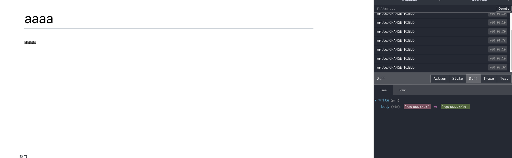

# 24 프론트 엔드 프로젝트 : 시작 및 구현 인증 구현

첫 번째, 회원가입/로그인 기능을 만든다.

두 번째, 글쓰기 기능을 만든다. Quill이라는 WYSIWYG 에디터 라이브러리를 사용한다.

글쓰기 페이지를 구현한 다음에는 블로그 포스트의 목록을 보여주는 기능과 , 포스트를 읽는 기능을 구현한다.

포스트를 수정하거나 삭제하는 기능을 개발한다.

## 24.1 작업환경 준비하기

blog 폴더 내에서

```
yarn create react-app blog-frontend
```


### 24.1.1 설정 파일 만들기

.prettierrc

```
{
  "singleQuote": true,
  "semi": true,
  "useTabs": false, // 탭이 있는 줄을 들여쓰기 하지 않음
  "tabWidth": 2,
  "trailingComma": "all",
  "printWidth": 80
}

```

import 자동화

jscongfig.json

```
{
  "compilerOptions": {
    "target": "es6"
  }
}

```


### 24.1.2 라우터 적용

리액트 라우터를 프로젝트에 설치 적용=> 라우트 컴포넌트

```
yarn add react-router-dom
```

다섯 개의 페이지 만들 예정

- LoginPage.js - 로그인
- RegisterPage.js - 회원 가입
- WritePage.js - 글쓰기
- PostPage.js - 포스트 읽기
- PostListPage.js - 포스트 목록

Pages/LoginPage.js 등 5개의 페이지 동일

```jsx
import React from 'react';

const LoginPage = () => {
  return <div>로그인</div>;
};

export default LoginPage;

```

src/index.js

```jsx
import React from 'react';
import ReactDOM from 'react-dom';
import './index.css';
import App from './App';
import * as serviceWorker from './serviceWorker';
import { BrowserRouter } from 'react-router-dom';
ReactDOM.render(
  <BrowserRouter>
    <App />
  </BrowserRouter>,
  document.getElementById('root'),
);

// If you want your app to work offline and load faster, you can change
// unregister() to register() below. Note this comes with some pitfalls.
// Learn more about service workers: https://bit.ly/CRA-PWA
serviceWorker.unregister();

```

src/App.js

```JSX
import React from 'react';
import { Route } from 'react-router-dom';
import PostListPage from './pages/PostListPage';
import LoginPage from './pages/LoginPage';
import RegisterPage from './pages/RegisterPage';
import PostPage from './pages/PostPage';
import WritePage from './pages/WritePage';

const App = () => {
  return (
    <>
      <Route component={PostListPage} path={['/@:username', '/']} exact />
      <Route component={PostPage} path={'/@:username/:postId'} />
      <Route component={LoginPage} path={'/login'} />
      <Route component={WritePage} path={'/write'} />
      <Route component={RegisterPage} path={'/register'} />
    </>
  );
};

export default App;

```


- <Route component={PostListPage} path={['/@:username', '/']} exact />
  - <Route component={PostListPage} path={'/@:username'} exact />
  - <Route component={PostListPage} path={'/'} exact />
  - 위 두 줄을 쓰는 것보다 같이 쓰는 게 낫다.
- /@:Username
  - 브런치,Medium 같은 서비스에서도 계정명을 주소 경로 안에 넣을 때 주소 경로에 @을 넣는 방식을 사용한다. 
  - Username 파라미터로 읽을 수 있게 한다.


### 24.1.3 스타일 설정

```
yarn add styled-components
```

색상 팔레트 파일 만들기

-   http://Bit.ly/mypalette 
-   open-color 오픈소스 사용

src/lib/styles/palette.js

```
// source: https://yeun.github.io/open-color/

const palette = {
  gray: [
    '#f8f9fa',
    '#f1f3f5',
    '#e9ecef',
    '#dee2e6',
    '#ced4da',
    '#adb5bd',
    '#868e96',
    '#495057',
    '#343a40',
    '#212529',
  ],
  cyan: [
    '#e3fafc',
    '#c5f6fa',
    '#99e9f2',
    '#66d9e8',
    '#3bc9db',
    '#22b8cf',
    '#15aabf',
    '#1098ad',
    '#0c8599',
    '#0b7285',
  ],
};

export default palette;
```

### 24.1.4 button 컴포넌트 만들기

src/components/common/Button.js

```jsx
import React from 'react';
import styled from 'styled-components';
import palette from '../../lib/styles/palette';

const StyledButton = styled.button`
  border: none;
  border-radius: 4px;
  font-size: 1rem;
  font-weight: bold;
  padding: 0.25rem 1rem;
  color: white;
  outline: none;
  cursor: pointer;

  background: ${palette.gray[8]};
  &:hover {
    background: ${palette.gray[6]};
  }
`;
const Button = props => <StyledButton {...props} />;

export default Button;
```

- styledButton을 export하지 않고 Button을 만들어서 StyleButton을 렌더링 한 이유는 컴포넌트를 사용할 때 자동으로 import가 되도록 하기 위해서
- Button 컴포넌트를 만드는 과정중 {...porps}을 StyledButoon의 속성으로 설정했는데 이는 Button이 받아 오는 props를 모두 StyledButton에 전달한다는 의미
- 질문 : Button이 있더라도 내가  Button을 만들면 속성이 다 전달 되는것인가?


src/pages/PostListPage.js

```jsx
import React from 'react';
import Button from '../components/common/Button';

const PostListPage = () => {
  return (
    <div>
      postlistpage<Button>버튼</Button>
    </div>
  );
};

export default PostListPage;
	
```


src/index.css

```css
body {
  margin: 0;
  font-family: -apple-system, BlinkMacSystemFont, 'Segoe UI', 'Roboto', 'Oxygen',
    'Ubuntu', 'Cantarell', 'Fira Sans', 'Droid Sans', 'Helvetica Neue',
    sans-serif;
  -webkit-font-smoothing: antialiased;
  -moz-osx-font-smoothing: grayscale;
  box-sizing: border-box; /* 엘리먼트의 box-sizing 값을 border-box로 설정*/
  min-height: 100%;
}

#root {
  min-height: 100%;
}
/* 추후 회원 인증 페이지에서 배경 화면을 페이지의 전체 영역에 채우기 위한 용도 */
html {
  height: 100%;
}

/* 링크의 색상 및 밑줄 없애기 */
a {
  color: inherit;
  text-decoration: none;
}

* {
  box-sizing: inherit; /* 모든 엘리먼트의 box-sizing 값을 border-box로 설정 */
}
code {
  font-family: source-code-pro, Menlo, Monaco, Consolas, 'Courier New',
    monospace;
}


```


### 24.1.5 리덕스 적용

리덕스를 적용하는데 추후 비동기 작업에서 redux-saga를 사용, 지금 당장은 미들웨어에 대한 관심 x 리덕스 스토어 생성, Provider 컴포넌트를 통해 리덕스를 적용


```
yarn add redux react-redux redux-actions immer redux-devtools-extension
```

immer은 굳이 필요하지 않지만 편하게 불변성 관리하기 위해 사용

 src/modules/auth.js

```jsx
import { createAction, handleActions } from 'redux-actions';

const SAMPLE_ACTION = 'auth/SAMPLE_ACTION';

export const sampleAction = createAction(SAMPLE_ACTION);

const initialState = {};

const auth = handleActions(
  {
    [SAMPLE_ACTION]: (state, action) => state,
  },
  initialState,
);

export default auth;

```

src/moduels/index.js

```jsx
import { combineReducers } from 'redux';
import auth from './auth';

const rootReducer = combineReducers({ auth });

export default rootReducer;

```

src/index.js

```jsx
import React from 'react';
import ReactDOM from 'react-dom';
import './index.css';
import App from './App';
import * as serviceWorker from './serviceWorker';
import { BrowserRouter } from 'react-router-dom';
import { createStore } from 'redux';
import rootReducer from './modules/index';
import { composeWithDevTools } from 'redux-devtools-extension';
import { Provider } from 'react-redux';

const store = createStore(rootReducer, composeWithDevTools());

ReactDOM.render(
  <Provider store={store}>
    <BrowserRouter>
      <App />
    </BrowserRouter>
  </Provider>,
  document.getElementById('root'),
);

// If you want your app to work offline and load faster, you can change
// unregister() to register() below. Note this comes with some pitfalls.
// Learn more about service workers: https://bit.ly/CRA-PWA
serviceWorker.unregister();

```


## 24.2  회원가입과 로그인 구현

 UI개발 => 리덕스 적용

### 24.2.1 UI  준비하기

- UI에 집중하기
- 프레젠테이셔널 컴포넌트는  components directory
- EX)BUTTON은 이곳 저곳에서 많이 사용하므로 common directory
- 회원 인증은  auth, 글쓰기 관련 컴포넌트는 write 디렉터리, 포스트 읽기에 관련된 것 post directory

회원가입과 로그인 기능을 구현하기 위해 만들어야 할 프레젠테이셔널 컴포넌트는 2개

회원가입과 로그인 폼을 보여줌

컴포넌트의 최상위 컴포넌트를 선언할 때는 네이밍 방법을 통해 표시 한다.


회원가입과 로그인 폼을 담당

components/auth/AuthFoam.js

```jsx
import React from 'react';
import styled from 'styled-components';

const AuthFoamBlock = styled``;

const AuthFoam = () => {
  return <AuthFoamBlock>AuthFoam</AuthFoamBlock>;
};

export default AuthFoam;

```

회원가입과 로그인의 레이아웃 담당


components/auth/AuthTemplate.js

```jsx
import React from 'react';
import styled from 'styled-components';

const AuthTemplateBlock = styled``;

const AuthTemplate = () => {
  return <AuthTemplateBlock>AuthFoam</AuthTemplateBlock>;
};

export default AuthTemplate;
	
```

 http://sinppet-generator.app에

components/auth/AuthTemplate.js 코드 복사  AuthTemplate라는 단어를 ${TM_FILENAME_BASE}로 변환 , 단축기 설정(탭 트리거)후 

copy snippet 버튼 ,

```
"": {
  "prefix": "",
  "body": [
    "import React from 'react';",
    "import styled from 'styled-components';",
    "",
    "const ${TM_FILENAME_BASE}Block = styled``;",
    "",
    "const ${TM_FILENAME_BASE} = () => {",
    "  return <${TM_FILENAME_BASE}Block></${TM_FILENAME_BASE}Block>;",
    "};",
    "",
    "export default ${TM_FILENAME_BASE};",
    "	"
  ],
  "description": ""
}
```


Copy sinppet  클릭

macOS :VS code Code > 기본 설정 > 사용자 코드 조각

Window  파일 메뉴에 있습니다.


 javascriptreact 선택 후 복사한 것 붙여넣기 후 저장 , 기본 폴더에 저장됨


Header.js 컴포넌트 생성 ,

왼쪽 하단  JavaScript 클릭

 

.js에 대한 파일 연결 구성


javascript react 설정


- 단축기 srfc로 컴포넌트 형태를 불러올 수 있습니다.

settings.json 에서 javascriptreact로 변환하면 자동으로 다 변환된다.

```json
"": {
  "prefix": "",
  "body": [
    "import React from 'react';",
    "import styled from 'styled-components';",
    "",
    "const ${TM_FILENAME_BASE}Block = styled``;",
    "",
    "const ${TM_FILENAME_BASE} = () => {",
    "  return <${TM_FILENAME_BASE}Block></${TM_FILENAME_BASE}Block>;",
    "};",
    "",
    "export default ${TM_FILENAME_BASE};",
    "	"
  ],
  "description": ""
}
```


components/auth/AuthTemplate.js 

컴포넌트를 열어서 children을 렌더링 한다.

```jsx
import React from 'react';
import styled from 'styled-components';

const AuthTemplateBlock = styled.div``;

const AuthTemplate = ({ children }) => {
  return <AuthTemplateBlock>{children}</AuthTemplateBlock>;
};

export default AuthTemplate;

```

src/pages/RegistserPage.js

```jsx
import React from 'react';
import AuthTemplate from '../components/auth/AuthTemplate';
import AuthFoam from '../components/auth/AuthFoam';

const RegisterPage = () => {
  return (
    <AuthTemplate>
      <AuthFoam />
    </AuthTemplate>
  );
};

export default RegisterPage;

```

src/pages/LoginPage.js

```jsx
import React from 'react';
import AuthTemplate from '../components/auth/AuthTemplate';
import AuthFoam from '../components/auth/AuthFoam';

const LoginPage = () => {
  return (
    <AuthTemplate>
      <AuthFoam />
    </AuthTemplate>
  );
};

export default LoginPage;
```


#### 24.2.1.1 AuthTemplate 완성

 children으로 받아온 내용을 보여 주기만 하는 역할

배경은 회색, 중앙에 흰색 박스, 홈 경로 / 로 들어가는 링크도 보여준다.

Styled-components로 스타일링 할 시

엘리먼트에 특별한 용도가 있거나 엘리먼트를 따로 만들어 주었을 때 jsx의 가독성이 좋아진다면 만드는 것도 좋다.  그렇지 않다면 클래스나 아이디로 css selector를 사용하겟다.

components/auth/AuthTemplate.js 

```jsx
import React from 'react';
import styled from 'styled-components';
import palette from '../../lib/styles/palette';
import { Link } from 'react-router-dom';
const AuthTemplateBlock = styled.div`
  position: absolute;
  /* 모든 것을 0으로 해야 모든 화면을 잡음 */
  left: 0;
  top: 0;
  bottom: 0;
  right: 0;
  background: ${palette.gray[2]};
  /* 플렉스로 내부 내용 중앙 정렬 ? */
  display: flex;
  flex-direction: column;
  /* 상하의 중심 */
  justify-content: center;
  /* 좌우의 중심 */
  align-items: center;
`;
const WhiteBox = styled.div`
  .logo-area {
    display: block;
    padding-bottom: 2rem;
    /* 좌우 간격 중심 */
    text-align: center;
    font-weight: bold;
    /* 글자 간격 */
    letter-spacing: 2px;
  }
  box-shadow: 0 0 8px rgba(0, 0, 0.025);
  /* 내부에서으로부터 패딩 */
  padding: 2rem;
  width: 360px;
  background: white;
  /* 필렛 */
  border-radius: 2px;
`;

const AuthTemplate = ({ children }) => {
  return (
    <AuthTemplateBlock>
      <WhiteBox>
        <div className="logo-area">
          <Link to="/">REACTERS</Link>
        </div>
        {children}
      </WhiteBox>
    </AuthTemplateBlock>
  );
};

export default AuthTemplate;

```


#### 24.2.1.2 AuthFoam

src/components/auth/AuthFoam.js

```jsx
import React from 'react';
import styled from 'styled-components';
import Button from '../common/Button';
import palette from '../../lib/styles/palette';
import { Link } from 'react-router-dom';

const AuthFoamBlock = styled.div`
  h3 {
    margin: 0;

    color: ${palette.gray[8]};
    /*  바닥으로부터 마진 */
    margin-bottom: 1rem;
  }
`;

const StyledInput = styled.input`
  font-size: 1rem;
  /* 모서리선 삭제 */
  border: none;
  /* 밑 줄 긋기 */
  border-bottom: 1px solid ${palette.gray[5]};
  /* 글자와 밑줄 사이의 틈을 두기 */
  padding-bottom: 0.5rem;
  outline: none;
  width: 100%;
  &:focus {
    color: $oc-teal-7;
    border-bottom: 1px solid ${palette.gray[7]};
  }
  & + & {
    margin-top: 1rem;
  }
`;

const Footer = styled.div`
  /* 위의 엘리먼트과의 간격 */
  margin-top: 1rem;
  text-align: right;
  a {
    color: ${palette.gray[6]};
    text-decoration: underline;
    :hover {
      color: ${palette.gray[9]};
    }
  }
`;

const AuthFoam = () => {
  return (
    <AuthFoamBlock>
      <h3>로그인</h3>
      <form>
        <StyledInput
          autoComplete="username"
          name="username"
          placeholder="아이디"
        />
        <StyledInput
          autoComplete="new-password"
          name="password"
          placeholder="비밀번호"
          type="password"
        />
        <Button>로그인</Button>
      </form>
      <Footer>
        <Link to="/register">회원가입</Link>
      </Footer>
    </AuthFoamBlock>
  );
};

export default AuthFoam;

```


- 버튼의 배경을 밝은 파랑색으로 수정
- Width 가 100% 차지 하도록
- css 속성으로 만듦
- Button cyan fullWidth  === Button cyan={true} fullWidth={true}

src/components/common/Button.js

```jsx
import React from 'react';
import styled, { css } from 'styled-components';
import palette from '../../lib/styles/palette';

const StyledButton = styled.button`
  border: none;
  border-radius: 4px;
  font-size: 1rem;
  font-weight: bold;
  padding: 0.25rem 1rem;
  color: white;
  outline: none;
  cursor: pointer;

  background: ${palette.gray[8]};
  &:hover {
    background: ${palette.gray[6]};
  }

  ${props =>
    props.fullWidth &&
    css`
      /* 글자와 block 사이의 간격 */
      padding-top: 0.75rem;
      padding-bottom: 0.75rem;
      width: 100%;
      font-size: 1.125rem;
    `}
  ${props =>
    props.cyan &&
    css`
      background: ${palette.cyan[5]};
      &:hover {
        background: ${palette.cyan[4]};
      }
    `}
`;
const Button = props => <StyledButton {...props} />;

export default Button;

```

상단 여백 주기 방법이 두가지

첫번째, style props로 전달 하기

src/components/auth/AuthFoam.js

```jsx
<Button cyan fullWidth style={{ marginTop: '1rem' }}        
```

두번째, styled 함수로 함수로 새로운 컴포넌트 이름으로 정의하는 것

글쓴이는 두번째 추천 가독성 때문에

src/components/auth/AuthFoam.js

```jsx
...
const ButtonWithMarginTop = styled(Button)`
  margin-top: 1rem;
`;

const AuthFoam = () => {
  return (
    <AuthFoamBlock>
      <h3>로그인</h3>
      <form>
        <StyledInput
          autoComplete="username"
          name="username"
          placeholder="아이디"
        />
        <StyledInput
          autoComplete="new-password"
          name="password"
          placeholder="비밀번호"
          type="password"
        />
        <ButtonWithMarginTop cyan fullWidth>
          로그인
        </ButtonWithMarginTop>
      </form>
      <Footer>
        <Link to="/register">회원가입</Link>
      </Footer>
    </AuthFoamBlock>
  );
};
...
```

- 회원가입시 비밀번호 확인 받을 수 있는  인풋 엘리먼트 추가하기
- 사용되는 문구도 달라지고 footer내용도 달라지게 만들기


src/components/auth/AuthFoam.js

```jsx
const textMap = { login: '로그인', register: '회원가입' };

const AuthFoam = ({ type }) => {
  const text = textMap[type];

  return (
    <AuthFoamBlock>
      <h3>로그인</h3>
      <form>
        <StyledInput
          autoComplete="username"
          name="username"
          placeholder="아이디"
        />
        <StyledInput
          autoComplete="new-password"
          name="password"
          placeholder="비밀번호"
          type="password"
        />
        {type === 'register' && (
          <StyledInput
            autoComplete="new-password"
            name="passwordConfirm"
            placeholder="비밀번호 확인"
            type="password"
          ></StyledInput>
        )}
        <ButtonWithMarginTop cyan fullWidth>
          {text}
        </ButtonWithMarginTop>
      </form>
      <Footer>
        {type === 'login' ? (
          <Link to="/register">회원가입</Link>
        ) : (
          <Link to="/login">로그인</Link>
        )}
      </Footer>
    </AuthFoamBlock>
  );
};

export default AuthFoam;

```

src/pages/LoginPage.js

```jsx
import React from 'react';
import AuthTemplate from '../components/auth/AuthTemplate';
import AuthForm from '../components/auth/AuthForm';

const LoginPage = () => {
  return (
    <AuthTemplate>
      <AuthForm type="login" />
    </AuthTemplate>
  );
};

export default LoginPage;

```

src/pages/RegisterPage.js

```jsx
import React from 'react';
import AuthTemplate from '../components/auth/AuthTemplate';
import AuthForm from '../components/auth/AuthForm';

const RegisterPage = () => {
  return (
    <AuthTemplate>
      <AuthForm type="register" />
    </AuthTemplate>
  );
};

export default RegisterPage;
```

UI 완성했으나 위의 컴포넌트명이 AuthFoam에서 AuthForm으로 변경함


### 24.2.2 리덕스로 폼 상태 관리


Modules/auth.js

- ```jsx
  import { createAction, handleActions } from 'redux-actions';
  import produce from 'immer';
  
  const CHANGE_FIELD = 'auth/CHANEGE_FIELD';
  const INITIALIZE_FORM = 'auth/INITIALIZE_FORM';
  
  export const changeField = createAction(
    CHANGE_FIELD,
    ({ form, key, value }) => ({
      form, //register,login
      key, // username,password,passwordConfirm
      value, // 실제 바꾸려는 값
    }),
  );
  
  export const initializeForm = createAction(INITIALIZE_FORM, form => form); // register, login
  
  const initialState = {
    register: {
      username: '',
      password: '',
      passwordConfirm: '',
    },
    login: {
      username: '',
      password: '',
    },
  };
  
  const auth = handleActions(
    {
      [CHANGE_FIELD]: (state, { payload: { form, key, value } }) =>
        produce(state, draft => {
          draft[form][key] = value;
        }),
      [INITIALIZE_FORM]: (state, { payload: { form } }) => ({
        ...state,
        [form]: initialState[form],
      }),
    },
    initialState,
  );
  export default auth;
  ```


containers/auth/LoginForm.js

```jsx
import React, { useEffect } from 'react';
import { useDispatch, useSelector } from 'react-redux';
import { changeField, initializeForm } from '../../modules/auth';
import AuthForm from '../../components/auth/AuthForm';

const LoginForm = () => {
  const dispatch = useDispatch();
  const { form } = useSelector(({ auth }) => ({ form: auth.login }));

  const onChange = e => {
    const { value, name } = e.target;
    dispatch(changeField({ form: 'login', key: name, value }));
  };

  const onSubmit = e => {
    e.preventDefault();
  };
  // 컴포넌트가 처음 렌더링될 때 form을 초기화
  useEffect(() => {
    dispatch(initializeForm('login'));
  }, [dispatch]);

  return (
    <AuthForm
      type="login"
      form={form}
      onChange={onChange}
      onSubmit={onSubmit}
    ></AuthForm>
  );
};

export default LoginForm;

```

src/pages/LoginPage.js

```jsx
import React from 'react';
import AuthTemplate from '../components/auth/AuthTemplate';
import AuthForm from '../components/auth/AuthForm';
import LoginForm from '../containers/auth/LoginForm';

const LoginPage = () => {
  return (
    <AuthTemplate>
      <LoginForm />
    </AuthTemplate>
  );
};

export default LoginPage;

```

src/components/auth/AuthForm.js

```jsx
import React from 'react';
import styled from 'styled-components';
import Button from '../common/Button';
import palette from '../../lib/styles/palette';
import { Link } from 'react-router-dom';

const AuthFormBlock = styled.div`
  h3 {
    margin: 0;
    color: ${palette.gray[8]};
    /*  바닥으로부터 마진 */
    margin-bottom: 1rem;
  }
`;

const StyledInput = styled.input`
  font-size: 1rem;
  /* 모서리선 삭제 */
  border: none;
  /* 밑 줄 긋기 */
  border-bottom: 1px solid ${palette.gray[5]};
  /* 글자와 밑줄 사이의 틈을 두기 */
  padding-bottom: 0.5rem;
  outline: none;
  width: 100%;
  &:focus {
    color: $oc-teal-7;
    border-bottom: 1px solid ${palette.gray[7]};
  }
  & + & {
    margin-top: 1rem;
  }
`;

const Footer = styled.div`
  /* 위의 엘리먼트과의 간격 */
  margin-top: 1rem;
  text-align: right;
  a {
    color: ${palette.gray[6]};
    text-decoration: underline;
    :hover {
      color: ${palette.gray[9]};
    }
  }
`;

const ButtonWithMarginTop = styled(Button)`
  margin-top: 1rem;
`;
const textMap = { login: '로그인', register: '회원가입' };

const AuthForm = ({ type, form, onChange, onSubmit }) => {
  const text = textMap[type];

  return (
    <AuthFormBlock>
      <h3>로그인</h3>
      <form>
        <StyledInput
          autoComplete="username"
          name="username"
          placeholder="아이디"
          onChange={onChange}
          value={form.username}
        />
        <StyledInput
          autoComplete="new-password"
          name="password"
          placeholder="비밀번호"
          type="password"
          onChange={onChange}
          value={form.password}
        />
        {type === 'register' && (
          <StyledInput
            autoComplete="new-password"
            name="passwordConfirm"
            placeholder="비밀번호 확인"
            type="password"
            onChange={onChange}
            value={form.passwordConfirm}
          ></StyledInput>
        )}
        <ButtonWithMarginTop cyan fullWidth>
          {text}
        </ButtonWithMarginTop>
      </form>
      <Footer>
        {type === 'login' ? (
          <Link to="/register">회원가입</Link>
        ) : (
          <Link to="/login">로그인</Link>
        )}
      </Footer>
    </AuthFormBlock>
  );
};

export default AuthForm;

```

리덕스 개발자 도구로 확인


회원가입도 설정 로그인과 똑같다. 

containers/auth/RegisterForm.js

```jsx
import React, { useEffect } from 'react';
import { useDispatch, useSelector } from 'react-redux';
import { changeField, initializeForm } from '../../modules/auth';
import AuthForm from '../../components/auth/AuthForm';

const RegisterForm = () => {
  const dispatch = useDispatch();
  const { form } = useSelector(({ auth }) => ({ form: auth.register }));

  const onChange = e => {
    const { value, name } = e.target;
    dispatch(changeField({ form: 'register', key: name, value }));
  };

  const onSubmit = e => {
    e.preventDefault();
  };
  // 컴포넌트가 처음 렌더링될 때 form을 초기화
  useEffect(() => {
    dispatch(initializeForm('register'));
  }, [dispatch]);

  return (
    <AuthForm
      type="register"
      form={form}
      onChange={onChange}
      onSubmit={onSubmit}
    ></AuthForm>
  );
};

export default RegisterForm;
```

pages/ResisterPage.js

```jsx
import React from 'react';
import AuthTemplate from '../components/auth/AuthTemplate';
import AuthForm from '../components/auth/AuthForm';
import RegisterForm from '../containers/auth/RegisterForm';

const RegisterPage = () => {
  return (
    <AuthTemplate>
      <RegisterForm></RegisterForm>
    </AuthTemplate>
  );
};

export default RegisterPage;
```


### 24.2.3 API 연동하기

```
yarn add axios redux-saga
```


#### 24.2.3.1 axios instance

API 함수를 작성하기 전에 axios 인스턴스를 생성해야함

API 클라이언트에 공통된 설정을 쉽게 넣을 수 있다.애플리케이션에서 발생하는 모든 요청에 대해 설정하게 되므로, 또 다른 API서버를 사용하려 할 때 곤란해질 수 있습니다. 추가로 나중에 axios를 사용하지 않는 상황이 오더라도 클라이언트를 쉽게 교체할 수 있는 것 또한 장점

src/lib/api/client.js

```jsx
import axios from 'axios';

const client = axios.create();
/*
 // API 주소를 다른곳으로 설정
client.defaults.baseURL = 'https://external-api-server.com/';
// 헤더 설정
client.defaults.headers.common['Authorization'] = 'Bearer a1b2c3d4';
// 인터셉터 설정
axios.intercepter.response.use(
  response => {
    return response;
  },
  error => {
    return Promise.reject(error);
  },
 );
*/ 

export default client;

```

- 질문 : 왜 주석처리했지? 당장 사용안하려고?

#### 24.2.3.2 프록시 설정

백엔드 서버 4000, 프론트엔드 서버는 3000로 열려있기 때문에 별도의 설정없이 API를 호출하려 하면 오류가 발생합니다. 이 오류를 CORS(Cross Origin Request)오류라고 부릅니다. 네트워크요청을 할 때 주소가 다른 경우에 발생합니다. 이 오류를 해결하려면 다른 주소에서도 API를 호출할 수 있도록 서버쪽 코드를 수정해야 합니다. 그런데 최종적으로 프로젝트를 다 완성하고 나면 결국 리액트 앱도 같은 호스트에서 제공할 예정이기 때문에 불필요하다.그 대신 프록시 라는 기능을 사용할 것입니다. 웹팩 개발 서버에서 지원하는 기능인데, 개발 서버로 요청하는 API를 우리가 프록시로 정해둔 서버로 그대로 전달해 주고 그 응답을 웹 애플리케이션에서 사용할 수 있게 해준다.


CRA로 만든 프로젝트에서 프록시를 설정할 때는 package.json 파일을 수정

package.json

```jsx 
{
... ,
"proxy" :"http://localhost:4000"
}
```

이제 리액트 애플리케이션에서 client.get('/api/posts')를 하면, 웹팩 개발 서버가 프록시 역할을 해서 http://localhost:4000/api/posts에 대신 요청한 뒤 결과물을 응답해 준다.

#### 24.2.3.3 API 함수 작성

src/lib/api/auth.js

```jsx
import client from './client';

export const login = ({ username, password }) =>
  client.post('/api/auth/login', { username, password });

export const register = ({ username, password }) =>
  client.post('/api/auth/register', { username, password });

export const check = () => client.get('/api/auth/check');

```

#### 24.2.3.4 redux-saga 로 더 쉬운 API 요청 상태 관리

modules/loading.js

```jsx
import { createAction, handleActions } from 'redux-actions';

const START_LOADING = 'loading/START_LOADING';
const FINISH_LOADING = 'loading/FINISH_LOADING';

export const startLoading = createAction(
  START_LOADING,
  requestType => requestType,
);

export const finishLoading = createAction(
  FINISH_LOADING,
  requestType => requestType,
);

const initialState = {};

const loading = handleActions(
  {
    [START_LOADING]: (state, action) => ({
      ...state,
      [action.payload]: true,
    }),
    [FINISH_LOADING]: (state, action) => ({
      ...state,
      [action.payload]: false,
    }),
  },
  initialState,
);

export default loading;

```

- 리듀서 등록

modules/index.js

```jsx
import { combineReducers } from 'redux';
import auth from './auth';
import loading from './loading';
const rootReducer = combineReducers({ auth, loading });

export default rootReducer;

```

lib/creqteRequestSaga.js

```jsx
import { startLoading, finishLoading } from '../modules/loading';
import { call, put } from 'redux-saga/effects';
export default function createRequestSaga(type, request) {
  const SUCCESS = `${type}_SUCCESS`;
  const FAILURE = `${type}_FAILURE`;

  return function*(action) {
    yield put(startLoading(type));
    try {
      const response = yield call(request, action.payload);
      yield put({ type: SUCCESS, payload: response.data });
    } catch (e) {
      yield put({ type: FAILURE, payload: e, error: true });
    }
    yield put(finishLoading(type));
  };
}
```


#### 24.2.3.5 auth 리덕스 모듈에서 API 사용하기

각 요청마다 액션 타입을 선언해야함

lib/createRequestSaga.js

```jsx
export const createRequestActionTypes = type => {
  const SUCCESS = `${type}_SUCCESS`;
  const FAILURE = `${type}_FAILURE`;
  return [type, SUCCESS, FAILURE];
};

```

액션 타입 정의 및 사가를 통해 리듀서 작성

modules/auth.js

```JSX
import { createAction, handleActions } from 'redux-actions';
import produce from 'immer';
import createRequestSaga, {
  createRequestActionTypes,
} from '../lib/createRequestSaga';
import * as authAPI from '../lib/api/auth';
import { takeLatest } from 'redux-saga/effects';

const CHANGE_FIELD = 'auth/CHANEGE_FIELD';
const INITIALIZE_FORM = 'auth/INITIALIZE_FORM';

const [REGISTER, REGISTER_SUCCESS, REGISTER_FAILURE] = createRequestActionTypes(
  'auth/REGISTER',
);

const [LOGIN, LOGIN_SUCCESS, LOGIN_FAILURE] = createRequestActionTypes(
  'auth/LOGIN',
);

export const changeField = createAction(
  CHANGE_FIELD,
  ({ form, key, value }) => ({
    form, //register,login
    key, // username,password,passwordConfirm
    value, // 실제 바꾸려는 값
  }),
);

export const initializeForm = createAction(INITIALIZE_FORM, form => form); // register, login

export const register = createAction(REGISTER, ({ username, password }) => ({
  username,
  password,
}));
export const login = createAction(LOGIN, ({ username, password }) => ({
  username,
  password,
}));

const registerSaga = createRequestSaga(REGISTER, authAPI.register);
const loginSaga = createRequestSaga(LOGIN, authAPI.login);

export function* authSaga() {
  yield takeLatest(REGISTER, registerSaga);
  yield takeLatest(LOGIN, loginSaga);
}

const initialState = {
  register: {
    username: '',
    password: '',
    passwordConfirm: '',
  },
  login: {
    username: '',
    password: '',
  },
  auth: null,
  authError: null,
};

const auth = handleActions(
  {
    [CHANGE_FIELD]: (state, { payload: { form, key, value } }) =>
      produce(state, draft => {
        draft[form][key] = value;
      }),
    [INITIALIZE_FORM]: (state, { payload: { form } }) => ({
      ...state,
      [form]: initialState[form],
      authError: null, // form 전환 시 회원 인증 에러 초기화
    }),
    [REGISTER_SUCCESS]: (state, { payload: auth }) => ({
      ...state,
      authError: null,
      auth,
    }),
    [REGISTER_FAILURE]: (state, { payload: error }) => ({
      ...state,
      authError: error,
    }),
    [LOGIN_SUCCESS]: (state, { payload: auth }) => ({
      ...state,
      authError: null,
      auth,
    }),
    [LOGIN_FAILURE]: (state, { payload: error }) => ({
      ...state,
      authError: error,
    }),
  },
  initialState,
);

export default auth;
```

 modules/index.js

```jsx
import { combineReducers } from 'redux';
import auth, { authSaga } from './auth';
import loading from './loading';
import { all } from 'redux-saga/effects';
const rootReducer = combineReducers({ auth, loading });

export function* rootSaga() {
  yield all([authSaga()]);
}
export default rootReducer;

```

Src/index.js

```jsx
import React from 'react';
import ReactDOM from 'react-dom';
import './index.css';
import App from './App';
import * as serviceWorker from './serviceWorker';
import { BrowserRouter } from 'react-router-dom';
import { createStore, applyMiddleware } from 'redux';
import rootReducer, { rootSaga } from './modules';
import { composeWithDevTools } from 'redux-devtools-extension';
import { Provider } from 'react-redux';
import createSagaMiddleware from 'redux-saga';
const sagaMiddleware = createSagaMiddleware();

const store = createStore(
  rootReducer,
  composeWithDevTools(applyMiddleware(sagaMiddleware)),
);

sagaMiddleware.run(rootSaga);
ReactDOM.render(
  <Provider store={store}>
    <BrowserRouter>
      <App />
    </BrowserRouter>
  </Provider>,
  document.getElementById('root'),
);

// If you want your app to work offline and load faster, you can change
// unregister() to register() below. Note this comes with some pitfalls.
// Learn more about service workers: https://bit.ly/CRA-PWA
serviceWorker.unregister();

```

### 24.2.4 회원가입,유저 상태 체크 구현

src/containers/auth/RegisterForm.js

```jsx
import React, { useEffect } from 'react';
import { useDispatch, useSelector } from 'react-redux';
import { changeField, initializeForm, register } from '../../modules/auth';
import AuthForm from '../../components/auth/AuthForm';

const RegisterForm = () => {
  const dispatch = useDispatch();
  const { form, auth, authError } = useSelector(({ auth }) => ({
    form: auth.register,
    auth: auth.auth,
    authError: auth.authError,
  }));

  const onChange = e => {
    const { value, name } = e.target;
    dispatch(changeField({ form: 'register', key: name, value }));
  };

  const onSubmit = e => {
    e.preventDefault();
    const { username, password, passwordConfirm } = form;
    if (password !== passwordConfirm) {
      return;
    }
    dispatch(register({ username, password }));
  };
  // 컴포넌트가 처음 렌더링될 때 form을 초기화
  useEffect(() => {
    dispatch(initializeForm('register'));
  }, [dispatch]);

  useEffect(() => {
    if (authError) {
      console.log('오류 발생');
      console.log(authError);
      return;
    }

    if (auth) {
      console.log('회원가입 성공');
      console.log(auth);
    }
  }, [auth, authError]);

  return (
    <AuthForm
      type="register"
      form={form}
      onChange={onChange}
      onSubmit={onSubmit}
    ></AuthForm>
  );
};

export default RegisterForm;

```

- 이슈

  - 백엔드, 프론트 2개의 서버를 열어야한다.

    - 터미널이 1개밖에 안 열린다. iTerm 터미널을 설치하여 사용

  - 버튼 속성에서 onClick={onSubmit}로 지정해야함

  - ```jsx
        <ButtonWithMarginTop cyan fullWidth onClick={onSubmit}>
          {text}
        </ButtonWithMarginTop>
    ```

    

  - 에러가 발생되면 밑의 if문이 실행이 되지 않아야 하기 때문에 if문의 순서를 바꾸면 안된다.

    ```jsx
    if (authError) {
          console.log('오류 발생');
          console.log(authError);
          return;
        }
    
        if (auth) {
          console.log('회원가입 성공');
          console.log(auth);
        }
    ```


사용자 상태를 담을 user 리덕스 모듈

src/modules/user.js

```jsx
import createRequestSaga, {
  createRequestActionTypes,
} from '../lib/createRequestSaga';
import { createAction, handleActions } from 'redux-actions';
import authAPI from '../lib/api/auth';
import { takeLatest } from 'react-saga/affects';

const TEMP_SET_USER = 'user/TEMP_SET_USER';
const [CHECK, CHECK_SUCCESS, CHECK_FAILURE] = createRequestActionTypes(
  'user/CHECK',
);

export const tempSetUser = createAction(TEMP_SET_USER, user => user);
export const check = createAction(CHECK);

const checkSaga = createRequestSaga(CHECK, authAPI.check);

export function* userSaga() {
  yield takeLatest(CHECK, checkSaga);
}

const initialState = {
  user: null,
  checkError: null,
};

export default handleActions(
  {
    [TEMP_SET_USER]: (state, { payload: user }) => ({
      ...state,
      user,
    }),
    [CHECK_SUCCESS]: (state, { payload: user }) => ({
      ...state,
      user,
      checkError: null,
    }),
    [CHECK_FAILURE]: (state, { payload: error }) => ({
      ...state,
      user: null,
      checkError: error,
    }),
  },
  initialState,
);

```

루트 리듀서에 포함

```jsx
import { combineReducers } from 'redux';
import auth, { authSaga } from './auth';
import loading from './loading';
import { all } from 'redux-saga/effects';
import user, { userSaga } from './user';
const rootReducer = combineReducers({ auth, loading, user });

export function* rootSaga() {
  yield all([authSaga(), userSaga()]);
}
export default rootReducer;

```

모듈 작성 완료

회원가입 이후 check를 호출하여 현재 사용자의 로그인 상태를 체크 해보자.

 그리고 회원가입이 된다면 localhost:3000/으로 돌려보내보자

withRouter , history객체

Containers/auth/RegisterForm.js

```jsx
import React, { useEffect } from 'react';
import { useDispatch, useSelector } from 'react-redux';
import { changeField, initializeForm, register } from '../../modules/auth';
import AuthForm from '../../components/auth/AuthForm';
import { check } from '../../modules/user';
import { withRouter } from 'react-router-dom';

const RegisterForm = ({ history }) => {
  const dispatch = useDispatch();
  const { form, auth, authError, user } = useSelector(({ auth, user }) => ({
    form: auth.register,
    auth: auth.auth,
    authError: auth.authError,
    user: user.user,
  }));

  const onChange = e => {
    const { value, name } = e.target;
    dispatch(changeField({ form: 'register', key: name, value }));
  };

  const onSubmit = e => {
    e.preventDefault();
    const { username, password, passwordConfirm } = form;
    if (password !== passwordConfirm) {
      return;
    }
    dispatch(register({ username, password }));
  };
  // 컴포넌트가 처음 렌더링될 때 form을 초기화
  useEffect(() => {
    dispatch(initializeForm('register'));
  }, [dispatch]);

  useEffect(() => {
    if (authError) {
      console.log('오류 발생');
      console.log(authError);
      return;
    }

    if (auth) {
      console.log('회원가입 성공');
      console.log(auth);
      dispatch(check());
    }
  }, [auth, authError, dispatch]);

  useEffect(() => {
    if (user) {
      console.log('check API 성공');
      console.log(user);
      history.push('/');
    }
  }, [user, history]);

  return (
    <AuthForm
      type="register"
      form={form}
      onChange={onChange}
      onSubmit={onSubmit}
    ></AuthForm>
  );
};

export default withRouter(RegisterForm);
```

### 24.2.5 로그인 구현

containers/auth/LoginForm.js

```jsx
import React, { useEffect } from 'react';
import { useDispatch, useSelector } from 'react-redux';
import { changeField, initializeForm, login } from '../../modules/auth';
import AuthForm from '../../components/auth/AuthForm';
import { check } from '../../modules/user';
import { withRouter } from 'react-router-dom';

const LoginForm = ({ history }) => {
  const dispatch = useDispatch();
  const { form, auth, authError, user } = useSelector(({ auth, user }) => ({
    form: auth.login,
    auth: auth.auth,
    authError: auth.authError,
    user: user.user,
  }));

  const onChange = e => {
    const { value, name } = e.target;
    dispatch(changeField({ form: 'login', key: name, value }));
  };

  const onSubmit = e => {
    e.preventDefault();
    const { username, password } = form;
    dispatch(login({ username, password })); // parameter 형태 주의
  };
  // 컴포넌트가 처음 렌더링될 때 form을 초기화
  useEffect(() => {
    dispatch(initializeForm('login'));
  }, [dispatch]);

  useEffect(() => {
    if (authError) {
      console.log('오류 발생');
      console.log(authError);
      return;
    }

    if (auth) {
      console.log('login 성공');
      dispatch(check());
    }
  }, [auth, authError, dispatch]);

  useEffect(() => {
    if (user) {
      console.log('check API 성공');
      console.log(user);
      history.push('/');
    }
  }, [user, history]);

  return (
    <AuthForm
      type="login"
      form={form}
      onChange={onChange}
      onSubmit={onSubmit}
    ></AuthForm>
  );
};

export default withRouter(LoginForm);

```


### 24.2.6 회원 인증 에러 처리하기

Component/auth/AuthForm.js

```jsx
import React from 'react';
import styled from 'styled-components';
import Button from '../common/Button';
import palette from '../../lib/styles/palette';
import { Link } from 'react-router-dom';

const ErrorMessage = styled.div`
  color: red;
  text-align: center;
  font-size: 0.875rem;
  margin-top: 1rem;
`;

const AuthFormBlock = styled.div`
  h3 {
    margin: 0;
    color: ${palette.gray[8]};
    /*  바닥으로부터 마진 */
    margin-bottom: 1rem;
  }
`;

const StyledInput = styled.input`
  font-size: 1rem;
  /* 모서리선 삭제 */
  border: none;
  /* 밑 줄 긋기 */
  border-bottom: 1px solid ${palette.gray[5]};
  /* 글자와 밑줄 사이의 틈을 두기 */
  padding-bottom: 0.5rem;
  outline: none;
  width: 100%;
  &:focus {
    color: $oc-teal-7;
    border-bottom: 1px solid ${palette.gray[7]};
  }
  & + & {
    margin-top: 1rem;
  }
`;

const Footer = styled.div`
  /* 위의 엘리먼트과의 간격 */
  margin-top: 1rem;
  text-align: right;
  a {
    color: ${palette.gray[6]};
    text-decoration: underline;
    :hover {
      color: ${palette.gray[9]};
    }
  }
`;

const ButtonWithMarginTop = styled(Button)`
  margin-top: 1rem;
`;
const textMap = { login: '로그인', register: '회원가입' };

const AuthForm = ({ type, form, onChange, onSubmit, error }) => {
  const text = textMap[type];

  return (
    <AuthFormBlock>
      <h3>{text}</h3>
      <form>
        <StyledInput
          autoComplete="username"
          name="username"
          placeholder="아이디"
          onChange={onChange}
          value={form.username}
        />
        <StyledInput
          autoComplete="new-password"
          name="password"
          placeholder="비밀번호"
          type="password"
          onChange={onChange}
          value={form.password}
        />
        {type === 'register' && (
          <StyledInput
            autoComplete="new-password"
            name="passwordConfirm"
            placeholder="비밀번호 확인"
            type="password"
            onChange={onChange}
            value={form.passwordConfirm}
          ></StyledInput>
        )}
        {error && <ErrorMessage>{error}</ErrorMessage>}
        <ButtonWithMarginTop cyan fullWidth onClick={onSubmit}>
          {text}
        </ButtonWithMarginTop>
      </form>
      <Footer>
        {type === 'login' ? (
          <Link to="/register">회원가입</Link>
        ) : (
          <Link to="/login">로그인</Link>
        )}
      </Footer>
    </AuthFormBlock>
  );
};

export default AuthForm;

```


containers/auth/LoginForm.js

```jsx
import React, { useEffect, useState } from 'react';
import { useDispatch, useSelector } from 'react-redux';
import { changeField, initializeForm, login } from '../../modules/auth';
import AuthForm from '../../components/auth/AuthForm';
import { check } from '../../modules/user';
import { withRouter } from 'react-router-dom';

const LoginForm = ({ history }) => {
  const dispatch = useDispatch();
  const { form, auth, authError, user } = useSelector(({ auth, user }) => ({
    form: auth.login,
    auth: auth.auth,
    authError: auth.authError,
    user: user.user,
  }));

  const [error, setError] = useState(null);

  const onChange = e => {
    const { value, name } = e.target;
    dispatch(changeField({ form: 'login', key: name, value }));
  };

  const onSubmit = e => {
    e.preventDefault();
    const { username, password } = form;
    dispatch(login({ username, password }));
  };
  // 컴포넌트가 처음 렌더링될 때 form을 초기화
  useEffect(() => {
    dispatch(initializeForm('login'));
  }, [dispatch]);

  useEffect(() => {
    if (authError) {
      console.log('오류 발생');
      console.log(authError);
      setError('로그인 실패');
      return;
    }

    if (auth) {
      console.log('login 성공');
      dispatch(check());
    }
  }, [auth, authError, dispatch]);

  useEffect(() => {
    if (user) {
      console.log('check API 성공');
      console.log(user);
      history.push('/');
    }
  }, [user, history]);

  return (
    <AuthForm
      type="login"
      form={form}
      onChange={onChange}
      onSubmit={onSubmit}
      error={error}
    ></AuthForm>
  );
};

export default withRouter(LoginForm);

```


회원가입 시 발생에러는 어렵다.

상황이 3가지

username,password, passwordConfirm 중 하나라도 비어 있을 때

password와 passwordConfrim의 값이 일치하지 않을 때

Username이 중복될 때

- 이 컴포넌트에 책에 오류가 있습니다.

containers/auth/RegisterForm.js

```jsx
import React, { useEffect, useState } from 'react';
import { useDispatch, useSelector } from 'react-redux';
import { changeField, initializeForm, register } from '../../modules/auth';
import AuthForm from '../../components/auth/AuthForm';
import { check } from '../../modules/user';
import { withRouter } from 'react-router-dom';

const RegisterForm = ({ history }) => {
  const [error, setError] = useState(null);
  const dispatch = useDispatch();
  const { form, auth, authError, user } = useSelector(({ auth, user }) => ({
    form: auth.register,
    auth: auth.auth,
    authError: auth.authError,
    user: user.user,
  }));

  const onChange = e => {
    const { value, name } = e.target;
    dispatch(changeField({ form: 'register', key: name, value }));
  };

  const onSubmit = e => {
    e.preventDefault();
    const { username, password, passwordConfirm } = form;
    if ([username, password, passwordConfirm].includes('')) {
      setError('빈 칸을 모두 입력하세요');
      return;
    }
    if (password !== passwordConfirm) {
      setError('비밀번호가 일치하지 않습니다.');
      dispatch(changeField({ form: 'register', key: 'password', value: '' }));
      dispatch(
        changeField({ form: 'register', key: 'passwordConfirm', value: '' }),
      );
      return;
    }
    dispatch(register({ username, password }));
  };
  // 컴포넌트가 처음 렌더링될 때 form을 초기화
  useEffect(() => {
    dispatch(initializeForm('register'));
  }, [dispatch]);

  useEffect(() => {
    if (authError) {
      if ((authError.response.status = 409)) {
        setError('이미 존재하는 계정명입니다.');
        return;
      }
      console.log('회원 가입 실패');

      return;
    }

    if (auth) {
      console.log('회원가입 성공');
      console.log(auth);
      dispatch(check());
    }
  }, [auth, authError, dispatch]);

  useEffect(() => {
    if (user) {
      console.log('check API 성공');
      console.log(user);
      history.push('/');
    }
  }, [user, history]);

  return (
    <AuthForm
      type="register"
      form={form}
      onChange={onChange}
      onSubmit={onSubmit}
      error={error}
    ></AuthForm>
  );
};

export default withRouter(RegisterForm);

```

## 24.3 헤더 컴포넌트 생성 및 로그인 유지

- 반응형 디자인을 할 때 더 편하게 하기 위해 Responsive.js


components/common/Responsive.js

```jsx
import React from 'react';
import styled from 'styled-components';

const ResponsiveBlock = styled.div`
  padding-left: 1rem;
  padding-right: 1rem;
  /* 1024px이상이면 1024px를 줘라 */
  width: 1024px;
  margin: 0 auto; /* 중앙정렬 */
  /* 1024px이하 768아상은 768px */
  @media (max-width: 1024px) {
    width: 768px;
  }
  /* 768px이하 width= 100%주어라 */
  @media (max-width: 768px) {
    width: 100%;
  }
`;

const Responsive = ({ children, ...rest }) => {
  // style,className,onClick,onMouseMove 등의 props을 사용할 수 있도록
  // ...rest를 이용해서  ResponsiveBlock에게 전달
  return <ResponsiveBlock {...rest}>{children}</ResponsiveBlock>;
};

export default Responsive;

```


src/components/common/Header.js

```jsx
import React from 'react';
import styled from 'styled-components';
import Responsive from './Responsive';
import Button from './Button';

const HeaderBlock = styled.div`
  position: fixed;
  width: 100%;
  background: white;
  box-shadow: 0px 2px 4px rgba(0, 0, 0, 0.08);
`;
// 순서대로
// 높이가 4rem, 물 흐르듯이, 상하 맞추기, 좌우 너비 조정
// 글자크기 1.125배,(0~949) 진하게, 글자 간격 2px
const Wrapper = styled(Responsive)`
  height: 4rem;
  display: flex;
  align-items: center;
  justify-content: space-between;

  .logo {
    font-size: 1.125rem;
    font-weight: 949;
    letter-spacing: 2px;
  }
  .right {
    display: flex;
    align-items: center;
  }
`;

const Spacer = styled.div`
  height: 4rem;
`;

const Header = () => {
  return (
    <>
      <HeaderBlock>
        <Wrapper>
          <div className="logo">REACTERS</div>
          <div className="right">
            <Button>로그인</Button>
          </div>
        </Wrapper>
      </HeaderBlock>
      <Spacer />
    </>
  );
};

export default Header;

```

pages/PostListPage.js

```jsx
import React from 'react';
import Header from '../components/common/Header';

const PostListPage = () => {
  return (
    <>
      <Header />
      <div>안녕하세요</div>
    </>
  );
};

export default PostListPage;

```


이 때, 로그인 버튼을 누르면 /login 페이지로 이동해야 한다. 방법은 2가지 버튼컴포넌트에서

1. withRouter 와 history 객체 사용

components/common/Button.js

```jsx
import React from 'react';
import styled, { css } from 'styled-components';
import palette from '../../lib/styles/palette';
import { withRouter } from 'react-router-dom';

const StyledButton = styled.button`
  border: none;
  border-radius: 4px;
  font-size: 1rem;
  font-weight: bold;
  padding: 0.25rem 1rem;
  color: white;
  outline: none;
  cursor: pointer;

  background: ${palette.gray[8]};
  &:hover {
    background: ${palette.gray[6]};
  }

  ${props =>
    props.fullWidth &&
    css`
      /* 글자와 block 사이의 간격 */
      padding-top: 0.75rem;
      padding-bottom: 0.75rem;
      width: 100%;
      font-size: 1.125rem;
    `}
  ${props =>
    props.cyan &&
    css`
      background: ${palette.cyan[5]};
      &:hover {
        background: ${palette.cyan[4]};
      }
    `}
`;

const Button = ({ to, history, ...rest }) => {
  const onClick = e => {
    if (to) {
      history.push(to);
    }
    if (rest.onClick) {
      rest.onClick(e);
    }
  };
  return <StyledButton {...rest} onClick={onClick} />;
};

export default withRouter(Button);

```

components/common/Header.js

```jsx
import React from 'react';
import styled from 'styled-components';
import Responsive from './Responsive';
import Button from './Button';
import { Link } from 'react-router-dom';

const HeaderBlock = styled.div`
  position: fixed;
  width: 100%;
  background: white;
  box-shadow: 0px 2px 4px rgba(0, 0, 0, 0.08);
`;
// 순서대로
// 높이가 4rem, 물 흐르듯이, 상하 맞추기, 좌우 너비 조정
// 글자크기 1.125배,(0~949) 진하게, 글자 간격 2px
const Wrapper = styled(Responsive)`
  height: 4rem;
  display: flex;
  align-items: center;
  justify-content: space-between;

  .logo {
    font-size: 1.125rem;
    font-weight: 949;
    letter-spacing: 2px;
  }
  .right {
    display: flex;
    align-items: center;
  }
`;

const Spacer = styled.div`
  height: 4rem;
`;

const Header = () => {
  return (
    <>
      <HeaderBlock>
        <Wrapper>
          <Link to="/" className="logo">
            REACTERS
          </Link>
          <div className="right">
            <Button to="login">로그인</Button>
          </div>
        </Wrapper>
      </HeaderBlock>
      <Spacer />
    </>
  );
};

export default Header;

```


2. Link 컴포넌트 사용

common/Button.js

```jsx
import React from 'react';
import styled, { css } from 'styled-components';
import palette from '../../lib/styles/palette';
import { Link } from 'react-router-dom';

const buttonStyle = css`
  border: none;
  border-radius: 4px;
  font-size: 1rem;
  font-weight: bold;
  padding: 0.25rem 1rem;
  color: white;
  outline: none;
  cursor: pointer;

  background: ${palette.gray[8]};
  &:hover {
    background: ${palette.gray[6]};
  }

  ${props =>
    props.fullWidth &&
    css`
      /* 글자와 block 사이의 간격 */
      padding-top: 0.75rem;
      padding-bottom: 0.75rem;
      width: 100%;
      font-size: 1.125rem;
    `}
  ${props =>
    props.cyan &&
    css`
      background: ${palette.cyan[5]};
      &:hover {
        background: ${palette.cyan[4]};
      }
    `}
`;
const StyledLink = styled(Link)`
  ${buttonStyle}
`;

const StyledButton = styled.button`
  ${buttonStyle}
`;
const Button = props => {
  return props.to ? (
    <StyledLink {...props} cyan={props.cyan ? 1 : 0} />
  ) : (
    <StyledButton {...props} />
  );
};

export default Button;

```

- 두번째 Link 컴포넌트를 사용하는 것을 추천함, 브라우저 하단에 이동할 주소도 나타남
- 삼항연산자에 1:0을 써야함 숫자/문자열만 허용

### 24.3.2 로그인 상태를 보여주고 유지하기

만약 로그인에 성공하면 헤더 컴포넌트에서 로그인 중인 상태를 보여주고, 새로고침을 하여도 이 상태가 유지되도록하겠습니다.

#### 24.3.2.1 로그인 상태 보여 주기

containers/common/HeaderContainer.js

```jsx
import React from 'react';
import { useSelector } from 'react-redux';
import Header from './Header';
const HeaderContainer = () => {
  const { user } = useSelector(({ user }) => ({ user: user.user }));
  return <Header user={user} />;
};

export default HeaderContainer;

```

components/common/Header.js

```jsx
import React from 'react';
import styled from 'styled-components';
import Responsive from './Responsive';
import Button from './Button';
import { Link } from 'react-router-dom';
import user from '../../modules/user';

const HeaderBlock = styled.div`
  position: fixed;
  width: 100%;
  background: white;
  box-shadow: 0px 2px 4px rgba(0, 0, 0, 0.08);
`;
// 순서대로
// 높이가 4rem, 물 흐르듯이, 상하 맞추기, 좌우 너비 조정
// 글자크기 1.125배,(0~949) 진하게, 글자 간격 2px
const Wrapper = styled(Responsive)`
  height: 4rem;
  display: flex;
  align-items: center;
  justify-content: space-between;

  .logo {
    font-size: 1.125rem;
    font-weight: 949;
    letter-spacing: 2px;
  }
  .right {
    display: flex;
    align-items: center;
  }
`;

const Spacer = styled.div`
  height: 4rem;
`;

const UserInfo = styled.div`
  font-weight: 800;
  margin-right: 1rem;
`;
const Header = ({ user }) => {
  return (
    <>
      <HeaderBlock>
        <Wrapper>
          <Link to="/" className="logo">
            REACTERS
          </Link>
          {user ? (
            <div className="right">
              <UserInfo>{user.username}</UserInfo>
              <Button>로그아웃</Button>
            </div>
          ) : (
            <div className="right">
              <Button to="/login">로그인</Button>
            </div>
          )}
        </Wrapper>
      </HeaderBlock>
      <Spacer />
    </>
  );
};

export default Header;

```

components/pages/PostListPage.js

```jsx
import React from 'react';
import HeaderContainer from '../components/common/HeaderContainer';

const PostListPage = () => {
  return (
    <>
      <HeaderContainer />
      <div>안녕하세요</div>
    </>
  );
};

export default PostListPage;

```


새로고침 하면 상태가 초기화 됩니다.

#### 24.3.2.2 로그인 상태 유지하기

로그인 상태를 유지하기 위해 브라우저에 내장되어 있는  localStorage를 사용합니다.

LoginForm과 RegisterForm 수정

containers/auth/LoginForm.js

```jsx
import React, { useEffect, useState } from 'react';
import { useDispatch, useSelector } from 'react-redux';
import { changeField, initializeForm, login } from '../../modules/auth';
import AuthForm from '../../components/auth/AuthForm';
import { check } from '../../modules/user';
import { withRouter } from 'react-router-dom';

const LoginForm = ({ history }) => {
  const dispatch = useDispatch();
  const { form, auth, authError, user } = useSelector(({ auth, user }) => ({
    form: auth.login,
    auth: auth.auth,
    authError: auth.authError,
    user: user.user,
  }));

  const [error, setError] = useState(null);

  const onChange = e => {
    const { value, name } = e.target;
    dispatch(changeField({ form: 'login', key: name, value }));
  };

  const onSubmit = e => {
    e.preventDefault();
    const { username, password } = form;
    dispatch(login({ username, password }));
  };
  // 컴포넌트가 처음 렌더링될 때 form을 초기화
  useEffect(() => {
    dispatch(initializeForm('login'));
  }, [dispatch]);

  useEffect(() => {
    if (authError) {
      console.log('오류 발생');
      console.log(authError);
      setError('로그인 실패');
      return;
    }

    if (auth) {
      console.log('login 성공');
      dispatch(check());
    }
  }, [auth, authError, dispatch]);

  useEffect(() => {
    if (user) {
      console.log('check API 성공');
      console.log(user);
      history.push('/');
      try {
        localStorage.setItem('user', JSON.stringify(user));
      } catch (e) {
        console.log('LocalStorage is not working');
      }
    }
  }, [user, history]);

  return (
    <AuthForm
      type="login"
      form={form}
      onChange={onChange}
      onSubmit={onSubmit}
      error={error}
    ></AuthForm>
  );
};

export default withRouter(LoginForm);

```


containers/auth/RegisterForm.js

```jsx
import React, { useEffect, useState } from 'react';
import { useDispatch, useSelector } from 'react-redux';
import { changeField, initializeForm, register } from '../../modules/auth';
import AuthForm from '../../components/auth/AuthForm';
import { check } from '../../modules/user';
import { withRouter } from 'react-router-dom';

const RegisterForm = ({ history }) => {
  const [error, setError] = useState(null);
  const dispatch = useDispatch();
  const { form, auth, authError, user } = useSelector(({ auth, user }) => ({
    form: auth.register,
    auth: auth.auth,
    authError: auth.authError,
    user: user.user,
  }));

  const onChange = e => {
    const { value, name } = e.target;
    dispatch(changeField({ form: 'register', key: name, value }));
  };

  const onSubmit = e => {
    e.preventDefault();
    const { username, password, passwordConfirm } = form;
    if ([username, password, passwordConfirm].includes('')) {
      setError('빈 칸을 모두 입력하세요');
      return;
    }
    if (password !== passwordConfirm) {
      setError('비밀번호가 일치하지 않습니다.');
      dispatch(changeField({ form: 'register', key: 'password', value: '' }));
      dispatch(
        changeField({ form: 'register', key: 'passwordConfirm', value: '' }),
      );
      return;
    }
    dispatch(register({ username, password }));
  };
  // 컴포넌트가 처음 렌더링될 때 form을 초기화
  useEffect(() => {
    dispatch(initializeForm('register'));
  }, [dispatch]);

  useEffect(() => {
    if (authError) {
      if ((authError.response.status = 409)) {
        setError('이미 존재하는 계정명입니다.');
        return;
      }
      console.log('회원 가입 실패');

      return;
    }

    if (auth) {
      console.log('회원가입 성공');
      console.log(auth);
      dispatch(check());
    }
  }, [auth, authError, dispatch]);

  useEffect(() => {
    if (user) {
      console.log('check API 성공');
      console.log(user);
      history.push('/');
      try {
        localStorage.setItem('user', JSON.stringify(user));
      } catch (e) {
        console.log('LocalStorage is not working');
      }
    }
  }, [user, history]);

  return (
    <AuthForm
      type="register"
      form={form}
      onChange={onChange}
      onSubmit={onSubmit}
      error={error}
    ></AuthForm>
  );
};

export default withRouter(RegisterForm);

```

질문 : 회원가입 때는 왜 ? 곧바로 로그인 시키려고?

회원가입 및 로그인을 하면 사용자 정보를 localStorage에 저장하도록 작업

페이지를 새로고침 하더라도 로그인 상태를 유지하고 싶다면, 리액트 앱이 브라우저에서 맨 처음 ㄹ렌더링 될때  localStorage에서 값을 불러와 리덕스 스토어 안에 넣어주어야한다.

이작업은 App 컴포넌트에서  useEffect를 사용하여 처리하거나 App Component를 클래스형 컴포넌트로 변환하여 componentDidMount 메서드를 사용해도 좋으나 여기서는 index.js에서 처리해 주겠다.

왜냐하면 componentdidMount와 useEffect는 컴포넌트가 한번 렌더링 된 이후에 실행되기 때문에 사용자가 아주 짧은 깜빡임 현상(로그인이 나타났다가 로그아웃이 나타나는 현상)을 경험 할수 도 있다. index.js에서 사용자 정보를 불러오도록 처리하고 컴포넌트를 렌더링하면 이러한 깜빡임 현상이 발생하지 않습니다.

Src/index.js

```jsx
import React from 'react';
import ReactDOM from 'react-dom';
import './index.css';
import App from './App';
import * as serviceWorker from './serviceWorker';
import { BrowserRouter } from 'react-router-dom';
import { createStore, applyMiddleware } from 'redux';
import rootReducer, { rootSaga } from './modules';
import { composeWithDevTools } from 'redux-devtools-extension';
import { Provider } from 'react-redux';
import createSagaMiddleware from 'redux-saga';
import { tempSetUser, check } from './modules/user';
const sagaMiddleware = createSagaMiddleware();
const store = createStore(
  rootReducer,
  composeWithDevTools(applyMiddleware(sagaMiddleware)),
);

function loadUser() {
  try {
    const user = localStorage.getItem('user');
    if (!user) return;

    store.dispatch(tempSetUser(user));
    store.dispatch(check());
  } catch (e) {
    console.log('localStorage is not working');
  }
}

sagaMiddleware.run(rootSaga);
loadUser();
ReactDOM.render(
  <Provider store={store}>
    <BrowserRouter>
      <App />
    </BrowserRouter>
  </Provider>,
  document.getElementById('root'),
);

// If you want your app to work offline and load faster, you can change
// unregister() to register() below. Note this comes with some pitfalls.
// Learn more about service workers: https://bit.ly/CRA-PWA
serviceWorker.unregister();

```

- 실행 순서 : sagaMiddleware.run(rootSaga) -> loadUser();
  - 만약 바뀐다면  loadUser에서 체크를 실행하지 못한다.
  - 리덕스 개발자 도구와 새로고침을 통해 확인 


#### 24.3.2.3 로그인 검증 실패 시 정보 초기화

 로그인 정보가 만료 되었을 때 정보초기화

modules/user.js

```jsx
import createRequestSaga, {
  createRequestActionTypes,
} from '../lib/createRequestSaga';
import { createAction, handleActions } from 'redux-actions';
import * as authAPI from '../lib/api/auth';
import { takeLatest } from 'redux-saga/effects';

const TEMP_SET_USER = 'user/TEMP_SET_USER';
const [CHECK, CHECK_SUCCESS, CHECK_FAILURE] = createRequestActionTypes(
  'user/CHECK',
);

export const tempSetUser = createAction(TEMP_SET_USER, user => user);
export const check = createAction(CHECK);

const checkSaga = createRequestSaga(CHECK, authAPI.check);

function checkFailureSaga() {
  try {
    localStorage.removeItem('user'); //localStorage에서 user를 제거
  } catch (e) {
    console.log('localStorage is not working');
  }
}

export function* userSaga() {
  yield takeLatest(CHECK, checkSaga);
  yield takeLatest(CHECK_FAILURE, checkFailureSaga);
}

const initialState = {
  user: null,
  checkError: null,
};

export default handleActions(
  {
    [TEMP_SET_USER]: (state, { payload: user }) => ({
      ...state,
      user,
    }),
    [CHECK_SUCCESS]: (state, { payload: user }) => ({
      ...state,
      user,
      checkError: null,
    }),
    [CHECK_FAILURE]: (state, { payload: error }) => ({
      ...state,
      user: null,
      checkError: error,
    }),
  },
  initialState,
);

```

checkFailureSaga 함수 만들고 CHECK_FAILURE 액션 발생시 호출되도록 설정, 이 함수에서는 localStorage 안에 있는 user값을 초기화해 줍니다. 리듀서에서 user 값을 null로 설정하도록 이미 처리했으니 신경쓰지 않아도 됩니다. 또한 이 함수 안에서 yield를 사용하지 않으니 제네레이터 함수 형태로 만들지 않아도 괜찮습니다. 

확인방법(쿠키 초기화) : 개발자 도구에서 Application 탭을 열고 Cookies > http://localhost:3000/을 선택한 다음 금지 아이콘 누르면 됩니다. 개발자 도구의 콘솔에서 console.log(localStorage.user)를 입력 , 초기화가 잘 되어 있다면 undefined가 나타나면 된다.


새로고침 후 console.log(localStorage.user)


#### 24.3.3 로그아웃 기능 구현

로그아웃 API 구현 , localStorage 안의 값을 없애 주면 됩니다.

lib/api/auth.js

```jsx
import client from './client';

export const login = ({ username, password }) =>
  client.post('/api/auth/login', { username, password });

export const register = ({ username, password }) =>
  client.post('/api/auth/register', { username, password });

export const check = () => client.get('/api/auth/check');

export const logout = () => client.post('/api/auth/logout');

```

modules/user.js

```jsx
import createRequestSaga, {
  createRequestActionTypes,
} from '../lib/createRequestSaga';
import { createAction, handleActions } from 'redux-actions';
import * as authAPI from '../lib/api/auth';
import { takeLatest, call } from 'redux-saga/effects';

const TEMP_SET_USER = 'user/TEMP_SET_USER';
const [CHECK, CHECK_SUCCESS, CHECK_FAILURE] = createRequestActionTypes(
  'user/CHECK',
);
const LOGOUT = 'user/LOGOUT';

export const tempSetUser = createAction(TEMP_SET_USER, user => user);
export const check = createAction(CHECK);
export const logout = createAction(LOGOUT);

const checkSaga = createRequestSaga(CHECK, authAPI.check);

function checkFailureSaga() {
  try {
    localStorage.removeItem('user'); //localStorage에서 user를 제거
  } catch (e) {
    console.log('localStorage is not working');
  }
}
function* logoutSaga() {
  try {
    yield call(authAPI.logout);
    localStorage.removeItem('user');
  } catch (e) {
    console.log(e);
  }
}
export function* userSaga() {
  yield takeLatest(CHECK, checkSaga);
  yield takeLatest(CHECK_FAILURE, checkFailureSaga);
  yield takeLatest(LOGOUT, logoutSaga);
}

const initialState = {
  user: null,
  checkError: null,
};

export default handleActions(
  {
    [TEMP_SET_USER]: (state, { payload: user }) => ({
      ...state,
      user,
    }),
    [CHECK_SUCCESS]: (state, { payload: user }) => ({
      ...state,
      user,
      checkError: null,
    }),
    [CHECK_FAILURE]: (state, { payload: error }) => ({
      ...state,
      user: null,
      checkError: error,
    }),
    [LOGOUT]: state => ({ ...state, user: null }),
  },
  initialState,
);

```

containers/common/HeaderContainer.js

```jsx
import React from 'react';
import { useSelector, useDispatch } from 'react-redux';
import Header from '../../components/common/Header';
import { logout } from '../../modules/user';
const HeaderContainer = () => {
  const { user } = useSelector(({ user }) => ({ user: user.user }));

  const dispatch = useDispatch();
  const onLogout = () => {
    dispatch(logout());
  };
  return <Header user={user} onLogout={onLogout} />;
};

export default HeaderContainer;

```


# 25. 프런트엔드 : 글쓰기 기능 구현하기

글쓰기 페이지

## 25.1 에디터 UI 구현하기

quill 라이브러리 설치

```
yarn add quill
```


제목과 내용을 입력받을 수 있음

외부라이브러리를 연동할 때는 useRef와 useEffect를 적절히 사용

components/write/Editor.js

```jsx
import React, { useRef, useEffect } from 'react';
import styled from 'styled-components';
import Responsive from '../common/Responsive';
import 'quill/dist/quill.bubble.css';
import Quill from 'quill';
import palette from '../../lib/styles/palette';

const EditorBlock = styled(Responsive)`
  /* 페이지 위아래 여백지정 */
  padding-top: 5rem;
  padding-bottom: 5rem;
`;

const TitleInput = styled.input`
  font-size: 3rem;
  outline: none;
  padding-bottom: 0.5rem;
  border: none;
  border-bottom: 1px solid ${palette.gray[4]};
  margin-bottom: 2rem;
  width: 100%;
`;

const QuillWrapper = styled.div`
  .ql-ditor {
    padding: 0;
    min-height: 320px;
    font-size: 1.125rem;
    line-height: 1.5;
  }
  .ql-editor .ql-blank::before {
    left: 0px;
  }
`;

const Editor = () => {
  const quillElement = useRef(null); // Quill을 적용할 DivElement
  const quillInstance = useRef(null); // Quill 인스턴스 설정

  useEffect(() => {
    quillInstance.current = new Quill(quillElement.current, {
      theme: 'bubble',
      placeholder: '내용을 작성하세요...',
      modules: {
        toolbar: [
          [{ header: '1' }, { header: '2' }],
          ['bold', 'italic', 'underline', 'strike'],
          [{ list: 'ordered' }, { list: 'bullet' }],
          ['bold', 'code-block', 'link', 'image'],
        ],
      },
    });
  }, []);

  return (
    <EditorBlock>
      <TitleInput placeholder="제목을 입력하세요" />
      <QuillWrapper>
        <div ref={quillElement}></div>
      </QuillWrapper>
    </EditorBlock>
  );
};

export default Editor;

```

src/pages/WritePage.js

```jsx
import React from 'react';
import Responsive from '../components/common/Responsive';
import Editor from '../components/write/Editor';
const WritePage = () => {
  return (
    <Responsive>
      <Editor />
    </Responsive>
  );
};

export default WritePage;

```

## 25.2 에디터 하단 컴포넌트 UI

### 25.2.1 TagBox 만들기

- TagBox 컴포넌트에서 몬든것을 하는것이 아니다.
- TagItem TagList라는 두 컴포넌트로 나누었는데 렌더링을 최적화
- TagBox는 두 가지 상황에서 렌더링을 한다
  - input이 바뀔 때
  - 태그 목록이 바뀔 때
- 만약 이렇게 하지 않는다면
  - 인풋의 변화 -> 태그목록 렌더링 -> 태그 하나하나가 리렌더링된다.
  - 

src/components/write/TagBox.js

```jsx
import React from 'react';
import styled from 'styled-components';
import palette from '../../lib/styles/palette';

const TagBoxBlock = styled.div`
  width: 100%;
  border-top: 1px solid ${palette.gray[2]};
  h4 {
    color: ${palette.gray[8]};
    margin-top: 0;
    margin-bottom: 0.5rem;
  }
`;

const TagForm = styled.form`
  border-radius: 4px;
  overflow: hidden;
  display: flex;
  width: 256px;
  border: 1px solid ${palette.gray[9]};
  input,
  button {
    outline: none;
    border: none;
    font-size: 1rem;
  }
  input {
    padding: 0.5rem;
    flex: 1;
    /* 찌그러짐 방지 */
    min-width: 0;
  }
  button {
    cursor: pointer;
    padding-right: 1rem;
    padding-left: 1rem;
    border: none;
    background: ${palette.gray[8]};
    color: white;
    font-weight: bold;
    &:hover {
      background: ${palette.gray[6]};
    }
  }
`;

const Tag = styled.div`
  margin-right: 0.5rem;
  color: ${palette.gray[6]};
  cursor: pointer;
  &:hover {
    opacity: 0.5;
  }
`;

const TagListBlock = styled.div`
  display: flex;
  margin-top: 0.5rem;
`;

const TagItem = React.memo(({ tag }) => <Tag>#{tag}</Tag>);

const TagList = React.memo(({ tags }) => (
  <TagListBlock>
    {tags.map(tag => (
      <TagItem key={tag} tag={tag}></TagItem>
    ))}
  </TagListBlock>
));

const TagBox = () => {
  return (
    <TagBoxBlock>
      <h4>태그</h4>
      <TagForm>
        <input placeholde="태그를 입력하세요" />
        <button type="submit">추가</button>
      </TagForm>
      <TagList tags={['태그1', '태그2', '태그3']} />
    </TagBoxBlock>
  );
};

export default TagBox;

```

- 질문 : css   

```jsx
const TagForm = styled.form`
  border-radius: 4px;
  overflow: hidden;
  display: flex;
  width: 256px;
  border: 1px solid ${palette.gray[9]};
  input,
  button {
    outline: none;
    border: none;
    font-size: 1rem;
  }
  input {
    padding: 0.5rem;
    flex: 1;
    /* 찌그러짐 방지 */
    min-width: 0;
  }
  button {
    cursor: pointer;
    padding-right: 1rem;
    padding-left: 1rem;
    border: none;
    background: ${palette.gray[8]};
    color: white;
    font-weight: bold;
    &:hover {
      background: ${palette.gray[6]};
    }
  }
`;
```


pages/WritePage.js

```jsx
import React from 'react';
import Responsive from '../components/common/Responsive';
import Editor from '../components/write/Editor';
import TagBox from '../components/write/TagBox';
import WriteActionButtons from '../components/write/WriteActionButtons';
const WritePage = () => {
  return (
    <Responsive>
      <Editor />
      <TagBox></TagBox>
      <WriteActionButtons />
    </Responsive>
  );
};

export default WritePage;

```


components/write/TagBox.js

```jsx
import React, { useState, useCallback } from 'react';
import styled from 'styled-components';
import palette from '../../lib/styles/palette';

const TagBoxBlock = styled.div`
  width: 100%;
  border-top: 1px solid ${palette.gray[2]};
  h4 {
    color: ${palette.gray[8]};
    margin-top: 0;
    margin-bottom: 0.5rem;
  }
`;

const TagForm = styled.form`
  border-radius: 4px;
  overflow: hidden;
  display: flex;
  width: 256px;
  border: 1px solid ${palette.gray[9]};
  input,
  button {
    outline: none;
    border: none;
    font-size: 1rem;
  }
  input {
    padding: 0.5rem;
    flex: 1;
    /* 찌그러짐 방지 */
    min-width: 0;
  }
  button {
    cursor: pointer;
    padding-right: 1rem;
    padding-left: 1rem;
    border: none;
    background: ${palette.gray[8]};
    color: white;
    font-weight: bold;
    &:hover {
      background: ${palette.gray[6]};
    }
  }
`;

const Tag = styled.div`
  margin-right: 0.5rem;
  color: ${palette.gray[6]};
  cursor: pointer;
  &:hover {
    opacity: 0.5;
  }
`;

const TagListBlock = styled.div`
  display: flex;
  margin-top: 0.5rem;
`;

const TagItem = React.memo(({ tag, onRemove }) => (
  <Tag onClick={() => onRemove(tag)}>#{tag}</Tag>
));

const TagList = React.memo(({ tags, onRemove }) => (
  <TagListBlock>
    {tags.map(tag => (
      <TagItem key={tag} tag={tag} onRemove={onRemove}></TagItem>
    ))}
  </TagListBlock>
));

const TagBox = () => {
  const [input, setInput] = useState('');
  const [localTags, setLocalTags] = useState([]);

  const insertTag = useCallback(
    tag => {
      if (!tag) return; //  공백이면 추가하지 않음
      if (localTags.includes(tag)) return; // 이미 존재한다면 추가하지 않음
      setLocalTags([...localTags, tag]);
    },
    [localTags],
  );

  const onRemove = useCallback(
    tag => {
      setLocalTags(localTags.filter(t => t !== tag));
    },
    [localTags],
  );

  const onChange = useCallback(e => {
    setInput(e.target.value);
  }, []);

  const onSubmit = useCallback(
    e => {
      e.preventDefault();
      insertTag(input.trim());
      setInput('');
    },
    [input, insertTag],
  );
  return (
    <TagBoxBlock>
      <h4>태그</h4>
      <TagForm onSubmit={onSubmit}>
        <input
          placeholde="태그를 입력하세요"
          value={input}
          onChange={onChange}
        />
        <button type="submit">추가</button>
      </TagForm>
      <TagList tags={localTags} onRemove={onRemove} />
    </TagBoxBlock>
  );
};

export default TagBox;

```


components/write/WriteActionButtons.js

```jsx
import React from 'react';
import styled from 'styled-components';
import Button from '../common/Button';

const WriteActionButtonsBlock = styled.div`
  margin-top: 1rem;
  margin-bottom: 3rem;
  button + button {
    margin-left: 0.5rem;
  }
`;
// TagBox에서 사용하는 버튼과 일치하는 높이로 설정한 후 서로 간의 여백 지정
const StyledButton = styled(Button)`
  height: 2.125rem;
  & + & {
    margin-left: 0.5rem;
  }
`;
const WriteActionButtons = ({ onCancel, onPublish }) => {
  return (
    <WriteActionButtonsBlock>
      <StyledButton cyan onClick={onPublish}>
        포스트 등록
      </StyledButton>
      <StyledButton onClick={onCancel}>취소</StyledButton>
    </WriteActionButtonsBlock>
  );
};

export default WriteActionButtons;

```


# 25.3 리덕스로 글쓰기 상태 관리하기

modules/write.js

```JSX
import { createAction, handleActions } from 'redux-actions';

const INITIALIZE = 'write/INITIALIZE';
const CHANGE_FIELD = 'write/CHANGE_FIELD'; //특정 key 값 바꾸기

export const initalize = createAction(INITIALIZE);
export const changeField = createAction(CHANGE_FIELD, ({ key, value }) => ({
  key,
  value,
}));

const initialState = {
  title: '',
  body: '',
  tags: [],
};

const write = handleActions(
  {
    [INITIALIZE]: state => initialState,
    [CHANGE_FIELD]: (state, { payload: { key, value } }) => ({
      ...state,
      [key]: value,
    }),
  },
  initialState,
);

export default write;

```

modules/index.js

```jsx
import { combineReducers } from 'redux';
import auth, { authSaga } from './auth';
import loading from './loading';
import { all } from 'redux-saga/effects';
import user, { userSaga } from './user';
import write from './write';
const rootReducer = combineReducers({ auth, loading, user, write });

export function* rootSaga() {
  yield all([authSaga(), userSaga()]);
}
export default rootReducer;

```


### 25.3.1  EditorContainer 만들기

원래는 각각의 컴포넌트 역할에 따라 컨테이너 컴포넌트를 따로 만드는 것을 권장하지만 이번에는 구현해야 할 기능이 그렇게도 많지 않고 로직도 간단하기 때문에 컨테이너 컴포넌트를 하나만 만들고 그 안에서 글 작성에 관련한 모든 컴포넌트의 상태 관리를 해줘도 될것같다.


containers/write/EditorContainer.js

```jsx
import React, { useCallback, useEffect } from 'react';
import { useDispatch, useSelector } from 'react-redux';
import { changeField, initalize } from '../../modules/write';
import Editor from '../../components/write/Editor';

const EditorContainer = () => {
  const dispatch = useDispatch();
  const { title, body } = useSelector(({ write }) => ({
    title: write.title,
    body: write.body,
  }));
  const onChangeField = useCallback(payload => dispatch(changeField(payload)), [
    dispatch,
  ]);
  // 언마운트 될 때 초기화
  useEffect(() => {
    return () => {
      dispatch(initalize());
    };
  }, [dispatch]);
  return <Editor onChangeField={onChangeField} title={title} body={body} />;
};

export default EditorContainer;

```

리덕스 스토어에서 title , body를 가져와서(useSeletor)   Editor 컴포넌트에 제공하였다. 참고로 Quill 에디터는 일반 input이나 textarea가 아니기 때문에 onChange, value 값을 사용하여 상태를 관리할 수 없다. 따라서  에디터에서 값이 바뀔 때 리덕스 스토어에 값을 넣는 작업만 하고(onChangeField) 리덕스 스토어에서 title body값이 바뀔 때 에디터 값이 바뀌게 하는 작업은 추후 포스트 수정 기능에서 구현할 때 처리하겠습니다. 

onChangeField 함수는 useCallback으로 감싸 주었는데 , 이는 Editor 컴포넌트에서 사용할 useEffect에서 onChangeField를 사용할 것이기 때문입니다. onChangeField를 useCallback를 감싸주어야만 나중에 Editor에서 사용할 useEffect에서 컴포넌트가 화면에 나타났을 때 딱 한번만 실행되기 때문입니다.

또한 사용자가 WritePage에서 벗어날 때는 데이터를 초기화 하는 작업을 했습니다.  컴포넌트가 언마운트 될 때 useEffect로 INITIALIZE 액션을 발생시켜서 리덕스의 write 관련 상태를 초기화 해줍니다. 만약 초기화를 하지 않는다면, 포스트 작성 후 다시 글쓰기 페이지에 들어왔을 때 이전에 작성한 내용이 남아 있게 된다.

pages/Wrtiepage.js

```jsx
import React from 'react';
import Responsive from '../components/common/Responsive';
import TagBox from '../components/write/TagBox';
import WriteActionButtons from '../components/write/WriteActionButtons';
import EditorContainer from '../containers/write/EditorContainer';
const WritePage = () => {
  return (
    <Responsive>
      <EditorContainer />
      <TagBox></TagBox>
      <WriteActionButtons />
    </Responsive>
  );
};

export default WritePage;

```


components/write/Editor.js

```jsx
import React, { useRef, useEffect } from 'react';
import styled from 'styled-components';
import Responsive from '../common/Responsive';
import 'quill/dist/quill.bubble.css';
import Quill from 'quill';
import palette from '../../lib/styles/palette';

const EditorBlock = styled(Responsive)`
  /* 페이지 위아래 여백지정 */
  padding-top: 5rem;
  padding-bottom: 5rem;
`;

const TitleInput = styled.input`
  font-size: 3rem;
  outline: none;
  padding-bottom: 0.5rem;
  border: none;
  border-bottom: 1px solid ${palette.gray[4]};
  margin-bottom: 2rem;
  width: 100%;
`;

const QuillWrapper = styled.div`
  .ql-editor {
    padding: 0;
    min-height: 320px;
    font-size: 1.125rem;
    line-height: 1.5;
  }
  .ql-editor .ql-blank::before {
    left: 0px;
  }
`;

const Editor = ({ title, body, onChangeField }) => {
  const quillElement = useRef(null); // Quill을 적용할 DivElement
  const quillInstance = useRef(null); // Quill 인스턴스 설정

  useEffect(() => {
    quillInstance.current = new Quill(quillElement.current, {
      theme: 'bubble',
      placeholder: '내용을 작성하세요...',
      modules: {
        toolbar: [
          [{ header: '1' }, { header: '2' }],
          ['bold', 'italic', 'underline', 'strike'],
          [{ list: 'ordered' }, { list: 'bullet' }],
          ['bold', 'code-block', 'link', 'image'],
        ],
      },
    });
    // quill에 text-change 이벤트 핸들러 등록
    // 참고: https://quilljs.com/docs/api/#events
    const quill = quillInstance.current;
    quill.on('text-change', (delta, oldDelta, source) => {
      if (source === 'user') {
        onChangeField({ key: 'body', value: quill.root.innerHTML });
      }
    });
  }, [onChangeField]);

  const onChangeTitle = e => {
    onChangeField({ key: 'title', value: e.target.value });
  };

  return (
    <EditorBlock>
      <TitleInput
        placeholder="제목을 입력하세요"
        onChange={onChangeTitle}
        value={title}
      />
      <QuillWrapper>
        <div ref={quillElement}></div>
      </QuillWrapper>
    </EditorBlock>
  );
};

export default Editor;

```

재시작 해야함 ,

리덕스 개발자 도구에서 상태 확인



### 25.3.2 TagBoxContainer 만들기 

containers/write/TagBoxContainer.js

```jsx
import React from 'react';
import { useDispatch, useSelector } from 'react-redux';
import { changeField } from '../../modules/write';
import TagBox from '../../components/write/TagBox';
const TagBoxContainer = () => {
  const dispatch = useDispatch();
  const tags = useSelector(state => state.write.tags);

  const onChangeTags = nextTags => {
    dispatch(changeField({ key: 'tags', value: nextTags }));
  };
  return <TagBox onChangeTags={onChangeTags} tags={tags} />;
};

export default TagBoxContainer;

```

pages/WritePage.js

```jsx
import React from 'react';
import Responsive from '../components/common/Responsive';
import TagBoxContainer from '../containers/write/TagBoxContainer';
import WriteActionButtons from '../components/write/WriteActionButtons';
import EditorContainer from '../containers/write/EditorContainer';
const WritePage = () => {
  return (
    <Responsive>
      <EditorContainer />
      <TagBoxContainer />
      <WriteActionButtons />
    </Responsive>
  );
};

export default WritePage;

```


components/write/TagBox.js

```jsx
import React, { useState, useCallback, useEffect } from 'react';
import styled from 'styled-components';
import palette from '../../lib/styles/palette';

const TagBoxBlock = styled.div`
  width: 100%;
  border-top: 1px solid ${palette.gray[2]};
  h4 {
    color: ${palette.gray[8]};
    margin-top: 0;
    margin-bottom: 0.5rem;
  }
`;

const TagForm = styled.form`
  border-radius: 4px;
  overflow: hidden;
  display: flex;
  width: 256px;
  border: 1px solid ${palette.gray[9]}; /* 스타일 초기화??? */
  input,
  button {
    outline: none;
    border: none;
    font-size: 1rem;
  }
  input {
    padding: 0.5rem;
    flex: 1;
    /* 찌그러짐 방지 */
    min-width: 0;
  }
  button {
    cursor: pointer;
    padding-right: 1rem;
    padding-left: 1rem;
    border: none;
    background: ${palette.gray[8]};
    color: white;
    font-weight: bold;
    &:hover {
      background: ${palette.gray[6]};
    }
  }
`;

const Tag = styled.div`
  margin-right: 0.5rem;
  color: ${palette.gray[6]};
  cursor: pointer;
  &:hover {
    opacity: 0.5;
  }
`;

const TagListBlock = styled.div`
  display: flex;
  margin-top: 0.5rem;
`;

const TagItem = React.memo(({ tag, onRemove }) => (
  <Tag onClick={() => onRemove(tag)}>#{tag}</Tag>
));

const TagList = React.memo(({ tags, onRemove }) => (
  <TagListBlock>
    {tags.map(tag => (
      <TagItem key={tag} tag={tag} onRemove={onRemove}></TagItem>
    ))}
  </TagListBlock>
));

const TagBox = ({ tags, onChangeTags }) => {
  const [input, setInput] = useState('');
  const [localTags, setLocalTags] = useState([]);

  const insertTag = useCallback(
    tag => {
      if (!tag) return; //  공백이면 추가하지 않음
      if (localTags.includes(tag)) return; // 이미 존재한다면 추가하지 않음
      const nextTags = [...localTags, tag];
      setLocalTags(nextTags);
      onChangeTags(nextTags);
    },
    [localTags, onChangeTags],
  );

  const onRemove = useCallback(
    tag => {
      const nextTags = localTags.filter(t => t !== tag);
      setLocalTags(nextTags);
      onChangeTags(nextTags);
    },
    [localTags, onChangeTags],
  );

  const onChange = useCallback(e => {
    setInput(e.target.value);
  }, []);

  const onSubmit = useCallback(
    e => {
      e.preventDefault();
      insertTag(input.trim()); // 앞 뒤 공백 없앤 후 등록
      setInput('');
    },
    [input, insertTag],
  );
  // tags 값이 바뀔 때
  useEffect(() => {
    setLocalTags(tags);
  }, [tags]);

  return (
    <TagBoxBlock>
      <h4>태그</h4>
      <TagForm onSubmit={onSubmit}>
        <input
          placeholde="태그를 입력하세요"
          value={input}
          onChange={onChange}
        />
        <button type="submit">추가</button>
      </TagForm>
      <TagList tags={localTags} onRemove={onRemove} />
    </TagBoxBlock>
  );
};

export default TagBox;

```


### 25.3.3 글쓰기 API 연동하기


lib/api/posts.js

```jsx
import client from './client';
export const writePost = ({ title, body, tags }) =>
  client.post('/api/posts', { title, body, tags });
```


moduels/write.js

```jsx
import { createAction, handleActions } from 'redux-actions';
import createRequestSaga, {
  createRequestActionTypes,
} from '../lib/createRequestSaga';
import * as postsAPI from '../lib/api/post';
import { takeLatest } from 'redux-saga/effects';
const INITIALIZE = 'write/INITIALIZE';
const CHANGE_FIELD = 'write/CHANGE_FIELD'; //특정 key 값 바꾸기

const [WRITE_POST, WRTIE_SUCCESS, WRITE_FAILURE] = createRequestActionTypes(
  'write/WRITE_POST',
);

export const initalize = createAction(INITIALIZE);
export const changeField = createAction(CHANGE_FIELD, ({ key, value }) => ({
  key,
  value,
}));

export const writePost = createAction(WRITE_POST, ({ title, body, tags }) => ({
  title,
  body,
  tags,
}));

const writePostSaga = createRequestSaga(WRITE_POST, postsAPI.writePost);

export function* writeSaga() {
  yield takeLatest(WRITE_POST, writePostSaga);
}
const initialState = {
  title: '',
  body: '',
  tags: [],
};

const write = handleActions(
  {
    [INITIALIZE]: state => initialState,
    [CHANGE_FIELD]: (state, { payload: { key, value } }) => ({
      ...state,
      [key]: value,
    }),
    [WRITE_POST]: state => ({ ...state, post: null, postError: null }),
    [WRTIE_SUCCESS]: (state, { payload: post }) => ({
      ...state,
      post: post,
    }),
    [WRITE_FAILURE]: (state, { payload: postError }) => ({
      ...state,
      postError,
    }),
  },
  initialState,
);

export default write;

```

- 리듀서에서 success와 Failure를 다르게 사용 해봄


modules/index.js

```jsx
import { combineReducers } from 'redux';
import auth, { authSaga } from './auth';
import loading from './loading';
import { all } from 'redux-saga/effects';
import user, { userSaga } from './user';
import write, { writeSaga } from './write';
const rootReducer = combineReducers({ auth, loading, user, write });

export function* rootSaga() {
  yield all([authSaga(), userSaga(), writeSaga()]);
}
export default rootReducer;

```

containers/write/WriteActionButtonsContainer.js

```jsx
import React, { useEffect } from 'react';
import { useDispatch, useSelector } from 'react-redux';
import { writePost } from '../../modules/write';
import WriteActionButtons from '../../components/write/WriteActionButtons';

const WriteActionButtonsContainer = ({ history }) => {
  const dispatch = useDispatch();
  const { title, body, tags, post, postError } = useSelector(({ write }) => ({
    title: write.title,
    body: write.body,
    tags: write.tags,
    post: write.post,
    postError: write.postError,
  }));

  const onPublish = () => {
    dispatch(writePost({ title, body, tags }));
  };

  const onCancel = () => {
    history.goBack();
  };
  // 성공 혹은 실패 시 할  작업
  useEffect(() => {
    if (post) {
      const { _id, user } = post;
      history.push(`/@${user.username}/${_id}`);
    }
    if (postError) {
      console.log(postError);
    }
  }, [history, post, postError]);
  return <WriteActionButtons onPublish={onPublish} onCancel={onCancel} />;
};

export default WriteActionButtonsContainer;

```


# 26. 프런트엔드 프로젝트 : 포스트 조회 기능 구현하기


## 26.1 포스트 읽기 페이지 구현하기

- 포스트제목
- 작성자 계정명
- 작성된 시간
- 태그
- 제목
- 내용
- ?? 순서가 왜이래

components/post/PostViewer.js

```jsx
import React from 'react';
import styled from 'styled-components';
import palette from '../../lib/styles/palette';

const PostViewerBlock = styled.div`
  margin-top: 4rem;
`;

const PostHead = styled.div`
  border-bottom: 1px solid ${palette.gray[2]};
  padding-bottom: 3rem;
  margin-bottom: 3rem;
  h1 {
    font-size: 3rem;
    line-height: 1.5;
    margin: 0;
  }
`;
const SubInfo = styled.div`
  margin-top: 1rem;
  color: ${palette.gray[6]};
  /* span  사이에 가운데 점 문자로 보여주기 */
  span + span:before {
    color: ${palette.gray[5]};
    padding-left: 0.25rem;
    padding-right: 0.25rem;
    content: '\\B7';
  }
`;

const Tags = styled.div`
  margin-top: 0.5rem;
  .tag {
    display: inline-block;
    color: ${palette.cyan[7]};
    text-decoration: none;
    margin-right: 0.5rem;
    &:hover {
      color: ${palette.gray[6]};
    }
  }
`;

const PostContent = styled.div`
  font-size: 1.3125rem;
  color: ${palette.gray[8]};
`;

const PostViewer = () => {
  return (
    <PostViewerBlock>
      <PostHead>
        <h1>제목</h1>
        <SubInfo>
          <span>
            <b>tester</b>
          </span>
          <span>{new Date().toLocaleDateString()}</span>
        </SubInfo>
        <Tags>
          <div className="tag">#태그1</div>
          <div className="tag">#태그2</div>
          <div className="tag">#태그 3</div>
        </Tags>
      </PostHead>
      <PostContent
        dangerouslySetInnerHTML={{ __html: `<p>Html <b>내용</b>입니다</p>` }}
      />
    </PostViewerBlock>
  );
};

export default PostViewer;

```

 PostCotent에 danger-- 리액트에서는 <div . {html}와 같이 HTML을 그대로 렌더링하는 형태로 JSX를 작성하면 HTML 태그가 적용되지 않고 일반 테스트 형태로 나타나 버립니다. 따라서 HTML을 적용하고 싶다면 dangerouslySetInnerHTML이라는 props를 설정해야합니다.

div className="tag"는 차후 Link컴포넌트로 전환해줄 예정

pages/PostPage.js

```jsx
import React from 'react';
import HeaderContainer from '../containers/common/HeaderContainer';
import PostViewer from '../components/post/PostViewer';

const PostPage = () => {
  return (
    <>
      <HeaderContainer />
      <PostViewer />
    </>
  );
};

export default PostPage;

```


### 26.1.2 API 연동하기

lib/api/posts.js

```jsx
import client from './client';
export const writePost = ({ title, body, tags }) =>
  client.post('/api/posts', { title, body, tags });

export const readPost = id => client.get(`/api/posts/${id}`);

```

modules/post.js

```jsx
import createRequestSaga, {
  createRequestActionTypes,
} from '../lib/createRequestSaga';
import { createAction, handleActions } from 'redux-actions';
import * as postsAPI from '../lib/api/post';
import { takeLatest } from 'redux-saga/effects';
const [
  READ_POST,
  READ_POST_SUCCESS,
  READ_POST_FAILURE,
] = createRequestActionTypes('post/READ_POST');

const UNLOAD_POST = 'post/UNLOAD_POST';

export const readPost = createAction(READ_POST, id => id);
export const unloadPost = createAction(UNLOAD_POST);

const readPostSaga = createRequestSaga(READ_POST, postsAPI.readPost);

export function* postSaga() {
  yield takeLatest(READ_POST, readPostSaga);
}

const initialState = { post: null, error: null };

const post = handleActions(
  {
    [READ_POST_SUCCESS]: (state, { payload: post }) => ({ ...state, post }),
    [READ_POST_FAILURE]: (state, { payload: error }) => ({ ...state, error }),
    [UNLOAD_POST]: () => initialState,
  },
  initialState,
);
export default post;

```

이 리덕스 모듈에는 포스트를 불러오는 READ_POST 액션 외에도 UNLOAD_POST라는 액션이 있는데 이 액션의 용도는 포스트 페이지를 벗어날 때 리덕스 상태의 데이터를 비우는 것입니다. 만약 포스트 페이지를 벗어날 때 데이터를 비우지 않으면, 나중에 사용자가 특정 포스트를 읽은 뒤 목록으로 돌아가서 또 다른 포스트를 읽을 때 아주 짧은 시간 동안 이전에 불러왔던 포스트가 나타나는 깜빡이는 현상이 발생합니다.

modules/index.js

```jsx
import { combineReducers } from 'redux';
import auth, { authSaga } from './auth';
import loading from './loading';
import { all } from 'redux-saga/effects';
import user, { userSaga } from './user';
import write, { writeSaga } from './write';
import post, { postSaga } from './post';

const rootReducer = combineReducers({ auth, loading, user, write, post });

export function* rootSaga() {
  yield all([authSaga(), userSaga(), writeSaga(), postSaga()]);
}
export default rootReducer;

```


containers/post/PostViewerContainer.js

```jsx
import React, { useEffect } from 'react';
import { useDispatch, useSelector } from 'react-redux';
import { readPost, unloadPost } from '../../modules/post';
import PostViewer from '../../components/post/PostViewer';
import { withRouter } from 'react-router-dom';

const PostViewerContainer = ({ match }) => {
  const { postId } = match.params;
  const dispatch = useDispatch();
  const { post, error, loading } = useSelector(({ post, loading }) => ({
    post: post.post,
    error: post.error,
    loading: loading['post/READ_POST'],
  }));

  useEffect(() => {
    dispatch(readPost(postId));
    // 언마운트 될 때 리덕스에서 포스트 데이터 없애기
    return () => {
      dispatch(unloadPost());
    };
  }, [dispatch, postId]);

  return <PostViewer post={post} loading={loading} error={error} />;
};

export default withRouter(PostViewerContainer);

```

pages/PostPage.js

```jsx
import React from 'react';
import HeaderContainer from '../containers/common/HeaderContainer';
import PostViewerContainer from '../containers/post/PostViewerContainer';

const PostPage = () => {
  return (
    <>
      <HeaderContainer />
      <PostViewerContainer />
    </>
  );
};

export default PostPage;

```

components/post/PostViewer.js

```jsx
import React from 'react';
import styled from 'styled-components';
import palette from '../../lib/styles/palette';


const PostViewerBlock = styled.div`
  margin-top: 4rem;
`;

const PostHead = styled.div`
  border-bottom: 1px solid ${palette.gray[2]};
  padding-bottom: 3rem;
  margin-bottom: 3rem;
  h1 {
    font-size: 3rem;
    line-height: 1.5;
    margin: 0;
  }
`;
const SubInfo = styled.div`
  margin-top: 1rem;
  color: ${palette.gray[6]};
  /* span  사이에 가운데 점 문자로 보여주기 */
  span + span:before {
    color: ${palette.gray[5]};
    padding-left: 0.25rem;
    padding-right: 0.25rem;
    content: '\\B7';
  }
`;

const Tags = styled.div`
  margin-top: 0.5rem;
  .tag {
    display: inline-block;
    color: ${palette.cyan[7]};
    text-decoration: none;
    margin-right: 0.5rem;
    &:hover {
      color: ${palette.gray[6]};
    }
  }
`;

const PostContent = styled.div`
  font-size: 1.3125rem;
  color: ${palette.gray[8]};
`;

const PostViewer = ({ post, error, loading }) => {
  if (error) {
    if (error.response && error.response.status === 404) {
      return <PostViewerBlock>존재하지 않는 포스트 입니다.</PostViewerBlock>;
    }
    return <PostViewerBlock>오류 발생!</PostViewerBlock>;
  }
  if (loading || !post) {
    return null;
  }
  const { title, body, user, publishedDate, tags } = post;

  return (
    <PostViewerBlock>
      <PostHead>
        <h1>{title}</h1>
        <SubInfo>
          <span>
            <b>{user.username}</b>
          </span>
          <span>{new Date(publishedDate).toLocaleDateString()}</span>
        </SubInfo>
        <Tags>
          {tags.map(tag => (
            <div className="tag">{tag}</div>
          ))}
        </Tags>
      </PostHead>
      <PostContent dangerouslySetInnerHTML={{ __html: body }} />
    </PostViewerBlock>
  );
};

export default PostViewer;

```


## 26.2 포스트 목록 페이지 구현하기

### 26.2.1  PostList UI 준비하기

포스트들을 배열로 받아와서 렌더링 해준다.

로그인 중이라면 새 글 작성하기 버튼을 만들어주자

components/posts/PostList.js

```jsx
import React from 'react';
import styled from 'styled-components';
import Button from '../common/Button';
import palette from '../../lib/styles/palette';
import Responsive from '../common/Responsive';

const PostListBlock = styled(Responsive)`
  margin-top: 3rem;
`;

const WritePostButtonWrapper = styled.div`
  display: flex;
  justify-content: flex-end;
  margin-top: 3rem;
`;

const PostItemBlock = styled.div`
  padding-top: 3rem;
  padding-bottom: 3rem;
  /* 맨 위 포스트는 padding-top 없음 */
  &:first-child {
    padding-top: 0;
  }
  & + & {
    border-top: 1px solid ${palette.gray[2]};
  }

  h2 {
    font-size: 2rem;
    margin-top: 0;
    margin-bottom: 0;
    &:hover {
      color: ${palette.gray[6]};
    }
    p {
      margin-top: 2rem;
    }
  }
`;

const SubInfo = styled.div`
  margin-top: 1rem;
  color: ${palette.gray[6]};
  span + span:before {
    color: ${palette.gray[4]};
    padding-left: 0.25rem;
    padding-right: 0.25rem;
    content: '\\B7';
  }
`;
const Tags = styled.div`
  margin-top: 0.5rem;
  .tag {
    display: inline-block;
    color: ${palette.cyan[7]};
    text-decoration: none;
    margin-right: 0.5rem;
    &:hover {
      color: ${palette.gray[6]};
    }
  }
`;
const PostItem = () => {
  return (
    <PostItemBlock>
      <h2>제목</h2>
      <SubInfo>
        <span>
          <b>username</b>
        </span>
        <span>{new Date().toLocaleDateString()}</span>
      </SubInfo>
      <Tags>
        <div className="tag">#태그1</div>
        <div className="tag">#태그2</div>
        <div className="tag">#태그 3</div>
      </Tags>
      <p>post conent...</p>
    </PostItemBlock>
  );
};

const PostList = () => {
  return (
    <PostListBlock>
      <WritePostButtonWrapper>
        <Button>새 글 작성하기</Button>
      </WritePostButtonWrapper>
      <div>
        <PostItem />
        <PostItem />
        <PostItem />
        <PostItem />
      </div>
    </PostListBlock>
  );
};

export default PostList;

```

SubInfo 컴포넌트와 Tags 컴포넌트가 같다. 단지 SubInfo 컴포넌트의 경우 margin-top이 없다.

코드를 분리 하자

components/common/SubInfo

```jsx
import React from 'react';
import styled, { css } from 'styled-components';
import palette from '../../lib/styles/palette';
import { Link } from 'react-router-dom';

const SubInfoBlock = styled.div`
  ${props =>
    props.hasMarginTop &&
    css`
      margin-top: 1rem;
    `}
  color: ${palette.gray[6]};
  span + span:before {
    color: ${palette.gray[4]};
    padding-left: 0.25rem;
    padding-right: 0.25rem;
    content: '\\B7';
  }
`;

const SubInfo = ({ username, publishedDate, hasMarginTop }) => {
  return (
    <SubInfoBlock hasMarginTop={hasMarginTop}>
      <span>
        <b>
          <Link to={`/@${username}`}>{username}</Link>
        </b>
      </span>
      <span>{new Date(publishedDate).toLocaleDateString()}</span>
    </SubInfoBlock>
  );
};

export default SubInfo;

```

components/common/Tags.js

```jsx
import React from 'react';
import styled from 'styled-components';
import palette from '../../lib/styles/palette';
import { Link } from 'react-router-dom';

const TagsBlock = styled.div`
  margin-top: 0.5rem;
  .tag {
    display: inline-block;
    color: ${palette.cyan[7]};
    text-decoration: none;
    margin-right: 0.5rem;
    &:hover {
      color: ${palette.gray[6]};
    }
  }
`;

const Tags = ({ tags }) => {
  return (
    <TagsBlock>
      {tags.map(tag => (
        <Link className="tag" to={`/?tag=${tag}`} key={tag}>
          #{tag}
        </Link>
      ))}
    </TagsBlock>
  );
};

export default Tags;

```

```jsx
import React from 'react';
import styled from 'styled-components';
import Button from '../common/Button';
import palette from '../../lib/styles/palette';
import SubInfo from '../common/SubInfo';
import Tags from '../common/Tags';
import Responsive from '../common/Responsive';

const PostListBlock = styled(Responsive)`
  margin-top: 3rem;
`;

const WritePostButtonWrapper = styled.div`
  display: flex;
  justify-content: flex-end;
  margin-bottom: 3rem;
`;

const PostItemBlock = styled.div`
  padding-top: 3rem;
  padding-bottom: 3rem;
  /* 맨 위 포스트는 padding-top 없음 */
  &:first-child {
    padding-top: 0;
  }
  & + & {
    border-top: 1px solid ${palette.gray[2]};
  }

  h2 {
    font-size: 2rem;
    margin-top: 0;
    margin-bottom: 0;
    &:hover {
      color: ${palette.gray[6]};
    }
    p {
      margin-top: 2rem;
    }
  }
`;

const PostItem = () => {
  return (
    <PostItemBlock>
      <h2>제목</h2>
      <SubInfo username="username" publishedDate={new Date()}></SubInfo>
      <Tags tags={['t1', 't2', 't3', 't4']}></Tags>
      <p>post conent...</p>
    </PostItemBlock>
  );
};

const PostList = () => {
  return (
    <PostListBlock>
      <WritePostButtonWrapper>
        <Button>새 글 작성하기</Button>
      </WritePostButtonWrapper>
      <div>
        <PostItem />
        <PostItem />
        <PostItem />
        <PostItem />
      </div>
    </PostListBlock>
  );
};

export default PostList;

```


pages/PostListPage.js

```jsx
import React from 'react';
import HeaderContainer from '../containers/common/HeaderContainer';
import PostList from '../components/posts/PostList';

const PostListPage = () => {
  return (
    <>
      <HeaderContainer />
      <PostList />
    </>
  );
};

export default PostListPage;

```

이전의 절에서 만든곳에서도 태그와 서브인포 컴포넌트 사용하기

components/post/PostViewer.js

```jsx
import React from 'react';
import styled from 'styled-components';
import palette from '../../lib/styles/palette';
import SubInfo from '../common/SubInfo';
import Tags from '../common/Tags';

const PostViewerBlock = styled.div`
  margin-top: 4rem;
`;

const PostHead = styled.div`
  border-bottom: 1px solid ${palette.gray[2]};
  padding-bottom: 3rem;
  margin-bottom: 3rem;
  h1 {
    font-size: 3rem;
    line-height: 1.5;
    margin: 0;
  }
`;
const PostContent = styled.div`
  font-size: 1.3125rem;
  color: ${palette.gray[8]};
`;

const PostViewer = ({ post, error, loading }) => {
  if (error) {
    if (error.response && error.response.status === 404) {
      return <PostViewerBlock>존재하지 않는 포스트 입니다.</PostViewerBlock>;
    }
    return <PostViewerBlock>오류 발생!</PostViewerBlock>;
  }
  if (loading || !post) {
    return null;
  }
  const { title, body, user, publishedDate, tags } = post;

  return (
    <PostViewerBlock>
      <PostHead>
        <h1>{title}</h1>
        <SubInfo
          username={user.username}
          publishedDate={publishedDate}
          hasMarginTop
        />
        <Tags tags={tags} />
      </PostHead>
      <PostContent dangerouslySetInnerHTML={{ __html: body }} />
    </PostViewerBlock>
  );
};

export default PostViewer;

```

### 26.2.2 포스트 목록 조회 API연동하기

```
 yarn add qs
```

PostList 컴포넌트에서 실제 데이터를 보여줄 수 있도록 API를 연동해 봅시다. 우리가 사용할 list API는 username,page,tag 값을 쿼리 값으로 넣어서 사용합니다.  API를 사용할 때 파라미터로 문자열들을 받아 와서 직접 조합해도 되지만, 여기서는 qs라이브러리를 사용하여 쿼리 값을 생성하겠습니다. 이 라이브러리를 사용하면 쿼리 값을 더 편리하게 생성하고 JSON으로 변환 할 수 있습니다.

lib/api/posts.js (기존에 post.js인데 수정함)

```jsx
import client from './client';
import qs from 'qs';
export const writePost = ({ title, body, tags }) =>
  client.post('/api/posts', { title, body, tags });

export const readPost = id => client.get(`/api/posts/${id}`);

export const listPost = ({ page, username, tags }) => {
  const queryString = qs.stringify({ page, username, tags });

  return client.get(`/api/posts?${queryString}`);
};

```

listPosts API를 호출할 때 파라미터로 값을 넣어주면 /api/posts?username=tester&page=2&tag=tag와 같이 주소를 만들어 호출한다

modules/posts.js

```jsx
import createRequestSaga, {
  createRequestActionTypes,
} from '../lib/createRequestSaga';
import { createAction, handleActions } from 'redux-actions';
import * as postsAPI from '../lib/api/posts ';
import { takeLatest } from 'redux-saga/effects';
const [
  LIST_POSTS,
  LIST_POSTS_SUCCESS,
  LIST_POSTS_FAILURE,
] = createRequestActionTypes('posts/LIST_POSTS');

export const listPosts = createAction(
  LIST_POSTS,
  ({ tags, username, page }) => ({ tags, username, page }),
);

const listPostsSaga = createRequestSaga(LIST_POSTS, postsAPI.listPosts);

export function* postsSaga() {
  yield takeLatest(LIST_POSTS, listPostsSaga);
}

const initialState = { posts: null, error: null };

const posts = handleActions(
  {
    [LIST_POSTS_SUCCESS]: (state, { payload: posts }) => ({ ...state, posts }),
    [LIST_POSTS_FAILURE]: (state, { payload: error }) => ({ ...state, error }),
  },
  initialState,
);

export default posts;

```


modules/index.js

```jsx
import { combineReducers } from 'redux';
import auth, { authSaga } from './auth';
import loading from './loading';
import { all } from 'redux-saga/effects';
import user, { userSaga } from './user';
import write, { writeSaga } from './write';
import post, { postSaga } from './post';
import posts, { postsSaga } from './posts';

const rootReducer = combineReducers({
  auth,
  loading,
  user,
  write,
  post,
  posts,
});

export function* rootSaga() {
  yield all([authSaga(), userSaga(), writeSaga(), postSaga(), postsSaga()]);
}
export default rootReducer;

```


containers/posts/PostListContainer.js

```jsx
import React, { useEffect } from 'react';
import { useDispatch, useSelector } from 'react-redux';
import qs from 'qs';
import { listPosts } from '../../modules/posts';
import PostList from '../../components/posts/PostList';
import { withRouter } from 'react-router-dom';
const PostListContainer = ({ location }) => {
  const dispatch = useDispatch();
  const { posts, error, loading, user } = useSelector(
    ({ posts, loading, user }) => ({
      posts: posts.posts,
      error: posts.error,
      loading: loading['post/LIST_POSTS'],
      user: user.user,
    }),
  );

  useEffect(() => {
    const { tag, username, page } = qs.parse(location.search, {
      ignoreQueryPrefix: true,
    });
    dispatch(listPosts({ tag, username, page }));
  }, [dispatch, location.search]);
  return (
    <PostList
      loading={loading}
      error={error}
      posts={posts}
      showWriteButton={user}
    />
  );
};

export default withRouter(PostListContainer);

```

pages/PostListPage.js

```jsx
import React from 'react';
import HeaderContainer from '../containers/common/HeaderContainer';
import PostListContainer from '../containers/posts/PostListContainer';

const PostListPage = () => {
  return (
    <>
      <HeaderContainer />
      <PostListContainer />
    </>
  );
};

export default PostListPage;

```

components/posts/PostList.js

```jsx
import React from 'react';
import styled from 'styled-components';
import Button from '../common/Button';
import palette from '../../lib/styles/palette';
import SubInfo from '../common/SubInfo';
import Tags from '../common/Tags';
import Responsive from '../common/Responsive';
import { Link } from 'react-router-dom';

const PostListBlock = styled(Responsive)`
  margin-top: 3rem;
`;

const WritePostButtonWrapper = styled.div`
  display: flex;
  justify-content: flex-end;
  margin-bottom: 3rem;
`;

const PostItemBlock = styled.div`
  padding-top: 3rem;
  padding-bottom: 3rem;
  /* 맨 위 포스트는 padding-top 없음 */
  &:first-child {
    padding-top: 0;
  }
  & + & {
    border-top: 1px solid ${palette.gray[2]};
  }

  h2 {
    font-size: 2rem;
    margin-top: 0;
    margin-bottom: 0;
    &:hover {
      color: ${palette.gray[6]};
    }
    p {
      margin-top: 2rem;
    }
  }
`;

const PostItem = ({ post }) => {
  const { publishedDate, user, tags, title, body, _id } = post;
  return (
    <PostItemBlock>
      <h2>
        <Link to={`/@${user.username}/${_id}`}>{title}</Link>
      </h2>
      <SubInfo
        username={user.username}
        publishedDate={new Date(publishedDate)}
      ></SubInfo>
      <Tags tags={tags}></Tags>
      <p>{body}</p>
    </PostItemBlock>
  );
};

const PostList = ({ posts, loading, error, showWriteButton }) => {
  if (error) {
    return <PostListBlock>에러가 발생했습니다.</PostListBlock>;
  }

  return (
    <PostListBlock>
      <WritePostButtonWrapper>
        {showWriteButton && (
          <Button cyan to="/write">
            새 글 작성하기
          </Button>
        )}
      </WritePostButtonWrapper>
      {/* 로딩 중이 아니고, 포스트배열이 존재할 때만 보여 줌 */}
      {!loading && posts && (
        <div>
          {posts.map(post => (
            <PostItem post={post} key={post._id} />
          ))}
        </div>
      )}
    </PostListBlock>
  );
};

export default PostList;

```

태그를 없애는 작업은 서버에서 해주어야합니다. 물론 클라이언트에서 처리하는 방법도 있지만, 현재는 포스트 리스팅을 할 때 바디의 글자 수가 200자로 제한하능 기능이 있어 완성된 HTML이 아니라 HTML의 일부부만 전달되어 HTML 태그를 없애는 작업이 잘 이루어지지 않을 가능성이 있습니다.

### 26.2.3 HTML 필터링하기

벡엔드 디렉터리에서 설치

```jsx
yarn add sanitize-html
```

sanitize-html라는 라이브러리를 사용해서 HTML을 필터링 해 보겠습니다. 이 라이브러리는 HTML을 작성하고 보여주어야하는 서비스에서 매우 유용합니다. 단순히 HTML을 제거하는 기능뿐만 아니라 특정 HTML만 허용하는 기능도 있기 때문에 글쓰기 API에서 사용하면 손쉽에 악성 스크립트 삽입을 막을 수 있습니다.


list, write, update  수정할 예정

함수  removeHtmlAndShorten  : HTML태그 없애기, 길이도 200자 제한

포스트를 수정하고 작성할때는 모든 html을 제거하는 것이 아니라 , 악성 스크립트가 주입되는 것을 방지하기위해 특정  태그들만 허용한다. sanitizeOptions 객체는 HTML을 필터링할 때 허용할 것을 설정해 준다.

src/api/posts/posts.ctrl.js

```jsx
import Post from '../../models/post';
import mongoose from 'mongoose';
import Joi from '@hapi/joi';
import sanitizeHtml from 'sanitize-html';
const { ObjectId } = mongoose.Types;

const sanitizeOption = {
  allowedTags: [
    'h1',
    'h2',
    'b',
    'i',
    'u',
    's',
    'p',
    'ul',
    'ol',
    'li',
    'blockquote',
    'a',
    'img',
  ],
  allowedAttributes: {
    a: ['href', 'name', 'target'],
    img: ['src'],
    li: ['class'],
  },
  allowedSchemas: ['data', 'http'],
};
const removeHtmlAndShorten = body => {
  const filtered = sanitizeHtml(body, { allowedTags: [] });
  return filtered.length < 200 ? filtered : `${filtered.slice(0, 200)}...`;
};

export const getPostById = async (ctx, next) => {
  const { id } = ctx.params;
  if (!ObjectId.isValid(id)) {
    ctx.status = 400;
    return;
  }
  try {
    const post = await Post.findById(id);
    if (!post) {
      ctx.status = 404; // not Found
      return;
    }
    ctx.state.post = post;
    return next();
  } catch (e) {
    ctx.throw(500, e);
  }
};

export const checkOwnPost = (ctx, next) => {
  const { user, post } = ctx.state;
  // mongodb에서 받아온
  if (post.user._id.toString() !== user._id) {
    ctx.status = 403; // forbidden
    return;
  }
  return next();
};

export const write = async ctx => {
  const schema = Joi.object({
    title: Joi.string().required(),
    body: Joi.string().required(),
    tags: Joi.array()
      .items(Joi.string())
      .required(),
  });

  const result = schema.validate(ctx.request.body);
  if (result.error) {
    ctx.status = 400;
    ctx.body = result.error;
    return;
  }

  const { title, body, tags } = ctx.request.body;

  const post = new Post({
    title,
    body: sanitizeHtml(body, sanitizeOption),
    tags,
    user: ctx.state.user,
  });
  try {
    await post.save();
    ctx.body = post;
  } catch (e) {
    ctx.throw(500, e);
  }
};

export const list = async ctx => {
  const page = parseInt(ctx.query.page || '1', 10);
  if (page < 1) {
    ctx.status = 400;
    return;
  }

  const { username, tag } = ctx.query;

  const query = {
    ...(username ? { 'user.username': username } : {}),
    ...(tag ? { tags: tag } : {}),
  };

  try {
    const posts = await Post.find(query)
      .sort({ _id: -1 })
      .limit(10)
      .skip((page - 1) * 10)
      .lean()
      .exec();
    const postCount = await Post.countDocuments(query).exec();
    ctx.set('Last-Page', Math.ceil(postCount / 10));
    ctx.body = posts.map(post => ({
      ...post,
      body: removeHtmlAndShorten(post.body),
    }));
  } catch (e) {
    ctx.throw(500, e);
  }
};

export const read = ctx => {
  ctx.body = ctx.state.post;
};

export const remove = async ctx => {
  const { id } = ctx.params;

  try {
    await Post.findByIdAndRemove(id).exec();
    ctx.status = 204; // success for response but there is not show
  } catch (e) {
    ctx.throw(500, e);
  }
};

export const update = async ctx => {
  const schema = Joi.object({
    title: Joi.string(),
    body: Joi.string(),
    tags: Joi.array().items(Joi.string()),
  });

  const result = schema.validate(ctx.request.body);
  if (result.error) {
    ctx.status = 400;
    ctx.body = result.error;
    return;
  }

  const nextData = { ...ctx.request.bdoy }; //객체를 복사하고
  // 바디 값이 주어졌다면 필터링
  if (nextData.body) {
    nextData.body = sanitizeHtml(nextData.body);
  }

  const { id } = ctx.params;

  try {
    const post = await Post.findByIdAndUpdate(id, nextData.body, {
      new: true, //  이 값을 설정하면 업데이트 된 데이터를 반환합니다.
      // false일 때는 업데이트되기 전의 데이터를 반환합니다.
    }).exec();

    if (!post) {
      ctx.status - 404;
      return;
    }
    ctx.body = post;
  } catch (e) {
    ctx.throw(500, e);
  }
};

```

post맨으로 확인하는 법  b , p, script 태그를 사용햇는데 scipt 태그만 삭제되면 필터링이 성공된거다.


#### 


### 26.2.4 페이지네이션구현

list API를 만들 때 마지막 페이지 번호를 http 헤더를 통해 클라이언트에 전달하도록 설정했습니다.

하지만 요청을 관리하는 사가를 만들 쉽게 만들기 위해 작성한  createRequestSaga에서는 SUCCESS액션을 발생시킬때 payload에  response.data만 넣어져 있기 때문ㅇ에 현재 구조로는 헤더를 확인 할 수 없습니다.

meta : response

lib/createRequestSaga.js

```jsx
import { startLoading, finishLoading } from '../modules/loading';
import { call, put } from 'redux-saga/effects';

export const createRequestActionTypes = type => {
  const SUCCESS = `${type}_SUCCESS`;
  const FAILURE = `${type}_FAILURE`;
  return [type, SUCCESS, FAILURE];
};

export default function createRequestSaga(type, request) {
  const SUCCESS = `${type}_SUCCESS`;
  const FAILURE = `${type}_FAILURE`;

  return function*(action) {
    yield put(startLoading(type));
    try {
      const response = yield call(request, action.payload);
      yield put({ type: SUCCESS, payload: response.data, meta: response });
    } catch (e) {
      yield put({ type: FAILURE, payload: e, error: true });
    }
    yield put(finishLoading(type));
  };
}

```


modules/posts.js

```jsx
import createRequestSaga, {
  createRequestActionTypes,
} from '../lib/createRequestSaga';
import { createAction, handleActions } from 'redux-actions';
import * as postsAPI from '../lib/api/posts';
import { takeLatest } from 'redux-saga/effects';
const [
  LIST_POSTS,
  LIST_POSTS_SUCCESS,
  LIST_POSTS_FAILURE,
] = createRequestActionTypes('posts/LIST_POSTS');

export const listPosts = createAction(
  LIST_POSTS,
  ({ tags, username, page }) => ({ tags, username, page }),
);

const listPostsSaga = createRequestSaga(LIST_POSTS, postsAPI.listPosts);

export function* postsSaga() {
  yield takeLatest(LIST_POSTS, listPostsSaga);
}

const initialState = { posts: null, error: null, lastPage: 1 };

const posts = handleActions(
  {
    [LIST_POSTS_SUCCESS]: (state, { payload: posts, meta: response }) => ({
      ...state,
      posts,
      lastPage: parseInt(response.headers['last-page'], 10),
    }),
    [LIST_POSTS_FAILURE]: (state, { payload: error }) => ({ ...state, error }),
  },
  initialState,
);

export default posts;

```


components/posts/Pagination.js

```jsx
import React from 'react';
import styled from 'styled-components';
import qs from 'qs';
import Button from '../common/Button';
const PaginationBlock = styled.div`
  width: 320px;
  margin: 0 auto;
  display: flex;
  justify-content: space-between;
  margin-bottom: 3rem;
`;

const PageNumber = styled.div``;

const buildLink = ({ username, tag, page }) => {
  const query = qs.stringify({ tag, page });
  return username ? `/@${username}?${query}` : `/?${query}`;
};

const Pagination = ({ page, lastPage, username, tag }) => {
  return (
    <PaginationBlock>
      <Button
        disabled={page === 1}
        to={
          page === 1 ? undefined : buildLink({ username, tag, page: page - 1 })
        }
      >
        이전
      </Button>
      <PageNumber>{page}</PageNumber>
      <Button
        disabled={page === lastPage}
        to={
          page === lastPage
            ? undefined
            : buildLink({ username, tag, page: page + 1 })
        }
      >
        다음
      </Button>
    </PaginationBlock>
  );
};

export default Pagination;

```


components/common/Button.js

```jsx
import React from 'react';
import styled, { css } from 'styled-components';
import palette from '../../lib/styles/palette';
import { Link } from 'react-router-dom';

const buttonStyle = css`
  border: none;
  border-radius: 4px;
  font-size: 1rem;
  font-weight: bold;
  padding: 0.25rem 1rem;
  color: white;
  outline: none;
  cursor: pointer;
  background: ${palette.gray[8]};
  &:hover {
    background: ${palette.gray[6]};
  }

  &:disabled {
    background: ${palette.gray[3]};
    color: ${palette.gray[5]};
    cursor: not-allowed;
  }


```


containers/posts/PaginationContainer.js

```jsx
import React from 'react';
import { useSelector } from 'react-redux';
import qs from 'qs';
import Pagination from '../../components/posts/Pagination';
import { withRouter } from 'react-router-dom';
const PaginationContainer = ({ location }) => {
  const { lastPage, posts, loading } = useSelector(({ posts, loading }) => ({
    lastPage: posts.lastPage,
    posts: posts.posts,
    loading: loading['posts/LIST_POSTS'],
  }));
  if (!posts || loading) return null;

  const { tag, username, page = 1 } = qs.parse(location.search, {
    ignoreQueryPrefix: true,
  });
  return (
    <Pagination
      tag={tag}
      username={username}
      page={parseInt(page, 10)}
      lastPage={lastPage}
    />
  );
};

export default withRouter(PaginationContainer);

```


# 27 프런트엔드 프로젝트 : 수정/삭제 기능 구현 및 마무리


## 27.1 포스트 수정


### 27.1.1 PostActionButtons 만들기 

포스트 읽는 화면에서 포스트 작성자에게만 포스트 상단에 수정 버튼과 삭제버튼이 나타나도록 렌더링 해 보겠습니다. 이번에 만들 버튼은 이전의 버튼과 스타일이 다르므로 기존의 버튼 컴포넌트를 재사용 하지 않겠습니다. 이 컴포넌트는 PostViewer의 PostHead 하단에서 보여주어야하나 직접 렌더링하면 무조건  PostViewer를 거쳐서 전달해야하기 때문에 불편하다.

해결방법

- PostActionButtonsContainer -> postViewer의 내부에 렌더링

- prorps를  jsx 형태로 받아와서 렌더링 하는 것이 있다.

두 번째로 하겠다.

components/post/PostActionButtons.js

```jsx
import React from 'react';
import styled from 'styled-components';
import palette from '../../lib/styles/palette';

const PostActionButtonsBlock = styled.div`
  display: flex;
  justify-content: flex-end;
  margin-bottom: 2rem;
  margin-top: -1.5rem;
`;

const ActionButton = styled.button`
  padding: 0.25rem 0.5rem;
  border-radius: 4px;
  color: ${palette.gray[6]};
  font-weight: bold;
  border: none;
  outline: none;
  font-size: 0.875rem;
  cursor: pointer;

  &:hover {
    background: ${palette.gray[1]};
    color: ${palette.cyan[7]};
  }
  & + & {
    margin-left: 0.25rem;
  }
`;

const PostActionButtons = () => {
  return (
    <PostActionButtonsBlock>
      <ActionButton>수정</ActionButton>
      <ActionButton>삭제</ActionButton>
    </PostActionButtonsBlock>
  );
};

export default PostActionButtons;

```


components/post/PostViewer.js

```jsx
import React from 'react';
import styled from 'styled-components';
import palette from '../../lib/styles/palette';
import SubInfo from '../common/SubInfo';
import Tags from '../common/Tags';

const PostViewerBlock = styled.div`
  margin-top: 4rem;
`;

const PostHead = styled.div`
  border-bottom: 1px solid ${palette.gray[2]};
  padding-bottom: 3rem;
  margin-bottom: 3rem;
  h1 {
    font-size: 3rem;
    line-height: 1.5;
    margin: 0;
  }
`;
const PostContent = styled.div`
  font-size: 1.3125rem;
  color: ${palette.gray[8]};
`;

const PostViewer = ({ actionButtons, post, error, loading }) => {
  if (error) {
    if (error.response && error.response.status === 404) {
      return <PostViewerBlock>존재하지 않는 포스트 입니다.</PostViewerBlock>;
    }
    return <PostViewerBlock>오류 발생!</PostViewerBlock>;
  }
  if (loading || !post) {
    return null;
  }

  const { title, body, user, publishedDate, tags } = post;
  return (
    <PostViewerBlock>
      <PostHead>
        <h1>{title}</h1>
        <SubInfo
          username={user.username}
          publishedDate={publishedDate}
          hasMarginTop
        />
        <Tags tags={tags} />
      </PostHead>
      {actionButtons}
      <PostContent dangerouslySetInnerHTML={{ __html: body }} />
    </PostViewerBlock>
  );
};

export default PostViewer;

```


container/post/PostViewerContainer.js

```jsx
import React, { useEffect } from 'react';
import { useDispatch, useSelector } from 'react-redux';
import { readPost, unloadPost } from '../../modules/post';
import PostViewer from '../../components/post/PostViewer';
import { withRouter } from 'react-router-dom';
import PostActionButtons from '../../components/post/PostActionButtons';
const PostViewerContainer = ({ match }) => {
  const { postId } = match.params;
  const dispatch = useDispatch();
  const { post, error, loading } = useSelector(({ post, loading }) => ({
    post: post.post,
    error: post.error,
    loading: loading['post/READ_POST'],
  }));

  useEffect(() => {
    dispatch(readPost(postId));
    // 언마운트 될 때 리덕스에서 포스트 데이터 없애기
    return () => {
      dispatch(unloadPost());
    };
  }, [dispatch, postId]);

  return (
    <PostViewer
      post={post}
      loading={loading}
      error={error}
      actionButtons={<PostActionButtons />}
    />
  );
};

export default withRouter(PostViewerContainer);

```

아직 조건을 주지 않았다.

### 27.1.2 수정 버튼 클릭 시 글쓰기 페이지로 이동하기

 modules/write.js

```jsx
import { createAction, handleActions } from 'redux-actions';
import createRequestSaga, {
  createRequestActionTypes,
} from '../lib/createRequestSaga';
import * as postsAPI from '../lib/api/posts';
import { takeLatest } from 'redux-saga/effects';
import posts from './posts';

const INITIALIZE = 'write/INITIALIZE';
const CHANGE_FIELD = 'write/CHANGE_FIELD'; //특정 key 값 바꾸기
const SET_ORIGINAL_POST = 'write/SET_ORIGINAL_POST';

const [WRITE_POST, WRTIE_SUCCESS, WRITE_FAILURE] = createRequestActionTypes(
  'write/WRITE_POST',
);

export const setOriginalPost = createAction(SET_ORIGINAL_POST, post => post);

export const initalize = createAction(INITIALIZE);
export const changeField = createAction(CHANGE_FIELD, ({ key, value }) => ({
  key,
  value,
}));

export const writePost = createAction(WRITE_POST, ({ title, body, tags }) => ({
  title,
  body,
  tags,
}));

const writePostSaga = createRequestSaga(WRITE_POST, postsAPI.writePost);

export function* writeSaga() {
  yield takeLatest(WRITE_POST, writePostSaga);
}
const initialState = {
  title: '',
  body: '',
  tags: [],
  post: null,
  postError: null,
  originalPostId: null,
};

const write = handleActions(
  {
    [INITIALIZE]: state => initialState,
    [CHANGE_FIELD]: (state, { payload: { key, value } }) => ({
      ...state,
      [key]: value,
    }),
    [WRITE_POST]: state => ({ ...state, post: null, postError: null }),
    [WRTIE_SUCCESS]: (state, { payload: post }) => ({
      ...state,
      post: post,
    }),
    [WRITE_FAILURE]: (state, { payload: postError }) => ({
      ...state,
      postError,
    }),
    [SET_ORIGINAL_POST]: (state, { payload: post }) => ({
      ...state,
      title: post.title,
      body: post.body,
      tags: posts.tags,
      originalPostId: post._id,
    }),
  },
  initialState,
);

export default write;

```


containers/post/PostViewerContainers.js

```jsx
import React, { useEffect } from 'react';
import { useDispatch, useSelector } from 'react-redux';
import { readPost, unloadPost } from '../../modules/post';
import PostViewer from '../../components/post/PostViewer';
import { withRouter } from 'react-router-dom';
import PostActionButtons from '../../components/post/PostActionButtons';
import { setOriginalPost } from '../../modules/write';
const PostViewerContainer = ({ match, history }) => {
  const { postId } = match.params;
  const dispatch = useDispatch();
  const { post, error, loading, user } = useSelector(
    ({ post, loading, user }) => ({
      post: post.post,
      error: post.error,
      loading: loading['post/READ_POST'],
      user: user.user,
    }),
  );

  useEffect(() => {
    dispatch(readPost(postId));
    // 언마운트 될 때 리덕스에서 포스트 데이터 없애기
    return () => {
      dispatch(unloadPost());
    };
  }, [dispatch, postId]);

  const onEdit = () => {
    dispatch(setOriginalPost(post));
    history.push('/write');
  };
  const ownPost = (user && user._id) === (post && post._id);

  return (
    <PostViewer
      post={post}
      loading={loading}
      error={error}
      actionButtons={ownPost && <PostActionButtons onEdit={onEdit} />}
    />
  );
};

export default withRouter(PostViewerContainer);

```

위의 컴포넌트에 오탈자 있어 깃보고 수정함.


 components/post/PostActionButtons.js

```jsx
...
const PostActionButtons = ({ onEdit }) => {
  return (
    <PostActionButtonsBlock>
      <ActionButton onClick={onEdit}>수정</ActionButton>
      <ActionButton>삭제</ActionButton>
    </PostActionButtonsBlock>
  );
};

export default PostActionButtons;

```


수정 버튼을 누르면 글쓰기 페이지로 넘어가면서 제목과 태그는 자동으로 입력되어 있고 내용은 공백으로 나타납니다.

 components/write/Editor.js

```jsx
import React, { useRef, useEffect } from 'react';
import styled from 'styled-components';
import Responsive from '../common/Responsive';
import 'quill/dist/quill.bubble.css';
import Quill from 'quill';
import palette from '../../lib/styles/palette';

const EditorBlock = styled(Responsive)`
  /* 페이지 위아래 여백지정 */
  padding-top: 5rem;
  padding-bottom: 5rem;
`;

const TitleInput = styled.input`
  font-size: 3rem;
  outline: none;
  padding-bottom: 0.5rem;
  border: none;
  border-bottom: 1px solid ${palette.gray[4]};
  margin-bottom: 2rem;
  width: 100%;
`;

const QuillWrapper = styled.div`
  .ql-editor {
    padding: 0;
    min-height: 320px;
    font-size: 1.125rem;
    line-height: 1.5;
  }
  .ql-editor .ql-blank::before {
    left: 0px;
  }
`;

const Editor = ({ title, body, onChangeField }) => {
  const quillElement = useRef(null); // Quill을 적용할 DivElement
  const quillInstance = useRef(null); // Quill 인스턴스 설정

  useEffect(() => {
    quillInstance.current = new Quill(quillElement.current, {
      theme: 'bubble',
      placeholder: '내용을 작성하세요...',
      modules: {
        toolbar: [
          [{ header: '1' }, { header: '2' }],
          ['bold', 'italic', 'underline', 'strike'],
          [{ list: 'ordered' }, { list: 'bullet' }],
          ['bold', 'code-block', 'link', 'image'],
        ],
      },
    });
    // quill에 text-change 이벤트 핸들러 등록
    // 참고: https://quilljs.com/docs/api/#events
    const quill = quillInstance.current;
    quill.on('text-change', (delta, oldDelta, source) => {
      if (source === 'user') {
        onChangeField({ key: 'body', value: quill.root.innerHTML });
      }
    });
  }, [onChangeField]);

  const mounted = useRef(false);
  useEffect(() => {
    if (mounted.current) return;
    mounted.current = true;
    quillInstance.current.root.innerHTML = body;
  }, [body]);
  const onChangeTitle = e => {
    onChangeField({ key: 'title', value: e.target.value });
  };

  return (
    <EditorBlock>
      <TitleInput
        placeholder="제목을 입력하세요"
        onChange={onChangeTitle}
        value={title}
      />
      <QuillWrapper>
        <div ref={quillElement}></div>
      </QuillWrapper>
    </EditorBlock>
  );
};

export default Editor;

```

에디터 컴포넌트에서 받아 오는 QUill 에디터에서 내용을 입력할 때 마다 변경됩니다. body가 변경될 때마다 방금 작성한 useEffect에 등록한 함수가 호출됩니다.

하지만 우리는 컴포넌트가 화면에 마운트되고 나서  단 한번만 useEffect에 등록한 작업이 실행되도록 설정해주어야해서 useRef를 사용해서 mount 상태에 따라 작업을 처리하도록 설정해 주어야 합니다. 따라서 useRef를 사용하여 mount 상태에 따라 작업을 처리하도록 설정했습니다.


물론 useEffect의 두 번재 파라미터에 비어 있는 배여을 넣으면 해결 될 수 있습니다. 하지만 ES-LINT규칙은 useEffect에서 사용하는 모든 외부 값을 두 번째 파라미터에 넣는 배열안에 포함시키는 것을 권장하고 있으므로 이렇게 처리했습니다.

또 다른 방법으로 해당 줄만 ESLint 규칙을 비활성화 할 수도 있습니다.

```jsx
  useEffect(() => {
    quillInstance.current.root.innerHTML = body;
  }, []); /* elint-disable-line */
```


lib/api/posts.js

```jsx
import client from './client';
import qs from 'qs';
export const writePost = ({ title, body, tags }) =>
  client.post('/api/posts', { title, body, tags });

export const readPost = id => client.get(`/api/posts/${id}`);

export const listPosts = ({ page, username, tags }) => {
  const queryString = qs.stringify({ page, username, tags });
  return client.get(`/api/posts?${queryString}`);
};

export const updatePost = ({ id, title, body, tags }) =>
  client.patch(`/api/posts/${id}`, title, body, tags);

```

 

moduels/write.js

```jsx
import { createAction, handleActions } from 'redux-actions';
import createRequestSaga, {
  createRequestActionTypes,
} from '../lib/createRequestSaga';
import * as postsAPI from '../lib/api/posts';
import { takeLatest } from 'redux-saga/effects';

const INITIALIZE = 'write/INITIALIZE';
const CHANGE_FIELD = 'write/CHANGE_FIELD'; //특정 key 값 바꾸기
const SET_ORIGINAL_POST = 'write/SET_ORIGINAL_POST';

const [WRITE_POST, WRTIE_SUCCESS, WRITE_FAILURE] = createRequestActionTypes(
  'write/WRITE_POST',
);

const [
  UPDATE_POST,
  UPDATE_POST_SUCCESS,
  UPDATE_POST_FAILURE,
] = createRequestActionTypes('write/UPDATE_POST');

export const setOriginalPost = createAction(SET_ORIGINAL_POST, post => post);

export const initalize = createAction(INITIALIZE);
export const changeField = createAction(CHANGE_FIELD, ({ key, value }) => ({
  key,
  value,
}));

export const writePost = createAction(WRITE_POST, ({ title, body, tags }) => ({
  title,
  body,
  tags,
}));

export const updatePost = createAction(
  UPDATE_POST,
  ({ id, title, body, tags }) => ({ id, title, body, tags }),
);

const writePostSaga = createRequestSaga(WRITE_POST, postsAPI.writePost);
const updatePostSaga = createRequestSaga(UPDATE_POST, postsAPI.updatePost);

export function* writeSaga() {
  yield takeLatest(WRITE_POST, writePostSaga);
  yield takeLatest(UPDATE_POST, updatePostSaga);
}
const initialState = {
  title: '',
  body: '',
  tags: [],
  post: null,
  postError: null,
  originalPostId: null,
};

const write = handleActions(
  {
    [INITIALIZE]: state => initialState,
    [CHANGE_FIELD]: (state, { payload: { key, value } }) => ({
      ...state,
      [key]: value,
    }),
    [WRITE_POST]: state => ({ ...state, post: null, postError: null }),
    [WRTIE_SUCCESS]: (state, { payload: post }) => ({
      ...state,
      post: post,
    }),
    [WRITE_FAILURE]: (state, { payload: postError }) => ({
      ...state,
      postError,
    }),
    [SET_ORIGINAL_POST]: (state, { payload: post }) => ({
      ...state,
      title: post.title,
      body: post.body,
      tags: post.tags,
      originalPostId: post._id,
    }),
    [UPDATE_POST_SUCCESS]: (state, { payload: post }) => ({ ...state, post }),
    [UPDATE_POST_FAILURE]: (state, { payload: postError }) => ({
      ...state,
      postError,
    }),
  },
  initialState,
);

export default write;

```


containers/write/WriteActionButtonsContainer.js

```jsx
import React, { useEffect } from 'react';
import { useDispatch, useSelector } from 'react-redux';
import { writePost, updatePost } from '../../modules/write';


import WriteActionButtons from '../../components/write/WriteActionButtons';
import { withRouter } from 'react-router-dom';

const WriteActionButtonsContainer = ({ history }) => {
  const dispatch = useDispatch();
  const { title, body, tags, post, postError, originalPostId } = useSelector(
    ({ write }) => ({
      title: write.title,
      body: write.body,
      tags: write.tags,
      post: write.post,
      postError: write.postError,
      originalPostId: write.originalPostId,
    }),
  );
  const onPublish = () => {
    if (originalPostId) {
      dispatch(updatePost({ title, body, tags, id: originalPostId }));
    }
    dispatch(writePost({ title, body, tags }));
  };

  const onCancel = () => {
    history.goBack();
  };
  // 성공 혹은 실패 시 할  작업
  useEffect(() => {
    if (post) {
      const { _id, user } = post;
      history.push(`/@${user.username}/${_id}`);
    }
    if (postError) {
      console.log(postError);
    }
  }, [history, post, postError]);
  return (
    <WriteActionButtons
      onPublish={onPublish}
      onCancel={onCancel}
      isEdit={!originalPostId}
    />
  );
};

export default withRouter(WriteActionButtonsContainer);

```


components/write/WriteActionButton.js

```jsx
import React from 'react';
import styled from 'styled-components';
import Button from '../common/Button';

const WriteActionButtonsBlock = styled.div`
  margin-top: 1rem;
  margin-bottom: 3rem;
  button + button {
    margin-left: 0.5rem;
  }
`;
// TagBox에서 사용하는 버튼과 일치하는 높이로 설정한 후 서로 간의 여백 지정
const StyledButton = styled(Button)`
  height: 2.125rem;
  & + & {
    margin-left: 0.5rem;
  }
`;
const WriteActionButtons = ({ onCancel, onPublish, isEdit }) => {
  return (
    <WriteActionButtonsBlock>
      <StyledButton cyan onClick={onPublish}>
        포스트 {isEdit ? '수정 ' : '등록'}
      </StyledButton>
      <StyledButton onClick={onCancel}>취소</StyledButton>
    </WriteActionButtonsBlock>
  );
};

export default WriteActionButtons;

```


## 27.2 포스트 삭제

포스트 삭제시 사용자의 확인을 한 번 더 요청하고 나서 삭제하려고 합니다. 이렇게 하는 이유는 사용자가 실수로 삭제하는 것을 방지하기 위해서

components/common/AskModal.js

```jsx
import React from 'react';
import styled from 'styled-components';
import Button from './Button';

const Fullscreen = styled.div`
  position: fixed;
  z-index: 30;
  top: 0;
  left: 0;
  width: 100%;
  height: 100%;
  background: rgba(0, 0, 0, 0.25);
  display: flex;
  justify-content: center;
  align-items: center;
`;

const AskModalBlock = styled.div`
  width: 320px;
  background: white;
  padding: 1.5rem;
  border-radius: 4px;
  box-shadow: 0px 0px 8px rgba(0, 0, 0, 0.125);
  h2 {
    margin-top: 0;
    margin-bottom: 1rem;
  }
  p {
    margin-bottom: 3rem;
  }
  .buttons {
    display: flex;
    justify-content: flex-end;
  }
`;

const StyledButton = styled(Button)`
  height: 2rem;
  & + & {
    margin-left: 0.75rem;
  }
`;
const AskModal = ({
  visible,
  title,
  description,
  confirmText = '삭제',
  cancelText = '취소',
  onConfirm,
  onCancel,
}) => {
  if (!visible) return null;

  return (
    <Fullscreen>
      <AskModalBlock>
        <h2>{title}</h2>
        <p>{description}</p>
        <div className="buttons">
          <StyledButton onClick={onCancel}>{cancelText}</StyledButton>
          <StyledButton cyan onClick={onConfirm}>
            {confirmText}
          </StyledButton>
        </div>
      </AskModalBlock>
    </Fullscreen>
  );
};

export default AskModal;

```


components/post/AskRemoveModal.js

```jsx
import React from 'react';
import AskModal from '../common/AskModal';

const AskRemoveModal = ({ visible, onConfirm, onCancel }) => {
  return (
    <AskModal
      visible={visible}
      title="포스트 삭제"
      description="포스트를 정말 삭제하시겠습니까?"
      confirmText="삭제"
      onConfirm={onConfirm}
      onCancel={onCancel}
    />
  );
};

export default AskRemoveModal;

```

components/post/PostActionButtons.js

```jsx
(...)

const PostActionButtons = ({ onEdit, onRemove }) => {
  const [modal, setModal] = useState(false);
  const onRemoveClick = () => {
    setModal(true);
  };
  const onCancel = () => {
    setModal(false);
  };
  const onConfirm = () => {
    setModal(false);
    onRemove();
  };

  return (
    <>
      <PostActionButtonsBlock>
        <ActionButton onClick={onEdit}>수정</ActionButton>
        <ActionButton onClick={() => onRemoveClick()}>삭제</ActionButton>
      </PostActionButtonsBlock>
      <AskRemoveModal
        visible={modal}
        onConfirm={onConfirm}
        onCancel={onCancel}
      />
    </>
  );
};

export default PostActionButtons;

```


lib/api/posts.js

```jsx
(...)
export const removePost = id => client.delete(`/api/posts/${id}`);

```

removePost의 경우 보여줄 내용이 없기 때문에 saga로 만들지 않고 그대로 만들겟다.

containers/post/PostViewerContainer.js

```jsx
import React, { useEffect } from 'react';
import { useDispatch, useSelector } from 'react-redux';
import { readPost, unloadPost } from '../../modules/post';
import PostViewer from '../../components/post/PostViewer';
import { withRouter } from 'react-router-dom';
import PostActionButtons from '../../components/post/PostActionButtons';
import { setOriginalPost } from '../../modules/write';
import { removePost } from '../../lib/api/posts';
const PostViewerContainer = ({ match, history }) => {
  const { postId } = match.params;
  const dispatch = useDispatch();
  const { post, error, loading, user } = useSelector(
    ({ post, loading, user }) => ({
      post: post.post,
      error: post.error,
      loading: loading['post/READ_POST'],
      user: user.user,
    }),
  );

  useEffect(() => {
    dispatch(readPost(postId));
    // 언마운트 될 때 리덕스에서 포스트 데이터 없애기
    return () => {
      dispatch(unloadPost());
    };
  }, [dispatch, postId]);

  const onEdit = () => {
    dispatch(setOriginalPost(post));
    history.push('/write');
  };

  const onRemove = async () => {
    try {
      await removePost(postId);
      history.push('/');
    } catch (e) {
      console.log(e);
    }
  };
  const ownPost = (user && user._id) === (post && post.user._id);

  return (
    <PostViewer
      post={post}
      loading={loading}
      error={error}
      actionButtons={
        ownPost && <PostActionButtons onEdit={onEdit} onRemove={onRemove} />
      }
    />
  );
};

export default withRouter(PostViewerContainer);

```


## 27.3  react-helmet-async

 상단의 제목 바꾸기 


구글, 네이버 검색엔진에서 웹 페이지를 수집할 때는 meta 태그를 읽는데, 이 meta 태그를 리액트 앱에서 설정하는 방법을 한번 알아봅시다.


```
yarn add react-helmet-async
```


src/index.js

```jsx
(...)
 import { HelmetProvider } from 'react-helmet-async';
(...)
sagaMiddleware.run(rootSaga);
loadUser();
ReactDOM.render(
  <Provider store={store}>
    <BrowserRouter>
      <HelmetProvider>
        <App />
      </HelmetProvider>
    </BrowserRouter>
  </Provider>,
  document.getElementById('root'),
);

```

src/App.js

```jsx
import { Helmet } from 'react-helmet-async';

const App = () => {
  return (
    <>
      <Helmet>
        <title>REACTERS</title>
      </Helmet>
```

pages/WrtiePages.js

```jsx
import React from 'react';
import Responsive from '../components/common/Responsive';
import TagBoxContainer from '../containers/write/TagBoxContainer';
import EditorContainer from '../containers/write/EditorContainer';
import WriteActionButtonsContainer from '../containers/write/WriteActionButtonsContainer';
import { Helmet } from 'react-helmet-async';
const WritePage = () => {
  return (
    <Responsive>
      <Helmet>
        <title> 새 글 작성하기</title>
      </Helmet>
      <EditorContainer />
      <TagBoxContainer />
      <WriteActionButtonsContainer />
    </Responsive>
  );
};

export default WritePage;

```

components/post/PostViewer.js

```jsx
    <PostViewerBlock>
      <Helmet>
        <title>{title} -REACTERS</title>
      </Helmet>
```


## 27.4 프로젝트 마무리

### 27.4.1 프로젝트 빌드하기

백엔드 서버를 통해 리액트 앱을 제공할 수 있도록 빌드 해야한다. 클라이언트(프론트엔드)서버에서

```
yarn build
```

then ,  build directory  생성 된 것 확인

### 27.4.2 koa-static으로 정적파일 제공하기

blog-frontend/build 디렉터리 안의 파일을 사용할수 있도록 제공

백엔드 디렉터리에서

```j
yarn add koa-static
```

src/index.js

```jsx
require('dotenv').config();
import Koa from 'koa';
import Router from 'koa-router';
import bodyParser from 'koa-bodyparser';
import mongoose from 'mongoose';
import jwtMiddleware from './lib/jwtMiddleware';
import api from './api';
import serve from 'koa-static';
import path from 'path';
import send from 'koa-send';
const { PORT, MONGO_URI } = process.env;
mongoose
  .connect(MONGO_URI, { useNewUrlParser: true, useFindAndModify: false })
  .then(() => {
    console.log('Connected to MongoDB');
  })
  .catch(e => {
    console.error(e);
  });

const app = new Koa();
const router = new Router();

app.use(bodyParser());
app.use(jwtMiddleware);

router.use('/api', api.routes());

app.use(router.routes()).use(router.allowedMethods());

const buildDirectory = path.resolve(__dirname, '../../blog-frontend/build');
app.use(serve(buildDirectory));
app.use(async ctx => {
  if (ctx.status === 404 && ctx.path.indexOf('/api') !== 0) {
    // index.html 반환
    await send(ctx, 'index.html', { root: buildDirectory });
  }
});

const port = PORT || 4000;
app.listen(port, () => {
  console.log('Listening to port %d', port);
});

```

위 작업은 빌드 디렉터리에 있는 파일들을 서버를 통해 조회할 수 있게 해 주었습니다. 추가로 하단에 send 함수를 사용하는 미들웨어를 작성하였는데 이 미들웨어는 클라리언트 기반 라우팅이 제대로 작동하게 해 줍니다. HTTP가 404이고 주소가 /api로 시작하지 않으면, index.html의 내용을 응답하도록 합니다. 이 미들웨어를 적용하지 않으면 http://localhost:4000/wrtie 페이지를 브라우저 주소창에 직접 입력하여 들어갈 경우, 페이지가 not found가 나타나게 됩니다.

확인


한편, React 프로젝트를 Build하면 CRA가 생성한 서버는 자동으로 제외되어 build 디렉토리가 생성된다. 이를 배포하게 되면 express 단일 서버에서 build 디렉토리 내의 React 앱을 배포하는 방식으로 작동하게 된다.

이처럼 dev 상황과 prod 상황은 서로 다른 환경을 가진다. dev에서는 Express서버와 CRA 서버가 동시에 존재하고, prod에서는 Express서버만 존재하게 된다.

Express와 React를 함께 사용하는 방법은 아래 도표와 같다. dev모드에서는 proxy를 활용해 두 개의 서버를 연결해준다. 한편, prod모드에서는 CRA 서버가 없이 build 디렉토리만 존재하므로 하나의 서버에서 React 프로젝트를 서비스 하게 되는 것이다.

### 27.4.3 더 할 수 있는 작업

#### 코드 스플리팅


#### 서버 호스팅

#### 서버 사이드 렌더링

index.server.js

`import client from './lib/api/client;`

`client.default.baseURL=http://localhost:4000`

서버 컴퓨터에 두 종류의 서버를 구동해야 합니다.  하나는 서버 API(백엔드) 다른 하나는 서버 사이드 렌더링 전용 서버입니다. 그리고 nginx를 사용하여 사용자가 요청한 경로에 따라 다른 서버에서 처리하게끔 하면 됩니다. 또한 nginx를 사용하는 경우 정적 파일 제공을 node.js 서버가 아닌 nginx 자체적으로 처리하는것이 성능상 빠릅니다.


정리

1. 기능 설계하기
2. UI 만들기
3. API 연동하기
4. 상태 관리하기

# 28  커뮤니티

페이스북 리액트 코리아 (슬랙 채널)

프런트엔드개발그룹

### 28.1.2 국외 커뮤니티

[Reddit](https://www.reddit.com/r/reactjs/)

디스코드의  ReactiFlux(https://www.reactiflux.com/)

### 28.2 책의 연장선

UI 테스팅, 타입 설정을  TypeScript 등의 자료 

# 29 서버사이드렌더링과 코드스플리팅

20장 그대로. 다른점 styled-components를 사용한 것과 node 내부의 라이브러리의 css를 사용

`yarn add redux react-redux redux-thunk axios` 중 설치 안한 것 있는지 확인 => 없음

container마다 db 서버에서 데이터 받아올 때 useEffect부분 usePreload 보완

`yarn add koa koa-static`


#  터미널

##  맥 os 에서 실행중인 process 찾기

lsof -i : 4000 (연결한 포트 번호 했으니) => PID 찾기

KILL -9 PID넘버  

# NGINX

nginx 실행 `sudo nginx`

nginx 중지 `sudo nginx -s stop`

nginx config 설정 

koa 프레임워크 사용 => express를 Koa로 다 바꾸어줌

Preload 적용한 콘테이너는 포스트리스트만 사용함

quill editor의 문제로 보임 =>아래내용 검색

```
quill.bubble.css:7
.ql-container {
^

SyntaxError: Unexpected token '.'

```

 [검색한 해결책](https://github.com/surmon-china/vue-quill-editor/issues/10)


#  30장 AWS EC2


내가 서버 설치할 파일

node& npm ,yarn, mongodb( ec2에서 제공하는 db 삭제후 재설치), pm2 ,nginx

ufw 

```
curl 
https://gist.githubusercontent.com/Neo0204/fb38b2ff3a10acae4f4b96c51ab05e71/raw/af08748259820be09c291a7a94c340858b958dd1/setup-nodejs-mongodb-production-server-on-ubuntu-1804.sh | sudo bash
// 빌드 파일 깃에서 다운로드 ,  프론트엔드 쪽에 gitignore를 삭제하였음
sudo git clone https://github.com/Neo0204/EC2PROJECT.git /opt
// 환경변수 설정
sudo nano .env에 복사붙여넣기

// nodemon이 설치 안되어 있어서 설치 bcrypt
sudo yarn add nodemon bcrypt


// 백엔드 서버에서
sudo yarn start:dev
```

https://jasonwatmore.com/post/2019/11/18/react-nodejs-on-aws-how-to-deploy-a-mern-stack-app-to-amazon-ec2 참고


된다!!!