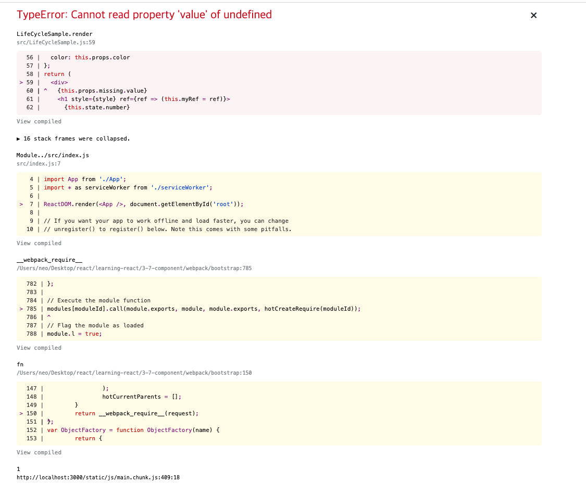

### 7장 컴포넌트의 라이프사이클 메서드

모든 리액트 컴포넌트에는 라이프사이클(수명 주기)이 존재합니다. 컴포넌트의 수명은 페이제 렌더링되기 전인 준비 과정에서 시작하여 페이지에서 사라질 때 끝납니다. 리액트 프로젝트를 진행하다 보면 가끔 컴포넌트를 **처음으로 렌더링할 때** 어떤 작업을 처리해야 하거나 **컴포넌트를 업데이트하기 전후로** 어떤 작업을 처리해야 할 수도 있고, 불필요한 업데이트를 방지해야 할 수도 있습니다.

이 때는 컴포넌트의 라이프사이클메서드를 사용합니다. 참고로 라이프사이클 메서드는 클래스형 컴포넌트에서만 사용할 수 있습니다. 함수형 컴포넌트에서는 대신에 Hook 기능을 사용하여 비슷한 작업을 처리할 수 있습니다.

# 7.1 라이프 사이클의 메서드의 이해

라이프 사이클의 메서듸 종류는 총 9가지입니다.  Will 접두사가 붙은 메서드는 어떤 작업을 작동하기 **전**에 실행되는 메서드이고, Did 접두사가 붙은 메서드는 어떤 작업을 작동한 **후** 에 실행 되는 메서드 입니다.


**마운트**

DOM이 생성되고 웹 브라우저에 나타나는 것을 마운트(mount)라고 합니다. 때 호출되는 메서드는 다음과 같습니다.

- 마운트 작동순서

컴포넌트 만들기

constructor : 컴포넌트를 새로 만들 때마다 호출되는 클래스 생성자 메서드

getDerivedStateFromProps : props에 있는 값을 state에 넣을때 사용하는 메서드

render : 우리가 준비한 UI를 렌더링 하는 메서드

componentDidMount : 컴포넌트가 웹브라우저상에 나타난(마운트 한) 후 호출하는 메서드


**업데이트**

컴포넌트는 다음과 같은 경우에 업데이트합니다. 

- props가 바뀔때
- state가 바뀔 때
- 부모 컴포넌트가 리렌더링 될때
- this.forceUpdate로 강제로 렌더링을 trigger할 때


getDerivedStateFromProps :  이 메서드는 마운트 과정에서도 호출되며 업데이트가 시작되기 전에도 호출됩니다. props의 변화에 따라 state 값에더 변화를 주고 싶을 때 사용합니다. 

shouldComponentUpdate : 컴포넌트가 리렌더링을 해야 할지 말아야 할지를 결정하는 메서드입니다. 이 메서드에서는 true혹은 false 값을 반환해야 하며, true를 반환하면 다음 라이프사이클 메서드를 계속 진행하고, false를 반환하면 중지합니다. 즉 리렌더링이 되지 않습니다. 만약 특정함수에서 this.forceUpdate()함수를 호출한다면 이 과정을 생략하고 render 함수를 호출합니다. 

render : 컴포넌트를 리렌더링합니다.

getSnapshotBeforeUpdate : 컴포넌트 변화를 DOM에 반영하기 바로 직전에 호출하는 메소드 입니다. (렌더링 한 다음 DOM에 변화를 주는거야?) (렌더링 하는 동안 수동으로 스크롤 위치를 유지할 때와 같은 경우에 유용할 수 있다.) 기존에 componentWillUpdate 메소드를 대체하는 

componentDidUpate : 컴포넌트의 업데이트 작업이 끝난 후 호출하는 메서드입니다.

**언마운트**

마운트의 반대과정 즉 컴포넌트를 DOM에서 제거하는 것을 언마운트라고 한다.

componentWillUnmount :  컴포넌트가 웹 브라우저상에서 사라지기 전에 호출하는 메서드입니다.


## 7.2 라이프사이클 메서드 살펴보기

### 7.2.1 render()

컴포넌트의 모양새를 정의합니다. 라이프사이클 메서드 중 유일한 필수 메서드이기도 합니다. 이 메서드 안에서 this.props와 this.state에 접근할 수 있으면 리액트 요소를 반환합니다. 요소는 태그나 컴포넌트가 될수도 있지만 null이나 false도 될 수도 있다.(안 보여주고 싶을 때)

이 메서드 안에서 이벤트 설정이 아닌 곳에서 setState를 사용하면 안 되며, 브라우저의 DOM에 접근해서도 안됩니다???

DOM정보를 가져오거나 state에 변화를 줄 때에는 componentDidMount(마운트 끝나고 나서 변화를 주어야 합니다)에서 처리해야 합니다.

### 7.2.2 constructor 메서드

컴포넌트를 만들 때 처음으로 실행됩니다. 초기  state를 설정할 수 있습니다.

### 7.2.3 getDerivedStateFromProps

 props로 받아온 값을 state 값으로 동기화 시키는데 사용하며 마운트와 업데이트 할 때 호출 됩니다.

### 7.2.4 componentDidMount

컴포넌트를 만들고, 첫 렌더링을 다 마친 후 실행합니다. 이 안에서 다른 자바스크립트 라이브러리 또는 프레임 워크의 함수를 호출 하거나 이벤트 등록, setTimeout,setInterval, 네트워크 요청 같은 비동기 작업을 처리하면 됩니다.

### 7.2.5 shouldComponentUpdate

props 또는 state를 변경했을 때 리렌더링을 시작할지 여부를 지정하는 메서드입니다. 이 메서드에서는 반드시  true or false 값을 반환 해야합니다. 컴포넌트를 만들 때 이 메서드를 따로 생성(설정)하지 않으면 기본적으로 true를 반환합니다. 이 메서드가 false 값을 반환한다면 업데이트 과정은 여기서 중지됩니다.

이 메서드 안에서 현재 props와 state는 this.props와 this.state로 접근하고 새로 설정될 속성과 상태는 nextProps , nextState로 접근합니다. 프로젝트 성능을 최적화하기위하여 리렌더링이 불필요로 할때는 false값을 반환하도록 만들어 합니다.

### 7.2.6 getSnapshotBeforeUpdate

render에서 만들어진 결과물이 브라우저에서 실제로 반응되기 직전에 호출됩니다. 이 메서드에서 반환하는 값은 componentDidUpdate의 세번째 파라미터로  전달합니다. 주로 업데이트하기 직전의 값을 참고할 일이 있을 때 활용됩니다.(예를 들어 스크롤바의 위치)

### 7.2.7 componentDidUpdate

리렌더링을 완료한 후 실행합니다. 업데이트가 끝난 직후로 , DOM 관련 처리를 해도 무방합니다. 여기서 prevProps, prevState를 사용하여 업데이트 전의 컴포넌트의 데이터에 접근할 수 있습니다. 또 getSnapshotBeforeUpdate에서 반환한 값이 있다면 여기서 snapshot 값을 전달받을 수 있습니다.

### 7.2.8 componentWillUnmount

컴포넌트를 DOM에서 제거할 때 실행합니다. componentDidMount에서 등록한 이벤트,타이머를 여기서 제거 작업을 해야 합니다.

### 7.2.9 componentDidCatch

컴포넌트 렌더린 도중에 에러가 발생했을 때 애플리케이션이 먹통이 되지 않고 오류 UI를 보여 줄 수 있게 해 줍니다. 

```jsx
componentDidCatch(error,info){
  this.setState({error : true})
  console.log({error,info})
}
```

error는 어떤 에러가 발생했는지 ,  info는 어디에 있는 코드에서 오류가 발생했는지에 대한 정보를 담아줍니다.

 실제로 사용할 때 오류가 발생하면 서버  API를 호출하여 따로 에러를 수집할 수 있습니다. 하지만 이 메서드는 컴포넌트 자신에게 발생하는 에러를 잡아낼 수 없고 this.props.children으로 전달되는 컴포넌트에서 발생되는 에러만 잡아낼 수 있다는 점을 알아두어야 합니다. 이 메서드는 7.3.3 절에서 알아 보겠습니다.

## 7.3  라이프사이클 메서드 사용하기

### 7.3.1-2 예제 컴포넌트

LifeCycleSample.js

```jsx
import React, { Component } from 'react';

class LifeCycleSample extends Component {
  state = { number: 0, color: null };
  myRef = null; // ref를 설정할 부분

  constructor(props) {
    super(props);
    console.log('constructor');
  }

  // 받아온 속성중에 색깔이 다르면 업데이트, 같다면 반환하지 않음 , 동기화
  static getDerivedStateFromProps(nextProps, prevState) {
    console.log('getDerivedStateFromProps');
    if (nextProps.color !== prevState.color) {
      return { color: nextProps.color };
    }
    return null;
  }
  componentDidMount() {
    console.log('componentDidMount');
  }

  shouldComponentUpdate(nextProps, nextState) {
    console.log('shouldComponentUpdate', nextProps, nextState);
    // 끝 자리 수가 4로 끝나지 않는다면 리렌더링을 하지 않음 (4일때만 거짓 반환)
    return nextState.number % 10 !== 4;
  }

  componentWillUnmount() {
    console.log('componentWillUnmount');
  }

  handleClick = () => {
    this.setState({ number: this.state.number + 1 });
  };

  getSnapshotBeforeUpdate(prevProps, prevState) {
    console.log('getSnapshotBeforeUpdate');
    // 이전 속성의 칼라와 현재와 다르다면 myRef.style.color를 반환
    if (prevProps.color !== this.props.color) {
      return this.myRef.style.color;
    }
    return null;
  }
  componentDidUpdate(prevProps, prevState, snapshot) {
    console.log('componentDidUpdate');
    if (snapshot) {
      console.log('업데이트되기 직전 생상', snapshot);
    }
  }
  render() {
    console.log('render');
    const style = {
      color: this.props.color
    };
    return (
      <div>
        <h1 style={style} ref={ref => (this.myRef = ref)}>
          {this.state.number}
        </h1>
        <p>color : {this.state.color}</p>
        <button onClick={this.handleClick}>더하기</button>
      </div>
    );
  }
}

export default LifeCycleSample;

```

App.js

```jsx
import React, { Component } from 'react';
import LifeCycleSample from './LifeCycleSample';

function getRandomColor() {
  return '#' + Math.floor(Math.random() * 16777215).toString(16);
}

class App extends Component {
  state = {
    color: '#000000'
  };
  handleClick = () => {
    this.setState({
      color: getRandomColor()
    });
  };
  render() {
    return (
      <div>
        <button onClick={this.handleClick}>랜덤 색상</button>
        <LifeCycleSample color={this.state.color} />;
      </div>
    );
  }
}

export default App;

```

### 7.3.3 에러잡아내기

render에서 의도적으로 에러를 발생시켜 보겠습니다. 주로 존재하지 않는 함수를 사용하거나, 존재하지 않는 객체의 값을 조회하려고 할 때 발생합니다.

LifeCycleSample.js

```jsx
  render() {
    console.log('render');
    const style = {
      color: this.props.color
    };
    return (
      <div>
        {this.props.missing.value}
        <h1 style={style} ref={ref => (this.myRef = ref)}>
          {this.state.number}
        </h1>
        <p>color : {this.state.color}</p>
        <button onClick={this.handleClick}>더하기</button>
      </div>
    );
  }
```



개발 서버를 실행 중이기 때문에 에러를 잡아준다. 하지만 만약 사용자가 웹 서비스를 실제로 이용할 때 이렇게 빈 화면만 나타나면 어리둥절할 것입니다. 이럴 땐 어떤 에러가 발생했다고 사용자에게 인지시켜 주어야합니다.


ErrorBoundary.js

```JSX
import React, { Component } from 'react';

class ErrorBoundary extends Component {
  state = {
    error: false
  };
  componentDidCatch(error, info) {
    this.setState({ error: true });
    console.log({ error, info });
  }
  render() {
    if (this.state.error) return <div>에러가 발생 했습니다.</div>;

    return this.props.children;
  }
}

export default ErrorBoundary;

```

App.js

```jsx
import React, { Component } from 'react';
import LifeCycleSample from './LifeCycleSample';
import ErrorBoundary from './ErrorBoundary';

function getRandomColor() {
  return '#' + Math.floor(Math.random() * 16777215).toString(16);
}

class App extends Component {
  state = {
    color: '#000000'
  };
  handleClick = () => {
    this.setState({
      color: getRandomColor()
    });
  };
  render() {
    return (
      <div>
        <button onClick={this.handleClick}>랜덤 색상</button>
        <ErrorBoundary>
          <LifeCycleSample color={this.state.color} />;
        </ErrorBoundary>
      </div>
    );
  }
}

export default App;
```


위의 에러가 보일 겁니다.

## 7.4 정리

라이프 사이클메서드는 컴포넌트의 상태에 변화가 있을 때 실행하는 메서드 입니다. 라이프사이클 메서드는 서드파티 라이브러리를 이용하거나 DOM을 직접 건드려야 할 때 사용합니다.

컴포넌트 업데이트의 성능을  개선할 때에는 shouldComponentUpdate가 중요합니다.


# 8장  Hooks

## 8.1 useState

함수형 컴포넌트에서 상태 관리 합니다.

Counter.js

```jsx
import React, { useState } from 'react';

const Counter = () => {
  const [value, setValue] = useState(0);

  return (
    <div>
      <p>
        현재 카운터의 값은 <b>{value}</b>입니다.
      </p>
      <button onClick={() => setValue(value + 1)}>더하기</button>
      <button onClick={() => setValue(value - 1)}>빼기</button>
    </div>
  );
};

export default Counter;

```


8.1.1 useState를 여러 번 사용하기

Info.js

```jsx
import React, { useState } from 'react';

const Info = () => {
  const [name, setName] = useState('');
  const [nickname, setNickname] = useState('');

  const onChangeName = e => {
    setName(e.target.value);
  };
  const onChangeNickname = e => {
    setNickname(e.target.value);
  };
  return (
    <div>
      <input value={name} onChange={onChangeName} />{' '}
      <input value={nickname} onChange={onChangeNickname} />
      <div>
        <b>이름 :</b>
        {name}
      </div>
      <div>
        <b>닉네임 :</b>
        {nickname}
      </div>
    </div>
  );
};

export default Info;

```

# 8.2 useEffect

useEffect는 리액트 컴포넌트가 렌더링 될 때마다 특정 작업을 수행하도록 설정할 수 있는 Hook입니다. 클래스형 컴포넌트의 componentDidMount와 componentDidUpdate를 합친 형태로 보아도 무방합니다.

렌더링이 끝난 후 할 수 있는 작업을 설정하면 됩니다.

```jsx
import React, { useState, useEffect } from 'react';

const Info = () => {
  const [name, setName] = useState('');
  const [nickname, setNickname] = useState('');

  useEffect(() => {
    console.log('렌더링이 완료 되었습니다.');
    console.log({ name, nickname });
  });
  const onChangeName = e => {
    setName(e.target.value);
  };
  const onChangeNickname = e => {
    setNickname(e.target.value);
  };
  return (
    <div>
      <input value={name} onChange={onChangeName} />{' '}
      <input value={nickname} onChange={onChangeNickname} />
      <div>
        <b>이름 :</b>
        {name}
      </div>
      <div>
        <b>닉네임 :</b>
        {nickname}
      </div>
    </div>
  );
};

export default Info;

```

### 8.2.1 마운트 될 때만 실행하고 싶을 때

```jsx
// useEffect두번째 파라미터에 빈 배열을 제공합니다.
  useEffect(() => {
    console.log('마운트 될 때만 실행 됩니다.');
  }, []);
```

### 8.2.2 특정 값 업데이트될 때만 실행하고 싶을 때

```jsx
  useEffect(() => {
    console.log(name);
  }, [name]);
```

### 8.2.3 뒷정리하기

useEffect는 기본적으로 렌더링되고 난 직후부터 실행되며 , 두번째 파라미터 배열에 무엇을 넣는지에 따라 실행조건이 달라지게 됩니다.

컴포넌트가 언마운트되기 전이나 업데이트 되기 직전에 어떠한 작업을 수행하고 싶다면 useEffect에서 뒷정리(clean up)함수를 반환해 주어야 합니다.

```jsx

  useEffect(() => {
    console.log('effet');
    console.log(name);
    return () => {
      console.log('cleanup');
      console.log(name);
    };
  });
```

App.js

```jsx
import React, { useState } from 'react';
import Info from './Info';

const App = () => {
  const [visible, setVisible] = useState(false);

  const onClick = () => {
    setVisible(!visible);
  };
  return (
    <div>
      <button onClick={onClick}> {visible ? '숨기기' : '보이기'}</button>
      <hr />
      {visible && <Info />}
    </div>
  );
};

export default App;

```

App에서 Info를 안 보이게 하면 언마운트입니다.


 언마운트 될 때만 뒷정리 함수를 실행하고 싶다면 두번째 파라마티어에 비어 있는 배열을 넣으면 됩니다. [] 

```jsx
  useEffect(() => {
    console.log('effet');
    console.log(name);
    return () => {
      console.log('cleanup');
      console.log(name);
    };
  }, []);
```

## 8.3 useReducer

리듀선는 현재 상태, 업데이트를 위해 필요한 정보를 담은 액션값을 전달 받아 새로운 상태로 반환하는 함수 입니다. 리덕스에서는 type 필드가 꼭 필요하지만 useReducer에서 사용하는 액션객체는 반드시 type을 지니고 있을 필요는 없습니다.

### 8.3.1 카운터 구현하기

useReducer의 첫 번째 파라미터에는 리듀서 함수를 넣고 두번째 파라미터에는 해당 파라미터에는 리듀서의 기본 값을 넣어 줍니다.이 Hook을 사용하면 state 값과 dispatch 함수를 반환 받는데, 여기서 state는 현재 가리키고 있는 상태고, dispatch는 액션을 발생시키는 함수 입니다. dispatch(action type) 과 같은 형태로 함수 안에 파라미터로 액션 타입값을 넣어 주면 리듀서 함수가 호출 되는 구조 입니다.

useReducer를 사용했을 때 가장 큰 장점은 컴포넌트 업데이트 로직을 컴포넌트 밖으로 빼낼 수 있다는 것입니다.

Counter.js

```jsx
import React, { useReducer } from 'react';

function reduecer(state, action) {
  switch (action.type) {
    case 'INCREMENT':
      return { value: state.value + 1 };
    case 'DECREMENT':
      return { value: state.value - 1 };
    default:
      return state;
  }
}
const Counter = () => {
  const initialState = { value: 0 };

  const [state, dispatch] = useReducer(reduecer, initialState);
  return (
    <div>
      <p>
        현재 카운터의 값은 <b>{state.value}</b>입니다.
      </p>
      <button onClick={() => dispatch({ type: 'INCREMENT' })}>더하기</button>
      <button onClick={() => dispatch({ type: 'DECREMENT' })}>빼기</button>
    </div>
  );
};

export default Counter;

```

### 8.3.2 인풋 상태 구현하기

기존에는 인풋이 여러개여서 useState를 여러번 사용 했는데, useReducer를 사용하면 기존에는 클래스형 컴포넌트에서 input 태그에 name을 할당하고 e.target.name을 참조하여  setState를 해 준 것과 유사한 방식으로 작업을 처리할 수 있습니다.

Info.js

```jsx
import React, { useState, useEffect, useReducer } from 'react';

function reducer(state, action) {
  return { ...state, [action.name]: action.value };
}
const Info = () => {
  const [state, dispatch] = useReducer(reducer, { name: '', nickname: '' });

  const { name, nickname } = state;

  const onChange = e => {
    dispatch(e.target);
  };
  return (
    <div>
      <input value={name} name="name" onChange={onChange} />
      <input value={nickname} name="nickname" onChange={onChange} />
      <div>
        <b>이름 :</b>
        {name}
      </div>
      <div>
        <b>닉네임 :</b>
        {nickname}
      </div>
    </div>
  );
};

export default Info;

```

## 8.4 useMemo

평균을 계산해 보여주는 컴포넌트를 작성

Average.js

```jsx
import React, { useState } from 'react';

const getAverage = numbers => {
  console.log('평균 계산 중...');
  if (numbers.length === 0) return 0;

  const sum = numbers.reduce((a, b) => a + b);
  return sum / numbers.length;
};

const Average = () => {
  const [list, setList] = useState([]);
  const [number, setNumber] = useState('');

  const onChange = e => {
    setNumber(e.target.value);
  };

  const onInsert = () => {
    const newList = list.concat(parseInt(number));
    setList(newList);
    setNumber('');
  };

  return (
    <div>
      <input value={number} onChange={onChange} />
      <button onClick={onInsert}>등록</button>
      <ul>
        {list.map((number, index) => (
          <li key={index}>{number}</li>
        ))}
      </ul>
      <div>
        <b>평균값 :</b>
        {getAverage(list)}
      </div>
    </div>
  );
};

export default Average;

```


인풋의 내용이 바뀌어도 평균을 다시 계산하는데 이것은 불필요한 행동이다. useMemo를 이용하여 상태값 중 list의 변화가 있을 시에 함수를 호출하도록 합니다.

Average.js

```jsx
import React, { useState, useMemo } from 'react';

const getAverage = numbers => {
  console.log('평균 계산 중...');
  if (numbers.length === 0) return 0;

  const sum = numbers.reduce((a, b) => a + b);
  return sum / numbers.length;
};

const Average = () => {
  const [list, setList] = useState([]);
  const [number, setNumber] = useState('');

  const onChange = e => {
    setNumber(e.target.value);
  };

  const onInsert = () => {
    const newList = list.concat(parseInt(number));
    setList(newList);
    setNumber('');
  };

  const avg = useMemo(() => getAverage(list), [list]);

  return (
    <div>
      <input value={number} onChange={onChange} />
      <button onClick={onInsert}>등록</button>
      <ul>
        {list.map((number, index) => (
          <li key={index}>{number}</li>
        ))}
      </ul>
      <div>
        <b>평균값 :</b>
        {avg}
      </div>
    </div>
  );
};

export default Average;

```

## 8.5 useCallback

이벤트를 선언할 때 컴포넌트가 리렌더링 될 때마다 이 함수들이 새로 생성됩니다. 대부분의 경우 이러한 방식은 문제없지만, 컴포넌트가 복잡해지면 최적화 해주는 것이 좋습니다.

Average.js

```jsx
import React, { useState, useMemo, useCallback } from 'react';

const getAverage = numbers => {
  console.log('평균 계산 중...');
  if (numbers.length === 0) return 0;

  const sum = numbers.reduce((a, b) => a + b);
  return sum / numbers.length;
};

const Average = () => {
  const [list, setList] = useState([]);
  const [number, setNumber] = useState('');

  const onChange = useCallback(e => {
    console.log('input change');
    setNumber(e.target.value); 
  }, []); // 첫 렌더링 때만 함수 생성
  const onInsert = useCallback(() => {
    console.log('list change');
    const newList = list.concat(parseInt(number));
    setList(newList);
    setNumber('');
  }, [list, number]); // list 또는 number가 바뀌었을 때만 함수 생성

  const avg = useMemo(() => getAverage(list), [list]);

  return (
    <div>
      <input value={number} onChange={onChange} />
      <button onClick={onInsert}>등록</button>
      <ul>
        {list.map((number, index) => (
          <li key={index}>{number}</li>
        ))}
      </ul>
      <div>
        <b>평균값 :</b>
        {avg}
      </div>
    </div>
  );
};

export default Average;

```

리렌더링을 하는 방법을 몰라서 => 확인하지 못하였다.

함수 내부에서 상태값에 의존해야 할 때는 그 값을 반드시 두 번째 파라미터 안에 포함시켜주어야 합니다. 예를 들어 onChange는 아무런 상태값을 참조하지 않기 때문에 빈 배열을 사용해도 상관 없지만 onInsert는 기존의 number와 list를 조회해서 newList를 생성하기 때문에 배열안에 number와 list를 꼭 넣어 주셔야 합니다.
useMemo은 숫자, 문자열, 객체처럼 일반 값을 재사용 할때에, useCallback은 함수를 재사용할 때 사용하세요.

```jsx
useCallback(()=>{
  console.log('hello react');
},[])
useMemo(()=>{
  const fn = () => {
    console.log('hello react');
  }
  return fn;
},[])
```

## 8.6 useRef

등록 버튼을 눌렀을 때 포커스가 인풋 쪽으로 넘어가도록 설정하겠습니다.

```jsx
import React, { useState, useMemo, useCallback, useRef } from 'react';

const getAverage = numbers => {
  console.log('평균 계산 중...');
  if (numbers.length === 0) return 0;

  const sum = numbers.reduce((a, b) => a + b);
  return sum / numbers.length;
};

const Average = () => {
  const [list, setList] = useState([]);
  const [number, setNumber] = useState('');
  const ref = useRef(null);

  const onChange = useCallback(e => {
    console.log('input change');
    setNumber(e.target.value);
  }, []); // 첫 렌더링 때만 함수 생성
  const onInsert = useCallback(() => {
    console.log('list change');
    const newList = list.concat(parseInt(number));
    setList(newList);
    setNumber('');
    ref.current.focus();
  }, [list, number]); // list 또는 number가 바뀌었을 때만 함수 생성

  const avg = useMemo(() => getAverage(list), [list]);

  return (
    <div>
      <input value={number} onChange={onChange} ref={ref} />
      <button onClick={onInsert}>등록</button>
      <ul>
        {list.map((number, index) => (
          <li key={index}>{number}</li>
        ))}
      </ul>
      <div>
        <b>평균값 :</b>
        {avg}
      </div>
    </div>
  );
};

export default Average;

```

useRef를 사용하여 ref를 설정하면 useRef를 통해 만든 객체(ref) 안의 current 값이 실제 엘리먼트를 가리킵니다.

지금 onInsert 함수 내의 ref.current가 결국 input element를 가르키는 것입니다.

### 8.6.1 로컬 변수 사용하기

추가로 컴포넌트 로컬 변수를 사용해야 할 때도 useRef를 활용할 수 있습니다. 여기서 로컬 변수란 렌더링과 상관없이 바뀔 수 있는 값을 의미합니다. 클래스 형태로 작성된 컴포넌트의 경우에는 로컬 변수를 사용해야 할 때 다음과 같이 사용 할 수 있습니다.

```jsx
import React, { Component } from 'react';

class MyComponent extends Component {
  id = 1;
  setId = n => {
    this.id = n;
  };
  printId = () => {
    console.log(this.id);
  };
  render() {
    return <div>MyComponent</div>;
  }
}

export default MyComponent;

```

함수형 컴포넌트에서는

```jsx
import React, { useRef } from 'react';

const MyComponent = () => {
  const id = useRef(1);
  const setId = n => {
    id.current = n;
  };
  const printId = () => {
    console.log(id.current);
  };
  return <div>MyComponent</div>;
};

export default MyComponent;

```

ref안의 값이 바뀌어도 컴포넌트가 렌더링되지 않는다는 점에 주의해야 합니다. 렌더링과 관련되지 않은 값을 관리할 때만 이러한 방식으로 코드를 작성하세요.

## 8.7 커스텀 Hooks 만들기

기존의 Info 컴포넌트에서 수정하겠습니다.

useInputs.js

```jsx
import { useReducer } from 'react';

function reducer(state, action) {
  return { ...state, [action.name]: action.value };
}
export default function useInputs(initialForm) {
  const [state, dispatch] = useReducer(reducer, initialForm);
  const onChange = e => {
    dispatch(e.target);
  };
  return [state, onChange];
}

```

Info.js

```jsx
import React from 'react';
import useInputs from './useInputs';

const Info = () => {
  const [state, onChange] = useInputs({ name: '', nickname: '' });

  const { name, nickname } = state;

  return (
    <div>
      <input value={name} name="name" onChange={onChange} />
      <input value={nickname} name="nickname" onChange={onChange} />
      <div>
        <b>이름 :</b>
        {name}
      </div>
      <div>
        <b>닉네임 :</b>
        {nickname}
      </div>
    </div>
  );
};

export default Info;

```

## 8.8 다른 hooks

다른 개발자가 만든 Hooks도 라이브러리로 설치하여 사용할 수 이씃ㅂ니다.

 nikgraf의 react-hooks

rehooks/awesome-react-hooks

## 8.9 정리

메뉴얼에서는 함수형 컴포넌트 추천, 클래스형도 지원함


# 9장 컴포넌트 스타일링

- 일반 CSS 
- Sass : 자주 사용되는  CSS(pre-processor) 중 하나로 확장된 CSS 문법을 사용하여 CSS 코드를 더욱 쉽게 작성할 수 있도록 해 줍니다.
- CSS Module : css 클래스가 다른 css 클래스의 이름과 절대 충돌하지 않도록 파일마다 고유한 이름을 자동으로 생성해 주는 옵션입니다.
- styled-components : 스타일을 자바스크립트 파일에 내장시키는 방식으로 스타일을 작성함과 동시에 해당 스타일이 적용된 컴포넌트를 만들 수 있게 해줍니다.


## 9.1 가장 흔한 방식, 일반 CSS

App.js 와 App.css

CSS를 작성할 때 가장 중요한 점은  CSS 클래스를 중복되지 않게 만드는 것입니다.  CSS 클래스가 중복되는 것을 방지하는 여러 가지 방식이 있는데, 그중 하나는 이름을 지을 때 특별한 규칙을 사용 하거나 또는 CSS Selector를 활용 하는 것입니다.

App.js

```jsx
import React from 'react';
import logo from './logo.svg';
import './App.css';

function App() {
  return (
    <div className="App">
      <header className="App-header">
        
        <p>
          Edit <code>src/App.js</code> and save to reload.
        </p>
        <a
          className="App-link"
          href="https://reactjs.org"
          target="_blank"
          rel="noopener noreferrer"
        >
          Learn React
        </a>
      </header>
    </div>
  );
}

export default App;

```

App.css

```css
.App {
  text-align: center;
}

.App-logo {
  height: 40vmin;
  pointer-events: none;
}

@media (prefers-reduced-motion: no-preference) {
  .App-logo {
    animation: App-logo-spin infinite 20s linear;
  }
}

.App-header {
  background-color: #282c34;
  min-height: 100vh;
  display: flex;
  flex-direction: column;
  align-items: center;
  justify-content: center;
  font-size: calc(10px + 2vmin);
  color: white;
}

.App-link {
  color: #61dafb;
}

@keyframes App-logo-spin {
  from {
    transform: rotate(0deg);
  }
  to {
    transform: rotate(360deg);
  }
}

```

### 9.1.2 CSS Selector

App.css

```css
.App {
  text-align: center;
}

/* classname="App" 내부의 className="logo" 가르키는 태그 */
.App .logo {
  height: 40vmin;
  pointer-events: none;
}


/* className="App" 내부의 header 태그 */
.App header {
  background-color: #282c34;
  min-height: 100vh;
  display: flex;
  flex-direction: column;
  align-items: center;
  justify-content: center;
  font-size: calc(10px + 2vmin);
  color: white;
}
/* App 안의 a 태그 */
.App a{
  color: #61dafb;
}

@keyframes App-logo-spin {
  from {
    transform: rotate(0deg);
  }
  to {
    transform: rotate(360deg);
  }
}

```

App.js

```jsx
import React from 'react';
import logo from './logo.svg';
import './App.css';

function App() {
  return (
    <div className="App">
      <header>
        
        <p>
          Edit <code>src/App.js</code> and save to reload.
        </p>
        <a href="https://reactjs.org" target="_blank" rel="noopener noreferrer">
          Learn React
        </a>
      </header>
    </div>
  );
}

export default App;

```

## 9.2 Sass 사용하기

 Sass는 CSS 전처리기로 복잡한 작업을 쉽게 하고 스타일 코드의 재활용성을 높여 줄 뿐만 아니라 코드의 가독성을 높여서 유지 보수를 더욱 쉽게 해 줍니다. sass와 scss를 지원홥니다.

.sass

```
$font-stack : Helvetica,sans-serif;
$primary-color : #333;
body
	font : 100% $font-stack
	color : $primary-color
```

.scss

```scss
$font-stack : Helvetica,sans-serif;
$primary-color : #333;

body{
  font : 100% $font-stack;
  color : $primary-color;
}
```


scss 문법이 css에 가깝다.

```
yarn add node-sass
```


SassComponent.scss

```scss
$red: #fa5252;
$oragne: #fd7e14;
$yellow: #ccbb33;
$green: #69d025;
$blue: #12bdb9;
$indigo: #3311bb;
$violet: #442299;
// 믹스인 (함수)만들기
@mixin square($size) {
  $calculated: 32px * $size;
  width: $calculated;
  height: $calculated;
}

.SassComponent {
  display: flex;
  .box {
    cursor: pointer;
    transition: all 0.3s ease-in;

    &:hover {
      background: black;
    }
  }
  .red {
    @include square(1);
    background: $red;
  }
  .orange {
    @include square(2);
    background: $oragne;
  }
  .yellow {
    @include square(3);
    background: $yellow;
  }
  .green {
    @include square(4);
    background: $green;
  }
  .blue {
    @include square(5);
    background: $blue;
  }
  .indigo {
    @include square(6);
    background: $indigo;
  }
  .violet {
    @include square(7);
    background: $violet;
  }
}

```


SassComponent.js

```jsx
import React from 'react';
import './SassComponent.scss';
const SassComponent = () => {
  return (
    <div className="SassComponent">
      <div className="box red" />
      <div className="box orange" />
      <div className="box yellow" />
      <div className="box green" />
      <div className="box blue" />
      <div className="box indigo" />
      <div className="box violet" />
    </div>
  );
};

export default SassComponent;

```

### 9.2.1 utils 함수 분리하기

여러 파일에서 사용될 수 있는 Sass 변수 및 믹스인은 다른 파일로 따로 분리하여 작성한 뒤 필요한 곳에서 불러와 사용할 수 있습니다.  따로 빼서 고쳐보겠습니다.

styles/utils.scss

```scss
$red: #fa5252;
$oragne: #fd7e14;
$yellow: #ccbb33;
$green: #69d025;
$blue: #12bdb9;
$indigo: #3311bb;
$violet: #442299;

@mixin square($size) {
  $calculated: 32px * $size;
  width: $calculated;
  height: $calculated;
}

```

SassComponent.scss

```scss
@import './styles/utils.scss';
.SassComponent {
  display: flex;
  .box {
    cursor: pointer;
    transition: all 0.3s ease-in;

    &:hover {
      background: black;
    }
  }
  .red {
    @include square(1);
    background: $red;
  }
  .orange {
    @include square(2);
    background: $oragne;
  }
  .yellow {
    @include square(3);
    background: $yellow;
  }
  .green {
    @include square(4);
    background: $green;
  }
  .blue {
    @include square(5);
    background: $blue;
  }
  .indigo {
    @include square(6);
    background: $indigo;
  }
  .violet {
    @include square(7);
    background: $violet;
  }
}

```


### 9.2.2 sasss-loader 설정 커스터마이징

Sass를 사용할 때 반드시 해야 하는 것은 아니지만 유용합니다.

프로젝트가 복잡해져서 디렉터리의 구조가 깊어졌다면(예src/components/somowhere/this.scsss) 상위 폴더로 한참 거슬러 올라가야 한다는 단점이 있습니다.

`@import '../../../styles/utils'`

웹팩에서 sass-loader를 커스터마이징 하여 해결할 수 있습니다.


```
git add .
git commit -m "before yarn eject"
yarn eject
```

config/webpack.config.js

```js
{
              test: sassRegex,
              exclude: sassModuleRegex,
              use: getStyleLoaders({
                importLoaders: 3,
                sourceMap: isEnvProduction && shouldUseSourceMap
              }).concat({
                loader: require.resolve('sass-loader'),
                options: {
                  sassOptions: { includePaths: [paths.appSrc + '/styles'] }, // src/styles
                  sourceMap: isEnvProduction && shouldUseSourceMap
                }
              }),
```

책과 달라짐

`@import 'utils.scss'` 라는 코드(경로 필요없이)로 찾아올 수 있게 됨

미리 넣어놓기 위해서는 options의 속성에 data를 `@import 'untils.scss'` 를 미리 설정하면 됩니다.

```js
  {
              test: sassRegex,
              exclude: sassModuleRegex,
              use: getStyleLoaders({
                importLoaders: 3,
                sourceMap: isEnvProduction && shouldUseSourceMap
              }).concat({
                loader: require.resolve('sass-loader'),
                options: {
                  sassOptions: { includePaths: [paths.appSrc + '/styles'] }, // src/styles
                  sourceMap: isEnvProduction && shouldUseSourceMap,
                  prependData: `@import 'utils';`
                }
              }),
              // Don't consider CSS imports dead code even if the
              // containing package claims to have no side effects.
              // Remove this when webpack adds a warning or an error for this.
              // See https://github.com/webpack/webpack/issues/6571
              sideEffects: true
            },
```

### 9.2.3 node_moduels에서 라이브러리 불러오기

`@import './../../node_modules/library/styles'`. 에서 물결사용하면

`@import '~library/styles'`

연습 삼아 유용한 Sass 라이브러리 두 개 반응형 디자인을 위한 include-media , 편리한 색상 팔레트인 open-color

```
yarn add open-color include-media
```

utils.scss

```scss
@import '~open-color/open-color';
@import '~include-media/dist/include-media';
...
```

SassComponent.scss

```scss
.SassComponent {
  display: flex;
  background: $oc-gray-2;
  @include media('<768px') {
    background: $oc-gray-9;
  }
...

```


## 9.3 CSS Module

CSS Module은  CSS를 불러와서 사용할 때 클래스 이름을 고유한 값, 즉 [파일이름]\_[클래스 이름]\_[해시값]\_ 형태로 자동으로 만들어 클래스 이름이 중첩되는 현상을 방지해 주는 기술입니다.

CSSModule.module.css

```css
/* 자동으로 고유해 질 것이므로 아무 이름을 서도 됩니다. */
.wrapper {
  background: black;
  color: white;
  padding: 1rem;
  font-size: 2rem;
}
/* 글로벌 css를 작성하고 싶다면 */
:global .something {
  font-weight: 800;
  color: aqua;
}

.inverted {
  color: black;
  background: white;
  border: 1px solid black;
}

```

CSSModule.js

```jsx
import React from 'react';
import styles from './CSSModule.module.css';
const CSSModule = () => {
  return (
    <div className={`${styles.wrapper} ${styles.inverted}`}>
      안녕하세요, 저는 <span className="something">Css module!</span>
    </div>
  );
};

export default CSSModule;

```

CSS Module이 적용된 스타일 파일을 불러오면 객체를 하나 전달받게 되는데 CSS Module에서 사용한 클래스 이름과 해당 이름을 고유화한 값이 키 - 값 형태로 들어 있습니다.예를 들어 console.log(styles)를 한다면

{wrapper : "CSSModule_wrapper_1SbdQ"} 이렇게 파일이름_클래스이름\_해쉬값

적용하고 싶다면  styles.[클래스 이름] 형태로 전달 해주면 됩니다.

자바스크립트 레퍼런스를 주입하기 위해 ES6 리터럴 문법을 사용합니다.


### 9.3.1 classnames

조건부로 클래스이름을 설정할 때 유용합니다.

### 9.3.2 Sass와 함께 사용해도 상관없다.

### 9.3.3 CSS Module이 아닌 일반 파일에서 CSS Module 사용하기


무슨말인지 모르겠는데 일반 .css/.scss 파일에서도 :local을 사용하여 CSS Module을 사용할 수 있다.

## 9.4 styled-components

자바스크립트 파일 안에 스타일을 선언하는 방식(CSS-IN-JS)입니다. 이와 관련된 라이브러리가 아주 많습니다. 그중 하나인 styled-components를 사용하겠습니다. 또한 현재 대표적인 라이브러리인emotion은의 사용법은 styled-components가 비슷하다.

`yarn add style-components`

StyledComponent.js

```jsx
import React from 'react';
import styled, { css } from 'styled-components';

const Box = styled.div`
  background: black;
  display: flex;
  padding: 1rem;
`;
const Button = styled.button`
  background: white;
  font-weight: 600;
  padding: 0.5rem;
  color: black;
  border-radius: 4px;
  display: flex;
  font-size: 1rem;
  box-sizing: border-box;
  justify-items: center;
  align-items: center;
  & + & {
    margin-left: 1rem;
  }
  &:hover {
    background: rgba(255, 255, 255, 0.9);
  }
  ${props =>
    props.inverted &&
    css`
      background: none;
      border: 2px solid white;
      color: white;
      &:hover {
        background: white;
        color: black;
      }
    `}
`;

const StyledComponent = () => {
  return (
    <div>
      <Box>
        <Button>안녕하세요</Button>
        <Button inverted={true}>테두리만</Button>
      </Box>
    </div>
  );
};

export default StyledComponent;

```

VS Code의 마켓플레이스에서 vscode-styled-components를 검색하여 설치하면 색상이 정상적으로 입혀집니다.

### 9.4.1 Tagged 템플릿 리터럴

```

```


### 9.4.2 스타일린된 엘리먼트 만들기

예시코드

```
const Mycomponent = styled.div`` //일반적인 태그
const MyInput = stlyed('input')`` // 태그의타입을 함수의 인자로 
const StyledLink = styled(link)``// 특정 컴포넌트
```


### 9.4.3 스타일에서  props 조회하기


```jsx
 ${props =>
    props.inverted &&
    css`
```

inverted가 참이라면 아래와 css 스타일링을 적용합니다.


### 9.4.4 props에 따른 조건부 스타일링


### 9.4.5 반응형 디자인

```jsx
const Box = styled.div`
  background: ${props => props.color || 'blue'};
  display: flex;
  padding: 1rem;

  /* 기본적으로 가로크기 1024px, 가운데 정렬 margin : 0 auto */
  /* 1024px 이상이면 */
  width: 1024px;
  margin: 0 auto;
  /* 1024px 이하 768이상 너비를 768px */
  @media (max-width: 1024px) {
    width: 768px;
  }
  @media (max-width: 768px) {
    width: 100%;
  }
`;
```

styled-components doc에 유틸 함수가 있다는데 없어진것으로 보인다.

useEffect의 언마운트 못한다. 서뻐쪽은 언마운트가 없다

1. 다큐먼트
2. quill 에디터의 
3. 