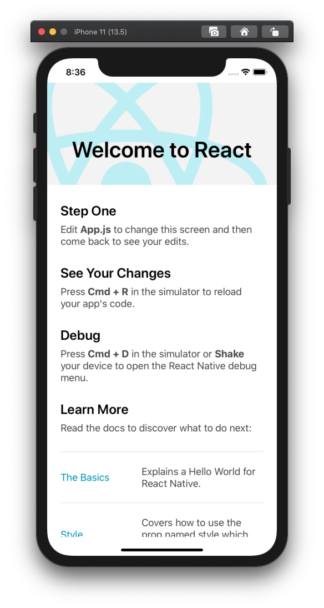
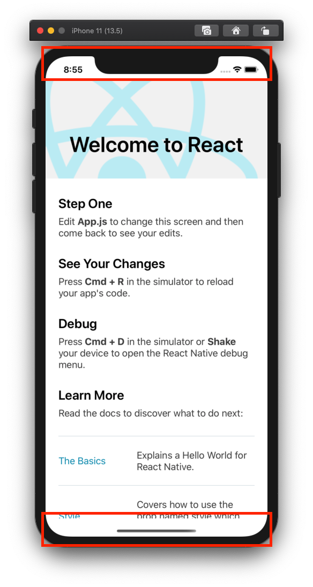
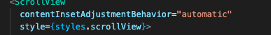
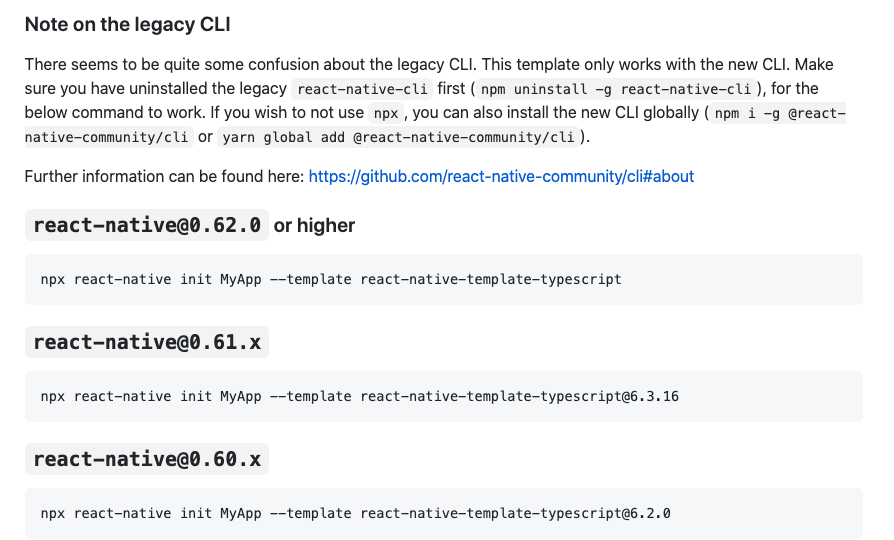
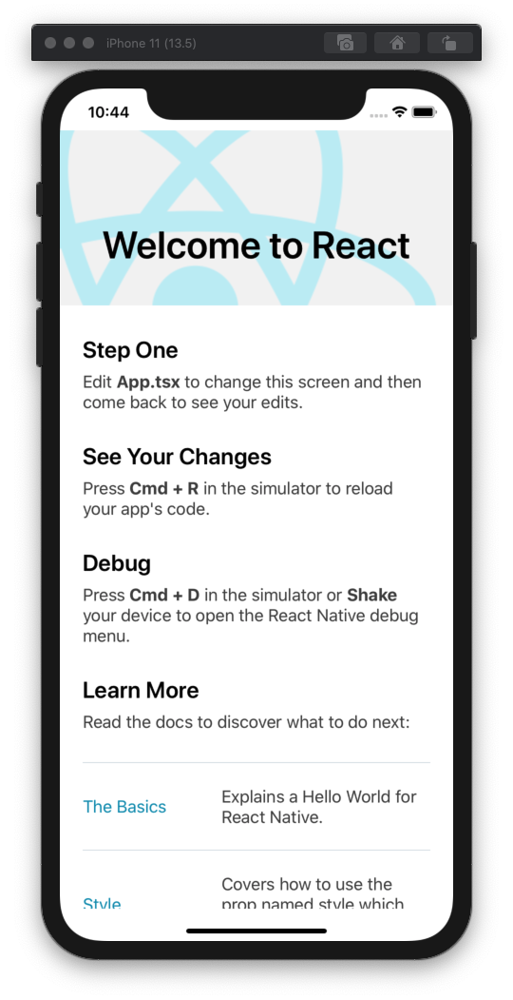
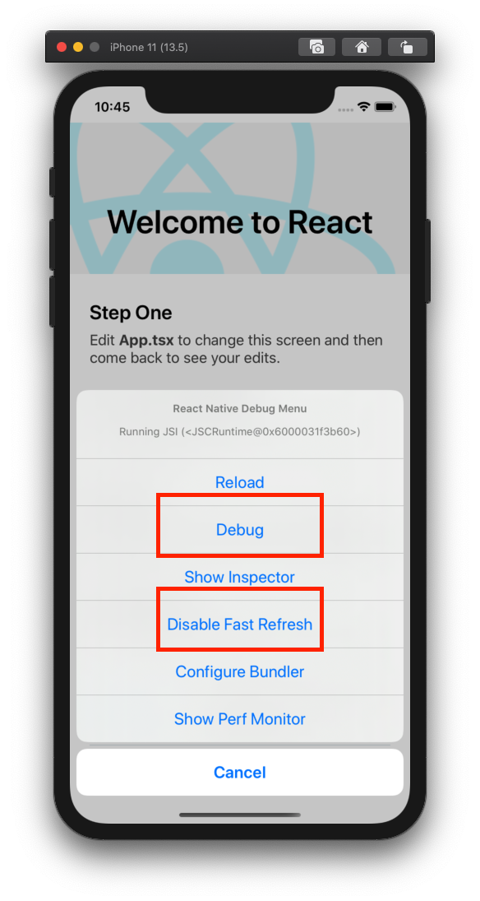

# 3장_FirstApp

## 3.1 나의 첫 리액트 네이티브 앱

리액트 네이티브 CLI 명령어를 통해 리액트 네이티브 앱을 생성해 보고, 그 구조를 파악해 봅니다.

### 3.1.1 리액트 네이티브 프로젝트 생성

리액트 네이티브는 버전이 업데이트될 때, 문제를 일으킬 가능성이 있으므로, 버전을 고정하여 사용하길 바랍니다. 노드패키지매니저를 통해서 버전 고정을 제어하는 명령어는 터미널 또는 cmd에서 아래와 같이 실행합니다

```
$ npm config set save-exact=true
```

리액트 네이티브 생성

```
$ cd desktop
$ mkdir rn
$ cd rn
$ react-native init FirstApp
```

폴더 이동 이후 ios 시뮬레이터 생성

```
$ cd FirstApp
$ npm run ios (ios 에뮬레이터)
$ npm run android (android 에뮬레이터)
```




### 3.1.2 폴더 및 파일 구조

./index.js : 프로젝트의 시작파일 입니다. 이 파일을 시작하여 리액트 네이티브의 자바스크립트 코드가 번들링 됩니다.

./App.js : 위 그림에 표시된 화면의 내용이 들어있습니다.

./andorid.js : 안드로이드 프로젝트가 담겨 있는 폴더입니다.

./android/app/build.gradle : 안드로이드 앱을 빌드, 배포할 때 사용하는 파일입니다.

./android/app/src/main/java/com/firstapp/MainAcitivity : 안드로이드 앱의 메인 파일입니다.

./android/app/src/res/ : 안드로이드 앱의 아이콘 또는 시작 화면(Launch Screen) 등의 리소스를 관리하는 폴더입니다.

./ios : iOS 프로젝트가 담겨있는 폴더입니다.

./ios/FirstApp/AppDelegate.h, AppDelegate.m : iOS 앱의 메인 파일들 입니다.

./ios/FirstApp/Info.plist : iOS 프로젝트의 설정 파일입니다.

./ios/FirstApp.xcworkspace : iOS의 프로젝트를 Xcode로 시작하기 위한 파일 입니다.

ios/FirstApp/Podfile : iOS에서는 코코아포드라는 의존성 관리자(Dependency Manager)를 사용하여 라이브러리를 관리합니다. 오브젝트-C,스위프트에서 npm과 같은 역할을 합니다. npm에서는 package.json를 사용하여 의존성을 관리하듯 코코아포드에서는 Podfile을 이용해서 의존성을 관리합니다.


### 3.1.3 리액트 네이티브 컴포넌트

리액트 네이티브의 구조와 컴포넌트를 이해해봅니다.

index.js

```jsx
import {AppRegistry} from 'react-native';
import App from './App';
import {name as appName} from './app.json';

AppRegistry.registerComponent(appName, () => App);

```

AppRegistry.registerComponent 를 사용하여 네이티브 브릿지에서 사용할 모듈을 지정합니다.

registComponent 함수의 첫번째 매개변수에는 모듈 이름을 지정하고 두 번째 매개변수에는 처음으로 렌더링(화면에 표시될)할 컴포넌트를 지정합니다.

appName은 기본적으로 프로젝트를 생성할때 자동으로 생성 및 연결됩니다.

App.js

```
import React from 'react';
import {
  SafeAreaView,
  StyleSheet,
  ScrollView,
  View,
  Text,
  StatusBar,
} from 'react-native';
```

리액트는 HTML 태그를 사용하지만 리액트 네이티브는 특별한 태그(컴포넌트)를 사용합니다.



SafeAreaView는 View와 달리 아이폰X와 같은 노치 디자인에서 상단에 상태와 하단의 홈 버튼 영역을 제외한 영역에 콘텐츠를 표시할 때 사용하는 컴포넌트입니다. 개발할 앱의 콘셉에 따라 SafeAreaView를 사용할지 View를 사용할지 결정하시면 됩니다.

StyleSheet는 리액트 네이티브의 컴포넌트(태그)에 스타일을 적용할 때 사용합니다. 리액트 네이티브에서는 인라인 스타일과 StyleSheet를 사용하는 방법이 있습니다. 스타이 적용에 관해서는 뒤에서 다시 자세히 다루겠습니다.

ScrollView는 화면 스크롤이 가능한 컴포넌트입니다. 리액트 네이티브에서 화면 스크롤이 가능한 컴포넌트로 FlatList,ScrollView, SectionList 등을 제공하고 있습니다. 스크린 컴포넌트에 관해서는 예제를 통해 더욱 자세히 다루도록 하겠습니다.

리액트 네이티브는 기본적으로 View 컴포넌트를 사용하여 전체적인 레이아웃을 잡습니다. 글자를 쓸 때는 반드시 Text 컴포넌트를 사용해야합니다.

StatusBar는 화면에 표시되는 컴포넌트가 아닙니다. 상단에 있는 상태바를 숨기거나 색깔을 변경하는데 사용합니다.

리액트 네이티브 0.60 버전부터 클래스형 컴포넌트가 아니라 함수형 컴포넌트를 기본으로 사용합니다.

아래와 같이 프로젝트 생성시 버전 명시를 하여 0.6보다 낮은 버전으로 클래스 컴포넌트를 사용할 수는 있습니다. 하지만 이책에서는 표준으로 채택된 함수형 컴포넌트를 사용하겠습니다.


```
$ react-native init -version 0.59.10 FirstApp
```


App.js

```jsx
const App = () => {
  return (
    <>
      <View></View>
      <View></View>
    </>
  );
};
export default App;
```

복수의 컴포넌트를 작성할때는 무조건 <>,</>(fragment)로 감싸 작성해야합니다. 단 ,1개의 컴포넌트만 작성시에는  괜찮습니다



리액트 네이티브이 스타일은 HTML에서 인라인 스타일와 유사한 형태를 띕니다


더 다양한 리액트 네이티브의 컴포넌트를 간략하게 살펴보았습니다. 더 궁금한 부분이 있으면 공식 홈페이지를 참고하세요

https://reactnative.dev/docs/components-and-apis


#### 3.1.4 스타일링

2가지 방법이 있습니다.

- styles 객체를 만들고 할당합니다.(위의 화면)
- 그냥 스타일 객체를 인라인으로 넣는 방법

```jsx
<View style={{background: 'black'}}></View>
```

StyleSheet를 사용하면 이와 같은 반복되는 스타일을 관리할 수 있습니다. 하지만 StyleSheet를 사용하지 않아도 인라인 스타일로도 충분히 스타일링 할 수 있습니다. 변수값을 확인하고 그에 맞게 동적 스타일 적용 가능합니다.

```jsx
<View style={{background:  error ? 'red':'blue'}}></View>
```

리액트 네이티브 컴포넌트에 적용된 스타일은 웹 개발의 CSS와 유사한 문법을 사용합니다.

하지만 리액트 네이티브의 스타일은  스타일 객체(자바스크립트 객체) 이므로 , css에서 사용되는 카멜 표기법을 사용합니다.(myFirstVariable)


## 3.2 추가라이브러리

### 3.2.1 타입스크립트와 VS  Code

책에는 왜 타입스크립트와 VS code가 좋은지 설명되어 있습니다. 하지만 프로젝트 상 문제가 되지 않기 때문에 작성하지 않습니다.

지금 현재 공식문서에서 Typescript를 사용하려면 React-native-cli를 삭제하라고 말합니다. 하지만 책에서는 React-native cli를 사용하여 개발하기 때문에 지금 당장 Typescript를 설정하지 않고 커뮤니티에 질문하고 있습니다.

https://reactnative.dev/docs/typescript

https://github.com/react-native-community/react-native-template-typescript

** 책에서 한 내용 ** 

- 타입스크립트
- VS Code  에디터 설치

```
$ npm install typescript @types/react @types/react-native --save-dev
$ // 기존 프로젝트 파일 삭제
$ react-native init FirstApp --template typescript
```

#### 3.2.1.1 공식 홈페이지

기존에 react-native-cli 삭제 , @react-native-community/cli 설치,

프로젝트 생성(기존 프로젝트 삭제)




```
$ npm uninstall -g react-native-cli
$ npm i -g @react-native-community/cli
$ npx react-native init MyApp --template react-native-template-typescript
```


### 3.2.2 Styled Components

책에서 앞으로 styled-components로 style을 작성하겠습니다라

프로젝트 폴더 내에서 아래의 명령어로 설치합니다.

```
$ npm install --save styled-components
$ npm install --save-dev @types/styled-components
```

책에서 styled-component로 app.tsx를 꾸몄지만 저는 그렇지 않았습니다. 리액트를 다루었던 사람들에게 이미 배운 내용이고 복잡하기도 하였기 때문입니다. 더 자세한 내용이 궁금하다면 [공식홈페이지](https://styled-components.com/)를 참고하세요 

### 3.2.3 절대 경로로 컴포넌트 추가

"babel-plugin-root-import"

리액트 네이티브는 컴포넌트를 추가할 때, 상대 경로를 이용한다. 이러면 import Button from "../../../Button" 이렇게 길어집니다.

그래서 babel-plugin-root-import와 타입스크립트를 설정하면 , 필요한 컴포넌트를 상대경로가 아닌 절대경로로 사용할 수 있습니다.

프로젝트 폴더 내에서 아래의 명령어로 설치하세요.

```
$ npm install --save-dev babel-plugin-root-import
```

 라이브러리가 설치되었다면 babel.config.js를 아래와 같이 수정합니다.

babel.config.js

``` js
module.exports = {
  presets: ['module:metro-react-native-babel-preset'],
  plugins: [
    ['babel-plugin-root-import', {rootPathPrefix: '~', rootPathSuffix: 'src'}],
  ],
};

```

타입스크립트도 설정합니다. 하지만 3.2.1 과 같은 이유로 사용하지 못합니다.

tsconfig.json


이렇게 설정한 다음 src 폴더를 생성하고 App.tsx를 src 폴더로 옮깁니다.


위 그림처럼 코드를 수정합니다.

```
$ npm run ios
```



## 3.3 개발자 메뉴

리액트 네이티브의 개발자 메뉴를 통해 디버깅 하는 방법을 알려드리겠습니다

iOS 시뮬레이터에서 개발자 메뉴를 표시하기 위해서는 cmd + D(command + D)

안드로이드의 경우는 ctrl + M (command + M) 를 이용합니다. 

실제 단말기에서 테스트할 경우, 단말기 흔들기로 개발자 메뉴를 띄울 수 있습니다. 개발할 때만, 활성화되며 앱을 배포하면 사용할 수 없다.




### 3.3.1 자바스크립트 디버깅

당연한 이야기지만 네이티브 앱을 디버깅 할 때 사용하는 Xcode or Android Studio로 디버깅 할 수 없습니다.

리액트 네이티브는 개발자 메뉴의 Debug JS Remotely 메뉴를 사용하여 자바스크립트를 디버깅합니다. 최신 버전 (0.61.3)에서는 Debug JS Remotely->Debug로 변경되었습니다.

### 3.3.2 핫 리로딩(코드 감시 -> 자동으로 변경 사항 적용)

리엑트 네이티브에서는 자바스크립트를 수정하면 ios는 cmd+R을, 안드로이드에서는 "R" 키를 연속 두번 눌러, 소스코드를 재빌드하고 렌더링하여 결과를 확인합니다.

하지만 개발자메뉴의 Enable Hot Reloading 메뉴를 선택하여 핫 리로딩을 활성화 시키면, 소스코드 수정시 리액트 네이티브가 이를 감지하여 자동으로 변경 사항을 적용하여 화면에 표시합니다.

하지만 0.61.3 + (최신 버전) 에서는 Fast Refresh라는 이름으로 핫리로딩을 지원합니다. 따라서 개발자 메뉴를 열어 활성화할 필요가 없습니다. 


## 3.4 요약

- 리액트 네이티브 CLI를 사용하여 첫 리액트 네이티브 앱를 생성하였습니다.
- 폴더구조와 기본컴포넌트를 확인하였습니다.
- 타입스크립트.styled-components를 설치하고 연동하는 방법에 대해 살펴보았습니다.

