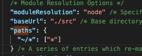
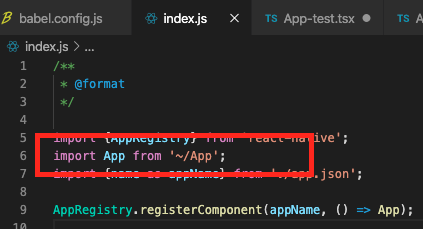
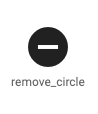
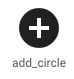
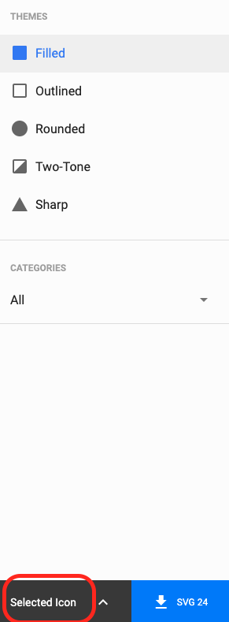
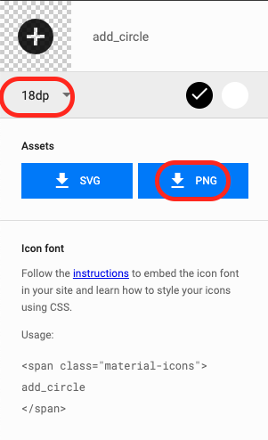
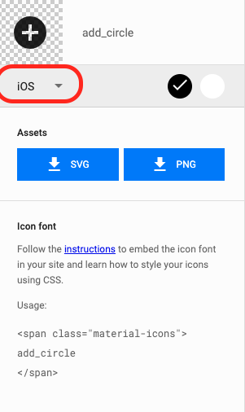
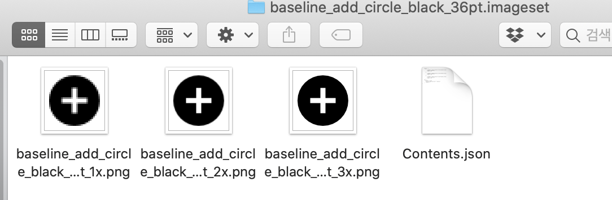
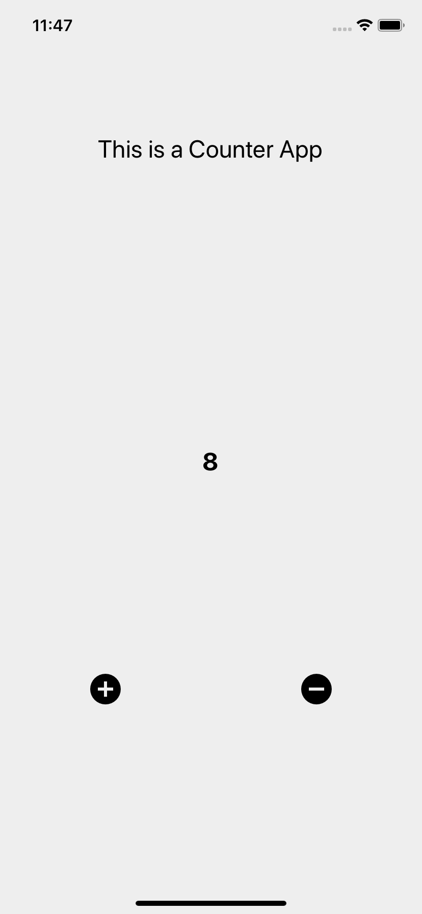

# 4장 Counter

## 4.1 Props State

리액트 네이티브는 리액트에서 파생되었기 때문에 리액트의 핵심 개념인 props와 state를 계승합니다.

- Props 

부모 컴포넌트로부터 자식 컴포넌트로 전달되는 데이터입니다. 자식 컴포넌트에서 변경이 불가능 합니다.

- State

한 컴포넌트 안에서 유동적인 데이터(변경 가능한 변수) 처럼 다룰 때 사용합니다. 컴포넌트 안에서 변경이 가능하고 한 컴포넌트의 상태를 나타냅니다.


## 4.2 프로젝트 준비

3장 마지막에서 배운 내용으로 준비해봅시다.

- 타입스크리브&리액트네이티브 앱 생성
- 한 앱 내에서 스타일컴포넌트 &  타입스크립트 & 절대경로 설정

```
$ npx react-native init CounterApp --template react-native-template-typescript
$ cd CounterApp
$ npm install --save styled-components
$ npm install --save-dev @types/react @types/react-native @types/styled-components babel-plugin-root-import typescript
```

babel.config.js

``` js
module.exports = {
  presets: ['module:metro-react-native-babel-preset'],
  plugins: [
    ['babel-plugin-root-import', {rootPathPrefix: '~', rootPathSuffix: 'src'}],
  ],
};

```

타입스크립트도 설정합니다. 하지만 3.2.1 과 같은 이유로 사용하지 못합니다.

tsconfig.json



이렇게 설정한 다음 src 폴더를 생성하고 App.tsx를 src 폴더로 옮깁니다.



위 그림처럼 코드를 수정합니다.


## 4.3 개발 시작

카운터 앱을 만들면서 Props와 State를 이해하여 봅시다.

This is a Counter App 감싸줄 텍스트 컴포넌트

상태(숫자)를  표시하고  State 와

버튼 2개 ( +, -)


### 4.3.1  Button Component

[머티리얼 디자인](https://material.io/) - icons에서 

remove_circle 


add_circle

을 골라서 사용하겠습니다. 위 사이트에서 위와 같은 아이콘을 선택하면 우측에 아래와 같은 화면이 제공됩니다.




이 화면에서 Selected Icon을 선택하고 18dp부분을 ios로 바꿉니다.




png형태로 다운로드 받습니다.



  저장한다면 알집파일이 제공되는데 그 알집파일에 다양한 폰트사이즈의 버튼 이미지가 있습니다. 저는 적당하게 36pt를 가져와 사용하겠습니다.



.

위 파일을 각각 add.png, add@2x.png, add@3x.png 로 src/Assets/Images/에 저장하겠습니다. 위와 마찬가지로 remove도 위와 똑같은 방식으로 저장합니다.


이제

src/components/Common/Button.tsx 파일을 생성하고 다음과 같이 수정합니다.

src/components/Common/Button.tsx 

```tsx
import React from 'react';
import styled from 'styled-components/native';

// Button 컴포넌트를 리액트 네이티브의 TouchableOpacity, Image로 구현합니다.
const Container = styled.TouchableOpacity``;
const Icon = styled.Image``;

// 타입스크립트의 인터페이스 문법을 통해 컴포넌트의 Props의 타입을 지정하여 타입에 대한 에러와 버그를 줄이고, 정확하게 파악할 수 있도록 하였습니다.
// iconName 필수, onPress 미필수
// iconName은 'plus' 또는 'minus'
// onPress no parma -> void 반환형 함수( 아마 버튼 클릭때 사용할 듯)
interface Props {
  iconName: 'plus' | 'minus';
  onPress?: () => void;
}

// Container는 Button 부모로 Button 컴포넌트가 받은 onPress와 props을 연결하여 사용합니다.
// Image 지정할 때는 require로 기본 사이즈의 이미지를 연결하고, 기본 사이즈의 이미지 이외에 2x,3x 크기의 이미지를 가지고 있다면 리액트 네이티브는 해당 단말기 화면 사이즈에 맞는 이미지 사이즈를
// 자동으로 불러와 표시합니다.
function Button({iconName, onPress}: Props) {
  return (
    <Container onPress={onPress}>
      <Icon
        source={
          iconName === 'plus'
            ? require('~/Assets/Images/add.png')
            : require('~/Assets/Images/remove.png')
        }></Icon>
    </Container>
  );
}

export default Button;

```


### 4.3.2 Counter.tsx

src/components/Screens/Counter.tsx

```tsx
import React, {useState} from 'react';
import styled from 'styled-components/native';
import Button from '~/Components/Common/Button';

const Container = styled.SafeAreaView`
  flex: 1;
`;
const TitleContainer = styled.View`
  flex: 1;
  justify-content: center;
  align-items: center;
`;
const TitleLabel = styled.Text`
  font-size: 24px;
`;
const NumberContainer = styled.View`
  flex: 2;
  justify-content: center;
  align-items: center;
`;
const NumberLabel = styled.Text`
  font-size: 24px;
  font-weight: bold;
`;
const ButtonContainer = styled.View`
  flex: 1;
  flex-direction: row;
  flex-wrap: wrap;
  justify-content: space-around;
`;
interface Props {
  title?: string;
  initValue: number;
}

function Counter({title, initValue}: Props) {
  const [number, setNumber] = useState<number>(0);

  return (
    <Container>
      {title && (
        <TitleContainer>
          <TitleLabel>{title}</TitleLabel>
        </TitleContainer>
      )}
      <NumberContainer>
        <NumberLabel>{initValue + number}</NumberLabel>
      </NumberContainer>
      <ButtonContainer>
        <Button iconName="plus" onPress={() => setNumber(number + 1)} />
        <Button iconName="minus" onPress={() => setNumber(number - 1)} />
      </ButtonContainer>
    </Container>
  );
}

export default Counter;

```

Counter 컴포넌트는 props 중 미필수인 title(string) 와 필수인 initValue(number)을 가지고 있습니다. 

useState 사용법은 리액트를 다루는 기술 Document를 참고하세요.

### 4.3.3 src/App.tsx

```tsx
import React from 'react';
import styled from 'styled-components/native';
import Counter from './Screens/Counter';

const Container = styled.View`
  flex: 1;
  background-color: #eee;
`;

function App() {
  return (
    <Container>
      <Counter title="This is a Counter App" initValue={5} />
    </Container>
  );
}

export default App;

```

결과 화면 :




## 4.4 요약

Props와 State를 사용할 때, 타입스크립트를 사용하여 데이터 타입을 지정함으로써 Props State를 좀 더 명확하게 사용하였습니다.

컴포넌트의 상태인 Props와 컴포넌트의 상태인 State를 통해 데이터를 화면에 표시합니다. 물론 데이터를 가지고 있지 않아 Props와 State가 필요 없는 컴포넌트도 제작할 수 있습니다.

state의 값을 변경하기 위해서는 useState가 제공하는 set 함수를 사용해야합니다. set함수를 사용하는 이유는 state의 값을 변경하여 발생하는 수 있는 문제를 해결하고, **가상 돔을 사용하여 변경된 부분만 화면에서 갱신**하기 위해서입니다.


